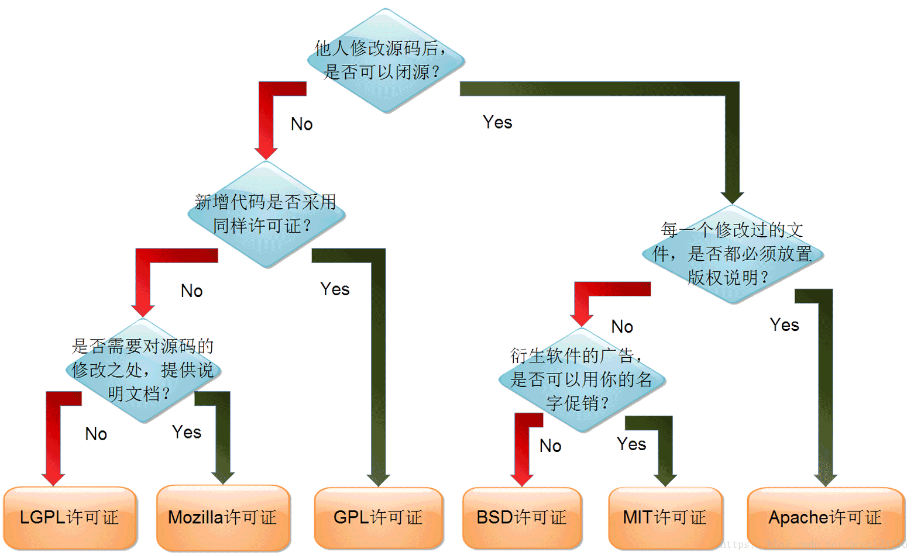

## 通用工具

### 文件比较工具

####  diff

**介绍**

diff 是一个文件比较工具，可以逐行比较两个文件的不同，它是以行为单位的，其中它有
三种输出方式，分别是 normal， context 以及 unified。区别如下：
* normal 方式为默认输出方式，不需要加任何参数
* context 相较于 normal 模式的简单输出，contetx 模式会输出修改过部分的上下文，
默认是前后 3 行。使用参数 -c
* unified 合并上下文模式则为新的上下文输出模式，同样为前后 3 行，只不过把上下文
合并了显示了。使用参数 -u

注：这里主要介绍 unified 模式

其他常用参数：
* -r 递归处理目录
* -N 将缺失的文件当作空白文件处理

***diff 语法与文件格式***

```shell
diff [options] old new

ex: diff -Nru <oldFile> <newFile> > tmp.patch
```

#### cmp

相对于diff，cmp的用途没有那么广泛，其主要是以字节为单位去比较，而diff是以行为
单位比较，因此cmp也可以比较二进制文件

#### patch

**介绍**

patch 是一个可以将 diff 生成的补丁应用到源文件，生成一个打过补丁版本的文件。语法：

```shell
patch [oiption] [originalfile [patchfile]]
```

常用参数：

* -i 指定补丁文件
* `-p<剥离层级>`或`--strip=<剥离层级>` 　设置欲剥离几层路径名称。在 diff 生成的
补丁中，第三四行是文件信息，其中文件名是可以包含路径的，例如：
```
Binary files LearnV4l2/.git/index and LearnV4l2_2/.git/index differ
diff --color -Nru LearnV4l2/v4l2Cap.c LearnV4l2_2/v4l2Cap.c
--- LearnV4l2/v4l2Cap.c	2023-06-09 20:49:57.915992397 +0800
+++ LearnV4l2_2/v4l2Cap.c	2023-09-29 09:58:17.235950333 +0800
```
-p0 代表完整的路径`LearnV4l2/v4l2Cap.c`，而 -p1 则指`v4l2Cap.c`，-pN 依此类推，
可以简单理解为，-pN 里的N表示去掉补丁路径里的几个 `/`。
* -E 删除应用补丁后为空文件的文件
* -o 输出到一个文件而不是直接覆盖文件
* -R 代表还原，将新的文件还原成原来的旧版本，也可以理解为去掉补丁

常见用法：
```shell
patch -p0 < tmp.patch
patch -R -p0 < tmp.patch
```


### sed

sed 是以行为单位进行处理的命令

参数介绍：
```
# sed [options] 'command' file(s)
# sed [options] -f scriptfile file(s)

option 参数：
-n: 使用安静（silient）模式。在一般sed的用法中，所有来自STDIN的数据一般都会被列出
    到屏幕上。但如果加上-n参数之后，则只有经过sed处理的行才会被列出来。
-e: 直接在命令行模式上进行sed的动作编辑，sed后若要接超过两个以上的动作，每个动作
    前需要加 -e
-f: 直接将sed的动作写在一个文件中，-f filename则可以执行filename内的sed动作
-r: sed的动作支持的是扩展型正则表达式的语法（默认是基础正则表达式语法）
-i: 直接修改读取的文件内容，而不是由屏幕输出
```

sed 命令
```
# [n1[,n2]]function[funcParas]

n1,n2: 不见得会存在，一般代表选择进行动作的行数或匹配，举例来说，如果动作是需要
       在10到20行之间进行的，则“10,20[动作行为]”
       n1 : 表示n1行
       n1,n2 : 表示从n1行，到n2行
       /pattern/ 查询包含pattern的行 例如： cat tmp.txt | sed '/^a/d'
       /pattern/,/pattern2/ 对匹配pattern到pattern2的行之间操作。例如：cat tmp.txt| sed '/^c/,/^d/d'
       /pattern/,x 通过pattern和行号查询匹配的行。例如：cat tmp.txt| sed '/^c/,$d'
       x,y! 查询不包含执行行号x和y的行 例如：cat tmp.txt| sed '3,4!d'

funcParas: function可能需要参数，例如新增"a"，需要在"a"后添加需要新增的内容

function 有下面这些参数:

a\: 新增，a的后面可以接字符串，而这些字符串会在新的一行出现（目前的下一行）
          举例：sed -i '2a\this is a test line' test.conf
c\: 替换，c的后面可以接字符串，这些字符串可以替换n1,n2之间的行
i\: 插入，i的后面可以接字符串，而这些字符串会在新的一行出现（目前的上一行）
          举例：将 this is a test line 追加到以test开头的行前面：
          sed '/^test/i\this is a test line' file
d:  删除，因为是删除，所以d后面通常不接任何参数
p:  打印，也就是将某个选择的数据打印出来。通常p会与参数sed -n一起运行
s:  替换，可以直接进行替换的工作。通过s的动作可以搭配正则表达式。
    例如：1,20s/old/new/g

D: 删除模板块的第一行。
P # (大写) 打印模板块的第一行。

h # 拷贝模板块的内容到内存中的缓冲区。
H # 追加模板块的内容到内存中的缓冲区。
g # 获得内存缓冲区的内容，并替代当前模板块中的文本。
G # 获得内存缓冲区的内容，并追加到当前模板块文本的后面。
l # 列表不能打印字符的清单。
n # 读取下一个输入行，用下一个命令处理新的行而不是用第一个命令。
N # 追加下一个输入行到模板块后面并在二者间嵌入一个新行，改变当前行号码。
q # 退出Sed。
b lable # 分支到脚本中带有标记的地方，如果分支不存在则分支到脚本的末尾。
r file # 从file中读行。
t label # if分支，从最后一行开始，条件一旦满足或者T，t命令，将导致分支到带有标号的命令处，或者到脚本的末尾。
T label # 错误分支，从最后一行开始，一旦发生错误或者T，t命令，将导致分支到带有标号的命令处，或者到脚本的末尾。
w file # 写并追加模板块到file末尾。
W file # 写并追加模板块的第一行到file末尾。
! # 表示后面的命令对所有没有被选定的行发生作用。
= # 打印当前行号码。
# # 把注释扩展到下一个换行符以前。
```

sed替换标记
```
g # 表示行内全面替换。
p # 表示打印行。
w # 表示把行写入一个文件。
x # 表示互换模板块中的文本和缓冲区中的文本。
y # 表示把一个字符翻译为另外的字符（但是不用于正则表达式）
\1 # 子串匹配标记
& # 已匹配字符串标记
```

sed元字符集
```
^ # 匹配行开始，如：/^sed/匹配所有以sed开头的行。
$ # 匹配行结束，如：/sed$/匹配所有以sed结尾的行。
. # 匹配一个非换行符的任意字符，如：/s.d/匹配s后接一个任意字符，最后是d。
* # 匹配0个或多个字符，如：/*sed/匹配所有模板是一个或多个空格后紧跟sed的行。
[] # 匹配一个指定范围内的字符，如/[sS]ed/匹配sed和Sed。
[^] # 匹配一个不在指定范围内的字符，如：/[^A-RT-Z]ed/匹配不包含A-R和T-Z的一个字母开头，紧跟ed的行。
\(..\) # 匹配子串，保存匹配的字符，如s/\(love\)able/\1rs，loveable被替换成lovers。
& # 保存搜索字符用来替换其他字符，如s/love/ **&** /，love这成 **love** 。
\< # 匹配单词的开始，如:/\<love/匹配包含以love开头的单词的行。
\> # 匹配单词的结束，如/love\>/匹配包含以love结尾的单词的行。
x\{m\} # 重复字符x，m次，如：/0\{5\}/匹配包含5个0的行。
x\{m,\} # 重复字符x，至少m次，如：/0\{5,\}/匹配至少有5个0的行。
x\{m,n\} # 重复字符x，至少m次，不多于n次，如：/0\{5,10\}/匹配5~10个0的行。
```

sed用法实例
```
# 将每一行中所有的book替换为books
sed 's/book/books/g' file

# 删除空白行
sed '/^$/d' file

# 删除文件的第2行：
sed '2d' file

# 删除文件的第2行到末尾所有行：
sed '2,$d' file

# 删除文件最后一行：
sed '$d' file

# 删除文件中所有开头是test的行：
sed '/^test/'d file
```


### man 替代工具

```shell
tldr <cmd>
curl cheat.sh/<cmd>

ex:
tldr ls
curl cheat.sh/ls
```

### LD_LIBRARY_PATH

### 查看程序搜索库的路径
LD_DEBUG1.LD_DEBUG使用方法如下:
1. LD_DEBUG=libs ./app
2. LD_DEBUG=libs help 查看命令使用方法

### 动态库搜索路径

linux下动态链接器会从以下目录下搜索共享库。

1.  首先在环境变量LD_LIBRARY_PATH 保存的路径中查找。
2. 然后从缓存文件/etc/ld.so.conf.cache中查找。这个缓存文件是ldconfig加载
   /etc/ld.so.conf文件生成的，所以修改/etc/ld.so.conf后需要执行ldconfg命令
   (没有/etc/ld.so.conf也可以自己创建)。当然，ldconfig不止处理/etc/ld.so.conf
   文件，还会处理一些默认目录，如/lib，/usr/lib等，处理的过程主要是建立索引
   以便快速查找。
3. 默认的系统库文件目录/usr/lib，然后从/lib目录中查找。

还有一种方法，就是链接生成执行文件时就把库路径写到文件中，通过gcc 的-rpath选项，
这种硬编码的方法是不被推荐的


### tightvnc

==> 安装：
```shell
sudo apt install xfce4 xfce4-goodies
sudo apt install tightvncserver tigervnc-viewer
sudo apt install ubuntu-gnome-desktop
```

==> 配置：
修改~/.vnc/xstartup，旧的xstartup可以备份

<配置1:>
```shell
#!/bin/bash

xrdb $HOME/.Xresources
startxfce4 &
```

<配置2:>
```shell
#!/bin/bash

unset SESSION_MANAGER
#unset DBUS_SESSION_BUS_ADDRESS #测试中发现如果去掉该行注释 桌面不会出现
export XKL_XMODMAP_DISABLE=1
export XDG_CURRENT_DESKTOP="GNOME-Flashback:GNOME"
export XDG_MENU_PREFIX="gnome-flashback-"
[ -x /etc/vnc/xstartup ] && exec /etc/vnc/xstartup
[ -r $HOME/.Xresources ] && xrdb $HOME/.Xresources
xsetroot -solid grey    #设置背景色
vncconfig -iconic &
gnome-terminal &        #连接后会直接打开一个terminal窗口
nautilus &              #连接后会直接打开一个文件窗口
gnome-session --session=gnome-flashback-metacity --disable-acceleration-check &
```

<配置3:>
```shell
unset SESSION_MANAGER
# 遇到一个vnc无法正常显示的问题，显示雪花屏，加上该参数可以解决
unset DBUS_SESSION_BUS_ADDRESS
startxfce4 &
[ -x /etc/vnc/xstartup ] && exec /etc/vnc/xstartup
[ -r $HOME/.Xresources ] && xrdb $HOME/.Xresources
# -- 这个选项告诉xsetroot你希望使用单一颜色来填充根窗口。grey: 这是用于填充根窗口
# -- 的颜色
xsetroot -solid grey &
# -- vncconfig 是 VNC 客户端的一个工具，它允许配置 VNC 会话的一些内容，例如调整颜色
# -- 深度、选择输入设备等。
# -- -iconic 是 vncconfig 的一个选项，它告诉 vncconfig 在启动时以图标化模式运行。
# -- 这意味着 vncconfig 的窗口将不会立即打开，而是作为一个图标存在于桌面或任务栏上。
# -- 用户可以点击这个图标来打开 vncconfig 的窗口，进行配置或更改。
# -- 这种方式可以保持桌面整洁，只有在需要时才打开 vncconfig 的窗口。如果你只是偶尔
# -- 需要调整 VNC 会话的设置，那么这个选项可能很有用。
vncconfig -iconic &
```

==> 启动/停止：
```shell
vncserver -geometry 1920x1080 :90
vncserver -kill :90
第一次启动的时候需要设置密码，输入密码之后还可以选择是否输入只看的密码，不需要就选n即可
密码以密文的形式放在.vnc文件夹下
```

==> 端口映射：
```shell
在.vnc下可以看到启动端口的log，实际使用的是5900 + vncserver指定端口，因此如果启动
90端口，映射时应该映射5990端口
```

==> 黑屏问题：
```shell
在启动vncserver时，应该会启动相应的窗口服务进程，如果使用startxfce4，则可以通过
ps aux | grep xfce 看到当前用户启动的窗口服务进程，如果查不到则说明vncserver启动
失败，可以通过如下途径排查：
1. 在终端启动startxfce4，确保该用户可以正常启动startxfce4，该终端可以是Linux系统的
ctrl+alt+Fn 的终端，也可以是ssh 带 -X 参数的终端，这确保可以启动窗口服务
2. 检查.vnc/xstartup 与第一步启动的终端是否统一
3. 查看.vnc中对应vncserver端口的log，看是否能查到有效信息
```
```shell
也有黑屏问题通过安装 kde-full 解决，kde-full好像是需要安装的
```

记录遇到的问题：
1. 问题现象：
```
perl: warning: Setting locale failed.
perl: warning: Please check that your locale settings:
    LANGUAGE = (unset),
    LC_ALL = (unset),
    LANG = "en_US.UTF-8"
are supported and installed on your system.
perl: warning: Falling back to the standard locale ("C").
```
解决方法：
```
Add the following lines to your bashrc or bash_profile file on the host machine:

# Setting for the new UTF-8 terminal support in Lion
export LC_CTYPE=en_US.UTF-8
export LC_ALL=en_US.UTF-8
If you are using Z shell (zsh), edit file zshrc:

# Setting for the new UTF-8 terminal support in Lion
LC_CTYPE=en_US.UTF-8
LC_ALL=en_US.UTF-8
```
2. 问题现象
```
dbus[6704]: Unable to set up transient service directory: XDG_RUNTIME_DIR "/run/user/1000" is owned by uid 1000, not our uid 1001
```
解决方法：
```
XDG_RUNTIME_DIR是一个环境变量，指定应用程序用于存储运行时数据的目录。
该目录通常在用户登录时创建，并且其所有权设置为用户的 UID。
当不同的用户（具有不同的 UID）尝试使用该目录时，就会发生错误。

在 ~/.vnc/xstartup 中添加如下内容，用于制定运行目录:
export XDG_RUNTIME_DIR=/run/user/$(id -u)
```

### tigervnc

使用tigervnc是因为 tightvnc不支持 RANDR，如果涉及到启动窗口之类的问题，可能会遇到
如下错误：
```
vnc Xlib: extension "RANDR" missing on display ":90.0"
```

mac install:
```
brew install --cask tigervnc-viewer
```

ubuntu install:
```
sudo apt install tigervnc-standalone-server tigervnc-xorg-extension tigervnc-viewer
sudo apt-get install tightvncserver
sudo apt-get install tigervnc-viewer
```

start server:
```
vncserver -geometry 1920x1080 :<port> -localhost no
```

client:
```
对话框中输入：<serIP>:59<port>
然后输入密码即可，密码可以通过vncpasswd设置
```

配置文件(~/.vnc/xstartup)，与tightvnc基本一致，只是需要加一个等待所有进程执行完成
的操作，例如：`wait`或者不放在后台执行：

<配置1>
```
xrdb $HOME/.Xresources
startxfce4 &
wait
```
或者
```
xrdb $HOME/.Xresources
startxfce4
```
以上两种配置方法均可以正常运行：
1. 第一个配置使用`wait`是为了等待xstartup中的程序都正常启动
2. 第二个配置中startxfce4没有加`&`也是为了保证xstartup中的程序都正常启动

如果不等待程序正常启动，vnc提前退出了，可能会导致 VNC 服务器误认为会话启动脚本
已经完成，因为它在几乎立即（<3秒）就退出了，导致桌面环境无法正常保持运行。

在某些情况下，启动 Xfce4 会话需要它在前台运行，以确保进程之间的依赖关系和初始化
顺序。这种情况下，放入后台可能会导致启动失败。

<配置2>
```
#!/bin/bash

export XDG_RUNTIME_DIR=/run/user/$(id -u)

unset SESSION_MANAGER
unset DBUS_SESSION_BUS_ADDRESS
startxfce4 &
[ -x /etc/vnc/xstartup ] && exec /etc/vnc/xstartup
[ -r $HOME/.Xresources ] && xrdb $HOME/.Xresources
# -- 这个选项告诉xsetroot你希望使用单一颜色来填充根窗口。grey: 这是用于填充根窗口
# -- 的颜色
xsetroot -solid grey &
# -- vncconfig 是 VNC 客户端的一个工具，它允许配置 VNC 会话的一些内容，例如调整颜色
# -- 深度、选择输入设备等。
# -- -iconic 是 vncconfig 的一个选项，它告诉 vncconfig 在启动时以图标化模式运行。
# -- 这意味着 vncconfig 的窗口将不会立即打开，而是作为一个图标存在于桌面或任务栏上。
# -- 用户可以点击这个图标来打开 vncconfig 的窗口，进行配置或更改。
# -- 这种方式可以保持桌面整洁，只有在需要时才打开 vncconfig 的窗口。如果你只是偶尔
# -- 需要调整 VNC 会话的设置，那么这个选项可能很有用。
vncconfig -iconic &

wait
```

遇到的问题记录：
1. 无法连接到服务器的问题
   * 现象：输入ip和端口之后，显示无法连接，错误为(10061)或者(61)
   * 原因：至少在 Ubuntu Zesty 上，TigerVNC 似乎默认为-localhost yes，这意味着它
   绑定到 127.0.0.1 上的端口 5901（或 2 等）。很容易通过`sudo netstat -tpln`识别。
   答案来源：https://github.com/TigerVNC/tigervnc/issues/117
   * 如果仍旧想只开放localhost的端口，那么可以使用ssh做正向隧道，参考如下：
   https://hychiang.info/blog/2024/install_tigervnc/
   与一般正向隧道不同的是，这里ssh映射在服务器端配置，而不是客户端，大概意思是使用
   另一个端口映射到tigervnc绑定的本地端口

### repo

reference: [repo manifest](https://www.jianshu.com/p/c6be01f23ebd)

repo是使用.repo/manifest.xml来管理各个小的仓库和组织代码目录结构的。


基本命令：
```
repo init \
    --repo-url <repo仓库地址> \
    -u <manifest仓库地址> \
    -b <manifest仓库分支> \
    -m <manifest文件名，即在 .repo/manifest.xml 中指定用 manifest库中 -b 参数分支的manifest文件>

最终结果是.repo/manifest.xml链接到.repo/manifests/<manifest文件名，即-m指定的参数>

-u 和 -b 的参数相对固定，这里主要关注 -m 参数，要选择这个参数有中方法：
1. 将 manifest 仓库下载下来，直接在仓库里找需要的文件名，作为 -m 的参数
2. 直接在 .repo/manifests 文件夹中找需要的文件名，作为 -m 的参数

默认 repo 的地址是 https://gerrit.googlesource.com/git-repo ，可能存在内网无法访问
的问题，导致 repo 失效，这个时候需要使用 --repo-url 指定一个镜像的国内地址
```


切分支：
1. 到 .repo/manifests 使用git操作切换分支
2. 再次同步库：
    `repo init -b <newbranch> -m <sdkFile>`
    `repo sync -c`


切换sdk：
1. 在 .repo/manifests 中查找可用的软件包信息
2. 执行 repo manifest 可以查看当前的配置，也可以通过查看`.repo/manifest.xml`文件，
   确认sdk是否切到指定的文件
3. 同步库：
    `repo init -m <newsdkFile>`
    `repo sync -c`


manifest.xml标签属性如下
```
<notice>
  <remote name="每个库的远程名"
          alias="会覆盖name的值"
          review="repo upload的hostname,repo upload时必须指定这个值"
          fetch="所有子库的git url前缀，一般是.或.."
          #fetch是".",各个具体的代码仓库与manifest目录同级则manifests库的路径组成分别是base_url/pro1/manifests和base_url/pro1/project-name，即
          #fetch是"..",则各个具体的代码仓库的URL是base_url/project-name，即与manifest上一级目录同级
          revision="会被default中的revision覆盖">
  <default remote="与remote的name一致"
            revision="branch"
            dest-branch="未设置则用revision的值"
            sync-j=""  #如果repo sync 没有加-j选项，则使用这里指定的值
            sync-c="true" #等同于 repo sync -c选项，sync当前revision
            sync-s="true" #sync子项目>
  <project name="名称唯一,${remote_fetch}/${project_name}.git"
            path="项目的路径，如果没有path,则用name的值作为path"
            remote=""
            revision=""
            dest-branch="repo upload 所上传的分支"
            groups="a,b"
            sync-c="true"
            sync-s="true"
            upstream="sha1,repo sync -c ,则sync这个指定的sha1"
            clone-depth="会被--depth覆盖"
            force-path="根据path或name值创建本地的mirror库，只有使用--mirror的时候这个才生效"
            >
  <remove-project 属性值同project>
  <include name="用manifest库的相对路径">
  ```

### code format

reference:[Linux下的代码格式工具详解(indent, clang-format, astyle)](Linux下的代码格式工具详解(indent, clang-format, astyle))

install:
```
 sudo apt-get install indent
 sudo apt-get install clang-format
 sudo apt-get install astyle
```

内核中的格式检查脚本：
```
./scripts/checkpatch.pl -f <fileName>
--style=linux
--indent=spaces=4
--indent=tab
--pad-oper
astyle --options=astylerc mpp/iep2_test.c
astyle --style=linux mpp/iep2_test.c
```

### ssh

#### config file

在`~/.ssh/config`文件中，可以为不同的 SSH 主机设置各种配置选项，包括主机名、用户名、
端口号、密钥文件等。这允许你使用简短的命令连接到 SSH 主机，而无需每次都指定所有参数。

规则如下：
```
Host <alias>
    HostName <host IP or net addr>
    User <userName>
    Port <If using a non-standard port, need to specify>
    IdentityFile <key>
    ForwardAgent yes  <Enable ssh agent forwarding>
```
配置好之后，就可以通过`ssh alias`进行登陆操作

demo
```
# GitHub 的配置
Host github.com
    HostName github.com
    User your_github_username
    IdentityFile ~/.ssh/id_rsa_github

# GitLab 的配置
Host gitlab.com
    HostName gitlab.com
    User your_gitlab_username
    Port 2222  # 如果 GitLab 使用非标准端口，请指定
    IdentityFile ~/.ssh/id_rsa_gitlab

# 自定义服务器的配置
Host myserver
    HostName myserver.example.com
    User your_server_username
    Port 22  # 如果不是默认的 22 端口，请指定
    IdentityFile ~/.ssh/id_rsa_myserver

# 可以通过别名连接的服务器
Host myalias
    HostName realserver.example.com
    User your_realserver_username
    IdentityFile ~/.ssh/id_rsa_realserver
    ForwardAgent yes  # 启用 SSH 代理转发，这样你就可以在远程服务器上使用你本地机器的 SSH 密钥
```

编译RK SDK时可能会遇到权限问题，这时候有如下方法解决：
```
1. 编辑～/.ssh/config文件，这样在连接server时，就会有默认的用户名了，推荐该方法
# for android sdk
Host <serverIp>
  HostName <serverIp>
  User <YourName>

2. 修改 default.xml 或 remote.xml 或 init时的配置文件 中的remote项，在网址链接
上添加用户名

3. 类似方法二，将其改为 <remote name="origin" fetch=".."/>， ".." 意思是fetch的
url和repo init时manifest的url对应。
```


### dd

`dd`是Linux系统中的一个非常强大的命令，主要用于复制和转换文件。它的名字来源于
“data definition”，即数据定义。`dd`命令可以读取原始数据，并进行字节级别的复制
或者转换，然后输出到指定位置。它经常被用于备份磁盘分区、制作启动盘、转换数据
格式等任务。

`dd`命令的基本语法如下：
```bash
dd if=input_file of=output_file [bs=block_size] [count=number] [conv=conversion]
```
- if=文件名：输入文件名，默认为标准输入。即指定源文件。
- of=文件名：输出文件名，默认为标准输出。即指定目的文件。
- 输入/输出字节数：
  - ibs=bytes：一次读入bytes个字节，即指定一个块大小为bytes个字节。
  - obs=bytes：一次输出bytes个字节，即指定一个块大小为bytes个字节。
  - bs=bytes：同时设置读入/输出的块大小为bytes个字节。
- cbs=bytes：一次转换bytes个字节，即指定转换缓冲区大小。
- skip=blocks：从输入文件开头跳过blocks个块后再开始复制。
- seek=blocks：从输出文件开头跳过blocks个块后再开始复制。
- count=blocks：仅拷贝blocks个块，块大小等于ibs指定的字节数。
- conv=<关键字>，关键字可以有以下11种：
  - conversion：用指定的参数转换文件。
  - ascii：转换ebcdic为ascii
  - ebcdic：转换ascii为ebcdic
  - ibm：转换ascii为alternate ebcdic
  - block：把每一行转换为长度为cbs，不足部分用空格填充
  - unblock：使每一行的长度都为cbs，不足部分用空格填充
  - lcase：把大写字符转换为小写字符
  - ucase：把小写字符转换为大写字符
  - swap：交换输入的每对字节
  - noerror：出错时不停止
  - notrunc：不截短输出文件
  - sync：将每个输入块填充到ibs个字节，不足部分用空（NUL）字符补齐。

例如，使用`dd`命令制作一个Live USB启动盘，可以将一个ISO文件写入到USB设备中：
```bash
dd if=/path/to/ubuntu.iso of=/dev/sdX bs=4M status=progress
```
在这个例子中：
- `if=/path/to/ubuntu.iso` 表示输入文件是ubuntu.iso。
- `of=/dev/sdX` 表示输出文件是USB设备，这里`sdX`需要替换成实际的USB设备名。
- `bs=4M` 表示每次读写4MB的数据。
- `status=progress` 表示在执行过程中显示进度条。
在使用`dd`命令时需要特别小心，因为一旦输出设备指定错误，可能会导致数据丢失甚至
系统损坏。务必确认设备名称正确无误。


### read

#### 命令说明

read就是按行从文件(或标准输入或给定文件描述符)中读取数据的最佳选择。当使用管道、
重定向方式组合命令时感觉达不到自己的需求时，不妨考虑下while read line。

```
read [-rs] [-a ARRAY] [-d delim] [-n nchars] [-N nchars] [-p prompt] [-t timeout]
     [-u fd] [var_name1 var_name2 ...]
```

read命令用于从标准输入中读取输入单行，并将读取的单行根据IFS变量分裂成多个字段，
并将分割后的字段分别赋值给指定的变量列表var_name。第一个字段分配给第一个变量
var_name1，第二个字段分配给第二个变量var_name2，依次到结束。如果指定的变量名少于
字段数量，则多出的字段数量也同样分配给最后一个var_name，如果指定的变量命令多于
字段数量，则多出的变量赋值为空。

如果没有指定任何var_name，则分割后的所有字段都存储在特定变量REPLY中。

选项说明：
* -a：将分裂后的字段依次存储到指定的数组中，存储的起始位置从数组的index=0开始。
* -d：指定读取行的结束符号。默认结束符号为换行符。
* -n：限制读取N个字符就自动结束读取，如果没有读满N个字符就按下回车或遇到换行符，
      则也会结束读取。
* -N：严格要求读满N个字符才自动结束读取，即使中途按下了回车或遇到了换行符也不结束。
      其中换行符或回车算一个字符。
* -p：给出提示符。默认不支持"\n"换行，要换行需要特殊处理，见下文示例。例如，
      "-p 请输入密码："
* -r：禁止反斜线的转义功能。这意味着`\`变成文本的一部分。
* -s：静默模式。输入的内容不会回显在屏幕上。
* -t：给出超时时间，在达到超时时间时，read退出并返回错误。也就是说不会读取任何内容，
      即使已经输入了一部分。
* -u：从给定文件描述符(fd=N)中读取数据。


#### 基本用法示例:

1. 将读取的内容分配给数组变量，从索引号0开始分配。
```
$ read -a array_test
what is you name?

$ echo ${array_test[@]}
what is you name?

$ echo ${array_test[0]}
what
```

2. 指定读取行的结束符号，而不再使用换行符。
```
$ read -d '/'
what is you name \//       # 输入完尾部的"/"，自动结束read
由于没有指定var_name，所以通过$REPLY变量查看read读取的行。

$ echo $REPLY
what is you name /
```

3. 限制输入字符。例如，输入了5个字符后就结束。
```
$ read -n 5
12345

$ echo $REPLY   # 输入12345共5个字符
12345
如果输入的字符数小于5，按下回车会立即结束读取。

$ read -n 5
123

$ echo $REPLY
123
但如果使用的是"-N 5"而不是"-n 5"，则严格限制读满5个字符才结束读取。

$ read -N 5
123\n4

$ read -N 5
123          # 3后的回车(换行)算是一个字符
4
```

4. 使用-p选项给出输入提示。
```
$ read -p "pls enter you name: "
pls enter you name: Junmajinlong

$ echo $REPLY
Junmajinlong
"-p"选项默认不带换行功能，且也不支持"\n"换行。但通过$'string'的方式特殊处理，就可以实现换行的功能。例如：

$ read -p $'Enter your name: \n'
Enter your name:
JunMaJinLong
关于$'String'和$"String"的作用，见http://www.cnblogs.com/f-ck-need-u/p/8454364.html
```

5. 禁止反斜线转义功能。
```
$ read -r
what is you name \?

$ echo $REPLY
what is you name \?
```

6. 不回显输入的字符。比如输入密码的时候，不回显输入密码。
```
$ read -s -p "please enter your password: "
please enter your password:

$ echo $REPLY
123456
```

7. 将读取的行分割后赋值给变量。
```
$ read var1 var2 var3
abc def    galsl djks

$ echo $var1:::$var2:::$var3
abc:::def:::galsl djks
```

8. 给出输入时间限制。没完成的输入将被丢弃，所以变量将赋值为空(如果在执行read前，
   变量已被赋值，则此变量在read超时后将被覆盖为空)。
```
$ var=5

$ read -t 3 var
1

$ echo $var
```

#### while read line

如果read不明确指定按字符数读取文件(或标准输入)，那么默认是按行读取的，而且每读一行
都会在那一行处打上标记(即文件指针。当然，按字符数读取也一样会打上标记)，表示这一次
已经读取到了这个地方，使得下次仍然能够从这里开始继续向下读取。这使得read结合while
使用的时候，是按行读数据非常好的方式。

例如：
```
[root@xuexi ~]# cat test1
a
b
c
d

# 用法示例1
$ cat test1 | while read line;do echo $line;done
a
b
c
d

# 用法示例2
$ while read line;do echo $line;done <test1
a
b
c
d

# 用法示例3：请对比下面这条命令和上面的
$ while read line <test1;do echo $line;done
```

关于while read line，需要注意几个事项：

1. 强烈建议，不要在管道后面使用while read line。正如上面第1个示例中`cat test1|
   while read line`。因为管道会开启子shell，使得while中的命令都在子shell中执行，
   而且，cat test1会一次性将test1文件所有数据装入内存，如果test1文件足够大，会
   直接 占用巨量内存。而第二个示例使用输入重定向的方式则每次只占用一行数据的内存，
   而且是在当前shell环境下执行的，while内的变量赋值、数组赋值在退出while后仍然有效。

2. 不要使用示例3，因为测试了就知道为什么不用，它会在每次循环的时候都重新打开test1
   文件，使得每次都从头开始读数据，而不是每次从上一次标记的地方继续读数据。

所以，在使用while read line的时候，能用示例2的方式就用示例2。

#### 精确输出每行数据

while read line在读取数据时，默认是按照IFS变量来将所读取的行数据进行切割保存到各
对应的变量当中。这会使得所读取的数据在保存到line中时会丢失前缀空白。

所以，要想原原本本地输出每行数据，需要修改IFS。不仅如此，在保存到line中之后，在
使用line时还需要加上双引号包围，否则前缀空格仍然会在变量替换后被忽略。

所以，最佳方式如下：
```
$ while IFS= read -r line;do echo "$line";done <filename
```
上面还加上了-r选项，表示忽略原始数据中的反斜线转义功能，而是当作原本的反斜线字符输出。

这样，就真正的原原本本地输出了每行数据。


### vim

#### 基本操作

1. :vertical diffsplit [new file]
新打开一个文件与当前文件比较，竖向分割窗口，如果不加 vertical 则横向分割窗口

2. 复制粘贴
vim复制到系统剪贴板
{Visual}"+y - copy the selected text into the system clipboard

vim剪切到系统剪贴板
"+dd – 剪切一行

从系统剪贴板粘贴到vim
"*p
"+p
Shift+Insert
:put + - Ex command puts contents of system clipboard on a new line
<C-r>+ - From insert mode (or commandline mode)
"+p比 Ctrl-v 命令更好，它可以更快更可靠地处理大块文本的粘贴，也能够避免粘贴大量文本时，发生每行行首的自动缩进累积，因为Ctrl-v是通过系统缓存的stream处理，一行一行地处理粘贴的文本。

3. Vim 移动

H: 移动到 home
M: 移动到屏幕中间
L: 移动到一屏末尾

zz：将光标处置于屏幕的中间
zt:   将光标处移动到屏幕的顶部
zb：将光标处移动到屏幕的底部

#### 在Vim中插入当前文件名
reference: https://www.cnblogs.com/Mr-Shadow/archive/2013/03/12/2954919.html
1. 使用<c-r>（即CTRL+R）。步骤如下：
在Insert模式下，先按CTRL+R，光标处变成双引号“
再按%，即可直接插入当前文件名（含路径）
关 于<c-r>，可输入”:help <c-r>“查看详细说明。此处简要说明一下，CTRL-R可以插入0～9号寄存器（numbered register）内的内容，也可以插入特殊寄存器（named register）里的内容。特殊寄存器中，只读寄存器"%包含的就是当前文件名。另外，vim中的复制粘贴（剪贴板操作）也是使用了特殊寄存器+的操作。

2. 使用expand()。其实这个也用到了<c-r>。步骤如下：
* 在Insert模式下，先按CTRL+R，光标处变成双引号”
* 再按=，提示输入表达式
* 输入expand("%:t")，回车
* 即可插入当前文件名（不含路径）
* 这个方法先进入<c-r>状态，然后利用"=寄存器，将表达式的值插入当前位置。基本上只要是可以返回字符串的表达式都可以用这个方法快速插入到文本中。可以将整个输入过程做map或abbreviation，实现快速插入当前文件名，比如：
* :iab fname <c-r>=expand("%:t")<CR>

只要在输入状态下输入“fname空格”即可插入当前文件名。
关于expand()，可输入“:help expand”查看详细说明。

### Git

### linux 串口工具

#### minicom

* minicom -s  修改设置，包括预置场景
* 打开串口后 ctrl+a z 打开帮助，敲z时不加ctrl
* 在帮助里按 o 可以进行端口配置
* 打开串口后 ctrl+a q 退出
* 使用功能菜单时按 Esc 基本都可以返回
* 对于mac，meta键默认是esc，但可以修改

无法写的问题:
1. sudo minicom -s 启动
2. Serial port setup -> Hardware Flow Control 改成NO，如果还不行，也可以尝试修改Software Flow Control为NO

非sudo用户，使用串口，只需要将ttyUSB0的权限改为666即可，或者将用户加入ttyUSB0所属的用户组，也可以一劳永逸

#### picocom

minicom的精简版

### 二进制工具

#### xxd + vim

1. xxd 基本操作
* `echo "616201026364" | xxd`：将二进制转换为文本
* `echo "616201026364" | xxd -r -ps`：将文本转换为二进制，-ps 表示以纯十六进制转储样式输出
* `echo "616201026364" | xxd -r -ps >> tmp.bin`：创建二进制文件


2. xxd + vim 修改文件

vim需要以二进制的格式打开文件：`vim -b <file>`，这可以防止 Vim 尝试解释文件中的
二进制数据作为文本，从而避免显示乱码或破坏文件内容。可以通过`%!xxd`确认两种打开
模式的区别，一般以文本模式打开的话，最后会多一个`0a`即换行符号，如果以为本模式
打开，会发现即便什么也不做，只是转化为文本，再转化为二进制，就会与之前的文件不同，
而如果以二进制文件打开则不存在该问题

vim中的二进制操作：
* `:%!xxd`：将当前二进制文件转换为文本
* `:%!xxd -r`: 将当前文本，转化为二进制文件
* `:%!xxd -ps`：将当前二进制文件转换为文本，以16进制纯文本格式作为输出
* `:%!xxd -r -ps`: 将当前文本，转化为二进制文件，以16进制纯文本格式作为输入

建议修改工作流：
* `vim -b <file>` 打开文件
* `:%!xxd -ps` or `:%!xxd` 将当前二进制文件转化为文本
* 搜索并修改文本，如果以`:%!xxd -ps`得到纯文本，为了避免换行对搜索的影响，可以
  直接去掉换行，不影响后续的转换，对于码流文件，建议使用`:!xxd`的方式转换为文本，
  配合码流工具修改：
    * 在码流工具中找到要修改的位置，对应可以看到hex的内容和偏移
    * 在文件中找到对应偏移的位置进行修改
    * 修改完后删除行首偏移和行末字符串，后续以纯文本形式进行转换
* `:%!xxd -r -ps` 将当前16进制纯文本转化为二进制文件
* 保存退出

tips:
* 如果对格式化的二进制文本(`:%!xxd`)修改后，想转化为二进制文件，可以直接使用`:%!xxd -r`
* 如果对格式化的二进制文本(`:%!xxd`)增删后，想转化为二进制文件，需要删除文本前端
  的偏移和后端的文本，然后执行`:%!xxd -r -ps`
* 如果要修改/增删二进制文件，建议以纯文本格式进行：`%!xxd -ps` `%!xxd -r -ps`


### 许可证


