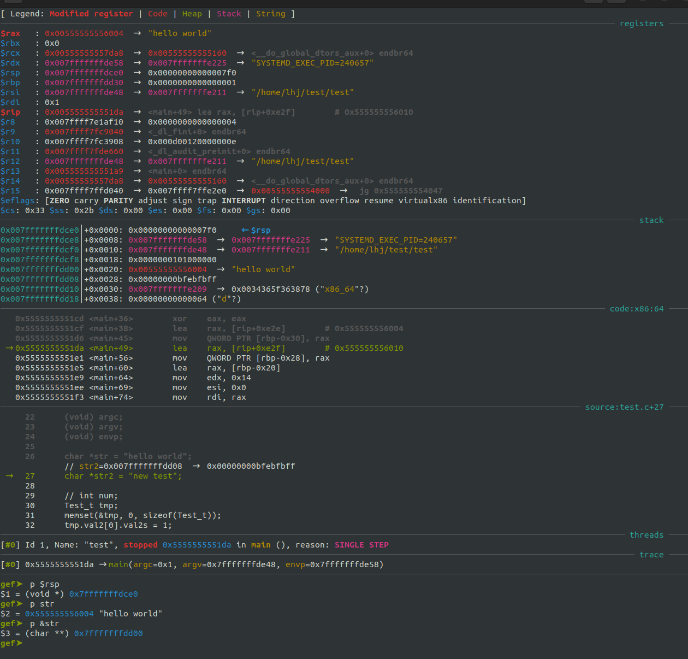

## linux 调试工具

### GDB

#### GDB基本用法

**基本指令：参考宋宝华的书**

0. base

* 编译需要添加参数-g，判断一个elf文件是否带有调试信息可以用如下方法：
```
1. 使用 readelf
    readelf -S your_program | grep debug
    如果带有调试信息，会有类似如下的打印：
    [29] .debug_aranges    PROGBITS         0000000000000000  0000303f
    [30] .debug_info       PROGBITS         0000000000000000  0000306f
    [31] .debug_abbrev     PROGBITS         0000000000000000  000034ac
    [32] .debug_line       PROGBITS         0000000000000000  0000362f
    [33] .debug_str        PROGBITS         0000000000000000  000036e9
    [34] .debug_line_str   PROGBITS         0000000000000000  00003997
    如果不带调试信息，则没有任何打印

2. 使用objdump
    objdump -g your_program | grep debug
    判断方法同readelf

3. 使用gdb
    在gdb中执行： info functions
    如果有调试信息，会有如下打印：
    All defined functions:

    File test.c:
    41: int main(int, char **, char **);
    30: void test(unsigned int);

    如果没有调试信息，则有如下打印，不会列举函数：
    All defined functions:
```

* 常用的打印参数指令：
```shell
$(gdb) show args
$(gdb) info files
```

1. 启动
```shell
$ gdb <app>
$ (gdb) file <app>
$ (gdb) info files
attach:
$ sudo gdb <app> -p <pid>
$ (gdb) file <app>
$ (gdb) attach <pid >

设置运行环境根目录:
$ (gdb) preinstall

运行参数处理：
1)进入gdb之前设置：gdb --args <app> <paras>
2)进入gdb之后设置：set args <paras>
3)进入gdb后，运行时设置：r <paras>
4)--batch 在处理完所有用“-x”指定的命令文件后以状态 0 退出。 如果在命令文件中执行
  GDB 命令时发生错误，则以非零状态退出。例如：
  gdb -ex=r --batch --args <paras>   其中 r 是 run的简写
5)使用command文件
  进入gdb之前：
  gdb --command=<commandfile.gdb> [--batch] --args <app> [<paras>]
  进入gdb之后：
  source <commandfile.gdb>
  commandfile的编写按照命令行敲命令的顺序即可
6) show user
  查看当前用户使用的命令等相关信息
  注意：无论在哪里设置参数，只要设置完就可以直接使用r运行，默认带有参数，除非另作
  修改更新，才会使用新的参数

当前工作目录：
$ (gdb) pwd
$ (gdb) cd <new/dir>


GDB动态库搜索路径
参考：
[set sysroot command](https://visualgdb.com/gdbreference/commands/set_sysroot)
[GDB动态库搜索路径](https://www.cnblogs.com/tibetanmastiff/p/4759995.html)
[GDB：无法找到动态链接器断点函数](https://www.fayewilliams.com/2013/01/31/gdb-unable-to-find-dynamic-linker-breakpoint-function/)

当GDB无法显示so动态库的信息或者显示信息有误时，通常是由于库搜索路径错误导致的，
可使用set sysroot、set solib-absolute-prefix、set solib-search-path来指定库搜索路径。
1. sysroot 与 solib-absolute-prefix 相同，sysroot是solib-absolute-prefix 的别名。
2. set solib-search-path设置动态库的搜索路径，该命令可设置多个搜索路径，路径之间
   使用“:”隔开（在linux中为冒号，DOS和Win32中为分号）。
3. set solib-absolute-prefix 与 set solib-search-path 的区别：
  总体上来说solib-absolute-prefix设置库的绝对路径前缀，只对绝对路径有效；而solib
  -search-path设置库的搜索路径，对绝对路径和相对路径均起作用。（编译器自动链接的
  so库多采用绝对路径）。

通俗理解：
solib-absolute-prefix: 别名，sysroot，指的是嵌入式根文件系统在上位机中的目录
solib-search-path: 指的是动态连接库的搜索路径


详细规则有：
set set solib-absolute-prefix由于是路径前缀，所以只能设置一个路径，而solib-search-path
可以设置多个搜索路径。
举例：
# 设置本地的sysroot：
$ (gdb) set sysroot preinstall
# 设置远程的sysroot，（之前关键字可以使用remote，但后来弃用建议使用target）：
$ (gdb) set sysroot target:/
# 设置搜索路径
$ (gdb) set solib-search-path /vendor/lib:/system/lib
# 手动加载动态库
$ (gdb) load /path/to/lib.so
# 查看加载的动态库，如果没有运行到需要动态库的位置可能也查询不到，需要用到动态库
# 才会看到加载信息：
$ (gdb) info sharedlibrary
```

2. 列出代码
```shell
$(gdb)  list <show number>
$(gdb)  list <function>
$(gdb)  list  # 显示当前行后边的源程序
$(gdb)  show listsize  # 显示现在 list 显示的行数
$(gdb)  set listsize <num> # 修改 list 显示的行数
$(gdb)  tui enable    # 使用独立的代码窗口
$(gdb)  layout src    # 使用独立的代码窗口
$(gdb)  layout asm    # 使用独立的代码窗口，汇编语言

layout的使用：
layout：用于分割窗口，可以一边查看代码，一边测试。主要有以下几种用法：
layout src：显示源代码窗口
layout asm：显示汇编窗口
layout regs：显示源代码/汇编和寄存器窗口
layout split：显示源代码和汇编窗口
layout next：显示下一个layout
layout prev：显示上一个layout
Ctrl + L：刷新窗口
Ctrl + x，再按1：单窗口模式，显示一个窗口
Ctrl + x，再按2：双窗口模式，显示两个窗口
Ctrl + x，再按a：回到传统模式，即退出layout，回到执行layout之前的调试窗口。

如果遇到源码路径有变动的情况下，涉及到以下内容：
# 查看 GDB 当前设置的源代码搜索路径
# $cdir 和 $cwd 是 GDB 中的特殊变量，分别代表编译目录（源代码文件被编译时的目录）和当前
# 工作目录（GDB 启动时的目录或在 GDB 中使用 cd 命令更改的目录）。这些变量是自动设置的，
# 并且通常不需要手动修改。
$(gdb) show directories
# 添加新的源代码搜索路径，追加模式，如果不跟目录，表示重置搜索目录（会保留$cdir 和 $cwd）
$(gdb) directory [<path1>:<path2>:<path3>:...]
# 切换到指定目录，这会修改$cwd的值，也会影响源码的搜索
$(gdb) cd [<new dir>]
```

3. 调试控制
```shell
$(gdb)  run # 运行，简写 r，后边可跟命令行参数，如果没有设置断点，不会停下。
$(gdb)  start # 开始执行程序，在main 函数处会停下来
$(gdb)  starti # 开始执行程序，在第一条(机器)指令处会停下来
$(gdb)  continue [<ignore-cnt>]# 可简写为 c，恢复程序运行直到程序结束或到达下一个
        断点，ignore-cnt 表示忽略其后多少次断点
$(gdb)  next # 下一步，可简写为 n
$(gdb)  break # 中断，可简写为 b
$(gdb)  where # 查看程序当前位置
$(gdb)  print # 打印，可简写为 p
$(gdb)  jump <linespec>  # GDB 提供了乱序执行的功能，<inespee>可以是文件的行号，
        可以是file:line格式，也可以是fnum 这种偏移量格式，表示下一条运行语句从哪里开始。
$(gdb)  signal <signal> # 使用singal 命令，可以产生一个信号量给被调试的程序，如中断
        信号 ctrl+C。于是，可以在程序运行的任意位置处设置断点，并在该断点处用 GDB
        产生一个信号量，这种精确地在某处产生信号的方法非常有利于程序的调试。UINIX 的
        系统信号量通常为 1-15，因此 signals 的取值也在这个范围内。
$(gdb)  return [<expr>] # 如果在函数中设置了调试断点，在断点后还有语向没有执行完，
        这时候我们可以使用 return 命令强制函数忽略还没有执行的语句并返回。
$(gdb)  call <func> # 强制调用某函数，也可以使用p <func> 的形式调用函数
```
在运行前，可以设置如下的环境变量：
```shell
a. 程序运行参数：
$(gdb) set args 1 2 3 4 5
$(gdb) r <paras>
$(gdb) show args
b. 运行环境：
$(gdb) path <dir> 设定程序的运行路径
$(gdb) show paths 查看程序的运行路径
$(gdb) set environment varname[=value] # 设定环境变量
$(gdb) show environment[varname] # 查看环境变量
c. 工作目录：
$(gdb) cd <dir> 相当于 shell 的 cd 命令
$(pwd) pwd 显示当前所在目录
d. 程序的输入输出：
info terminal 用于显示程序用到的终端模式
在gdb中也可以使用重定向控制程序输出，如 run > outfile
用tty命令可以指定输入输出的终端设备，如 tty /dev/ttyS1
```

4. 单步调试：
```shell
1) next [<count>]  # 可简写为 n，单步执行，不会进入函数
2) step [<count>]  # 可简写为 s，单步执行，会进入函数内部
3) set step-mode
   set step-mode on 用于打开step-mode 模式，这样在进行单步跟踪(step)时，若跨于某个
   没有调试信息的函数，程序的执行则会在该函数的第一条指令处停住，而不会跳过整个函数。
   这样我们可以查看该函数的机器指令
4) finish
   运行程序，直到当前函数完成返回，并打印函数返回时的堆栈地址、返回值及参数值等信息
5) untile (缩写为 u)  # 运行程序直到退出循环体
6) setpi (缩写为si) 和 nexti (缩写为ni)
   stepi 和 nexiti 用于单步跟踪一条机器指令。比如，一条c程序代码有可能由数条机器
   指令完成，stepi 和 nexiti 可以单步执行机器指令，相反，setp和next是c语言级别的
   命令。另外，运行 display/i $pc 命令后，单步跟踪会在打出程序代码的同时打出机器
   指令，即汇编代码。
```

5. 断点调试：
```shell
1) break <func> # 进入函数时停住，c++ 可以使用 class::function 或 function(type,type)
2) break <linenum> # 在指定行号停住
3) break +offset / break -offset  # 在当前行号的前面或后面的 offset 行停住
4) break filename:linenum # 在源文件flename 的 linenum 行处停住。
5) break filename: function # 在源文件 fliename 的 function 函数的人口处停住。
6) break *address # 在程序运行的内存地址处停住。
7) break     # break 命令没有参数时，表示在下一条指令处停住。
8) break …… if <condition>
   …… 可以是上述的 break<linenum>、break +offset / break -offset 中的参数，condition
   表示条件，在条件成立时停住。比如在循环体中，可以设置 break if i = 100，表示 i 100时停住程序
9) info breakpoints[n]、info break[n]  # 查看断点，n表示断点号
10) delete <num> # 删除断点
11) disable <num> # 去使能断点
12) enable <num> # 使能断点
13) commands 设置在给定断点被击中时要执行的命令，命令格式：
    commands [break point idx]
        cmd 1
        cmd 2
    end
    如果不填 break point idx 默认使用最后一个中断点
```

6. 调试过程中的信息查询和处理
```shell
1）print[/<f>] <expr>
    <expr> 是表达式，或者是变量，<f>是输出的格式，例如：/x 表示十六进制格式，当使用
    gdb的print查看程序运行时数据时，每个print都会被gdb记录下来。gdb会以$1,$2,$3这样的
    形式为每一个print命令编号。我们可以使用这个编号访问以前的表达式。如果要修改变量，
    可以使用类似 print x=4 的格式
    print 的输出格式如下：
    x：按十六进制格式显示变量
    d：按十进制格式显示变量
    u：按十六进制格式显示无符号整型
    o：按八进制格式显示变量
    t：按二进制格式显示变量
    a：按十六进制格式显示变量
    c：按宇符格式显示变量
    f：按浮点数格式显示变量
    tips:
    1. 使用print 打印之后，会显示$<nub> = ()，这时使用命令 p $<num> 即可打印对应的参数
    2. p $ 表示打印最后一次的 $<num> 值，p $$ 表示倒数第二个 $<num> 的值
    3. 希望在脚本中使用watch时，可以通过如下形式操作： p &<value>, watch *$
2) display</fmt> <expr>
    和 print 命令一样，display 命令也用于调试阶段查看某个变量或表达式的值，它们的
    区别是，使用 display 命令查看变量或表达式的值，每当程序暂停执行（例如单步执行）
    且作用域能达到时，GDB 调试器都会自动帮我们打印出来，而 print 命令则不会。
    关闭则使用 disable/delete display <idx>  其中idx可以通过info display查询
3) watch
    watch 一般用来观察某个表达式的值是否有了变换，如果有了变化，马上停止运行程序，使用方法如下：
    watch <expr>：为表达式（变量）expr 设置一个观察点。一旦表达式值有变化时，马上停止程序运行。
    rwatch <expr>：当表达式（变量）expr 被读时，停止程序运行。
    awatch <expr>：当表达式（变量）的值被读或被写时，停止程序运行。
    如果想观察内存的值变化可以按如下操作：
    1. 得到内存的地址：print &val
    2. watch *<addr>   // 观察一个byte
       watch *(int*)<addr>  // 观察int长度的byte
4) examine (缩写为 x) 查看内存地址中的值
    格式：x /<[n][f][u]>  <addr>
    n: 是正整数，表示需要显示的内存单元的个数，即从当前地址向后显示n个内存单元的内容，
       一个内存单元的大小由第三个参数u定义。
    f: 表示addr指向的内存内容的输出格式，s对应输出字符串，此处需特别注意输出整型数据的格式：
        x:按十六进制格式显示变量。
        d:按十进制格式显示变量。
        u:按十六进制格式显示无符号整型。
        o:按八进制格式显示变量。
        t:按二进制格式显示变量。
        a:按十六进制格式显示变量。
        c:按字符格式显示变量。
        f:按浮点数格式显示变量。
    u: 就是指以多少个字节作为一个内存单元-unit,默认为4。当然u还可以用被一些字符表示，
       如b=1 byte，h=2 bytes，w=4 bytes，g=8 bytes。
    <addr>: 表示内存地址。

    整合这个命令的诠释：就是以addr为起始地址，返回n个单元的值，每个单元对应u个字节，
    输出格式是f。
    如：x/ 3uh 0x54320表示：以地址0x54320为起始地址，返回3个单元的值，每个单元有
    两个字节，输出格式为无符号十六进制。也就是说返回了3*2=6个字节的数据，以十六
    进制输出，这6个字节的数据，每两个字节为一个单元输出，共输出3个单元。

5) examine 命令用于查看内存，而 set 命令用于修改内存。它的命令格式是“set* 有类型的
   指针=value”
6) info 命令
    info 命令可以用来在调试时查看奇存器、断点、观察点和信号等信息。要查看寄存器的值
         可以使用如下命令
    info registers（查看除了浮点寄存器以外的寄存器）
    info a11-registers（查看所有寄存器）
    info registers ＜regname...> （查看所指定的寄存器）

    要查看断点信息，可以使用如下命令：
    info break

    要列出当 前所设置的所有观察点，可使用如下命令：
    info watchpoints

    要查看有哪些信号正在被 GDB 检测，可使用如下命令：
    info signals
    info handle
    也可以使用 info line 命令来查看源代码在内存中的地址。info line 后面可以跟行号、
    函数名、文件名:行号、文件名:函数名等各种形式，例如用下面的命令会打印出所指定的
    源码在运行时的内存地址：
    info line tst.c: func

    查看进程相关信息：
    info proc # 进程ID、命令行命令、可执行文件位置
    info proc 后也可以跟其他命令，以查看更详细的信息：
    (gdb) help info proc
    info proc all -- List all available info about the specified process.
    info proc cmdline -- List command line arguments of the specified process.
    info proc cwd -- List current working directory of the specified process.
    info proc exe -- List absolute filename for executable of the specified process.
    info proc files -- List files opened by the specified process.
    info proc mappings -- List memory regions mapped by the specified process.
    info proc stat -- List process info from /proc/PID/stat.
    info proc status -- List process info from /proc/PID/status.

    查看进程(包括进程号)：
    info inferiors

    另有 info probes 命令，待后续探究

    查看线程：
    info threads

    查看线程栈结构：
    bt

    打印所有线程堆栈：
    thread apply all bt

    切换线程：
    thread n  # n 表示第几个线程

7) 历史命令
    mkdir -p ~/.config/gdb
    echo 'set history save on' >> ~/.config/gdb/gdbinit
    或
    # 如果不设置文件的话，会在当前路径下生成.gdb_history文件
    set history filename gdb.history
    set history save on
    set history size 1000

```
7. 查看栈/帧相关的信息
    * 查看调用栈信息：
        * backtrace: 显示程序的调用栈信息，可以用bt缩写
        * backtrace n: 显示程序的调用栈信息，只显示栈顶n帧(frame)
        * backtrace –n: 显示程序的调用栈信息，只显示栈底部n帧(frame)
        * set backtrace limit n: 设置bt显示的最大帧层数
        * where, info stack：都是bt的别名，功能一样
    * 查看帧信息：
        * frame n: 查看第n帧的信息， frame可以用f缩写
        * frame addr: 查看pc地址为addr的帧的相关信息
        * up [n]: 查看当前帧上面第n帧的信息，跳转后可以打印上一个函数的相关信息
                  注意这里的上指外层函数，不写n表示跳一层
        * down [n]: 查看当前帧下面第n帧的信息，跳转后可以打印下一个函数的相关信息
    * 查看更加详细的信息：
        * info frame、info frame n或者info frame addr
        * info args：查看当前帧中的参数
        * info locals：查看当前帧中的局部变量
        * info catch：查看当前帧中的异常处理器
    * 跟栈帧相关的寄存器
    ```shell
        %rax 作为函数返回值使用
        %rbp 栈帧指针，指向栈基
        %rsp 栈帧指针寄存器，指向栈顶
        x86架构的芯片对同一个寄存器有不同的名字，但是描述的位数不同，以上命名都是
        描述64bit的位宽，但对于更小的位宽也有相应的名字，例如：
        64bit --> 32bit --> 16bit --> 8bit  func
        %rax      %eax      %ax       %al  作为函数返回值使用
        %rbp      %ebp                     栈帧指针，指向栈基，被调用者保护
        %rsp      %esp                     栈帧指针寄存器，指向栈顶
    ```
    参考：
    * [x86-64 下函数调用及栈帧原理](https://zhuanlan.zhihu.com/p/27339191)
    * [x86-64寄存器和栈帧](https://zhuanlan.zhihu.com/p/440016053)
    * [rax,eax,ax,ah,al 关系](https://blog.csdn.net/MashiMaroJ/article/details/120646168)
    
    

8. `disassemble <func>` # 命令用于反汇编，可用它来查看当前执行时的源代码的机器码，
   实际上只是把目前内存中的指令冲刷出来。

9. 自定义函数

    可以写在 --command 加载的文件里，也可以在gdb的命令行里定义，语法如下：
    ```shell
    define <funcName>
        <op1>
        <op2>
        <op3>
    end
    ```
    例如：
    ```shell
    define test
    print "abcd"
    end
    ```
    使用时直接输入函数名就可以了

10. 寄存器操作
    ```shell
    查看寄存器的值
    info registers 打印所有寄存器
    registers $<regName> 查看指定寄存器值，比print查看寄存器专业些
    print $<regName> 查看指定寄存器值

    查看间接寻址的值
    例如：mov    -0x8(%rbp),%eax
    (gdb) x /1xb $rbp
    (gdb) x /1xb $rbp-0x8

    修改寄存器的值
    set var $<regName>=<regVal>
    ```
    tips:
    * 使用layout split查看代码时，汇编与c语言对应显示
    * 执行汇编代码时，如果寄存器没有别重新使用覆盖，会保留上次使用的旧值
    * 窗口显示中，指向的是将要执行的代码，这时候打印的寄存器为上次使用的值
    * 使用n，可以执行一行C代码
    * 使用ni，可以执行一行汇编代码
    * 使用si，也可以执行一行汇编代码，对应C代码的step，会进入子函数

11. gef 插件
    github: https://github.com/hugsy/gef

    

    **寄存器：**
    * 冒号左边是寄存器的名字
    * 冒号右边是寄存器的值，再向右箭头后边是寄存器的值翻译得到的结果，
      例如：如果是字符串会解析出字符串的内容

    **栈：**
    * 竖线左边是当前堆栈的地址
    * `$rsp`是栈帧指针寄存器，指向栈顶
    * 竖线右边`+`号之后是当前地址相对于栈顶的偏移
    * 冒号右边是当前栈地址存放的内容

    **code：**
    * 注意该区域写的偏移是十进制的，例如：main+49，这里的49是十进制

12. kernel Call trace 分析：
    `my_func_symbol_name+0xac/0x1ac` 表示： 函数 + 函数内的偏移量/函数的大小
    查到异常点的位置:
    1) 使用objdump，反汇编elf文件，根据函数和函数偏移查找
    2) 使用gdb-multiarch，在gdb中执行 `list *(my_func_symbol_name+0xac)`可以定位，
       这里注意，gdb-multiarch加载的不一定是可执行文件，也可以是一个.o文件

14. rebreak

    rbreak 命令用于设置正则表达式断点，允许基于正则表达式模式在多个位置设置断点。
    语法：
    ```
    (gdb) rbreak [filename:]regex
    ```
    * filename: 可选参数，指定想要在其中设置断点的文件名。如果省略了文件名，GDB 将
      在所有加载的文件中搜索匹配正则表达式的位置。
    * regex: 必须参数，这是一个正则表达式，用于匹配想要打断点的函数名或行号。

    示例：
    ```
    所有加载的程序的源文件中，为每一行设置一个断点。由于 .* 匹配任何文本，这个命令
    会为程序中几乎每一行设置一个断点
    (gdb) rbreak .*

    对特定文件中的所有函数设置断点
    (gdb) rbreak filename.c:.*

    在所有看起来像函数名的地方设置断点（假设函数名只包含字母、数字和下划线）
    (gdb) rbreak ^[a-zA-Z0-9_]+$

    在特定文件的所有函数开始处设置断点
    (gdb) rbreak filename.c:^[a-zA-Z0-9_]+$

    在包含特定文本的行上设置断点
    (gdb) rbreak filename.c:.*critical.*

    在特定行号范围设置断点
    (gdb) rbreak filename.c:^100$|^101$|^102$
    这个命令会在 filename.c 文件的第 100、101 和 102 行上设置断点。
    ```


#### GDB交叉编译

下载gdb源码：`https://sourceware.org/pub/gdb/releases/?C=M;O=D`

在autoconf中，定义了3种系统（或者机器）,用于标识构建过程中的参与者，它们是：
* host   运行构建过程生成的软件的系统。（译者注：gdb运行在x86上，因此host是x86;
         gdbserver运行在arm上，因此host是arm）
* build  执行构建过程的系统。大多数情况下，与上述的host系统是相同的系统，但在
         交叉编译的情况下，两者显然不同。
* target 运行正在构建的软件所依据的系统。正在构建的软件与运行在Host上运行的软件
         进行特定交互时，这才有意义。编译器、调试器、分析器和其他工具通常都是这样。

配置：
```
mkdir build
cd build
```


#### 嵌入式GDB远程调试
* 调试主机需要安装gdb-multiarch，这里需要与嵌入式设备匹配，我是用udooer的开发板的
  时候发现gdb-multiarch可以使用。
* 嵌入式设备需要安装gdbserver
* 嵌入式设备与调试主机在同一网段
* 嵌入式平台作为服务端执行：
    `gdbserver <host_ip>:<port> <app>`       例如： gdbserver  localhost:8888 test
* 调试主机作为客户端执行：
    `gdb-multiarch <app>`                    例如：gdb-multiarch test
    `(gdb) target remote <target_ip>:<port>` 例如：target remote 192.168.2.107:8888

之后就可以在上位机敲指令调试了

同样如果是使用系统中空闲的串口作为GDB调试器和GDBserver的底层通信手段的话各条指令如下：
* `gdbserver /dev/ttyS0 test`        其中/dev/ttyS0是嵌入式平台的通信设备
* `gdb-multiarch <app>`
* `(gdb) target remote /dev/ttyUSB0`  其中/dev/ttyUSB0是上位机的通信设备


#### LLDB 基本用法

* lldb 与 gdb 使用方法大同小异，可以参考gdb使用，如果无法实现效果再细究是否有差异
* lldb 与 gdb 的关系映射 [GDB to LLDB command map](https://lldb.llvm.org/use/map.html)
* lldb 常用命令：[LLDB 常用命令](https://www.jianshu.com/p/81278ade3b80)

**环境相关**
```shell
(lldb) platform status  # 打印基本状态
(lldb)
(lldb) platform list # 列举当前支持的平台，如果调试android，则执行 platform select remote-android
(lldb) platform connect connect://<deviceName>:<remotePort>
(lldb) platform settings -w <path: local or remote>
(lldb) file <fileName>
(lldb) r <input params>
$ lldb -s <debug.lldb> <app> # 相当于 gdb 的—command
$ lldb -- <args> # -- 相当于 gdb 的 --args
```

**远程设备执行：**
```shell
lldb-server p --server --listen "*:<remotePort>"
```

**使用独立的代码窗口**
```shell
(lldb) gui
```

**运行控制**
```shell
run (r) - 启动目标程序，如果遇到断点则暂停
next (n) - 运行当前箭头指向行
step (s) - 进入下一条指令中的函数内部
continue (c) - 继续运行程序直到遇到断点。
thread backtrace (bt) - 显示程序的调用栈信息，可以用bt缩写
frame (f) - 默认显示当前栈的内容，可以通过 `frame arg` 进入特定的 frame（用作输出本地变量）
```

**断点相关**
```shell
(lldb) breakpoint list   # 列出所有断点，可简写 br l
(lldb) b <funcName> # 添加断点
(lldb) b <fileNmae>:<line> # 添加断点
(lldb) br del <num> # 删除断点
(lldb) br dis <num> # 去使能断点
(lldb) br en <num> # 使能断点
```

**线程相关**
```shell
process interrupt  # 暂停当时程序的运行
thread list    # 列出当前线程
thread select 1  # 选择线程 1，可简写为 t 1
thread backtrace # 打印当前线程的调用战信息，可简写为 bt
thread backtrace all # 打印所有线程的调用栈信息
```

**变量相关**


#### 嵌入式LLDB远程调试

**上位机：**
```shell
$ lldb
(lldb) platform list    # 列出当前支持的远程平台
(lldb) platform select remote-android    # 选择嵌入式系统的平台
(lldb) platform connect connect://<device name>:8888 # 设备名可以用adb devices 查询
(lldb) platform settings -w /usr/local/bin # 修改工作路径，使用file加载文件时用的是该路径
(lldb) file <local host> # 加载work路径下的文件，可以通过paltform status 查看work路径，被加载的文件会在运行时推到嵌入式系统的server工作路径
(lldb) target
```
**attach 到远程进程**
```shell
(lldb) platform process list # 列出远程系统上的进程
(lldb) attach 68639 # attach 到进程上
```

**嵌入式系统：**
```shell
lldb-server 基本使用方法，（server可以启动一次循环调试使用）：
Usage:
  lldb-server v[ersion]
  lldb-server g[dbserver] [options]
  lldb-server p[latform] [options]

当lldb工作再 platform 模式时：
Usage:
  lldb-server p [--log-file log-file-name] [--log-channels log-channel-list] \
  [--port-file port-file-path] --server --listen port
例如：lldb-server p --server --listen "*:8888"
注意：这里需要在一个可以运行文件的路径下启动server，例如在 /vendor/bin 下执行就
可以正常调试，但是如果在/sdcard下执行就不能正常调试，会返回如下错误：
process launch failed: 'a' packet returned an error: 8
```

使用demo：
```shell
lldb-server p --server --listen "*:8888"    # 在可执行文件的路径下
platform select remote-android
platform connect connect://0:8888
platform settings -w /vendor/bin
file mpi_dec_test
r -i output.h264 -t 7
```

海强的 vscode 配置


#### ADB调试基本指令
```shell
连接设备的adb接口
电脑上安装adb工具
执行 adb devices 可以看到连接的设备
Android系统的文件系统可能为只读系统，无法放入文件，需要执行一下命令：
    adb root
    adb remount
然后在Android的路径 /vendor 下就是可写的了
文件传输：
    调试机 --> Android： adb push <localFile> <remoteDir>
    Android --> 调试机： adb pull <remoteFile> <localDir>
端口相关
    #将PC的<hostPort>端口收到的数据，转发到手机中<remotePort>端口。
    adb forward tcp:<hostPort> tcp:<remotePort>
    例如：adb forward tcp:8887 tcp:8888
    #查看端口转发
    adb forward --list
    #删除建立的转发端口
    adb forward --remove tcp:<hostPort>
可能会存在Linux系统无法检测到 adb 设备的情况，可以如下操作：
    $ sudo adb kill-server
    $ sudo adb devices
    之后直接用 adb devices 就可以检测到设备了
adb 网络模式
    切换到网络模式：
    adb tcpip <localPort>
    adb connect <remoteIp>:<remotePort>
    直接执行 adb connect <remoteIP> 也可以
    切换回usb模式：
    adb usb
    例如：
    adb tcpip 5555
    adb connect 192.168.0.101:5555
```

#### ADB+gdb调试(命令行)
```shell
嵌入式设备执行： gdbserver :<port> <app> <param>
    例如： gdbserver :8888 mpi_dec_test -i /sdcard/0.origin.h264
    其中：<param>在嵌入式设备指定就可以了，调试主机可以不指定，软件实际执行是在嵌入式设备
调试主机使用adb做端口映射：adb forward tcp:<hostPort> tcp:<remotePort>
    例如：adb forward tcp:8887 tcp:8888
调试主机启动gdb开始调试：
    1. gdb <app>
    2. (gdb) target remote 127.0.0.1:<hostPort> # 这里指向adb指定的主机端口
        例如： target remote 127.0.0.1:8887
        注意：这里的gdb应该使用nkd里的gdb，
        例如：android-ndkbuilt/linux-x86_64/bin/gdb
```

#### vscode 本地调试


#### vscode 调试+gdb 远程调试（adb环境）
**launch 模式：**
1. 在嵌入式平台上启动gdbserver，方法与ADB+gdb调试(命令行) 一致
2. 在调试主机使用adb forward做端口映射，方法与ADB+gdb调试(命令行) 一致
3. 在调试主机加入如下配置，然后开始调试

```json
{
    "name": "Attach to gdbserver",
    "type": "cppdbg",
    "request": "launch",
    "program": "${workspaceFolder}/build/android/arm/test/mpi_dec_test",
    "args": [],
    "miDebuggerPath":"/home/lhj/work/android/ndk/android-ndk-r16b/prebuilt/linux-x86_64/bin/gdb",
    "miDebuggerServerAddress": "127.0.0.1:8887",
    "remote": true,
    "cwd": "${workspaceRoot}",
    "valuesFormatting": "parseText"
},
```
**attach 模式：**
```shell
只需要在嵌入式启动的时候将指令改为：
gdbserver :<port> --attach <pid>
例如：
rk3566_r:/ # ps -elf | grep mediaserver
media           357      1 0 04:38:15 ?     00:00:01 mediaserver
root           2324   2321 0 07:02:00 pts/3 00:00:00 grep mediaserver
rk3566_r:/ # gdbserver :8888 –attach 357
```

### OpenOCD

references:
* [OpenOCD User’s Guide](https://openocd.org/doc/html/)
* [OpenOCD](https://openocd.org/doc-release/doxygen/jtagdocs.html)

#### 基本运行

references:
* [7 Server Configuration](https://openocd.org/doc/html/Server-Configuration.html#configurationstage)

##### 配置

如果不给任何-f或者-c选项，OpenOCD 会尝试读取配置文件openocd.cfg。要指定一个或多个
不同的配置文件，使用-f选项。例如：
```
openocd -f config1.cfg -f config2.cfg -f config3.cfg
```

配置文件和脚本在以下位置搜索
1. 当前目录
2. 在命令行中-s指定的搜索目录
3. 使用add_script_search_dir命令指定的搜索目录
4. 环境变量OPENOCD_SCRIPTS（如果有设置）中的目录
5. `%APPDATA%/OpenOCD`（仅在 Windows 上）
6. `$HOME/Library/Preferences/org.openocd`（仅在Darwin）
7. `$XDG_CONFIG_HOME/openocd`（`$XDG_CONFIG_HOME`默认为`$HOME/.config`)
8. `$HOME/.openocd`
9. site范围的脚本库$pkgdatadir/site
10. OpenOCD 提供的脚本库$pkgdatadir/scripts


当 OpenOCD 服务器进程启动时，首先进入配置阶段，这是唯一可以发出某些命令（配置命令）
的时间。通常，配置命令仅在启动脚本内可用。OpenOCD服务必须离开配置阶段才能访问或
激活 TAP。离开此阶段后，可能不再发出配置命令。


##### 运行（初始化）

完成配置阶段后，OpenOCD 要做的第一件事是验证它是否可以与已配置的扫描链（TAP 列表）
通信。如果没有找到期望找到的 TAP，或者发现了不应该存在的 TAP，会发出警告。此时
应该不会看到任何错误。如果看到错误，需要对命令进行修正。常见错误包括使用太快的初始
JTAG 速度，以及没有为扫描链上的 TAP 提供正确的 IDCODE 值。

一旦 OpenOCD 进入运行阶段，许多命令(指telnet中的命令，非配置命令)就变得可用。其中
许多与可能已声明的调试目标板相关。例如，mww在成功实例化目标之前，该命令将不可用。
如果想使用这些命令，可能需要强制进入运行阶段。

初始化命令列举如下：

* 配置命令：init
该命令终止配置阶段并进入运行阶段。当需要启动脚本管理诸如重置目标、编程闪存等任务
时，这会有所帮助。要在启动时重置 CPU，请在配置脚本末尾或在配置脚本末尾添加“init”
和“reset” OpenOCD 命令行使用-c命令行开关。

如果此命令没有出现在任何启动/配置文件中，OpenOCD 会在处理完所有配置文件和/或命令行
选项后自动执行该命令。

init也可以调用以下OpenOCD内部命令来初始化相应的子系统：
```
* 配置命令：target init
* 命令：transport init
* 命令：dap init
* 配置命令：flash init
* 配置命令：nand init
* 配置命令：pld init
* 命令：tpiu init
```

* 配置命令：noinit
防止 OpenOCDinit在启动结束时隐式调用。允许通过 telnet 或 Tcl 连接发出配置命令。
完成配置后，init进入运行阶段。

* 可重写过程：jtag_init
这在服务器启动时调用，以验证它是否可以与已配置的扫描链（TAP 列表）通信。默认实现
首先尝试jtag arp_init，在检查扫描链之前仅使用轻量级 JTAG 复位。如果失败，它会使
用可覆盖过程中的更硬重置再次尝试init_reset。
实现必须在返回之前验证 JTAG 扫描链。这是通过调用jtag arp_init (或jtag arp_init-reset)
来完成的。

##### TCP/IP 端口

OpenOCD 服务器接受多种语法的远程命令。每种语法使用不同的 TCP/IP 端口，只能在配置
期间（打开这些端口之前）指定该端口。

* 配置命令：`gdb_port [number]`
    * 通常 gdb 监听 TCP/IP 端口，但 GDB 也可以通过管道（stdin/out 或命名管道）进行
      通信。`gdb_port`这个名字被保留下来是因为它可能涵盖了超过 90% 的正常用例。
    * 无参数报告 GDB 端口。 “pipe”表示监听 stdin 输出到 stdout，整数是基本端口号，
      “disabled”禁用 gdb 服务器。
    * 使用“pipe”时，还可以使用 log_output 将日志输出重定向到文件，以免淹没 stdin/out 管道。
    * 任何其他字符串都被解释为要侦听的命名管道。输出管道与输入管道同名，但附加“o”，
      例如/var/gdb、/var/gdbo。
    * 第一个目标的 GDB 端口将是基本端口，第二个目标将侦听 gdb_port + 1，依此类推。
      如果在配置阶段未指定，则端口号默认为 3333。当number不是数值时，递增它来计算
      下一个端口号不起作用。在这种情况下，使用`$target_name configure`命令或
      `target create`的-gdb-port选项为每个目标指定正确的数量。可参阅选项 -gdb-port。

注意：使用“gdb_port pipeline”时，建议增加 gdb 中的默认远程超时（使用“set Remotetimeout”）。
超时不足可能会导致初始化失败，并显示“未知远程 qXfer 回复：正常”。

* 配置命令：`tcl_port [number]`
指定或查询用于简化 RPC 连接的端口，客户端可以使用该连接来发出 TCL 命令并从 Tcl 引擎
获取输出。旨在作为机器接口。当配置阶段未指定时，端口号默认为6666。当指定为“disabled”
时，不激活该服务。

* 配置命令：`telnet_port [number]`
指定或查询侦听传入 telnet 连接的端口。该端口旨在通过 TCL 命令与人进行交互。当配置
阶段未指定时，端口号默认为4444。当指定为“disabled”时，不激活该服务。

##### GDB配置

目前没发现必要性，如果需要可以参考官方文档，同时完善本文档

##### 事件轮询

目前没发现必要性，如果需要可以参考官方文档，同时完善本文档

#### config file

references:
* [6. Config File Guidelines](https://openocd.org/doc-release/html/Config-File-Guidelines.html)
* [8 Debug Adapter Configuration](https://openocd.org/doc-release/html/Debug-Adapter-Configuration.html)
* [10 TAP声明](https://openocd.org/doc/html/TAP-Declaration.html)
* [15 General-Commands](https://openocd.org/doc/html/General-Commands.html)
* [OpenOCD学习笔记 3-配置基本知识](https://blog.csdn.net/pq113_6/article/details/106432250)

实测 openocd 的 -c 命令和 -f 指定的配置文件有相同的效果，只是通常建议使用配置文件进行操作。

要注意的是，-f指定的文件是有先后加载顺序的，先指定的先加载，后指定的后加载，顺序不能乱。
通常先加载接口相关的文件。

openocd 目录中，tcl 存放着很多范例脚本：
* tcl/interface
  用于调试适配器。指定使用特定 JTAG、SWD 和其他适配器的配置的文件
* tcl/board
  想想电路板、PWA、PCB，它们有很多名称。板文件包含特定于板的初始化项。它们重复使用
  目标配置文件，因为许多板上使用相同的微处理器芯片。例如，主板的 SDRAM 初始化顺序，
  或者外部闪存的类型及其使用的地址。任何启用外部闪存或 SDRAM 的初始化序列都应在板
  文件中找到。主板还可能包含多个目标：两个 CPU；或者一个CPU和一个FPGA。
* tcl/target
  “target”目录代表 OpenOCD 应控制的芯片上的 JTAG TAP，而不是主板上的JTAG TAP。两种
  常见类型的目标是 ARM 芯片和 FPGA 或 CPLD 芯片。当芯片具有多个 TAP（可能同时具有
  ARM 和 DSP 内核）时，目标配置文件会定义所有 TAP。


一般情况下要实现一个完整的调试配置，只需要2个配置文件，例如：
`openocd –f interface/<m_Interface.cfg> –f <m_Board.cfg>`

m_Interface.cfg 可以在scripts/interface下找到使用的调试器，一般可以直接使用，
而board的配置文件不一定符合要求，可能需要参考scripts\board修改。另外第二个文件
不一定是board文件，看到也有很多场景直接用target里的文件。

一般情况下board.cfg会引用scripts/target下的配置文件，例如：tcl/board/bcm28155_ap.cfg
中引用了`source [find target/bcm281xx.cfg]`

openocd 使用的两个文件也可以写成一个，例如：
```
source [find interface/stlink.cfg]
source [find target/bcm28155_ap.cfg]
```

通常分为两个或更多的文件，有如下原因：
* 按照模块进行划分，便于管理
* 命令行中按照顺序通过 -f 指定不同的文件，配置顺序清晰

完整的 Tcl/Tk 语言支持“命名空间”，但 Jim-Tcl 不支持。因此，在 OpenOCD 中遵循的
规则是：以下划线开头的变量本质上是临时的，可以在目标配置文件中随意修改和使用。

常用变量约定：
1. CHIPNAME: 命名CHIP的名字，比如stm32f0x。
2. ENDIAN: 芯片的大小端模式，默认是小端，如果芯片不支持可以不设定。
3. CPUTAPID: 当使用JTAG时，OpenOCD可以检测JTAG IDCODE寄存器。
4. `_TARGETNAME`


测试访问端口(Test Access Ports, TAP) 是 JTAG 的核心。 TAP 具有多种作用，包括：
* **Debug Target** CPU TAP 可以作为 GDB 调试目标。
* **Flash Programming** 有些芯片直接通过 JTAG 对Flash进行编程。有些间接地执行
  此操作，让 CPU 执行这个操作。
* **Program Download** 使用相同的，支持GDB的CPU, 可以初始化 DRAM 控制器，下载代码
  到 DRAM，然后开始运行该代码。
* **Boundary Scan** 大多数芯片都支持边界扫描，这有助于测试电路板组装问题，例如焊桥
  和缺失连接。


以下是一些基本的OpenOCD配置命令和概念：

1. 接口配置：配置用于与目标设备进行通信的接口。这可以是一个JTAG接口、SWD接口等。
```
# 设置调试接口为JTAG
interface jtag

# 如果使用SWD，可以设置为
interface swd
```
2. 目标设备配置：定义目标设备的属性和连接。
```
# 创建一个新的JTAG tap连接
jtag newtap target1 cpu -irlen 4 -expected-id 0x12345678

# 设置目标设备的处理器和其他属性
set _CHIPNAME riscv
set _WORKAREASIZE 0x8000
set _CPUTAPID 0x12345678
```
3. 适配器配置：配置调试适配器的时钟速度和其他参数。
```
# 设置适配器的时钟速度为1000kHz
adapter_khz 1000
```
4. 传输协议选择：在某些情况下，可能需要在不同的调试协议（如JTAG和SWD）之间进行选择。
```
# 选择调试传输协议
transport select jtag
# 或者
transport select swd
```
5. 初始化命令：在配置完成后，使用init命令来结束配置阶段并进入运行阶段。
```
# 初始化OpenOCD
init
```
6. 查找文件：使用find命令来查找和定位OpenOCD脚本文件。
```
# 查找并加载脚本文件

source [find target/swj-dp.tcl]
```

#### OpenOCD通用命令

reference:
[15 General Commands](https://openocd.org/doc/html/General-Commands.html)

OpenOCD链接成功之后，可以通过telnet输入命令，常用的命令列举如下：
```
help     查看更多的OpenOCD命令

init     初始化OpenOCD服务器。通常在OpenOCD启动时自动执行，也可以手动执行以重新
         初始化环境

halt     将目标硬件暂停在当前执行位置。这允许检查或修改目标的状态，而不会丢失当前
         的执行上下文

targets <TargetName> 切换当前core，如果不加参数可以查看所有cpu的状态

resume   从暂停状态恢复目标硬件的执行。在halt命令之后使用此命令，可以继续程序的执行

step     单步执行目标硬件的指令。这允许你逐步跟踪程序的执行，观察每一步的变化。

mdw <address> <count>  从指定的内存地址读取多个字（通常是32位）。<address>是要
         读取的起始地址，<count>是要读取的字数。

mww <address> <value>  将指定的值写入到内存地址。<address>是目标地址，<value>是
         要写入的值。

reg <register> 显示或修改目标硬件的寄存器值。<register>是寄存器的名称或编号

break <address> 或 b <address>  在指定的地址设置断点。当程序执行到这个地址时，
         目标硬件会暂停。

delete <breakpoint-number> 或 d <breakpoint-number>：删除指定的断点

flash write_image erase <image-file>：将指定的镜像文件写入到目标硬件的闪存中。
         这通常用于将程序或固件烧录到目标设备上。
```


#### jtag和swd

SWD（Serial Wire Debug）和JTAG（Joint Test Action Group）都是用于嵌入式系统调试和
编程的接口标准，它们之间存在一些关键的区别和联系。

首先，从硬件连接的角度来看，JTAG通常使用四线或五线接口，包括TCK（测试时钟线）、
TMS（测试模式选择线）、TDI（测试数据输入线）、TDO（测试数据输出线）以及可能还包括
TRST（测试复位线）。而SWD则使用更简单的两线接口，包括SWDIO（串行数据输入/输出线）
和SWCLK（串行时钟线）。因此，在硬件资源有限的情况下，SWD由于其更简洁的接口设计而
更具优势。

其次，从功能上来看，JTAG是一个更通用的接口标准，支持多种调试和测试功能，包括边界
扫描、内部逻辑测试等。它通常用于在芯片设计阶段进行故障检测和定位。而SWD则更专注于
调试功能，特别是针对ARM Cortex-M系列微控制器的调试。SWD提供了高效的调试体验，包括
单步执行、断点设置、变量查看等功能。

尽管两者在硬件连接和功能上有所不同，但它们也有一些联系。首先，它们都是用于嵌入式
系统开发和调试的重要工具。其次，一些现代的开发板和调试器同时支持JTAG和SWD接口，
以提供更大的灵活性和兼容性。这意味着开发者可以根据具体需求选择使用JTAG还是SWD进行
调试。

总结来说，SWD和JTAG都是嵌入式系统开发和调试的重要接口标准。JTAG更通用，支持多种
测试和调试功能；而SWD则更专注于调试功能，特别是在ARM Cortex-M系列微控制器上。
它们之间既有区别又有联系，开发者可以根据具体需求选择使用哪种接口进行调试。


#### 树莓派使用jtag进行调试

references:  
[搭建树莓派4bJTAG调试平台jlink平替版](https://blog.csdn.net/qq_17593855/article/details/126452607)  
[光子课堂 | 如何用 J-Link 调试树莓派](https://zhuanlan.zhihu.com/p/669787054)

树莓派4b采用的是jtag作为调试端口的，按照arm官网所说，只要是带有jtag端口的都可以
对其进行调试，发现了一个国人开源方案就是nanodap，[开源地址](https://github.com/wuxx/nanoDAP/)。

它采用了最简单的stm32f103c8t6作为主控，所以价格相对不高，并且是基于arm开源项目
cmsis-dap，所以不是像jlink ob那样提示盗版，最关键的是大多数ob版jlink不会引出
jtag调试口，另外这个自带串口，连一个ch340的钱也省了。但因为大多数资料基于jlink，
需要做一些修改。


##### 环境搭建：

1. 烧录桌面版本系统，并修改系统中的文件`vi /boot/firmware/config.txt`，在最后加上
```
enable_jtag_gpio=1  // 使能jtag接口
gpio=22-27=a4  // 复用io口
```
否则后续连接时，会遇到如下问题
```
Open On-Chip Debugger 0.11.0
Licensed under GNU GPL v2
For bug reports, read
	http://openocd.org/doc/doxygen/bugs.html
DEPRECATED! use 'adapter speed' not 'adapter_khz'
Warn : Transport "jtag" was already selected
Warn : DEPRECATED! use '-baseaddr' not '-ctibase'
Warn : DEPRECATED! use '-baseaddr' not '-ctibase'
Warn : DEPRECATED! use '-baseaddr' not '-ctibase'
Warn : DEPRECATED! use '-baseaddr' not '-ctibase'
Info : Listening on port 6666 for tcl connections
Info : Listening on port 4444 for telnet connections
Info : CMSIS-DAP: SWD  Supported
Info : CMSIS-DAP: JTAG Supported
Info : CMSIS-DAP: FW Version = 2.1.0
Info : CMSIS-DAP: Serial# = 0700000100270020470000144e544634a5a5a5a597969908
Info : CMSIS-DAP: Interface Initialised (JTAG)
Info : SWCLK/TCK = 1 SWDIO/TMS = 1 TDI = 1 TDO = 1 nTRST = 0 nRESET = 1
Info : CMSIS-DAP: Interface ready
Info : clock speed 1000 kHz
Info : cmsis-dap JTAG TLR_RESET
Info : cmsis-dap JTAG TLR_RESET
Error: JTAG scan chain interrogation failed: all ones
Error: Check JTAG interface, timings, target power, etc.
Error: Trying to use configured scan chain anyway...
Error: auto0.tap: IR capture error; saw 0x0f not 0x01
Info : cmsis-dap JTAG TLR_RESET
Warn : Bypassing JTAG setup events due to errors
Error: Invalid ACK (3) in DAP response
Error: JTAG-DP STICKY ERROR
```

2. 硬件连接

| nanoDAP | 树莓派pin |
|--|--|
| TMS  |  13  |
| TCK  |  22  |
| TDI  |  37  |
| TDO  |  18  |
| nRST |  15  |
| TX   |  10  |
| RX   |  08  |
| GND  |  GND |


3. openocd 连接

安装openocd：
```
sudo apt-get install openocd
```
下载openocd源码：
```
git clone https://git.code.sf.net/p/openocd/code openocd
或从github镜像下载
git clone https://github.com/openocd-org/openocd.git
```
修改配置文件，nanoDAP的默认的配置文件为./tcl/interface/cmsis-dap.cfg，打开可以看到
如下代码：
```
adapter driver cmsis-dap
```
这只是连接了dap，没有进行配置，比如选择jtag口之类的。所以添加两行：
```
# 选择jtag作为调试口
transport select jtag
# 绑定到任意ip，可以支持远程连接
bindto 0.0.0.0
```
如果想只调试core0,可以对tcl/target/bcm2711.cfg b/tcl/target/bcm2711.cfg做如下修改：
```
+# for { set _core 0 } { $_core < $_cores } { incr _core } { 注释掉原来的
+for { set _core 0 } { $_core < 1 } { incr _core } { #改成只对cpu0调试
```
启动openocd：
```
openocd -f ./tcl/interface/cmsis-dap.cfg -f ./tcl/target/bcm2711.cfg

看到如下内容，说明启动成功：
Open On-Chip Debugger 0.11.0
Licensed under GNU GPL v2
For bug reports, read
	http://openocd.org/doc/doxygen/bugs.html
Info : Listening on port 6666 for tcl connections
Info : Listening on port 4444 for telnet connections
Info : CMSIS-DAP: SWD  Supported
Info : CMSIS-DAP: JTAG Supported
Info : CMSIS-DAP: FW Version = 2.1.0
Info : CMSIS-DAP: Serial# = 0700000100270020470000144e544634a5a5a5a597969908
Info : CMSIS-DAP: Interface Initialised (JTAG)
Info : SWCLK/TCK = 1 SWDIO/TMS = 1 TDI = 1 TDO = 1 nTRST = 0 nRESET = 1
Info : CMSIS-DAP: Interface ready
Info : clock speed 4000 kHz
Info : cmsis-dap JTAG TLR_RESET
Info : cmsis-dap JTAG TLR_RESET
Info : JTAG tap: bcm2711.cpu tap/device found: 0x4ba00477 (mfg: 0x23b (ARM Ltd), part: 0xba00, ver: 0x4)
Info : bcm2711.cpu0: hardware has 6 breakpoints, 4 watchpoints
Info : bcm2711.cpu1: hardware has 6 breakpoints, 4 watchpoints
Info : bcm2711.cpu2: hardware has 6 breakpoints, 4 watchpoints
Info : bcm2711.cpu3: hardware has 6 breakpoints, 4 watchpoints
Info : bcm2711.cpu0 cluster 0 core 0 multi core
Info : starting gdb server for bcm2711.cpu0 on 3333
Info : Listening on port 3333 for gdb connections
Info : starting gdb server for bcm2711.cpu1 on 3334
Info : Listening on port 3334 for gdb connections
Info : starting gdb server for bcm2711.cpu2 on 3335
Info : Listening on port 3335 for gdb connections
Info : starting gdb server for bcm2711.cpu3 on 3336
Info : Listening on port 3336 for gdb connections
Info : accepting 'telnet' connection on tcp/4444
```
启动telnet：
```
telnet localhost 4444

进入telnet之后，可以查看cpu工作状态：
> targets
    TargetName         Type       Endian TapName            State
--  ------------------ ---------- ------ ------------------ ------------
 0  bcm2711.ap         mem_ap     little bcm2711.cpu        running
 1* bcm2711.cpu0       aarch64    little bcm2711.cpu        halted
 2  bcm2711.cpu1       aarch64    little bcm2711.cpu        running
 3  bcm2711.cpu2       aarch64    little bcm2711.cpu        running
 4  bcm2711.cpu3       aarch64    little bcm2711.cpu        running
```


连接上nanoDAP之后可以敲
```
openocd -f ./tcl/interface/cmsis-dap.cfg
或者
openocd -c "interface cmsis-dap"
```
如果显示如下内容，说明已经连接成功
```
Open On-Chip Debugger 0.11.0
Licensed under GNU GPL v2
For bug reports, read
	http://openocd.org/doc/doxygen/bugs.html
Info : Listening on port 6666 for tcl connections
Info : Listening on port 4444 for telnet connections
Info : CMSIS-DAP: SWD  Supported
Info : CMSIS-DAP: JTAG Supported
Info : CMSIS-DAP: FW Version = 2.1.0
Info : CMSIS-DAP: Serial# = 0700000100270020470000144e544634a5a5a5a597969908
Info : CMSIS-DAP: Interface Initialised (JTAG)
Info : SWCLK/TCK = 1 SWDIO/TMS = 1 TDI = 1 TDO = 1 nTRST = 0 nRESET = 1
Error: CMSIS-DAP command CMD_DAP_SWJ_CLOCK failed.
```


##### 调试

GDB调试：
树莓派的GDB为aarch64-linux-gnu-gdb或gdb-multiarch
```
gdb-multiarch
target remote 127.0.0.1:3333
file <app>
```

1. 加载调试固件


### core dump
[Ubuntu 20 core dumped（核心已转储）问题分析](https://blog.csdn.net/scjdas/article/details/128585787)
[Crash/coredump 原理与实例](https://zhuanlan.zhihu.com/p/240633280)
[一文读懂Coredump文件是如何生成的](https://www.51cto.com/article/676754.html)

#### core dump 产生原因

core 指核心（线圈），没有半导体之前，使用线圈内存，指代内存。

可执行文件是分段存储的，加载进内存也是分段的，如代码段、数据段、堆、栈等，段错误的
原因往往是碰到了不该碰到的内存位置（如系统保留段、代码段不能被修改，使用空指针等）。
当程序发生内存越界访问等行为时，会触发OS的保护机制，此时OS会产生一个信号(signal)发送
给对应的进程。当进程从内核态到用户态切换时，该进程会处理这个信号。此类信号（比如SEGV）
的默认处理行为生成一个coredump文件。

核心已转储就是说进程结束之前，内存已被储存，可以用于程序员翻看程序的“临终遗言”来
定位问题。往往需要使用gdb工具查看核心转储文件，且需要采用一些设置保障核心文件能够
被储存，

以下列表中3、4、6、8、11默认都会产生core行为
```
Signal     Value     Action   Comment
──────────────────────────────────────────────────────────
SIGHUP        1       Term    Hangup detected on controlling terminal
                              or death of controlling process
SIGINT        2       Term    Interrupt from keyboard
SIGQUIT       3       Core    Quit from keyboard
SIGILL        4       Core    Illegal Instruction
SIGABRT       6       Core    Abort signal from abort(3)
SIGFPE        8       Core    Floating point exception
SIGKILL       9       Term    Kill signal
SIGSEGV      11       Core    Invalid memory reference
SIGPIPE      13       Term    Broken pipe: write to pipe with no
                              readers
SIGALRM      14       Term    Timer signal from alarm(2)
SIGTERM      15       Term    Termination signal
SIGUSR1   30,10,16    Term    User-defined signal 1
SIGUSR2   31,12,17    Term    User-defined signal 2
SIGCHLD   20,17,18    Ign     Child stopped or terminated
SIGCONT   19,18,25    Cont    Continue if stopped
SIGSTOP   17,19,23    Stop    Stop process
SIGTSTP   18,20,24    Stop    Stop typed at terminal
SIGTTIN   21,21,26    Stop    Terminal input for background process
SIGTTOU   22,22,27    Stop    Terminal output for background process
```

#### 构造实例

```C
int main(int argc, char *argv[])
{
    char *addr = (char *)0; // 设置 addr 变量为内存地址 "0"

    *addr = '\0';           // 向内存地址 "0" 写入数据

    return 0;
}
```

在上面的例子中，由于内存地址 ”0“ 并没有通过调用 malloc 函数申请，所以当向地址 “0”
写入数据时将会导致 段错误，进程将会接收到 SIGSEGV 信号。


#### coredump 文件生成原理

当进程接收到某些 信号 而导致异常退出时，就会生成 coredump 文件。

当进程从 内核态 返回到 用户态 前，内核会查看进程的信号队列中是否有信号没有处理，
如果有就调用 do_signal 内核函数处理信号。我们可以通过下图来展示内核是怎么生成
coredump 文件的：


 do_coredump 函数完成四个工作：

判断当前进程可生成的 coredump 文件大小是否受到资源限制。
如果不受限制，那么调用 format_corename 函数生成 coredump 文件的文件名。
接着调用 filp_open 函数创建 coredump 文件。
最后根据当前进程所使用的可执行文件格式来选择相应的填充方法来填充 coredump 文件的
内容，对于 ELF文件格式 使用的是 elf_core_dump 方法。
elf_core_dump 方法的主要工作是：把进程的内存信息和内容写入到 coredump 文件中，
并且以 ELF文件格式 作为 coredump 文件的存储格式。有兴趣的可以自行阅读 elf_core_dump
方法的代码，这里就不作进一步的解说了。

#### 自定义core对应信号的处理函数

在实际的生产环境中，core文件是默认关闭的状态; 或者说，由于程序运行产生的core文件
比较大，在生产环境下，为了避免产生core文件导致服务不可用，我们通常会关闭core文件
的产生。这种情况下，我们需要自定义信号处理函数，来取代默认的core行为coredump.
一般情况下，我们是利用信号处理函数，保存crash时刻对应的函数调用堆栈。

```C
#include <stdio.h>
#include <stdlib.h>
#include <signal.h>
#include <execinfo.h>

void DumpTraceback(int Signal);

int main(int argc, char *argv[])
{
	(void) argc;
	(void) argv;
    char *addr = (char *)0; // 设置 addr 变量为内存地址 "0"

	signal(SIGSEGV, DumpTraceback);//注册新号处理函数

    *addr = '\0';           // 向内存地址 "0" 写入数据

    return 0;
}


void DumpTraceback(int Signal)
{
    const int len = 200;
    void* buffer[len];
    int nptrs = backtrace(buffer, len);
    char** strings = backtrace_symbols(buffer, nptrs);
    printf("sig:%d nptrs:%d\n", Signal, nptrs);
    if (strings) {
        for (int i = 0; i < nptrs; ++i) {
            printf("line=%d||trace_back=%s||\n", i, strings[i]);
        }
        free(strings);
    }

    exit(1);
}
```

#### 解决方法

1. ubuntu官方为了自动收集错误，设置了apport.service服务，用于自动生成崩溃报告，
该服务开启时无法产生core文件，需要先将其关闭
```shell
# 1.关闭错误报告
sudo systemctl disable apport.service
# or
sudo service apport stop

# 2.启用错误报告
sudo systemctl enable apport.service
# or
sudo service apport start
```

2. 用 ulimit -a 查看 core file size 项是否为 unlimited（也可以用ulimit -c查看）。
如果不是，修改成unlimited （指令：ulimit -c unlimited）

3. 检查core产生路径是否正确，  cat /proc/sys/kernel/core_pattern，如果路径不存在，
则设置：`echo "./core-%e-%p-%s" > /proc/sys/kernel/core_pattern`，关闭 apport 服务
前后该路径可能会有差异，关闭后可能路径只剩core，即在程序运行路径创建core

core设置主要命令解析：
```shell
# 控制core文件的文件名中是否添加pid作为扩展
echo "1" > /proc/sys/kernel/core_uses_pid
# 设置core文件的输出路径和输出文件名
echo "/home/lhj/corefile/core-%e-%p-%t"> /proc/sys/kernel/core_pattern

# 参数说明
%p - insert pid into filename 添加pid
%u - insert current uid into filename 添加当前uid
%g - insert current gid into filename 添加当前gid
%s - insert signal that caused the coredump into the filename 添加导致产生core的信号
%t - insert UNIX time that the coredump occurred into filename 添加core文件生成时的unix时间
%h - insert hostname where the coredump happened into filename 添加主机名
%e - insert coredumping executable name into filename 添加程序名
```

4. 设置core文件存储的信息
`/proc/$pid/coredump_filter`设置那些内存会被dump出来，需要在程序启动之后进行设置。
```
bit 0  Dump anonymous private mappings.
bit 1  Dump anonymous shared mappings.
bit 2  Dump file-backed private mappings.
bit 3  Dump file-backed shared mappings.
bit 4 (since Linux 2.6.24)
       Dump ELF headers.
bit 5 (since Linux 2.6.28)
       Dump private huge pages.
bit 6 (since Linux 2.6.28)
       Dump shared huge pages.
```
默认设置是33,也就是保留了bit位对应的0和5对应的内存。另外，core文件的save遵循如下
原则：内存映射的IO 页不会被dump；vdso 始终会被dump。我们可以比较不同filter下的
内存大小.


5. gdb定位错误位置：
`gdb  <exe>  <coreFile>`

tips:
ulimit 命令是与shell有关的，并非所有shell都内置该命令，因此在一个系统上如果没有
该命令，可以尝试更换shell

#### 对于嵌入式环境core dump的调试

1. 上位机需要构造与嵌入式环境相同的目录结构
2. 嵌入式平台开启ulimit -c 并执行程序，生成core dump文件
3. 将core dump文件放到pc上，并执行gdb-multiarch

关于执行gdb-multiarch是没有符号信息的问题：

在命令行中指定可执行文件和core dump文件时，会自动加载相关的符号表，这时如果相应
目录中搜不到相关文件，则无法加载相关符号表，相应函数等会显示问号，且无法查看代码。
解决该问题有两种方法：

1. 如果在命令行中指定可执行文件和core dump文件，则在上位机中构建的目录结构下执行gdb命令
2. 如果执行gdb命令时不在构建的目录结构中，则需要手动设置gdb的系统根目录到目录结构(set sysroot)，
   然后使用file命令重新加载可以执行文件，使用core-file重新加载core dump文件，这时依赖的
   库文件同样会被加载进来


#### 也可以分析tombstone文件

在Android系统中，当一个程序异常终止时，系统会生成一个tombstone文件，也被称为“墓碑”
文件。这个文件包含了程序崩溃时的详细信息，如调用栈（call stack）、寄存器状态、内存
映射等，这些信息对于开发者诊断和修复程序中的错误非常有用。tombstone文件通常位于设备
的/data/tombstones/目录下，文件名通常包含崩溃的程序名称和崩溃的时间戳。


### mem leak

以下是一些常用的内存泄漏检查工具：
1. Valgrind：Valgrind是一种开源的内存调试和性能分析工具，可以检测内存泄漏、使用未初始化的内存、使用已释放的内存等问题。
2. AddressSanitizer（ASan）：ASan是一种内存错误检测工具，可以检测内存泄漏、缓冲区溢出、使用未初始化的内存等问题。
3. LeakSanitizer（LSan）：LSan是一种内存泄漏检测工具，可以检测动态分配的内存是否被释放。
4. Electric Fence：Electric Fence是一种内存调试工具，可以检测内存越界、使用已释放的内存等问题。
5. Purify：Purify是一种商业化的内存泄漏检测工具，可以检测内存泄漏、使用未初始化的内存等问题。
6. Insure++：Insure++是一种商业化的内存泄漏检测工具，可以检测内存泄漏、使用未初始化的内存等问题。

这些工具都有各自的优缺点，您可以根据自己的需求选择适合自己的工具。

用的比较多的主要是 Valgrind 和 AddressSanitizer

#### Valgrind

install:
```
sudo apt-get install valgrind
```

usage:
```
valgrind --leak-check=full ./myprogram
```

#### AddressSanitizer(ASan)

##### ASan

ASan 的优点：
* 平台兼容性：ASan 不依赖于特定硬件，可以在多种平台上运行。
* 易于使用：ASan 与编译器集成紧密，通常只需要添加编译选项即可使用。
* 广泛的应用：由于兼容性好，ASan 在开源和闭源项目中都有广泛的应用。

ASan 的缺点：
* 性能开销大：ASan 通过影子内存（shadow memory）来跟踪内存访问，这会导致较大的
  性能开销，尤其是在内存密集型应用中。
* 覆盖范围：虽然 ASan 能够检测许多内存错误，但它可能无法覆盖到 HWASan 能检测到的
  一些特定情况。

demo in 1.base/13.ASan

usage:
```
主要是需要与检查的app一起链接：
-fsanitize=address 启用 asan 的内存错误检测功能
-static-libasan 是静态链接asan
-fno-omit-frame-pointer 告诉编译器不要省略帧指针（frame pointer）

-fno-omit-frame-pointer 的进一步说明：
在大多数现代编译器和处理器架构中，为了优化代码和减少栈空间的使用，编译器可能会
选择省略帧指针。帧指针是存储在栈上的一个指针，它指向当前栈帧的起始位置，从而允许
函数快速访问其局部变量和参数，以及访问调用者的栈帧。
然而，对于 asan 来说，保留帧指针是非常重要的。这是因为 asan 需要能够回溯函数调用栈
来确定错误发生的上下文，包括哪个函数调用了出错的操作、调用链是怎样的等。如果没有
帧指针，asan 需要通过其他方式（如编译器插入的额外信息）来重构调用栈，这可能会更加
复杂、占用更多资源，甚至在某些情况下可能无法完全准确地重构。


gcc -fsanitize=address -static-libasan -fno-omit-frame-pointer -o myprogram myprogram.c

在cmake中可以写成：
SET(CMAKE_C_FLAGS "${CMAKE_C_FLAGS} -fsanitize=address -static-libasan -fno-omit-frame-pointer") # debug 和 release 都会使用的公用flag
SET(CMAKE_C_FLAGS_DEBUG "$ENV{CXXFLAGS} -fsanitize=address -static-libasan -fno-omit-frame-pointer")
SET(CMAKE_C_FLAGS_RELEASE "$ENV{CXXFLAGS} -fsanitize=address -static-libasan -fno-omit-frame-pointer")
SET(CMAKE_CXX_FLAGS "${CMAKE_CXX_FLAGS} -fsanitize=address -static-libasan -fno-omit-frame-pointer")
SET(CMAKE_CXX_FLAGS_DEBUG "$ENV{CXXFLAGS} -fsanitize=address -static-libasan -fno-omit-frame-pointer")
SET(CMAKE_CXX_FLAGS_RELEASE "$ENV{CXXFLAGS} -fsanitize=address -static-libasan -fno-omit-frame-pointer")

这里ENV是表示环境变量中的值，可以根据需要选择是否设置，关键是在需要的FLAGS中加入
-fsanitize=address

同样，也可以使用-DCMAKE_C_FLAGS="-fsanitize=address -static-libasan -fno-omit-frame-pointer"
```

ASAN运行选项
```
ASAN_OPTIONS，是Address-Sanitizier的运行选项环境变量，可用参数如下：
    halt_on_error=0：检测内存错误后继续运行
    detect_leaks=1:使能内存泄露检测
    malloc_context_size=15：内存错误发生时，显示的调用栈层数为15
    log_path=/home/xos/asan.log:内存检查问题日志存放文件路径
    suppressions=$SUPP_FILE:屏蔽打印某些内存错误
ex:
export ASAN_OPTIONS=halt_on_error=0:use_sigaltstack=0:detect_leaks=1:\
malloc_context_size=15:log_path=/home/xos/asan.log:suppressions=$SUPP_FILE

除了上述常用选项，以下还有一些选项可根据实际需要添加：
    detect_stack_use_after_return=1：检查访问指向已被释放的栈空间
    handle_segv=1：处理段错误；也可以添加handle_sigill=1处理SIGILL信号
    quarantine_size=4194304:内存cache可缓存free内存大小4M
ex:
ASAN_OPTIONS=${ASAN_OPTIONS}:verbosity=0:handle_segv=1:allow_user_segv_handler=1:\
detect_stack_use_after_return=1:fast_unwind_on_fatal=1:fast_unwind_on_check=1:\
fast_unwind_on_malloc=1:quarantine_size=4194304

LSAN_OPTIONS，是LeakSanitizier运行选项的环境变量，而LeakSanitizier是ASAN的内存泄漏
检测模块，常用运行选项有：
    exitcode=0：设置内存泄露退出码为0，默认情况内存泄露退出码0x16
    use_unaligned=4：4字节对齐
ex:
export LSAN_OPTIONS=exitcode=0:use_unaligned=4
```

##### HWASan

HWASan 的优点：
* 性能开销小：HWASan 利用硬件支持（如Intel的MPX指令集）来跟踪内存访问，相较于
  ASan，它对程序性能的影响更小。
* 覆盖率高：HWASan 能够检测到更多的内存错误，包括一些 ASan 难以检测的情况。
* 精确性：由于硬件的支持，HWASan 在检测内存错误时更为精确。

HWASan 的缺点：
* 硬件依赖：HWASan 需要特定的硬件支持，这限制了它的普及和使用场景。
* 兼容性：并不是所有的机器都支持硬件辅助的内存检测，这可能导致在不同环境下测试结果不一致。

可以通过如下指令查看系统是否支持HWASan
```
grep -q '^flags.*\bmpx\b' /proc/cpuinfo && echo "MPX supported" || echo "MPX not supported"
```
如果输出是 “MPX supported”，那么CPU支持MPX。

类似ASan，使用以下编译器选项来启用HWASan：
```
-fsanitize=hwaddress -fno-omit-frame-pointer
```
在 x86 平台上没有测试成功，因此这里没有放demo

##### KASAN

使用方法：

1. 确认内核配置

首先，确保的Linux内核配置中启用了KASAN。这通常涉及到以下几个配置选项：
* CONFIG_KASAN：启用KASAN。
* CONFIG_KASAN_INLINE：启用KASAN的内联模式，这可以减少性能开销。
* CONFIG_KASAN_GENERIC 或 CONFIG_KASAN_SLUB：根据内存分配器选择，
  `CONFIG_KASAN_GENERIC`适用于基于SLAB的分配器，而`CONFIG_KASAN_SLUB`适用于
  SLUB分配器。

实测按照如下操作进行，（未实测成功，建议）：

* 开启kasan
  `Kernel hacking  ---> Memory Debugging  ---> KASAN: dynamic memory safety error detector`
* 只开启这个有可能还不够，可能需要参考`mm/kasan/kasan_test.c`中的`kasan_test_init`和
  `kasan_test_exit`，
  * 可能需要直接编辑.config开启CONFIG_KASAN_MODULE_TEST，因为`kasan_test.c`中有
    用到用这个配置包住的接口，或者不开启，直接按照更底层的接口实现
  * 然后在module中`#include <../mm/kasan/kasan.h>`，再按照`kasan_test.c`中的做法
    开启kasan功能

2. 编译安装

3. 验证KASAN是否启用

启动后，可以通过以下命令检查KASAN是否已经启用：
```
cat /proc/meminfo | grep KASAN
```
如果看到与KASAN相关的行，说明KASAN已经成功启用。

4. 运行和调试

运行系统或特定的测试用例。如果KASAN检测到内存错误，它会在内核日志中打印出详细的
错误报告。可以通过以下命令查看：
```
dmesg -k
```
或者查看/var/log/kern.log文件。


#### 查看进程内存使用情况

status/top/ps 存在对应关系，可以发现他们的大小都是一致的：
```
status  top    ps
VmSize  VIRT   VSZ  总的虚拟内存空间，包含分配但未使用的部分
VmRSS   RES    RSS  实际使用的物理内存
```

1. `cat /proc/<pid>/status`
```
status 文件提供了关于进程的概要信息，包括内存使用情况。以下是status文件中与内存
相关的部分字段及其含义：

Name: 进程的名称。
State: 进程的状态（如R-running, S-sleeping等）。
VmSize: 进程虚拟内存的总大小（单位通常是KB）。
VmLck: 被锁定的内存大小（单位通常是KB）。
VmHWM: 进程生命周期内达到的最大物理内存使用量（High Water Mark，单位通常是KB）。
VmRSS: 进程当前占用的物理内存大小（单位通常是KB）。
VmData: 进程数据段的大小（单位通常是KB）。
VmStk: 进程栈的大小（单位通常是KB）。
VmExe: 进程代码段的大小（单位通常是KB）。
VmLib: 进程共享库的内存大小（单位通常是KB）。
VmPTE: 进程页表条目的大小（单位通常是KB）。
VmSwap: 进程使用的交换空间大小（单位通常是KB）。

如果发现VmRSS值很高，可能表明进程正在使用大量的物理内存；而smaps文件可以提供更
细粒度的信息，帮助确定内存使用过多的具体原因。
```

2. `cat /proc/<pid>/smaps`
```
smaps 文件为每个映射的内存区域提供了详细的内存使用统计信息。下面是smaps文件中的
一些常见字段及其含义：

Size: 内存区域的大小（单位通常是KB）。
Rss: 实际占用的物理内存大小（Resident Set Size，单位通常是KB）。
Pss: 考虑到内存共享后的实际物理内存使用量（Proportional Set Size，单位通常是KB）。
     对于共享内存，Pss会将内存使用量平均分配给共享该内存的进程。
Shared_Clean: 与其他进程共享的未被修改过的内存大小（单位通常是KB）。
Shared_Dirty: 与其他进程共享的被修改过的内存大小（单位通常是KB）。
Private_Clean: 未被修改过的私有内存大小（单位通常是KB）。
Private_Dirty: 被修改过的私有内存大小（单位通常是KB）。
Swap: 被换出的内存大小（单位通常是KB）。
SwapPss: 考虑到内存共享后的被换出的内存大小（单位通常是KB）。
KernelPageSize: 内核页大小。
MMUPageSize: MMU页大小。

smaps 文件通常包含多个这样的区域，每个区域代表进程的一个内存映射。
```

3. `top -p <pid>`

4. `ps aux | grep <...>`


### dumpsys

dumpsys 是 Android 系统中的一个强大工具，用于诊断系统服务状态。它提供了对系统内部
各种服务的深入查看能力，包括但不限于活动管理（Activity Manager）、窗口管理（Window
Manager）、CPU 信息、内存信息等。以下是 dumpsys 命令的基本使用方法和一些常见场景。

基本命令格式：`adb shell dumpsys [server name] [opts]`
```
dumpsys -l         -->  将会列出系统中当前正在运行的services.
dumpsys -t         -->  将10s的默认超时时间设置为-t后所跟时间，单位seconds，这对于
                        某些可能需要较长时间才能输出信息或者在某些特定条件下可能
                        无法立即输出信息的服务来说，非常有用，超时后将不再等待
dumpsys -T         -->  将10s的默认超时时间设置为-T后所跟时间，单位milliseconds，
                        原理同 -t
dumpsys --pid      -->  将会打印系统中的services及其对应的PID
dumpsys --proto    -->  将会调用系统中services的dumpProto方法，并进行Log输出
dumpsys --priority -->  将会根据后面跟的priority的等级，打印对应的services的信息
dumpsys --skip     -->  将会在打印
dumpsys [SERVICE]  -->  打印对应Services的DUMP信息**
```

如果不加任何服务名和选项，直接执行 adb shell dumpsys，将会输出所有系统服务的信息，
这通常用于对整个系统的性能进行全面的分析和诊断。

执行 adb shell dumpsys -l 或 adb shell service list 命令，可以查看当前设备支持的
所有 dumpsys 服务。

1. 查询 CPU 信息：
* 执行 adb shell dumpsys cpuinfo 命令，可以获取当前 CPU 的使用情况，包括各个核心的
  使用率、运行状态等。
2. 查询内存信息：
* 执行 adb shell dumpsys meminfo 命令，可以获取系统的内存使用情况。如果要查询特定
  应用的内存信息，可以加上包名，如 adb shell dumpsys meminfo com.example.app。
3. 查询活动管理（Activity Manager）信息：
* 执行 adb shell dumpsys activity 命令，可以查询活动管理器的相关信息，如活动（Activity）、
  服务（Service）、广播（Broadcast）等。通过添加不同的参数，可以进一步查询特定信息，
  如 dumpsys activity services com.example.app 用于查询指定应用的所有服务状态。
4. 查询窗口管理（Window Manager）信息：
* 执行 adb shell dumpsys window 命令，可以查询窗口管理器的相关信息，如窗口的层次结构、
  属性等。
5. 查询电池信息：
* 执行 adb shell dumpsys batterystats 命令，可以获取电池的使用情况，包括电量消耗、
  应用耗电情况等。
6. 查询网络统计信息：
* 执行 adb shell dumpsys netstats 命令，可以获取网络统计信息，如发送和接收的数据量、
  连接状态等。

#### dumpsys meminfo

在分析 dumpsys meminfo 的输出之前，需要了解几个关键的内存使用概念：
* PSS (Proportional Set Size)：进程使用的物理内存大小的一个比例，考虑了共享库的影响，
  更能反映进程实际使用的内存。
* USS (Unique Set Size)：进程独占的物理内存大小，不包括共享库。
* Shared_Dirty：进程与其他进程共享，并且已经被修改的内存大小。
* Private_Dirty：进程独占，并且已经被修改的内存大小。
* RSS (Resident Set Size)：进程当前占用的物理内存大小，包括共享库和其他共享内存。
* VSS (Virtual Set Size)：进程占用的虚拟内存大小，包括未分配的实际物理内存。

dumpsys meminfo 的输出包含了很多关于内存使用的详细信息，可以按照以下方式进行分析：
1. 总内存使用情况：
* 查看输出中的 Total PSS、Total RSS 等总览信息，了解整个设备的内存使用情况。
2. 进程内存使用情况：
* 输出会列出每个进程的内存使用情况，包括 PSS、USS、RSS 等。
* 特别注意那些内存使用较高的进程，分析它们是否有内存泄漏或不必要的内存占用。
3. OOM 调整值：
* 输出还会根据 OOM (Out of Memory) 调整值列出进程，这是系统在内存不足时用于决定
  哪个进程应该被首先杀掉的排序依据。

观察这些调整值，了解哪些进程在内存紧张时可能会被系统优先杀死。

举例：
`while true;do dumpsys meminfo | grep rockit;sleep 5;done`


### addr2line工具

addr2line工具是一个可以将指令的地址和可执行映像转换为文件名、函数名和源代码行数的
工具。这在内核执行过程中出现崩溃时，可用于快速定位出出错的位置，进而找出代码的bug。

工具在交叉编译工具链下通常可以找到，例如：
`arm-linux-androideabi-4.9/prebuilt/darwin-x86_64/bin/arm-linux-androideabi-addr2line`

**常用参数：**
```shell
-a	在函数名、文件和行号信息之前，显示地址，以十六进制形式
-b	指定目标文件的格式为bfdname
-e	指定需要转换地址的可执行文件名
-j	给出的地址代表指定section的偏移，而非绝对地址
-C	将低级别的符号名解码为用户级别的名字
-f	在显示文件名、行号输出信息的同时显示函数名信息
-p	使得该函数的输出信息更加人性化：每一个地址的信息占一行
```
示例：`addr2line -f -e <elfFile> <Num>`

**使用方法**
1. 编译可执行文件时要注意添加-g参数，保留调试信息
2. 查找系统信息，然后定位代码
```shell
dmesg
[150100.451504] traps: test[7593] trap divide error ip:4005f5 sp:7ffeebd4ba70 error:0 in test[400000+1000]
```
这条信息里，ip（指令指针寄存器）字段后面的数字就是test程序出错时程序执行的位置。
使用addr2line就可以将4005f5定位到代码的位置：
`addr2line 4005f5 -e test -f -s -C`

**原理**
addr2line如何找到的这一行呢。在可执行程序中都包含有调试信息（所以编译的时候需要
加-g选项），其中很重要的一份数据就是源程序的行号和编译后的机器代码之间的对应关系
Line Number Table。Line Number Table存储在可执行程序的.debug_line域。

使用如下命令
```shell
$ readelf -w test | grep "advance Address"

[0x000000ca]  Special opcode 7: advance Address by 0 to 0x4005e7 and Line by 2 to 3
[0x000000cb]  Special opcode 146: advance Address by 10 to 0x4005f1 and Line by 1 to 4
[0x000000cc]  Special opcode 104: advance Address by 7 to 0x4005f8 and Line by 1 to 5
[0x000000cd]  Special opcode 36: advance Address by 2 to 0x4005fa and Line by 3 to 8
[0x000000ce]  Special opcode 118: advance Address by 8 to 0x400602 and Line by 1 to 9
[0x000000cf]  Special opcode 146: advance Address by 10 to 0x40060c and Line by 1 to 10
[0x000000d0]  Special opcode 104: advance Address by 7 to 0x400613 and Line by 1 to 11
[0x000000d1]  Special opcode 104: advance Address by 7 to 0x40061a and Line by 1 to 12
[0x000000d3]  Special opcode 20: advance Address by 1 to 0x40062c and Line by 1 to 13
[0x000000d5]  Special opcode 132: advance Address by 9 to 0x400646 and Line by 1 to 14
[0x000000d6]  Special opcode 76: advance Address by 5 to 0x40064b and Line by 1 to 15
```
观察第二行和第三行，源代码的第4行的指令起始地址是0x4005f1， 第5行的起始地址是
0x4005f8，可以知道0x4005f5位置的指令是属于第4行代码的。

### hexdump

hexdump是Linux下的一个二进制文件查看工具，它可以将二进制文件转换为ASCII、八进制、
十进制、十六进制格式进行查看。
```shell
hexdump: [-bcCdovx] [-e fmt] [-f fmt_file] [-n length] [-s skip] [file ...]
```

此命令参数是Red Hat Enterprise Linux Server release 5.7下hexdump命令参数，不同版本
Linux的hexdump命令参数有可能不同。
```shell
-b  每个字节显示为8进制。一行共16个字节，一行开始以十六进制显示偏移值
-c  每个字节显示为ASCII字符
-C  每个字节显示为16进制和相应的ASCII字符
-d  两个字节显示为10进制
-e  格式化输出
-f  Specify a file that contains one or more newline separated format strings.  Empty lines and lines whose first non-blank character is a hash mark (#) are ignored.
-n  只格式前n个长度的字符
-o  两个字节显示为8进制
-s  从偏移量开始输出
-v  The -v option causes hexdump to display all input data.  Without the -v option, any number of groups of output lines, which would be identical to the immediately preceding group of output lines
-x  双字节十六进制显示
```

### ldd
```shell
ldd命令用于打印可执行文件或者库文件所依赖的共享库列表。
ldd(选项)(参数)
参数：
    --version：打印指令版本号；
    -v：详细信息模式，打印所有相关信息；
    -u：打印未使用的直接依赖；
    -d：执行重定位和报告任何丢失的对象；
    -r：执行数据对象和函数的重定位，并且报告任何丢失的对象和函数；
    --help：显示帮助信息。
```

### ar

ar命令可以用来创建、修改库，也可以从库中提出单个模块。


### lsof

在Linux 系统中，一切皆文件。通过文件不仅可以查看存储到磁盘中的文件数据，还可以访问
网络连接和硬件。用lsof 命令。不仅可以查看进程打开的文件、目录，还可以查看进程监听的
端口等socket 信息。

lsof 命令的常用选项

references:
* [浅谈 lsof 的一些使用](https://juejin.cn/post/7130170846127063047)
* [Linux lsof 命令 ](https://www.cnblogs.com/sparkdev/p/10271351.html)

```
-a  指示其它选项之间为与的关系
-c  <进程名> 输出指定进程所打开的文件
-d  <文件描述符> 列出占用该文件号的进程
+d  <目录> 输出目录及目录下被打开的文件和目录(不递归)
+D  <目录> 递归输出及目录下被打开的文件和目录
-i  <条件> 输出符合条件与网络相关的文件
-n  不解析主机名
-p  <进程号> 输出指定 PID 的进程所打开的文件
-P  不解析端口号
-t  只输出 PID
-u  输出指定用户打开的文件
-U  输出打开的 UNIX domain socket 文件
-h  显示帮助信息
-v  显示版本信息
```

lsof -i 是查看ipv4和v6 对文件的操作，如果需要单独看ipv4 或 ipv6，可以直接lsof -i ipv4/ipv6 来指定
```
$ sudo lsof -i 4
$ sudo lsof -i 6
```
查相关端口所使用的文件，比如说22 端口或啥的。用lsof -i:port
