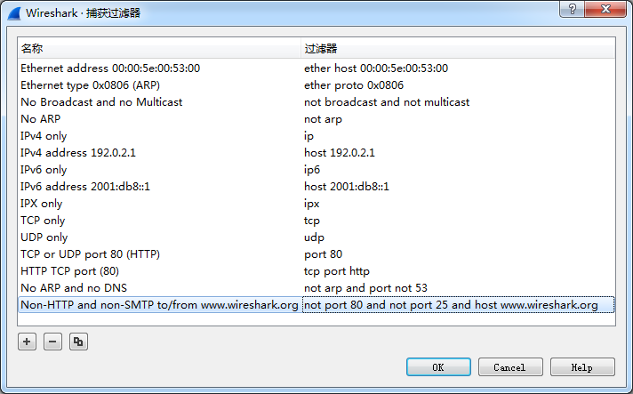
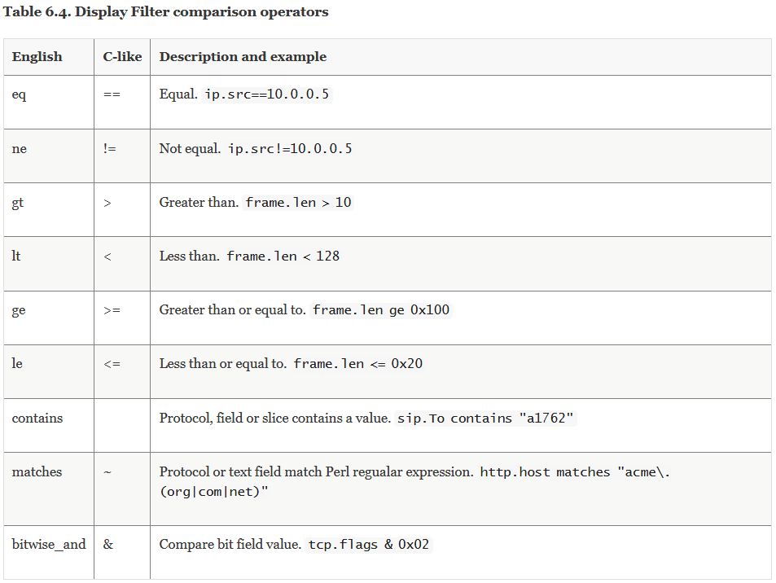
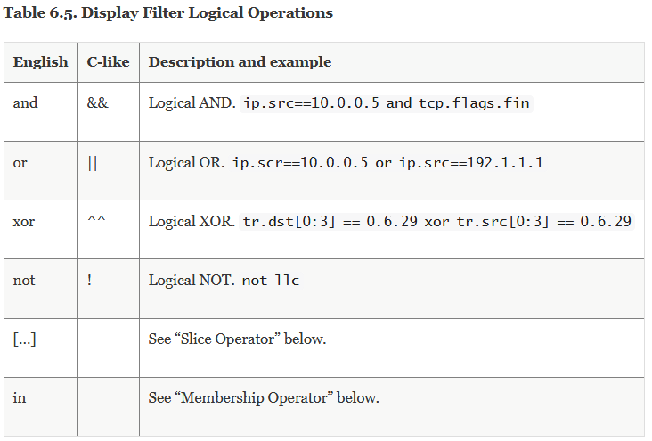

## Linux网络工具

### 网络问题总结

**软件**
* 断连问题ping,telnet,nc,websocat，postman
* 端口问题telnet,netstat,nmap
* 流量问题nethogs
* udp问题iptraf
* 带宽问题iperf3,speedtest
* DNS问题ping,tcping,dig,nslookup
* 路由问题traceroute,route
* 延时问题ping,tcping
* 运营商问题:切换不同的代理出口
* 抓包问题：tcpdump，wireshark，fiddler

**硬件**
* 替换法，替换稳定的器件或者稳定的通路
* 验证原先的通路是否有问题
* ifconfig
* ethtool
* nmcli

### nc

```shell
nc [-hlnruz][-g<网关...>][-G<指向器数目>][-i<延迟秒数>][-o<输出文件>][-p<通信端口>][-s<来源位址>][-v...][-w<超时秒数>][主机名称][通信端口...]
使用示例：
nc <ip> <port>  连接指定IP和端口
nc -l <port> 监听本地端口
-u: 使用udp协议传输，不带该参数默认使用tcp协议
传输文件：
nc <ip> <port> < <fileName>
nc -l <port> > <fileName>
```


### netstat

```shell
netstat -atulnp会显示所有端口和所有对应的程序，用grep管道可以过滤出想要的字段
    -a ：all，表示列出所有的连接，服务监听，Socket资料
    -t ：tcp，列出tcp协议的服务
    -u ：udp，列出udp协议的服务
    -n ：port number， 用端口号来显示
    -l ：listening，列出当前监听服务
    -p ：program，列出服务程序的PID
```

还可以通过lsof或ss查看端口信息，例如：
```
sudo lsof -i :8554
sudo ss -ltnp | grep 8554
```
* lsof 在0.2.tools_debug中有记录
* ss在当前文件中有记录


### ssh 隧道
**正向隧道**
* client    --> server
* localssh  <-> remotessh
```shell
ssh -N -f [-g] -L <locIP>:<locPort>:<remoteIP>:<remotePort> <remoteUserName>@<remoteIP> -p <sshPort>
其中：
-N: 表示不登陆 remote 设备
-f: 表示后台运行，终端退出也在后台运行
-g: 开启网关功能，开启该选项可以监听当前主机所有IP的 <locPort>
<locIP>: locIP可以缺省，此时默认 127.0.0.1，但这种情况下只能在本机访问 <locPort> 端口，来访问远程主机。如果想其他设备访问 本机，进而转发到 远程主机，则 <locIP> 需要改为本机在网络中的IP
```

**反向隧道**
* 场景：
    * 在 client 无法访问到 server 的 IP 时，但是 server 可以访问到 client时，可能需要从 server 建立反向隧道。
    * 典型的情况时有两台公网IP的主机，一台在 server 的环境中（IPA），另一台在其他环境中（IPB），server可以访问到IPA和IPB，但是IPA没有权限，IPB有权限，反之，IPB无法访问 server，此时需要建立反向隧道
* client     --> server
* remotessh  <-> localssh
```shell
ssh -N -f -R <remoteIP>:<remotePort>:<locIP>:<locPort> <remoteUserName>@<remoteIP> -p <sshPort>
其中：
<remoteIP>: 可以缺省不写，因为无论写不写都只能监听 remote 主机的 127.0.0.1 即：remote 主机不能被当作跳板，即便开启 -g 也不行
```

### ss

ss命令是Socket Statistics的缩写，也被称为IPC（Inter-Process Communication）套接字
统计。它是iproute2软件包的一部分，主要用于显示sockets（套接字）的状态。与netstat
命令类似，但ss命令通常提供更详细的统计信息和更快的性能。ss命令直接利用了内核的TCP
连接跟踪状态信息（通过tcp_diag模块），因此能够提供更丰富和详细的网络连接状态视图。

ss命令的主要特点和优势
* 更详细的统计信息：ss命令能够显示更多更详细的TCP和连接状态的信息，包括套接字的
  标记、队列长度等。
* 更快的性能：在处理大量socket连接时，ss命令比netstat更快更高效，因为它直接利用
  内核中的信息，避免了像netstat那样通过/proc接口获取数据的开销。
* 灵活的使用方式：ss命令的使用方式非常灵活，可以通过添加不同的参数来查看不同类型
  的信息，如TCP、UDP、UNIX域套接字等。
* 强大的过滤功能：ss命令支持通过状态、地址、端口等条件进行过滤，方便用户快速定位问题。

#### ss命令的基本语法

```bash
ss [选项] [过滤器]
```

常用选项
* -h、--help：显示帮助信息。
* -V、--version：显示版本信息。
* -n、--numeric：以数字形式显示地址和端口号，不进行DNS解析。
* -r、--resolve：尝试解析IP地址到主机名和端口号到服务名。
* -o、--options：显示计时器和套接字选项。
* -e、--extended：显示详细的套接字信息。
* -p、--processes：显示与套接字关联的进程信息，包括进程ID和名称（需要root权限）。
* -i、--info：显示内部TCP信息。
* -s、--summary：显示套接字使用情况摘要。
* -t、--tcp：仅显示TCP套接字信息。
* -u、--udp：仅显示UDP套接字信息。
* -l、--listening：仅显示处于监听状态的套接字。
* -a、--all：显示所有套接字信息，包括监听和非监听状态的套接字。

#### 常见用法示例

* 显示所有TCP套接字信息：
```bash
ss -t -a
```
* 显示所有UDP套接字信息：
```bash
ss -u -a
```
* 显示所有监听状态的套接字及其对应的进程信息：
```bash
ss -l -p
```
* 以数字格式显示所有套接字信息及其统计摘要：
```bash
ss -n -s
```
* 查看所有已建立的TCP连接：
```bash
ss -t -a state ESTABLISHED
```
* 查看特定端口的连接情况：
```bash
ss dst :端口号
```
注意事项
* 为了使用ss命令并查看其所有功能，用户可能需要具有足够的系统权限（如root用户或
  sudo权限）。
* ss命令的输出结果通常包括套接字的类型（TCP或UDP）、状态（如LISTEN、ESTAB等）、
  本地地址和端口、远程地址和端口（如果有的话），以及与之关联的进程信息（如果使用
  了-p选项）。

### iperf3
```shell
（1）-s,--server：iperf服务器模式，默认启动的监听端口为5201，eg：iperf -s
（2）-c,--client host：iperf客户端模式，host是server端地址，eg：iperf -c 222.35.11.23
（3）-i，--interval：指定每次报告之间的时间间隔，单位为秒，eg：iperf3 -c 192.168.12.168 -i 2
（4）-p，--port：指定服务器端监听的端口或客户端所连接的端口，默认是5001端口。
（5）-u，--udp：表示采用UDP协议发送报文，不带该参数表示采用TCP协议。
（6）-l，--len：设置读写缓冲区的长度，单位为 Byte。TCP方式默认为8KB，UDP方式默认为1470字节。通常测试 PPS 的时候该值为16，测试BPS时该值为1400。
（7）-b，--bandwidth [K|M|G]：指定UDP模式使用的带宽，单位bits/sec，默认值是1 Mbit/sec。
（8）-t，--time：指定数据传输的总时间，即在指定的时间内，重复发送指定长度的数据包。默认10秒。
（9）-A：CPU亲和性，可以将具体的iperf3进程绑定对应编号的逻辑CPU，避免iperf进程在不同的CPU间调度。

举例：
#iperf3 -s -p <serPort> -i 1
#iperf3 -c <serIP> -p <serPort> -i 1 -t 60
Interval表示时间间隔。
Transfer表示时间间隔里面转输的数据量。
Bandwidth是时间间隔里的传输速率。
```


### arp

reference: [ARP协议原理](https://zhuanlan.zhihu.com/p/59066874)

**arp原理**

ARP协议是地址解析协议（Address Resolution Protocol）是通过解析IP地址得到MAC地址的，它与网卡有着极其密切的关系，在TCP/IP分层结构中，把ARP划分为网络层，因为在网络层看来，源主机与目标主机是通过IP地址进行识别的，而所有的数据传输又依赖网卡底层硬件，即链路层，那么就需要将这些IP地址转换为链路层可以识别的东西，在所有的链路中都有着自己的一套寻址机制，如在以太网中使用MAC地址进行寻址，以标识不同的主机，那么就需要有一个协议将IP地址转换为MAC地址，由此就出现了ARP协议，所有ARP协议在网络层被应用，它是网络层与链路层连接的重要枢纽，每当有一个数据要发送的时候都需要在通过ARP协议将IP地址转换成MAC地址，在IP层及其以上的层次看来，他们只标识IP地址，从不跟硬件打交道。

ARP缓存表，是为了实现IP地址与MAC地址的查询与转换引入的的概念，每台主机或路由器在维护着一个ARP缓存表（ARP table），这个表包含IP地址到MAC地址的映射关系，表中记录了`<IP地址，MAC地址>`对，他们是主机最近运行时获得关于其他主机的IP地址到MAC地址的映射，当需要发送数据的时候，主机就会根据数据报中的目标IP地址信息，然后在ARP缓存表中进行查找对应的MAC地址，最后通过网卡将数据发送出去。ARP缓存表包含一个寿命值（TTL，也称作生存时间），它将记录每个ARP表项的生存时间，生存时间到了就会从缓存表中删除。从一个表项放置到ARP缓存表中开始，一个表项通常的生存时间一般是10分钟吗，当然，这些生存时间是可以任意设置的，一般使用默认即可。

当主机开机的时候，ARP缓存表肯定是空的，那么怎么一步步建立 ARP表项呢？如果没有ARP表项，那么主机就会去建立ARP表项。
* 对于局域网，如果向局域网中的某个电脑发送一个数据，那么就会从已有的ARP缓存表中寻找这个IP地址对应的物理地址的ARP表项，然后直接将数据写入以太网数据帧中让网卡进行发送即可，而如果没有找到这个IP地址，那么这个数据就没法立即发送，电脑会先在局域网上广播一个ARP请求（目标MAC地址为FF-FF-FF-FF-FF-FF），广播的ARP请求发出后，处于同一局域网内的所有主机都会接收到这个请求，如果目标IP地址与接收到ARP请求的主机自身IP地址吻合就会返回一个ARP应答，告诉请求者（即我的电脑）自身的MAC地址，当我的电脑收到这个ARP应答后，就去建立一个ARP表项，并且重新将数据发送出去。  
ARP协议的核心就是对缓存表的操作，发送数据包的时候，查找ARP缓存表以得到对应的MAC地址，在ARP缓存表中的TTL即将过期的时候更新缓存表以保证ARP表项有效，此外ARP协议还需要不断处理来自局域网中其他主机的ARP请求。

* 对于公网，因为当前电脑与服务器主机不在一个网段，电脑查询自己的路由表，知道如果想和服务器主机通信则必须通过网关（gateway）来中转，所以会在与网关直连的网卡上请求网关的MAC地址，因为电脑要把发给服务器主机的数据先发给网关，当合法以太帧到达网关并且顺利接收后，网关会将数据递交给IP层，IP层查询路由表，找到与服务器主机直连的接口（假设是直连的，实际上肯定不是直连的），网关会发一个ARP请求到服务器主机上，请求它的MAC地址，网关收到应答后将建立新的ARP表项并将开始维护ARP缓存表，然后完成最终的通信。因此这里服务器的缓存表是建立在网关中的，当前电脑只需要将数据和要请求的服务器地址发给网关。

ARP缓存表的超时处理，ARP是动态处理的，ARP表项的生存时间是一般为5-10分钟（LwIP中默认是5分钟），而ARP请求的等待时间是5秒钟，当这些时间到达后，就会更新ARP表项，如果在物理链路层无法连通则会删除表项。因此每个协议栈的实现都必须维护着一个定时器（超时机制）来管理ARP缓存表，在必要的时候更新及删除ARP表项。  
题外话：因为ARP协议是一个动态的协议，很多网络攻击都是利用ARP协议进行的，如ARP欺骗，ARP洪水攻击等等，而且这种攻击是很难防御的，当然也有办法，直接将动态的ARP缓存表设置为静态就行了，但是这就违背了ARP协议的动态地址解析特性。

**语法**

`arp <opt> <para>`

**选项**

```
-a # 主机 ：显示 arp 缓冲区的所有条目；
-H # 地址类型 ：指定 arp 指令使用的地址类型；
-d # 主机 ：从 arp 缓冲区中删除指定主机的 arp 条目；
-D # 使用指定接口的硬件地址；
-e # 以 Linux 的显示风格显示 arp 缓冲区中的条目；
-i # 接口 ：指定要操作 arp 缓冲区的网络接口；
-s # 主机 MAC 地址 ：设置指定的主机的 IP 地址与 MAC 地址的静态映射；
-n # 以数字方式显示 arp 缓冲区中的条目；
-v # 显示详细的 arp 缓冲区条目，包括缓冲区条目的统计信息；
-f # 文件 ：设置主机的 IP 地址与 MAC 地址的静态映射。
```

### tracert

tracert是路由跟踪命令，用于确定 IP 数据包访问目标所采取的路径。

**语法**

`tracert [-d] [-h maximum_hops] [-j host-list] [-w timeout] [-R] [-S srcaddr] [-4] [-6] target_name`

**参数说明**

```
-d：表示不让 tracert 根据节点主机名查找路由的 IP 地址，直接进行路由跟踪。当路由器不支持 ICMP/UDP/ICMPv6 数据包时，建议使用该选项。
-h maximum_hops：指定最多经过多少个节点进行路由跟踪，默认值为 30。使用该选项可以更改该值。
-j host-list：枚举一个节点列表，并在路由跟踪过程中只走该列表中的节点。
-w timeout：设置等待每个回复消息的超时时间，默认值为 4000 毫秒。使用该选项可以更改该值。
-R：指示 tracert 跟踪路由时，使用“参考路由”而不是“严格源路由”。如果启用了该选项，则可以跨越某些无法到达的能够到达目标的路由器。
-S srcaddr：指定源地址。如果在单个计算机上安装了多个网络适配器，则使用该选项可以指定从哪个适配器发出路由跟踪请求。
-4：强制使用 IPv4 进行路由跟踪。
-6：强制使用 IPv6 进行路由跟踪。
target_name：表示要查询的目标 IP 地址或主机名。
```

**使用方法**

假设你要查询百度的 IP 地址的路由信息，你可以使用以下命令：

`tracert www.baidu.com`

执行该命令后，Windows 系统会自动进行路由跟踪，并打印出许多节点信息，如下：
```
tracert www.baidu.com

通过最多 30 个跃点跟踪
到 www.a.shifen.com [14.119.104.189] 的路由:

  1     2 ms     1 ms     3 ms  192.168.1.1
  2     4 ms     4 ms     5 ms  10.1.1.1
  3     4 ms     4 ms     4 ms  116.22.52.1
  4    11 ms    14 ms    14 ms  113.98.85.121
  5     3 ms     8 ms     3 ms  14.147.4.209
  6     *        *        *     请求超时。
  7    26 ms     5 ms     *     121.14.14.162
  8    24 ms    18 ms    10 ms  14.29.117.150
  9     *        *        *     请求超时。
 10     *        *        *     请求超时。
 11    12 ms     4 ms     6 ms  14.119.104.189

跟踪完成。
```

在输出中，列出了路由跟踪时经过的每个网络节点的 IP 地址以及路由延迟。第一列包含跟踪的网络节点的序号，第二列指示往返时间，第三列指示路由跟踪过程中接收到每个节点的 IP 地址。

还可以利用命令参数调整结果输出的方式，例如：
* tracert -d target_name：不将节点主机名转换为 IP 地址。
* tracert -h 20 target_name：设置最多经过 20 个节点进行路由追踪。
* tracert -R target_name：使用“参考路由”而不是“严格源路由”。

比如如下操作：

`tracert -dR www.baidu.com`

### traceroute

references:
* [traceroute命令详解](https://www.cnblogs.com/machangwei-8/p/10353279.html)
* [Linux之traceroute命令](https://zhuanlan.zhihu.com/p/398459677)
* [traceroute使用与实现原理分析](https://zhuanlan.zhihu.com/p/36811672)

**tracert和traceroute**
* 相同点：都是用来跟踪路由，帮助排查问题，关注的是过程，而ping关注的是结果。
* 不同点：tracert请求是icmp echo报文；traceroute请求是UDP的报文，目标端口是30000以上随机端口。

`sudo apt install traceroute`

```
ex:
traceroute www.baidu.com
traceroute youtube.com
```

命令格式：
`traceroute[参数][主机]`

命令参数：

```
-d 使用Socket层级的排错功能。
-f 设置第一个检测数据包的存活数值TTL的大小。
-F 设置勿离断位。
-g 设置来源路由网关，最多可设置8个。
-i 使用指定的网络界面送出数据包。
-I 使用ICMP回应取代UDP资料信息。
-m 设置检测数据包的最大存活数值TTL的大小。
-n 直接使用IP地址而非主机名称。
-p 设置UDP传输协议的通信端口。
-r 忽略普通的Routing Table，直接将数据包送到远端主机上。
-s 设置本地主机送出数据包的IP地址。
-t 设置检测数据包的TOS数值。
-v 详细显示指令的执行过程。
-w 设置等待远端主机回报的时间。
-x 开启或关闭数据包的正确性检验。
```

使用方法

```
[root@localhost ~]# traceroute www.baidu.com
traceroute to www.baidu.com (61.135.169.125), 30 hops max, 40 byte packets
 1  192.168.74.2 (192.168.74.2)  2.606 ms  2.771 ms  2.950 ms
 2  211.151.56.57 (211.151.56.57)  0.596 ms  0.598 ms  0.591 ms
 3  211.151.227.206 (211.151.227.206)  0.546 ms  0.544 ms  0.538 ms
 4  210.77.139.145 (210.77.139.145)  0.710 ms  0.748 ms  0.801 ms
 5  202.106.42.101 (202.106.42.101)  6.759 ms  6.945 ms  7.107 ms
 6  61.148.154.97 (61.148.154.97)  718.908 ms * bt-228-025.bta.net.cn (202.106.228.25)  5.177 ms
 7  124.65.58.213 (124.65.58.213)  4.343 ms  4.336 ms  4.367 ms
 8  202.106.35.190 (202.106.35.190)  1.795 ms 61.148.156.138 (61.148.156.138)  1.899 ms  1.951 ms
 9  * * *
30  * * *
[root@localhost ~]#
```

记录按序列号从1开始，每个纪录就是一跳 ，每跳表示一个网关，我们看到每行有三个时间，单位是 ms，其实就是-q的默认参数。探测数据包向每个网关发送三个数据包后，网关响应后返回的时间；如果您用 traceroute -q 4 www.58.com ，表示向每个网关发送4个数据包。

有时我们traceroute 一台主机时，会看到有一些行是以星号表示的。出现这样的情况，可能是防火墙封掉了ICMP的返回信息，所以我们得不到什么相关的数据包返回数据。

有时我们在某一网关处延时比较长，有可能是某台网关比较阻塞，也可能是物理设备本身的原因。当然如果某台DNS出现问题时，不能解析主机名、域名时，也会 有延时长的现象；您可以加-n 参数来避免DNS解析，以IP格式输出数据。

如果在局域网中的不同网段之间，我们可以通过traceroute 来排查问题所在，是主机的问题还是网关的问题。如果我们通过远程来访问某台服务器遇到问题时，我们用到traceroute 追踪数据包所经过的网关，提交IDC服务商，也有助于解决问题；但目前看来在国内解决这样的问题是比较困难的，就是我们发现问题所在，IDC服务商也不可能帮助我们解决。


### route

references:
* [路由工作原理（路由表及其形成过程、静态路由、默认路由）](https://blog.csdn.net/weixin_51613313/article/details/109300224)
* [详解 linux 路由 route 命令](https://zhuanlan.zhihu.com/p/619838356)

路由：数据从源主机到目标主机的转发过程（路径）。

路由和交换机的区别：
* 数据在同一网段的转发用交换机。
* 数据在不同网段的转发用路由器。

路由器：能够将数据包转移到正确目的地，并在转交过程中选择最佳路径的设备。


**路由表的形成**

路由器的主要工作就是为经过路由器的每个数据帧寻找一条最佳传输路径，并将该数据有效地传送到目的站点。由此可见，选择最佳路径的策略即路由算法是路由器的关键所在。为了完成这项工作，在路由器中保存着各种传输路径的相关数据――路径表（RoutingTable），供路由选择时使用。路径表中保存着子网的标志信息、网上路由器的个数和下一个路由器的名字等内容。路径表可以是由系统管理员固定设置好的，也可以由系统动态修改，可以由路由器自动调整，也可以由主机控制。

路由表是路由器中维护的路由条目的集合，路由器根据路由表做路径选择，路由表中有直连网段和非直连网段两种。
* 直连网段：路由器上配置了接口的IP地址，并且接口状态为“up”状态，由此产生直连路由 。
* 非直连网段：没有跟路由器直接连接的网段，就是非直连网段 。

可以这么理解：对每一个路由器而言，长在路由器自己身上的，就是直连网段，没有长在自己身上，就是非直连网段对于非直连的网段，就需要静态路由或者动态路由，将网段添加到路由表中 。手动配上去的就是静态路由。


**路由表的内容**

路由表中的数据一般都是条目的形式。典型的路由表条目包含以下主要条目：
* 目标 IP 地址：此字段表示目标的 IP 地址。该 IP 地址可以是单个主机的地址，也可以是网络的地址。如果该条目包含主机的 IP 地址，则它由地址中的非零主机 ID 表示，而如果该条目包含网络的 IP 地址，则它由主机 ID 值 0 表示。
* 下一个路由器的 IP 地址：为什么称为“下一个”是因为这并不一定是最终路由器，它很可能是一个中间路由器。该条目给出了下一个路由器的 IP 地址，该地址决定如何进一步发送在其接口上接收到的 IP 数据报。
* 标志：此字段提供另一组重要信息，如目标 IP 地址是主机地址或网络地址。此外，标志传达下一个路由器是真正的下一个路由器还是直接连接的接口。
* 网络接口规范：关于网络接口的一些规范，应传递数据报以进行进一步传输。


**路由表相关操作**

route 命令的常用选项：
* route -n：以数字格式显示路由表。这将以 IP 地址和网络掩码的数字形式而非主机名和网络掩码的形式来显示路由表的内容。
* route add：添加新的路由表项。
* route del：从路由表中删除一条路由。
* route change：更改路由表中的一条路由。
* route flush：清空整个路由表。

在 route -n 命令的输出中可以看见标志即路由类型。以下是一些常见的路由类型及其含义：
* U 表示该路由是可用的 (up)
* G 表示该路由是一个默认网关 (gateway)
* H 表示该路由是一个主机路由 (host)
* UG 表示该路由同时具有默认网关和可用的属性
* UGH 表示该路由同时具有默认网关、可用和主机路由属性

***新增路由***

在 route add 命令中，可以使用 -gw 选项指定一个网关，也可以使用 -dev 选项指定要使用的网络设备。并且这两个选项可以同时使用，具体取决于网络设置和路由表配置。
```shell
# ==> 添加到网络的路由
route add -net 192.168.1.0 netmask 255.255.255.0 gw 192.168.0.1
# 如果指定掩码为 255.255.255.255 则变为了到主机的路由
route add -net 192.168.1.2 netmask 255.255.255.255 gw 192.168.0.1

# ==> 添加到主机的路由
route add -host 192.168.1.100 gw 192.168.0.1 eth0

# ==> 添加持久路由
# persist 选项是用于将静态路由添加到系统启动时的路由表中。当系统启动时，它会读取 /etc/network/interfaces 或 /etc/sysconfig/network-scripts/ifcfg-* 等配置文件，并在加载网络接口时自动执行 route 命令以添加静态路由
# 在 route add 命令中，指定 persist 选项将使添加的路由持久化，并在系统重启后自动加载。这样可以确保添加的路由在系统重新启动后仍然存在，而不需要手动重新添加路由。
route add -net 192.168.1.0 netmask 255.255.255.0 gw 192.168.0.1 persist

# ==> 添加路由时指定接口
route add -net 192.168.1.0 netmask 255.255.255.0 dev eth0
```

***删除路由***

删除类型基本只需要将添加路由的命令 add 改为 del 即可，下面的删除对应上面的新增。
```shell
# ==> 删除到网络的路由
route del -net 192.168.1.0 netmask 255.255.255.0 gw 192.168.0.1

# ==> 删除到主机的路由
route del -host 192.168.1.100 gw 192.168.0.1

# ==> 删除持久路由
route del -net 192.168.1.0 netmask 255.255.255.0 gw 192.168.0.1
# persist 选项指示添加的路由应该保存到系统启动时的路由表中，因此，在删除静态路由时不需要使用 -persist 选项。

# ==> 删除指定接口路由
route del -net 192.168.1.0 netmask 255.255.255.0 dev eth0
```

***更改路由表***
```shell
# ==> 更改到网络的路由网关
route change -net 192.168.1.0 netmask 255.255.255.0 gw 192.168.0.2

# ==> 更改到主机的路由网关
route change -host 192.168.1.100 gw 192.168.0.2

# ==> 更改持久路由网关
route change -net 192.168.1.0 netmask 255.255.255.0 gw 192.168.0.2 persist

# ==> 更改路由指定接口
route change -net 192.168.1.0 netmask 255.255.255.0 dev eth1
```

***清空路由表***
```shell
route flush
# 使用 route flush 命令将清空整个路由表，这意味着所有当前定义的路由都将被删除。在路由表被清空后，系统将无法将数据包路由到其目标地址，将无法访问网络。
# 因此，在执行 route flush 命令之前，应该确保已经备份了路由表，以便在需要时可以快速恢复。如果需要仅删除特定的路由表项，应该使用 route del 命令来删除特定的路由表项。
```


### wireshark

reference:
* [Wireshark使用教程（界面说明、捕获过滤器表达式、显示过滤器表达式）](https://www.cnblogs.com/lsdb/p/9254544.html)

#### 拦截本地回环数据

本机访问本机的回环数据是不经过网卡的（如我们在本机访问搭建在本机上的web服务），但我们经常有服务搭建在本机的操作也经常有拦截本地回环数据包加以分析的需求，所以我们环要拦载回环数据包。操作如下：

``` shell
# 查看本地IP和网关
ifconfig

# 添加路由，指定回环数据也要先转发到网关
route add <your_IP> mask 255.255.255.255 <gateway_IP> metric 1

# 查看路由表中路由是否已添加成功：
route print

# 回环数据经网关再回来会增加网卡的压力，可使用以下命令删除路由（使用前边获取本的本机ip替换其中的<your_IP>）：
route delete <your_IP>
```

#### 界面说明

* 1号窗口展示的是wireshark捕获到的所有数据包的列表。注意最后一列Info列是wireshark组织的说明列并不一定是该数据包中的原始内容。
* 2号窗口是1号窗口中选定的数据包的分协议层展示。底色为红色的是因为wireshark开启校验和验证而该层协议校验和又不正确所致。
* 3号窗口是1号窗口中选定的数据包的源数据，其中左侧是十六进制表示右侧是ASCII码表示。另外在2号窗口中选中某层或某字段，3号窗口对应位置也会被高亮。


被认为最难的其实还是2号窗口展开后的内容不懂怎么看，其实也很明了，以IP层为例：
* 每一行就对应该层协议的一个字段（中括号行是前一字段的说明）
* 冒号前的英文是协议字段的名称，冒号后是该数据包中该协议字段的值。


#### 捕获过滤器

捕获过滤器表达式作用在wireshark开始捕获数据包之前，只捕获符合条件的数据包，不记录不符合条件的数据包。

捕获过滤器表达式没有像显示过滤器表达式那样明显的规律，但写法不多所以也不难；而且除非全部捕获要占用的磁盘空间实现太大，且你非常明确过滤掉的数据包是你不需要的，不然一般都不用捕获过滤器表达式而用显示过滤器表达式。

在wireshark2.x版本，启动后欢迎界面即有捕获过滤器，在其中输入过滤表达式开始捕获数据包时即会生效：


点击图中“书签”标志，再点管理“捕获筛选器”，即可看到常用捕获过滤表达示的书写形式





from [超详细解析wireshark捕获过滤器语法](https://zhuanlan.zhihu.com/p/272685665)

捕获过滤器的语法格式为：

`<Protocol> <Direction> <Host> <Value> <Logical Operation> <other expression>`

以上语法解析：
* Protocol (协议) :该选项用来指定协议。可使用的值有ether、fddi、 wlan、 ip、arprarp、decnet、 lat、 sca、 moproc、 mopdl、 tcp 和udp.如果没有特别指明是什么协议，则默认使用所有支持的协议。
* Direction (方向) :该选项用来指定来源或目的地，默认使用src or dst作为关键该选项可使用的值有src、dst、 sre and dst和src or dst。
* Host(s): 指定主机地址。如果没有指定，默认使用host 关键字。可能使用的值有：net、port、 host 和portrange.
* Logical Operations (逻辑运算):该选项用来指定逻辑运算符。可能使用的值有and和or.其中，not (否)具有最高的优先级; or (或)和and (与)具有优先级，运算时从左至右进行。
* Other expression (其他表达式) :使用其他表达式捕获过滤器。

#### 显示过滤器

显示过滤器表达式作用在在wireshark捕获数据包之后，从已捕获的所有数据包中显示出符合条件的数据包，隐藏不符合条件的数据包。

显示过滤表达示在工具栏下方的“显示过滤器”输入框输入即可生效


**基本过滤表达式**

<font color='red'>一条基本的表达式由过滤项、过滤关系、过滤值三项组成。</font>

比如ip.addr == 192.168.1.1，这条表达式中ip.addr是过滤项、==是过滤关系，192.168.1.1是过滤值（整条表达示的意思是找出所有ip协议中源或目标ip、等于、192.168.1.1的数据包）

***过滤项***
<font color='red'>wireshark的过滤项是“协议“+”.“+”协议字段”的模式。</font>以端口为例，端口出现于tcp协议中所以有端口这个过滤项且其写法就是tcp.port。

推广到其他协议，如eth、ip、udp、http、telnet、ftp、icmp、snmp等等其他协议都是这个书写思路。当然wireshark出于缩减长度的原因有些字段没有使用协议规定的名称而是使用简写（比如Destination Port在wireshark中写为dstport）又出于简使用增加了一些协议中没有的字段（比如tcp协议只有源端口和目标端口字段，为了简便使用wireshark增加了tcp.port字段来同时代表这两个），但思路总的算是不变的。而且在实际使用时我们输入“协议”+“.”wireshark就会有支持的字段提示（特别是过滤表达式字段的首字母和wireshark在上边2窗口显示的字段名称首字母通常是一样的），看下名称就大概知道要用哪个字段了。wireshark支持的全部协议及协议字段可查看[官方说明](https://www.wireshark.org/docs/dfref/)。

***过滤关系***

过滤关系就是大于、小于、等于等几种等式关系，我们可以直接看官方给出的表。注意其中有“English”和“C-like”两个字段，这个意思是说“English”和“C-like”这两种写法在wireshark中是等价的、都是可用的。




***过滤值***

过滤值就是设定的过滤项应该满足过滤关系的标准，比如500、5000、50000等等。过滤值的写法一般已经被过滤项和过滤关系设定好了，只是填下自己的期望值就可以了。


**复合过滤表达示**

所谓复合过滤表达示，就是指由多条基本过滤表达式组合而成的表达示。基本过滤表达式的写法还是不变的，复合过滤表达示多出来的东西就只是基本过滤表达示的“连接词”

我们依然直接参照[官方给出的表](https://www.wireshark.org/docs/wsug_html/#FiltLogOps)，同样“English”和“C-like”这两个字段还是说明这两种写法在wireshark中是等价的、都是可用的。



**常见用显示过滤需求及其对应表达式**

```
数据链路层：
筛选mac地址为04:f9:38:ad:13:26的数据包----eth.src == 04:f9:38:ad:13:26
筛选源mac地址为04:f9:38:ad:13:26的数据包----eth.src == 04:f9:38:ad:13:26

网络层：
筛选ip地址为192.168.1.1的数据包----ip.addr == 192.168.1.1
筛选192.168.1.0网段的数据---- ip contains "192.168.1"
筛选192.168.1.1和192.168.1.2之间的数据包----ip.addr == 192.168.1.1 && ip.addr == 192.168.1.2
筛选从192.168.1.1到192.168.1.2的数据包----ip.src == 192.168.1.1 && ip.dst == 192.168.1.2

传输层：
筛选tcp协议的数据包----tcp
筛选除tcp协议以外的数据包----!tcp
筛选端口为80的数据包----tcp.port == 80
筛选12345端口和80端口之间的数据包----tcp.port == 12345 && tcp.port == 80
筛选从12345端口到80端口的数据包----tcp.srcport == 12345 && tcp.dstport == 80

应用层：
特别说明----http中http.request表示请求头中的第一行（如GET index.jsp HTTP/1.1），http.response表示响应头中的第一行（如HTTP/1.1 200 OK），其他头部都用http.header_name形式。
筛选url中包含.php的http数据包----http.request.uri contains ".php"
筛选内容包含username的http数据包----http contains "username"
```
