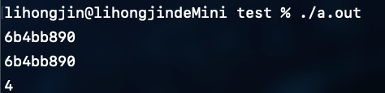
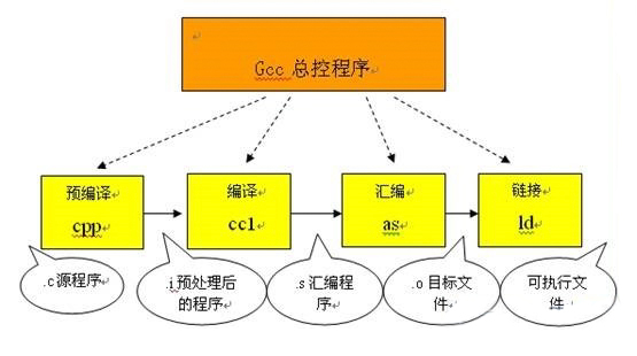

# 嵌入式开发基础

## C语言常用技巧

### uml 关系
```
【泛化】
    - 关系：指定了子类如何特化父类的所有特征和行为
    - 代码：继承
    - 箭头：三角、空心、实线，指向父类
【实现】
    - 关系：类与接口的关系，表示类是接口所有特征和行为的实现
    - 代码：类接口
    - 箭头：三角、空心、虚线，指向接口
【依赖】
    - 关系：是一种使用的关系，即一个类的实现需要另一个类的协助，弱关联，短期相关
    - 代码：形参、临时变量等
    - 箭头：三角、实心、虚线，指向被依赖
【关联】
    - 关系：是一种拥有的关系，它使一个类知道另一个类的属性和方法，可单向可双向，
            长期相关需要重点关注，是长期的，因此以成员变量的形式存在
    - 代码：成员变量
    - 箭头：三角、实心、实线，指向被拥有者
【聚合】
    - 关系：整体与部分的关系，部分可以离开整体单独存在，是一种强的关联关系；
            关联和聚合在语法上无法区分，必须考察具体的逻辑关系。
            例如雁群和大雁的关系、学校和学生之间的关系
    - 代码：成员变量
    - 箭头：菱形、空心、实线，指向整体
【组合】
    - 关系：整体与部分的关系，但部分不能离开整体而单独存在，是一种更强的关联关系
            例如大雁和大雁的翅膀是组合关系。
    - 代码：成员变量
    - 箭头：菱形、实心、实线，指向整体

耦合强弱： 组合 > 聚合 > 关联 > 依赖
```

### 关于#和##
在C语言的宏中，#的功能是将其后面的宏参数进行字符串化操作（Stringfication），简单
说就是在对它所引用的宏变量通过替换后在其左右各加上一个双引号。例如：
```c
#define WARN_IF(EXP) \
do{ \
    if (EXP) \
    fprintf(stderr, "Warning: " #EXP "\n"); \
}while(0)
```
那么实际使用中会出现下面所示的替换过程：
```c
WARN_IF (divider == 0);
```
被替换为
```c
do {
  if (divider == 0)
  fprintf(stderr, "Warning" "divider == 0" "\n");
} while(0);
```
这样每次divider（除数）为0的时候便会在标准错误流上输出一个提示信息。

而##被称为连接符（concatenator），用来将两个Token连接为一个Token。注意这里连接的
对象是Token就行，而不一定是宏的变量。比如你要做一个菜单项命令名和函数指针组成的
结构体的数组，并且希望在函数名和菜单项命令名之间有直观的、名字上的关系。那么下面
的代码就非常实用：
```c
struct command
{
  char *name;
  void (*function) (void);
};
#define COMMAND(NAME)   { NAME, NAME ## _command }
// 这里NAME##_command 里的NAME会被替换为给定变量的名字，而不是值
// 然后你就用一些预先定义好的命令来方便的初始化一个command结构的数组了：
struct command commands[] = {
  COMMAND(quit),
  COMMAND(help),
  ...
}
```
COMMAND宏在这里充当一个代码生成器的作用，这样可以在一定程度上减少代码密度，间接地
也可以减少不留心所造成的错误。我们还可以n个##符号连接 n+1个Token，这个特性也是
`#`符号所不具备的。比如：
```c
#define LINK_MULTIPLE(a,b,c,d) a##_##b##_##c##_##d
typedef  struct  _record_type  LINK_MULTIPLE(name,company,position,salary);
// 这里这个语句将展开为：
// typedef  struct  _record_type  name_company_position_salary;
```

### 变参列表

可变参数列表是通过宏来实现的，这些宏定义于 stdarg.h 头文件，他是标准库的一部分。
这个头文件声明了一个类型 vs_list 和三个宏： va_start 、 va_arg 和 va_end 。我们
可以声明一个类型为 va_list 的变量，与这几个宏配合使用，访问参数的值。
```c
/*
 * 计算指定数量的数据的平均值
 */
#include <stdarg.h>

float average(int n_values, ...) {
    va_list var_arg;
    int sum;
    int count;

    // 准备访问可变参数
    va_start(var_arg, n_values);

    // 添加取自可变参数列表的值
    for(count = 0; count < n_values; count++) {
        sum += va_arg(var_arg, int);
    }

    // 完成处理可变参数
    va_end(var_arg);

    return sum / n_values;
}

int main(int argc, char *argv)
{
    printf("average is: %d \n", average(1, 2, 3));
}
```
注意参数列表中的省略号，他提示此处可能传递数量和类型未知的参数。

在函数中声明了一个名为 var_arg 的变量，它用于访问参数列表的未确定部分。这个变量
通过 va_start 来初始化，它的第一个参数是 va_lista 变量的名字（即程序中的var_arg），
第二个参数是省略号前最后一个有名字的参数。初始化过程把 var_arg 变量设置为指向可变
参数部分的第一个参数（n_values）。

|栈底|
|--|
|…|
|param3|
|param2|
|param1 (n_values)|
|var_arg|
|栈顶|

为了访问参数，需要使用 va_arg，这个宏接受两个参数： va_list 变量和参数列表当前
参数的类型。在有些函数中可能要通过前面获得的数据来判断当前参数的类型（例如，
printf检查格式字符串中的字符来判断他需要打印的参数类型），va_arg 返回这个参数的
值，并使 var_arg 指向下一个可变参数。

最后，当访问完毕最后一个可变参数之后，需要调用va_end。

### 变参宏

**`标识符 __VA_ARGS__`**

`__VA_ARGS__` 是在 C99 中增加的新特性。虽然 C89 引入了一种标准机制，允许定义具有
可变数量参数的函数，但是 C89 中不允许这种定义可变数量参数的方式出现在宏定义中。
C99 中加入了 `__VA_ARGS__` 关键字，用于支持在宏定义中定义可变数量参数，用于接收
`...`传递的多个参数。

`__VA_ARGS__` 只能出现在使用了省略号的像函数一样的宏定义里。例如:
```
#define myprintf(...) fprintf(stderr, `__VA_ARGS__`)。
```

**带 ‘#’ 的标识符 `#__VA_ARGS__`**
预处理标记 ‘#’ 用于将宏定义参数转化为字符串，因此 #__VA_ARGS__ 会被展开为参数列表
对应的字符串。

示例：
```c
#define showlist(...) put(#__VA_ARGS__)

// 测试如下：
showlist(The first, second, and third items.);
showlist(arg1, arg2, arg3);

// 输出结果分别为：
// The first, second, and third items.
// arg1, arg2, arg3
```

**带 ‘##’ 的标识符 `##__VA_ARGS__`**

`##__VA_ARGS__` 是 GNU 特性，不是 C99 标准的一部分，C 标准不建议这样使用，但目前
已经被大部分编译器支持。

标识符 `##__VA_ARGS__` 的意义来自 ‘##’，主要为了解决一下应用场景：
```c
#define myprintf_a(fmt, ...) printf(fmt, __VA_ARGS__)
#define myprintf_b(fmt, ...) printf(fmt, ##__VA_ARGS__)
```

应用：
```c
myprintf_a("hello");
myprintf_b("hello");

myprintf_a("hello: %s", "world");
myprintf_b("hello: %s", "world");
```
这个时候，编译器会报错，如下所示：
```c
applications\main.c: In function 'main':
applications\main.c:26:57: error: expected expression before ')' to-ken
 #define myprintf_a(fmt, ...) printf(fmt, __VA_ARGS__)
                                                         ^
applications\main.c:36:5: note: in expansion of macro 'myprintf_a'
     myprintf_a("hello");
```
为什么呢？
我们展开 myprintf_a("hello"); 之后为 printf("hello",)。因为没有不定参，所以，
`__VA_ARGS__` 展开为空白字符，这个时候，printf 函数中就多了一个 ‘,’（逗号），
导致编译报错。而 `##__VA_ARGS__` 在展开的时候，因为 ‘##’ 找不到连接对象，会将
‘##’之前的空白字符和‘,’（逗号）删除，这个时候printf函数就没有了多余的‘,’（逗号）。

### main函数入参
```c
// main函数入参有两种写法：
int main (int argc, char *argv[])
// [ ] 的优先级高于 *，这样第二个参数可以解释为定义了一个数组，该数组中的所有元素
// 都是指向C风格字符串的指针（即 char *）。

// 另一种写法：
int main (int argc, char **argv)
```

### C 语言中的constructor与destructor

可以给一个函数赋予constructor或destructor，其中constructor在main开始运行之前被
调用，destructor在main函数结束后被调用。如果有多个constructor或destructor，可以
给每个constructor或destructor赋予优先级，对于constructor，优先级数值越小，运行
越早。destructor则相反。

例如：
```c
#include <stdio.h>

__attribute__((constructor(101))) void foo()
{
    printf("in constructor of foo\n");
}
__attribute__((constructor(102))) void foo1()
{
    printf("in constructor of foo1\n");
}
__attribute__((destructor)) void bar()
{
    printf("in constructor of bar\n");
}

int main()
{
        printf("in main\n");
        return 0;
}
```
其中constructor后边括号中为优先级，也可以不指定优先级。

### `__FUNCTION__` `__func__`等
```c
__FUNCTION__： 当前函数名

__func__：当前函数名

__PRETTY_FUNCTION__： 非标准宏。这个宏比__FUNCTION__功能更强,  若用g++编译C++程
序, __FUNCTION__只能输出类的成员名,不会输出类名;而__PRETTY_FUNCTION__则会以
<return-type>  <class-name>::<member-function-name>(<parameters-list>) 的格式
输出成员函数的详悉信息(注: 只会输出parameters-list的形参类型, 而不会输出形参名).
若用gcc编译C程序,__PRETTY_FUNCTION__跟__FUNCTION__的功能相同。

__LINE__：当前程序行的行号，表示为十进制整型常量，#line指令可以改变它的值。
                  例如： #line  200 指定下一行的__LINE__为200,重点是line的下一行是200

__FILE__：当前源文件名，表示字符串型常量

__DATE__：转换的日历日期，表示为Mmm dd yyyy 形式的字符串常量，Mmm是由asctime产生的。

__TIME__：转换的时间，表示"hh:mm:ss"形式的字符串型常量，是由asctime产生的。

__SIZEOF_POINTER__：当前平台指针的byte数

__WORDSIZE： 这个好像针对嵌入式平台

__SIZEOF_INT__
__SIZEOF_LONG__
__SIZEOF_LONG_LONG__
__SIZEOF_SHORT__
__SIZEOF_POINTER__
__SIZEOF_FLOAT__
__SIZEOF_DOUBLE__
__SIZEOF_LONG_DOUBLE__
__SIZEOF_SIZE_T__
__SIZEOF_WCHAR_T__
__SIZEOF_WINT_T__
__SIZEOF_PTRDIFF_T__
__GNUC__ 、__GNUC_MINOR__ 、__GNUC_PATCHLEVEL__分别代表gcc的主版本号，次版本号，修正版本号
```
更多宏定义可以参考：
[3.7.2 Common Predefined Macros](https://gcc.gnu.org/onlinedocs/cpp/Common-Predefined-Macros.html)

### do{}while(0)
为了保证宏定义的使用者能无编译错误地使用宏，可以考虑使用 do{}while(0)的形式。

### 数组和指针

1. 编译器为每个变量分配一个地址（左值）。这个地址在编译时可知，而且该变量在运行
时一直保存于这个地址。相反，存储与变量中的值（他的右值）只有在运行时才可知。所以
定义一个数组，例如：int num[5]; 。这时候num跟一个地址绑定在一起，如果编译器需要
一个地址（可能还要加上偏移量）来执行某种操作，他就可以直接进行操作，不需要增加
指令首先取得具体的地址。相反，对于指针，必须首先在运行时取得他的当前值，然后才能
对他进行解除引用操作。
2. 在表达式中，指针和数组是可以互换的，因为他们在编译器里的最终形式都是指针，并且
都可以进行取下标操作。
3. C语言把数组下标作为指针的偏移量。
4. 在函数参数的声明中，数组名被编译器当作指向该数组第一个元素的指针。编译器只向
函数传递数组的地址，而不是整个数组的拷贝。

### 数组指针和指针数组
```c
int *p1[5]； // 指针数组
int (*p2)[5]； // 数组指针
```
首先，对于语句`int*p1[5]`，因为“[]”的优先级要比`*`要高，所以 p1 先与“[]”结合，构成
一个数组的定义，数组名为 p1，而“int*”修饰的是数组的内容，即数组的每个元素。也就是说，
该数组包含 5 个指向 int 类型数据的指针


其次，对于语句`int(*p2)[5]`，“()”的优先级比“[]”高，`*`号和 p2 构成一个指针的定义，
指针变量名为 p2，而 int 修饰的是数组的内容，即数组的每个元素。也就是说，p2 是一个
指针，它指向一个包含 5 个 int 类型数据的数组。很显然，它是一个数组指针，数组在这里
并没有名字，是个匿名数组。


由此可见，对指针数组来说，首先它是一个数组，数组的元素都是指针，也就是说该数组存储
的是指针，数组占多少个字节由数组本身决定；而对数组指针来说，首先它是一个指针，它指
向一个数组，也就是说它是指向数组的指针，在 32 位系统下永远占 4 字节，至于它指向的
数组占多少字节，这个不能够确定，要看具体情况。

分析一个bug：
```c
int arr[5]={1，2，3，4，5};
int (*p1)[5] = &arr;
/*下面是错误的*/
int (*p2)[5] = arr;
```
不难看出，在上面的示例代码中，&arr 是指整个数组的首地址，而 arr 是指数组首元素的
首地址，虽然所表示的意义不同，但二者之间的值却是相同的。那么问题出来了，既然值是
相同的，为什么语句`int(*p1)[5]=&arr`是正确的，而语句`int(*p2)[5]=arr`却在有些编译
器下运行时会提示错误信息呢（如在 Microsoft Visual Studio 2010 中提示的错误信息为
“a value of type"int*"cannot be used to initialize an entity of type"int(*)[5]"”）？

其实原因很简单，在 C 语言中，赋值符号“=”号两边的数据类型必须是相同的，如果不同，
则需要显示或隐式类型转换。在这里，p1 和 p2 都是数组指针，指向的是整个数组。p1
这个定义的“=”号两边的数据类型完全一致，而 p2 这个定义的“=”号两边的数据类型就不
一致了（左边的类型是指向整个数组的指针，而右边的数据类型是指向单个字符的指针），
因此会提示错误信息。


### const
```c
int *pi;    普通指针
int const *pci; 可以修改指针指向的地址，但是不能修改指针指向的值。值是常量
等价于 const int *cpi;    被称为常量指针（底层），指针指向的内容不能更改。
int * const cpi;  可以修改指针指向的值，但不能修改指针指向的地址，指针是常量
被称为指针常量（顶层），指针指向的地址不能更改。
int const * const cpci;  指针的值和指针指向的值均不能修改，指针和值都是常量

注意：当用实参初始化函数形参时会忽略掉顶层const（值是常量）。换句话说，形参的顶层
const被忽略掉了。当形参有顶层const时，传给它常量对象或者非常量对象都是可以的。这就
导致下边两个定义是一样的，因为顶层const被忽略掉了。
void fcn(const int i){…}
void fcn(int i){…}
```

### 友元
友元函和友元类统称为友元（friend）。

借助友元，可以使得普通函数或其他类中的成员函数可以访问某个类的私有成员和保护成员。

友元函数：普通函数可以访问某个类私有成员或保护成员。需要在类A中声明友元函数
友元类：类A中的成员函数可以访问类B中的私有或保护成员。需要在类B中声明友元类

友元函数的声明格式如下：
`friend 类型 函数名(形参);`

友元类的所有成员函数都是另一个类的友元函数，都可以访问另一个类中的保护成员和私有
成员。声明友元类的格式如下：
`friend class 类名;`

类CB是类CA的友元类，可以直接访问类CA的私有成员。这需要在类CA中声明友元类：`friend class CB`

使用友元类时，需要注意：
- 友元关系不能被继承；
- 友元关系是单向的，不具有交换性。即类B是类A的友元，则类A不一定是类B的友元，需要
  看类中是否有相应的声明；
- 友元关系不具有传递性。即类B是类A的友元，类C是类B的友元，但类C不一定是类A的友元，
  需要看类中是否有相应的声明。
- 友元的声明只能出现在类定义的内部，但是在类内出现的具体位置不限。友元不是类的
  成员，也不受他所在区域访问控制级别的约束。

另外，使用一般不建议把整个类声明为友元类，而只将某些成员函数声明为友元函数，这样
更安全些。

另外，类还可以把其他的类定义为友元，也可以把其他类（之前已经定义过的）的成员函数
定义为友元。此外，友元函数能定义在类的内部，这样的函数是隐式的。

### 单引号和双引号

用单引号括起的一个字符代表一个整数，整数值对应于该字符在编译器采用的字符集中的
序列值。因此，对于采用ASCII字符集的编译器而言，‘a’的含义与0141（八进制）或者97
（十进制）严格一致。

用双引号括起的一个字符代表一个指向无名数组起始字符的指针，该数组被双引号之间的
字符以及一个额外的二进制值为零的字符‘\0’初始化。
因此如下的语句时错误的，因为单引号括起来的是一个整数，而不是char指针：
char *slash = ‘/’;

### 使用 0(NULL)

ANSIC标准允许值为0的常量被强制转换成任何一种类型的指针，并且转换的结果是个NULL，
因此((type *)0)的结果就是一个类型为type *的NULL指针。
如果利用这个NULL指针来访问type的成员当然是非法的，但typeof( ((type *)0)->member)
是想取该成员的类型，所有编译器不会生成访问type成员的代码，类似的代码
&(((type *)0)->member )在最前面有个取地址符&，它的意图是想取member的地址，所以
编译器同样会优化为直接取地址。

如下宏是根据结构体成员获取结构体地址：
```c
#define list_entry(ptr,  type,  member) \
    ((type  *)((char*)(ptr)  -  ( unsigned long)(&((type  *)0)->member)))
```



### 判断大端小端

大端：数据高位在低地址，低位在高地址
小端：数据地位在低地址，高位在高地址
Linux和mac默认栈从低地址向高地址增长
判断大小端的代码：
```c
#include <stdio.h>
int main() {
    int i = 0x11223344;
    char *p;

    p = (char *) &i;
    if (*p == 0x44) {
        printf("Little endian\n");
    }
    else {
        printf("Big endian\n");
    }
    return 0;
}
```

### C语言结构体对齐规则

1. 每个成员的偏移量（Offset）必须是其自身大小（Size）的整数倍：这意味着一个成员
   的起始地址必须是它自身大小的整数倍。例如，一个4字节大小的整数通常必须从4字节
   对齐的地址开始存储。
2. 结构体的总大小（Size）必须是最大成员大小的整数倍：结构体的大小必须足够大，以
   容纳其最大的成员，且必须是最大成员大小的整数倍。这确保了结构体在内存中的布局
   是紧凑的。
3. 结构体成员的顺序保持不变：C语言规定结构体成员的顺序是按照它们在声明中出现的
   顺序进行排列的，不会重新排序。

`#pragma pack(N)`每个特定平台上的编译器都有自己的默认“对齐系数”(也叫对齐模数)。
程序员可以通过预编译命令#pragma pack(n)，n=1,2,4,8,16来改变这一系数，其中的n就是
你要指定的“对齐系数”。

位域也是同理，每个位域会尽可能排列到一个对齐单元中（例如x86默认4byt对齐），但如果
当前对齐单元剩下的空间不够一个新的位域使用时，会将这个新的位域从下一个对齐单元开始
存放

注意这里的`#pragma pack(N)`不能保证位域定义中没有空隙，如果想没有空隙就要使用
`packed`属性


### `__attribute__((packed))` 和 `__attribute__((aligned(4)))`

packed 在用在结构体里时，指的是所有元素紧密排列，不进行填充

aligned(4) 在用在结构体里时，指的是结构体存放的起始地址是4字节对齐的，自然结构体
也占4字节对齐的内存空间

### 内联函数

内联函数需要使用`inline`关键字，由于内联函数的处理在编译过程中，因此需要放在当前
文件或者头文件中，另外如果放在头文件的话，被多次包含可能造成重定义的问题，因此应该
声明为静态函数以避免函数符号冲突

举例：
头文件test.h
```
#ifndef __TEST_H__
#define __TEST_H__

#include <stdio.h>

static inline int m_dump(int num1, int num2)
{
    printf("======> func:%s line:%d num1:%d num2:%d\n", __func__, __LINE__, num1, num2);

    return 0;
}

#endif /* TEST_H__ */
```
C文件：main.c
```
#include "test.h"

static inline int m_test(int num1, int num2)
{
    printf("======> func:%s line:%d num1:%d num2:%d\n", __func__, __LINE__, num1, num2);

    return 0;
}

int main()
{
    m_dump(2, 3);
    m_test(2, 3);
}
```

## C/C++程序编译过程

整个代码的编译过程分为编译和链接两个过程，编译对应图中的大括号括起的部分，其余则为
链接过程。

### 编译过程

编译过程又可以分成两个阶段：编译和汇编。

#### 编译

编译是读取源程序（字符流），对之进行词法和语法的分析，将高级语言指令转换为功能等效
的汇编代码，源文件的编译过程包含两个主要阶段：

**编译预处理**

读取c源程序，对其中的伪指令（以# 开头的指令）和特殊符号进行处理。
伪指令主要包括以下四个方面：
1. 宏定义指令，如# define Name TokenString，# undef等。
对于前一个伪指令，预编译所要做的是将程序中的所有Name用TokenString替换，但作为字符串
常量的 Name则不被替换。对于后者，则将取消对某个宏的定义，使以后该串的出现不再被替换。
2. 条件编译指令，如# ifdef，# ifndef，# else，# elif，# endif等。
这些伪指令的引入使得程序员可以通过定义不同的宏来决定编译程序对哪些代码进行处理。
预编译程序将根据有关的文件，将那些不必要的代码过滤掉。
3. 头文件包含指令，如# include "FileName" 或者`# include < FileName>`等。
在头文件中一般用伪指令# define定义了大量的宏（最常见的是字符常量），同时包含有各种
外部符号的声明。
采用头文件的目的主要是为了使某些定义可以供多个不同的C源程序使用。因为在需要用到
这些定义的C源程序中，只需加上一条# include语句即可，而不必再在此文件中将这些定义
重复一遍。预编译程序将把头文件中的定义统统都加入到它所产生的输出文件中，以供编译
程序对之进行处理。
包含到c源程序中的头文件可以是系统提供的，这些头文件一般被放在/ usr/ include目录下。
在程序中# include它们要使用尖括号`< >`。另外开发人员也可以定义自己的头文件，这些
文件一般与c源程序放在同一目录下，此时在# include中要用双引号（""）。
4. 特殊符号，预编译程序可以识别一些特殊的符号。
例如在源程序中出现的__LINE__标识将被解释为当前行号（十进制数），`__FILE__`则被
解释为当前被编译的C源程序的名称。预编译程序对于在源程序中出现的这些串将用合适的
值进行替换。
预编译程序所完成的基本上是对源程序的“替代”工作。经过此种替代，生成一个没有宏定义、
没有条件编译指令、没有特殊符号的输出文件。这个文件的含义同没有经过预处理的源文件是
相同的，但内容有所不同。下一步，此输出文件将作为编译程序的输入而被翻译成为机器指令。

**编译、优化阶段**

经过预编译得到的输出文件中，只有常量；如数字、字符串、变量的定义，以及C语言的关键字，
如main, if , else , for , while , { , } , + , - , * , \ 等等。

*编译程序*所要作得工作就是通过词法分析和语法分析，在确认所有的指令都符合语法规则之后，
将其翻译成等价的中间代码表示或汇编代码。

*优化处理*是编译系统中一项比较艰深的技术。它涉及到的问题不仅同编译技术本身有关，
而且同机器的硬件环境也有很大的关系。优化一部分是对中间代码的优化。这种优化不依赖于
具体的计算机。另一种优化则主要针对目标代码的生成而进行的。

对于前一种优化，主要的工作是删除公共表达式、循环优化（代码外提、强度削弱、变换循环
控制条件、已知量的合并等）、复写传播，以及无用赋值的删除，等等。

后一种类型的优化同机器的硬件结构密切相关，最主要的是考虑是如何充分利用机器的各个
硬件寄存器存放有关变量的值，以减少对于内存的访问次数。另外，如何根据机器硬件执行
指令的特点（如流水线、RISC、CISC、VLIW等）而对指令进行一些调整使目标代码比较短，
执行的效率比较高，也是一个重要的研究课题。

经过优化得到的汇编代码必须经过汇编程序的汇编转换成相应的机器指令，方可能被机器执行。

#### 汇编

汇编过程实际上指把汇编语言代码翻译成目标机器指令的过程。对于被翻译系统处理的每一个
C语言源程序，都将最终经过这一处理而得到相应的目标文件。目标文件中所存放的也就是与
源程序等效的目标的机器语言代码。
目标文件由段组成。通常一个目标文件中至少有两个段：
1. 代码段：该段中所包含的主要是程序的指令。该段一般是可读和可执行的，但一般却不可写。
2. 数据段：主要存放程序中要用到的各种全局变量或静态的数据。一般数据段都是可读，可写，可执行的。

UNIX环境下主要有三种类型的目标文件：
1. 可重定位文件
其中包含有适合与其它目标文件链接来创建一个可执行的或者共享的目标文件的代码和数据。
通过指令 readelf -S 可以发现，可重定位文件会多一个.rel.text段。通过指令 readelf -r
可以读取重定义表。
2. 共享的目标文件
   这种文件存放了适合于在两种上下文里链接的代码和数据。
   第一种是链接程序可把它与其它可重定位文件及共享的目标文件一起处理来创建另一个目标文件；
   第二种是动态链接程序将它与另一个可执行文件及其它的共享目标文件结合到一起，创建一个进程映象。
3. 可执行文件
它包含了一个可以被操作系统创建一个进程来执行之的文件。
汇编程序生成的实际上是第一种类型的目标文件。对于后两种还需要其他的一些处理方能得到，
这个就是链接程序的工作了。

### 链接过程

由汇编程序生成的目标文件并不能立即就被执行，其中可能还有许多没有解决的问题。
例如，某个源文件中的函数可能引用了另一个源文件中定义的某个符号（如变量或者函数调用
等）；在程序中可能调用了某个库文件中的函数，等等。所有的这些问题，都需要经链接程序的
处理方能得以解决。

链接程序的主要工作就是将有关的目标文件彼此相连接，也即将在一个文件中引用的符号同
该符号在另外一个文件中的定义连接起来，使得所有的这些目标文件成为一个能够被操作系统
装入执行的统一整体。

根据开发人员指定的同库函数的链接方式的不同，链接处理可分为两种：
1. 静态链接
在这种链接方式下，函数的代码将从其所在的静态链接库中被拷贝到最终的可执行程序中。
这样该程序在被执行时这些代码将被装入到该进程的虚拟地址空间中。**静态链接库实际上
是一个目标文件的集合**，其中的每个文件含有库中的一个或者一组相关函数的代码。
2. 动态链接
在此种方式下，函数的代码被放到称作是动态链接库或共享对象的某个目标文件中。链接
程序此时所作的只是在最终的可执行程序中记录下共享对象的名字以及其它少量的登记信息。
在此可执行文件被执行时，动态链接库的全部内容将被映射到运行时相应进程的虚地址空间。
动态链接程序将根据可执行程序中记录的信息找到相应的函数代码。
对于可执行文件中的函数调用，可分别采用动态链接或静态链接的方法。使用动态链接能够
使最终的可执行文件比较短小，并且当共享对象被多个进程使用时能节约一些内存，因为在
内存中只需要保存一份此共享对象的代码。但并不是使用动态链接就一定比使用静态链接要
优越。在某些情况下动态链接可能带来一些性能上损害。

### GCC的编译链接

我们在linux使用的gcc编译器便是把以上的几个过程进行捆绑，使用户只使用一次命令就把
编译工作完成，这的确方便了编译工作，但对于初学者了解编译过程就很不利了，下图便是
gcc代理的编译过程：

从上图可以看到：
1. 预编译
   * 将.c 文件转化成 .i文件
   * 使用的gcc命令是：gcc –E
   * 对应于预处理命令cpp
2. 编译
   * 将.c/.h文件转换成.s文件
   * 使用的gcc命令是：gcc –S
   * 对应于编译命令 cc –S
3. 汇编
   * 将.s 文件转化成 .o文件
   * 使用的gcc 命令是：gcc –c
   * 对应于汇编命令是 as
4. 链接
   * 将.o文件转化成可执行程序
   * 对应于链接命令是 ld
   * 使用的gcc 命令是： gcc

总结起来编译过程就上面的四个过程：
预编译处理(.c) －－> 编译、优化程序（.s、.asm）－－> 汇编程序(.obj、.o、.a、.ko)
－－> 链接程序（.exe、.elf、.axf等）。

参考博客：
[C/C++程序编译过程详解 ](https://www.cnblogs.com/mickole/articles/3659112.html)
在博客后半部分有对C++的编译说明，与C大致类似，但有差异

