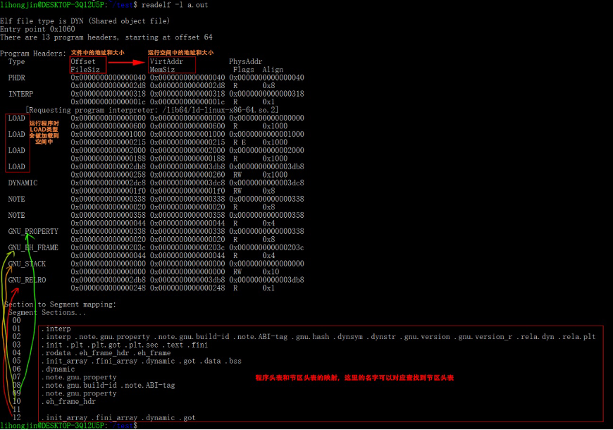
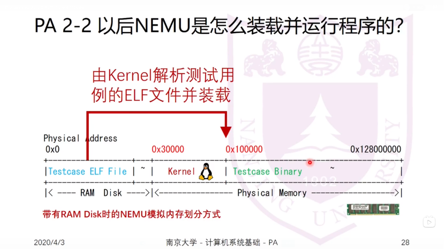
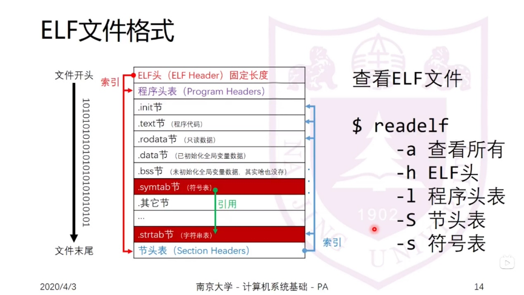
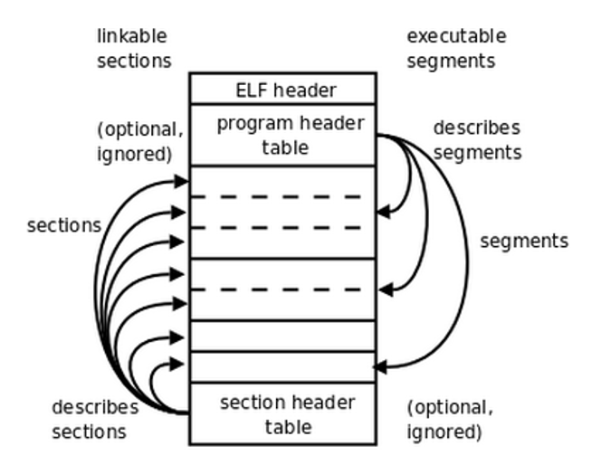
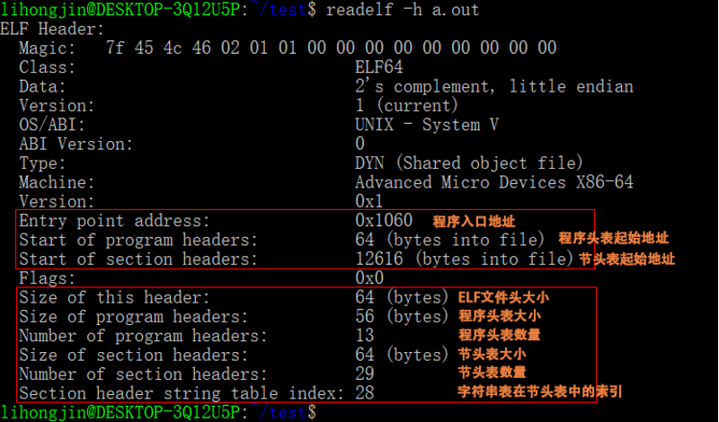
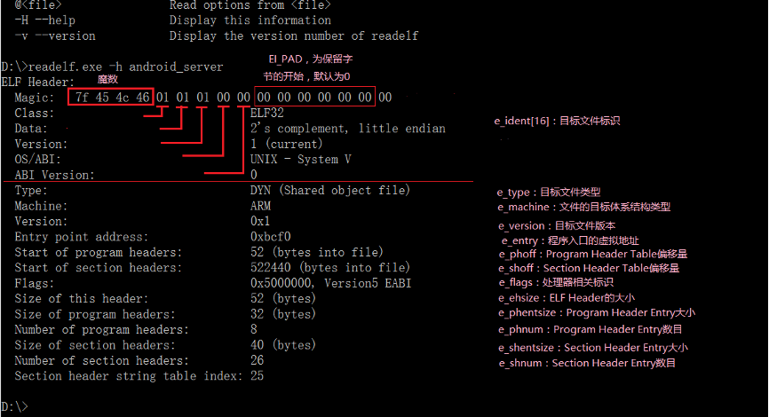
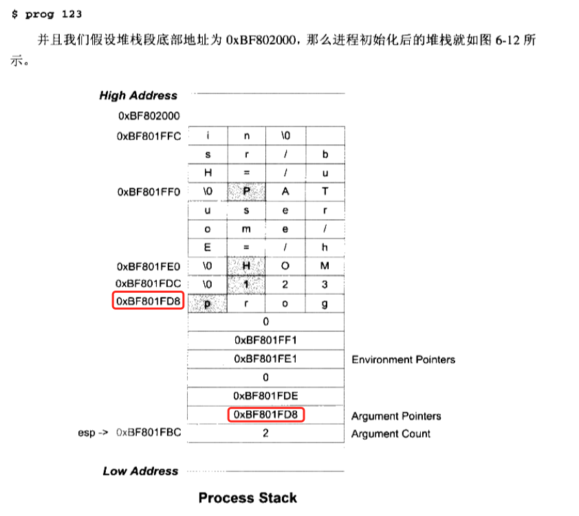

# ELF文件

ELF文件参考资料：  
[ELF文件格式解析](https://blog.csdn.net/feglass/article/details/51469511)  
[ELF文件格式, ELF文件是什么，里面包含什么内容](https://blog.csdn.net/liugaigai427/article/details/86742062)  
[Linux[ELF]: ELF文件结构简单梳理](https://www.jianshu.com/p/dd5aec5826da)  
[ELF格式文件（非常详细）](https://blog.csdn.net/weixin_44316996/article/details/107396385?utm_medium=distribute.pc_relevant.none-task-blog-BlogCommendFromBaidu-1.control&depth_1-utm_source=distribute.pc_relevant.none-task-blog-BlogCommendFromBaidu-1.control)

ELF文件(B站视频  推荐 已下载在当前目录下：elf文件及符号表解析)：  
[ELF文件装载和符号表解析](https://www.bilibili.com/video/BV1e54y1d74j?from=search&seid=157787288945585334)  
该up主有好多相关视频，可以关注：  
[南京大学-计算机系统基础-PA](https://space.bilibili.com/284613991/channel/detail?cid=103368)

## 原理介绍

**可重定位文件（Relocatable File）** 包含适合于与其他目标文件链接来创建可执行文件
或者共享目标文件的代码和数据。

**可执行文件（Executable File）** 包含适合于执行的一个程序，此文件规定了 exec() 
如何创建一个程序的进程映像。

**共享目标文件（Shared Object File）** 包含可在两种上下文中链接的代码和数据。首先
链接编辑器可以将它和其它可重定位文件和共享目标文件一起处理，生成另外一个目标文件。
其次，动态链接器（Dynamic Linker）可能将它与某个可执行文件以及其它共享目标一起组合，
创建进程映像。

**readelf -l < elf文件>可以查询elf程序头表信息：**

MemSiz可能比FileSiz大，这一般是由于存在定义未初始化的全局变量(.bss)引入的，这样的
话多出来的空前全都需要初始化为0。


**readelf -S < elf文件>可以查询elf程序头表信息：**


## 组织结构





```
          linkable                               executable
          sections                               segments
                     +----------------------+
                     |       ELF header     |
                     +----------------------+
(optional, ignored)  | program header table | ------+   describes segments
                     +----------------------+       |
            +------> |_  _  _  _  _  _  _  _|       |
            |------> |_  _  _  _  _  _  _  _| <-----+
            |------> |______________________|       |    segments
sections    |------> |_  _  _  _  _  _  _  _| <-----+
            |------> |______________________|       |
            |------> |______________________|       |
            |------> |______________________| <-----+
describes   +------- | section header table |            (optional, ignored)
sections             +----------------------+
```

ELF Header: 文件开始处是ELF Header，它包含了描述整个文件的基本属性和整个文件的组织，
比如ELF文件版本、目标机器型号、程序入口地址等

节区部分包含链接视图的大量信息：指令、数据、符号表、重定位信息等等。

Program Header Table: 程序头表，如果存在的话，告诉系统如何创建进程映像。用来构造
进程映像的目标文件必须具有程序头部表，可重定位文件不需要这个表。

Section Heade Table: 节区头表，包含了描述文件节区的信息，每个节区在表中都有一项，
每一项给出诸如节区名称、节区大小、在文件中的偏移、读写权限等信息。用于链接的目标
文件必须包含节区头部表，其他目标文件可以有，也可以没有这个表。

注意：尽管图中显示的各个组成部分是有顺序的，实际上除了 ELF 头部表以外，其他节区
和段都没有规定的顺序。

### ELF 头

**readelf -h < elf文件>可以查询elf头信息：**


网上的一张图，有别的相关注释，留作记录：


```
$ readelf -h hello

ELF Header:
  Magic:   7f 45 4c 46 02 01 01 00 00 00 00 00 00 00 00 00
  Class:                             ELF64
  Data:                              2's complement, little endian
  Version:                           1 (current)
  OS/ABI:                            UNIX - System V
  ABI Version:                       0
  Type:                              DYN (Position-Independent Executable file)
  Machine:                           Advanced Micro Devices X86-64
  Version:                           0x1
  Entry point address:               0x1060
  Start of program headers:          64 (bytes into file)
  Start of section headers:          14632 (bytes into file)
  Flags:                             0x0
  Size of this header:               64 (bytes)
  Size of program headers:           56 (bytes)
  Number of program headers:         13
  Size of section headers:           64 (bytes)
  Number of section headers:         37
  Section header string table index: 36
```

elf 的文件头中定义了elf魔数、文件机器字节长度、数据存储方式、版本、运行平台、
ABI版本、ELF重定位类型、硬件平台、硬件平台版本、入口地址、程序头表和节头表的
入口/size/数量、ELF头的size等。

elf文件头结构及相关常数被定义在 "/usr/include/elf.h" 里，Elf32_Ehdr和Elf64_Ehdr
对应32位平台和64位平台，其内容是一样的，只是有些成员的大小不一样

#### ELF 魔数

```
  Magic:   7f 45 4c 46 02 01 01 00 00 00 00 00 00 00 00 00
```

最开始的四个字节是所有 ELF 文件都必须相同的标识码，分别是0x7F、0x45、0x4c、0x46，
第一个字节对应ASCII字符串里面的DEL控制符，后面三个字符刚好是ELF的ASCII码。这4个
字节也被称为ELF文件的魔数，几乎所有的可执行文件格式的最开始的几个字节都是魔数。
这种魔数用来确认文件的类型，操作系统在加载可执行文件的时候会确认模数是否正确，
如果不正确会拒绝加载。

第5个字节是用来标识文件类型的，0x01标识32位文件，0x02标识64位文件；第6个字节是
字节序，规定该ELF文件是大端的还是小端的；第7个字节规定ELF文件的主版本号，一般是1，
因为ELF标准自1.2版本以后就再也没有更新了。后面的9个字节ELF标准没有定义，一般填0，
有些平台会用这9个字节作为扩展标志。

### 节区头表(Section Header Table)

可以使用`objdump -h`来查看ELF文件中包含的段，但`objdump -h`命令只是把ELF文件中
关键的段显示出来了，而省略了其他的辅助性的段，可以使用`readelf -S`来查看ELF文件
的段，它显示的才是真正的段表结构

节区头表更关心链接时的状态，每个节区在表中都有一项，每一项给出诸如节区名称、
节区大小、在文件中的偏移、读写权限等信息

readelf -S 打印的各个段的含义见《程序员的自我修养P76表3-7》

这里主要介绍如下几个信息：
* Address: 对于可加载的段（如代码段或数据段），这是段在内存中的虚拟地址。对于
  非可加载的节（如符号表或字符串表），此字段可能未定义
* Offset: 这是从文件开始到节数据第一个字节的偏移量
* Size: 节的大小（以字节为单位）
* Align: 节的地址对齐要求。例如，如果此值为4，则节的起始地址在内存中必须是4的倍数。

`readelf -S hello`
```
There are 37 section headers, starting at offset 0x3928:

Section Headers:
  [Nr] Name              Type             Address           Offset
       Size              EntSize          Flags  Link  Info  Align
  [ 0]                   NULL             0000000000000000  00000000
       0000000000000000  0000000000000000           0     0     0
  [ 1] .interp           PROGBITS         0000000000000318  00000318
       000000000000001c  0000000000000000   A       0     0     1
  [ 2] .note.gnu.pr[...] NOTE             0000000000000338  00000338
       0000000000000030  0000000000000000   A       0     0     8
  [ 3] .note.gnu.bu[...] NOTE             0000000000000368  00000368
       0000000000000024  0000000000000000   A       0     0     4
  [ 4] .note.ABI-tag     NOTE             000000000000038c  0000038c
       0000000000000020  0000000000000000   A       0     0     4
  [ 5] .gnu.hash         GNU_HASH         00000000000003b0  000003b0
       0000000000000024  0000000000000000   A       6     0     8
  [ 6] .dynsym           DYNSYM           00000000000003d8  000003d8
       00000000000000a8  0000000000000018   A       7     1     8
  [ 7] .dynstr           STRTAB           0000000000000480  00000480
       000000000000008d  0000000000000000   A       0     0     1
  [ 8] .gnu.version      VERSYM           000000000000050e  0000050e
       000000000000000e  0000000000000002   A       6     0     2
  [ 9] .gnu.version_r    VERNEED          0000000000000520  00000520
       0000000000000030  0000000000000000   A       7     1     8
  [10] .rela.dyn         RELA             0000000000000550  00000550
       00000000000000c0  0000000000000018   A       6     0     8
  [11] .rela.plt         RELA             0000000000000610  00000610
       0000000000000018  0000000000000018  AI       6    24     8
  [12] .init             PROGBITS         0000000000001000  00001000
       000000000000001b  0000000000000000  AX       0     0     4
  [13] .plt              PROGBITS         0000000000001020  00001020
       0000000000000020  0000000000000010  AX       0     0     16
  [14] .plt.got          PROGBITS         0000000000001040  00001040
       0000000000000010  0000000000000010  AX       0     0     16
  [15] .plt.sec          PROGBITS         0000000000001050  00001050
       0000000000000010  0000000000000010  AX       0     0     16
  [16] .text             PROGBITS         0000000000001060  00001060
       0000000000000107  0000000000000000  AX       0     0     16
  [17] .fini             PROGBITS         0000000000001168  00001168
       000000000000000d  0000000000000000  AX       0     0     4
  [18] .rodata           PROGBITS         0000000000002000  00002000
       0000000000000011  0000000000000000   A       0     0     4
  [19] .eh_frame_hdr     PROGBITS         0000000000002014  00002014
       0000000000000034  0000000000000000   A       0     0     4
  [20] .eh_frame         PROGBITS         0000000000002048  00002048
       00000000000000ac  0000000000000000   A       0     0     8
  [21] .init_array       INIT_ARRAY       0000000000003db8  00002db8
       0000000000000008  0000000000000008  WA       0     0     8
  [22] .fini_array       FINI_ARRAY       0000000000003dc0  00002dc0
       0000000000000008  0000000000000008  WA       0     0     8
  [23] .dynamic          DYNAMIC          0000000000003dc8  00002dc8
       00000000000001f0  0000000000000010  WA       7     0     8
  [24] .got              PROGBITS         0000000000003fb8  00002fb8
       0000000000000048  0000000000000008  WA       0     0     8
  [25] .data             PROGBITS         0000000000004000  00003000
       0000000000000010  0000000000000000  WA       0     0     8
  [26] .bss              NOBITS           0000000000004010  00003010
       0000000000000008  0000000000000000  WA       0     0     1
  [27] .comment          PROGBITS         0000000000000000  00003010
       000000000000002b  0000000000000001  MS       0     0     1
  [28] .debug_aranges    PROGBITS         0000000000000000  0000303b
       0000000000000030  0000000000000000           0     0     1
  [29] .debug_info       PROGBITS         0000000000000000  0000306b
       000000000000008c  0000000000000000           0     0     1
  [30] .debug_abbrev     PROGBITS         0000000000000000  000030f7
       0000000000000043  0000000000000000           0     0     1
  [31] .debug_line       PROGBITS         0000000000000000  0000313a
       0000000000000054  0000000000000000           0     0     1
  [32] .debug_str        PROGBITS         0000000000000000  0000318e
       00000000000000d9  0000000000000001  MS       0     0     1
  [33] .debug_line_str   PROGBITS         0000000000000000  00003267
       0000000000000017  0000000000000001  MS       0     0     1
  [34] .symtab           SYMTAB           0000000000000000  00003280
       0000000000000360  0000000000000018          35    18     8
  [35] .strtab           STRTAB           0000000000000000  000035e0
       00000000000001db  0000000000000000           0     0     1
  [36] .shstrtab         STRTAB           0000000000000000  000037bb
       000000000000016a  0000000000000000           0     0     1
Key to Flags:
  W (write), A (alloc), X (execute), M (merge), S (strings), I (info),
  L (link order), O (extra OS processing required), G (group), T (TLS),
  C (compressed), x (unknown), o (OS specific), E (exclude),
  D (mbind), l (large), p (processor specific)
```

`objdump -h hello`
```
hello:     file format elf64-x86-64

Sections:
Idx Name          Size      VMA               LMA               File off  Algn
  0 .interp       0000001c  0000000000000318  0000000000000318  00000318  2**0
                  CONTENTS, ALLOC, LOAD, READONLY, DATA
  1 .note.gnu.property 00000030  0000000000000338  0000000000000338  00000338  2**3
                  CONTENTS, ALLOC, LOAD, READONLY, DATA
  2 .note.gnu.build-id 00000024  0000000000000368  0000000000000368  00000368  2**2
                  CONTENTS, ALLOC, LOAD, READONLY, DATA
  3 .note.ABI-tag 00000020  000000000000038c  000000000000038c  0000038c  2**2
                  CONTENTS, ALLOC, LOAD, READONLY, DATA
  4 .gnu.hash     00000024  00000000000003b0  00000000000003b0  000003b0  2**3
                  CONTENTS, ALLOC, LOAD, READONLY, DATA
  5 .dynsym       000000a8  00000000000003d8  00000000000003d8  000003d8  2**3
                  CONTENTS, ALLOC, LOAD, READONLY, DATA
  6 .dynstr       0000008d  0000000000000480  0000000000000480  00000480  2**0
                  CONTENTS, ALLOC, LOAD, READONLY, DATA
  7 .gnu.version  0000000e  000000000000050e  000000000000050e  0000050e  2**1
                  CONTENTS, ALLOC, LOAD, READONLY, DATA
  8 .gnu.version_r 00000030  0000000000000520  0000000000000520  00000520  2**3
                  CONTENTS, ALLOC, LOAD, READONLY, DATA
  9 .rela.dyn     000000c0  0000000000000550  0000000000000550  00000550  2**3
                  CONTENTS, ALLOC, LOAD, READONLY, DATA
 10 .rela.plt     00000018  0000000000000610  0000000000000610  00000610  2**3
                  CONTENTS, ALLOC, LOAD, READONLY, DATA
 11 .init         0000001b  0000000000001000  0000000000001000  00001000  2**2
                  CONTENTS, ALLOC, LOAD, READONLY, CODE
 12 .plt          00000020  0000000000001020  0000000000001020  00001020  2**4
                  CONTENTS, ALLOC, LOAD, READONLY, CODE
 13 .plt.got      00000010  0000000000001040  0000000000001040  00001040  2**4
                  CONTENTS, ALLOC, LOAD, READONLY, CODE
 14 .plt.sec      00000010  0000000000001050  0000000000001050  00001050  2**4
                  CONTENTS, ALLOC, LOAD, READONLY, CODE
 15 .text         00000107  0000000000001060  0000000000001060  00001060  2**4
                  CONTENTS, ALLOC, LOAD, READONLY, CODE
 16 .fini         0000000d  0000000000001168  0000000000001168  00001168  2**2
                  CONTENTS, ALLOC, LOAD, READONLY, CODE
 17 .rodata       00000011  0000000000002000  0000000000002000  00002000  2**2
                  CONTENTS, ALLOC, LOAD, READONLY, DATA
 18 .eh_frame_hdr 00000034  0000000000002014  0000000000002014  00002014  2**2
                  CONTENTS, ALLOC, LOAD, READONLY, DATA
 19 .eh_frame     000000ac  0000000000002048  0000000000002048  00002048  2**3
                  CONTENTS, ALLOC, LOAD, READONLY, DATA
 20 .init_array   00000008  0000000000003db8  0000000000003db8  00002db8  2**3
                  CONTENTS, ALLOC, LOAD, DATA
 21 .fini_array   00000008  0000000000003dc0  0000000000003dc0  00002dc0  2**3
                  CONTENTS, ALLOC, LOAD, DATA
 22 .dynamic      000001f0  0000000000003dc8  0000000000003dc8  00002dc8  2**3
                  CONTENTS, ALLOC, LOAD, DATA
 23 .got          00000048  0000000000003fb8  0000000000003fb8  00002fb8  2**3
                  CONTENTS, ALLOC, LOAD, DATA
 24 .data         00000010  0000000000004000  0000000000004000  00003000  2**3
                  CONTENTS, ALLOC, LOAD, DATA
 25 .bss          00000008  0000000000004010  0000000000004010  00003010  2**0
                  ALLOC
 26 .comment      0000002b  0000000000000000  0000000000000000  00003010  2**0
                  CONTENTS, READONLY
 27 .debug_aranges 00000030  0000000000000000  0000000000000000  0000303b  2**0
                  CONTENTS, READONLY, DEBUGGING, OCTETS
 28 .debug_info   0000008c  0000000000000000  0000000000000000  0000306b  2**0
                  CONTENTS, READONLY, DEBUGGING, OCTETS
 29 .debug_abbrev 00000043  0000000000000000  0000000000000000  000030f7  2**0
                  CONTENTS, READONLY, DEBUGGING, OCTETS
 30 .debug_line   00000054  0000000000000000  0000000000000000  0000313a  2**0
                  CONTENTS, READONLY, DEBUGGING, OCTETS
 31 .debug_str    000000d9  0000000000000000  0000000000000000  0000318e  2**0
                  CONTENTS, READONLY, DEBUGGING, OCTETS
 32 .debug_line_str 00000017  0000000000000000  0000000000000000  00003267  2**0
                  CONTENTS, READONLY, DEBUGGING, OCTETS
```

### 重定位表

对于每个需要重定位的代码段或数据段，都会有一个相应的重定位表，例如：“rel.text”就是
针对“.text”段的重定位表

### 程序头表(Program Header Table)

可以使用`readelf -l <app>`读取程序头表，程序头表关注的是运行时的状态，进程的创建、
加载，虚拟地址空间中的排布等

如果按照链接时的section进行装载，内存中可能会有较多的碎片，于是就出现了程序头(Program
 Header)，它从装载的角度重新划分了ELF的各个段，因为装载的时候主要关心各个段的权限
 （读写可执行），因此链接器会尽量把相同权限属性的段分配在同一个空间。

在ELF的程序头表中，每个程序头（Program Header）通常包含以下几个与地址相关的字段：
* p_vaddr（Virtual Address）：这是段在内存中的虚拟地址。当程序被加载到内存中时，
  这个地址是段开始的位置。这个地址是相对于进程的虚拟地址空间的，而不是相对于ELF
  文件本身。在PC上测试：这里的地址实际上也是一个偏移地址，装载时有一个base地址，
  在该base地址的基础上偏移p_vaddr，可以通过返汇编和gdb计算出base地址是多少
* p_paddr（Physical Address）：这个字段在大多数现代系统上被忽略，因为它通常与
  物理内存地址没有直接关系。现代操作系统使用虚拟内存管理，所以物理地址和程序
  加载位置之间没有直接的对应关系。
* p_offset（Offset）：这是段在ELF文件中的偏移量。它告诉加载器从文件的哪个位置开始
  读取段的数据。这个地址是相对于ELF文件开头的。
* FileSize: 在ELF文件中所占空间的长度，可能为0
* MemSize: 在进程虚拟地址空间中所占的长度，可能为0

对于“LOAD”类型的段来说，MemSize不可以小于FileSize，否则是不合理的，但是如果MemSize
大于FileSize，在内存中分配的实际空间大小是大于MemSize的，多出来的这部分全部填充为0，
BBS段和数据段唯一的区别就是：数据段从文件中初始化内容，而BBS段的内容全部初始化为0，
利用这个特点，也可以为BBS段节省ELF文件在硬盘中的存储空间

当操作系统加载一个ELF可执行文件时，它会读取程序头表，并使用p_vaddr和p_offset等
信息来决定如何将文件的各个段加载到进程的虚拟地址空间中。这样，当程序开始执行时，
它就可以从预期的虚拟地址中访问其代码、数据和其他资源。


举例如下：
```
Elf file type is DYN (Position-Independent Executable file)
Entry point 0x1120
There are 13 program headers, starting at offset 64

Program Headers:
  Type           Offset             VirtAddr           PhysAddr
                 FileSiz            MemSiz              Flags  Align
  PHDR           0x0000000000000040 0x0000000000000040 0x0000000000000040
                 0x00000000000002d8 0x00000000000002d8  R      0x8
  INTERP         0x0000000000000318 0x0000000000000318 0x0000000000000318
                 0x000000000000001c 0x000000000000001c  R      0x1
      [Requesting program interpreter: /lib64/ld-linux-x86-64.so.2]
  LOAD           0x0000000000000000 0x0000000000000000 0x0000000000000000
                 0x0000000000000798 0x0000000000000798  R      0x1000
  LOAD           0x0000000000001000 0x0000000000001000 0x0000000000001000
                 0x00000000000003dd 0x00000000000003dd  R E    0x1000
  LOAD           0x0000000000002000 0x0000000000002000 0x0000000000002000
                 0x000000000000019c 0x000000000000019c  R      0x1000
  LOAD           0x0000000000002d88 0x0000000000003d88 0x0000000000003d88
                 0x000000000000028c 0x0000000000000290  RW     0x1000
  DYNAMIC        0x0000000000002d98 0x0000000000003d98 0x0000000000003d98
                 0x00000000000001f0 0x00000000000001f0  RW     0x8
  NOTE           0x0000000000000338 0x0000000000000338 0x0000000000000338
                 0x0000000000000030 0x0000000000000030  R      0x8
  NOTE           0x0000000000000368 0x0000000000000368 0x0000000000000368
                 0x0000000000000044 0x0000000000000044  R      0x4
  GNU_PROPERTY   0x0000000000000338 0x0000000000000338 0x0000000000000338
                 0x0000000000000030 0x0000000000000030  R      0x8
  GNU_EH_FRAME   0x0000000000002090 0x0000000000002090 0x0000000000002090
                 0x000000000000003c 0x000000000000003c  R      0x4
  GNU_STACK      0x0000000000000000 0x0000000000000000 0x0000000000000000
                 0x0000000000000000 0x0000000000000000  RW     0x10
  GNU_RELRO      0x0000000000002d88 0x0000000000003d88 0x0000000000003d88
                 0x0000000000000278 0x0000000000000278  R      0x1

 Section to Segment mapping:
  Segment Sections...
   00
   01     .interp
   02     .interp .note.gnu.property .note.gnu.build-id .note.ABI-tag .gnu.hash .dynsym .dynstr .gnu.version .gnu.version_r .rela.dyn .rela.plt
   03     .init .plt .plt.got .plt.sec .text .fini
   04     .rodata .eh_frame_hdr .eh_frame
   05     .init_array .fini_array .dynamic .got .data lhjSec .bss
   06     .dynamic
   07     .note.gnu.property
   08     .note.gnu.build-id .note.ABI-tag
   09     .note.gnu.property
   10     .eh_frame_hdr
   11
   12     .init_array .fini_array .dynamic .got
```


### 符号

#### 概念及定义

编程层面
* 符号：函数和变量统称为符号
* 符号名：函数名或变量名就是符号名

elf目标文件层面
* 符号表：每一个目标文件都会有一个相应的符号表，往往对应 .symtab 段
* 符号值：每个定义的符号有一个对应的值，即符号值，对于变量和函数来说，符号值就是他们的地址


分类：
* 当前目标文件中的全局符号，可以被其他目标文件引用
* 当前目标文件引用的全局符号，却没有定义在当前目标文件中，也可以称为外部符号
* 局部符号，这类符号只在编译单元内部可见，例如局部变量或者静态存储的变量等
* 段名，往往由编译器产生，他的值就是该段的起始地址。例如：.text、.data等
* 行号信息，即目标文件指令与源代码中代码行的对应关系，这在调试过程中会使用，是可选的

链接过程中主要关注第一类和第二类

符合的定义如下：
```
typedef struct
{
  Elf32_Word       st_name;         /* Symbol name (string tbl index) */
  Elf32_Addr       st_value;        /* Symbol value */
  Elf32_Word       st_size;         /* Symbol size */
  unsigned char    st_info;         /* Symbol type and binding */
  unsigned char    st_other;        /* Symbol visibility */
  Elf32_Section    st_shndx;        /* Section index */
} Elf32_Sym;
```
set_value 是符号的值，有可能是一个绝对值，也可能是一个地址等，不同的符号含义也不同，
如果这个符号是一个函数或者变量的定义，那么符号的值就是这个函数或变量的地址，其他细节
见《程序员的自我修养P83》


在使用ld作为链接器生成可执行文件时，它会定义很多特殊符号，这些符号是定义在ld链接器脚本中的
* __excutable_start 程序起始地址，注意不是入口地址，是程序最开始的地址
* __etext or _etext or etext 代码段结束地址，即代码段最末尾的地址
* _edata or edata 数据段结束地址，即数据段最末尾的地址
* _end or end 程序结束地址

以上地址都是程序被装载时的虚拟地址

为了避免符号冲突，UNIX下的C语言规定，C语言源代码文件中的所有全局的变量和函数经过
编译以后，相对应的符号名前加上下划线。而C++也通过命名空间来解决了多模块的符号冲突
问题，另外C++编译过程中，会考虑综合符合参数类型给出函数签名，因此同名函数的参数
如果参数不同的话，也会认为是不同的符号。


#### extern "C" 的底层原理

c语言调用memset函数时，编译器会将memset符号正确处理，但是在C++中，编译器会认为
这个memset函数是一个C++函数，将memset的符号修饰成_Z6memsetPvii，这样链接器就无法
与C库中的memset符号进行链接。所以对于C++来说，必须使用exter "C"来声明memset这个
函数。

但C语言是不支持exter "C"语法的，为了兼容C语言和C++，可以使用C++的宏：__cplusplus，
C++编译器会在编译时默认定义这个宏，这样就可以避免定义两套头文件的情况，举例如下：
```
#ifdef __cplusplus
extern "C" {
#endif

void *memset (void *, int, size_t);

#ifdef __cplusplus
}
#endif
```

#### 强符号和弱符号

编译器默认函数和初始化了的全局变量为强符号，未初始化的全局变量为弱符号。也可以通过
GCC的`__attribute__((weat))`来定义任何一个强符号为弱符号。

强符号和弱符号都是针对定义来说的，不是针对符号的引用。例如：`extern int ext`不是
强符号，也不是弱符号，因为它是一个外部变量的引用。

链接过程中对强符号和弱符号的处理：
* 不允许强符号被多次定义
* 链接过程中如果一个符号是强符号，其他是弱符号，则选择强符号链接
* 如果所有符号都是弱符号，则选择占用空间最大的一个进行链接

强引用和弱引用
* 强引用：如果没有找到该符号的定义，链接器就会报错
* 弱引用：如果有定义，则会引用，如果没有定义，也不会报错。一般对于未定义的弱引用，
链接器默认其为0，或者是一个特殊的值，以便于程序代码能够正常识别

对于一些弱引用的情况，使用场景举例如下：
```
if (pthread_create) {
    printf("This is multi-thread version\n");
} else {
    printf("This is singel-thread version\n");
}
```

### 调试信息

编译过程中可以使用 -g 参数给目标文件加上调试信息，可以通过readelf看到文件有很多
debug相关的段，也可以使用strip去掉调试信息

$ readelf -S hello
```
  [28] .debug_aranges    PROGBITS         0000000000000000  0000303b
       0000000000000030  0000000000000000           0     0     1
  [29] .debug_info       PROGBITS         0000000000000000  0000306b
       000000000000008c  0000000000000000           0     0     1
  [30] .debug_abbrev     PROGBITS         0000000000000000  000030f7
       0000000000000043  0000000000000000           0     0     1
  [31] .debug_line       PROGBITS         0000000000000000  0000313a
       0000000000000054  0000000000000000           0     0     1
  [32] .debug_str        PROGBITS         0000000000000000  0000318e
       00000000000000d9  0000000000000001  MS       0     0     1
  [33] .debug_line_str   PROGBITS         0000000000000000  00003267
       0000000000000017  0000000000000001  MS       0     0     1
```

执行 `$ strip hello` 后再执行`readelf -S hello`就会发现没有debug相关的段了


### 各个段的介绍

| 常用的段名 | 说明 |
| -- | -- |
| .text       | 代码段 |
| .data       | 保存已经初始化了的全局静态变量和局部静态变量 |
| .rodata     | 段存放的是只读数据，一般是程序里面的只读变量（如 const修饰的变量）和字符串常量，有时候编译器会把字符串常量放到.data段 |
| .bss        | 未初始化的全局变量和局部静态变量，有些编译器会将全局的未初始化变量存放在.bss段，有些不放，只是预留一个未定义的全局变量符号，等到最终连接成可执行文件的时候再在.bss段分配空间 |
| .rodata1    | Read only Data，这种段里存放的是只读数据，比如字符串常量、全局const变量，根“.rodata”一样 |
| .comment    | 存放的是编译器版本信息，比如字符串：“GCC:(GNU)4.2.0” |
| .debug      | 调试信息 |
| .dynamic    | 动态链接信息 |
| .hash       | 符号哈希表   |
| .line       | 调试时的行号表，即源代码行号与编译后指令的对应表 |
| .note       | 额外的编译器信息。比如程序的公司名、发布版本号等 |
| .strtab     | String Table.字符串表，用于存储ELF文件中用到的各种字符串，是普通的字符串 |
| .symtab     | Symbol Table.符号表 |
| .shstrtab   | Section String Table.段名表，用来保存段表中用到的字符串，最常见的就是段名（例如：.data、.text） |
| .plt .got   | 动态链接的跳转表和全局入口表 |
| .init .fini | 程序初始化与终结代码段 |

如果需要将指定变量放到特定的段，需要在全局变量或者函数之前加上 "__attribute__((section("<name>")))"
例如：
```
__attribute__((section("lhjSec"))) int mtest = 6;

objdump -s test
就可以相应的段和其内容
```

## 相关工具

### readelf

readelf命令用来显示一个或者多个elf格式的目标文件的信息，可以通过它的选项来控制
显示哪些信息。
```
readelf < option(s)> elf-file(s)
**常用的选项：**
<font color=blue>-a --all 显示全部信息,等价于 -h -l -S -s -r -d -V -A -I.
-h --file-header 显示elf文件开始的文件头信息.
-l --program-headers  显示程序头（段头）信息(如果有的话)。  别称： --segments
-S --section-headers  显示节头信息(如果有的话)。 别称：--sections </font>
-g --section-groups 显示节组信息(如果有的话)。
-t --section-details 显示节的详细信息(-S的)。
<font color=blue>-s --syms --symbols 显示符号表段中的项（如果有的话）。 </font>
-e --headers 显示全部头信息，等价于: -h -l -S
-n --notes 显示note段（内核注释）的信息。
-r --relocs 显示可重定位段的信息。
-u --unwind 显示unwind段信息。当前只支持IA64 ELF的unwind段信息。
-d --dynamic 显示动态段的信息。
-V --version-info 显示版本段的信息。
-A --arch-specific 显示CPU构架信息。
-D --use-dynamic 使用动态段中的符号表显示符号，而不是使用符号段。
-x <number or name> --hex-dump=<number or name> 以16进制方式显示指定段内内容。
   number指定段表中段的索引,或字符串指定文件中的段名。
-w[liaprmfFsoR] or --debug-dump [=line, =info, =abbrev, =pubnames, =aranges,
   =macro, =frames, =frames-interp, =str, =loc, =Ranges] 显示调试段中指定的内容。
-I --histogram 显示符号的时候，显示bucket list长度的柱状图。
-v --version 显示readelf的版本信息。
-H --help 显示readelf所支持的命令行选项。
-W --wide 宽行输出。
```

### nm

nm命令是linux下自带的特定文件分析工具，一般用来检查分析二进制文件、库文件、可执行
文件中的符号表，返回二进制文件中各段的信息。

[linux下强大的文件分析工具 -- nm](https://zhuanlan.zhihu.com/p/363014233)

**常用选项：**
```
-A 或-o或 --print-file-name：打印出每个符号属于的文件
-a或--debug-syms：打印出所有符号，包括debug符号
-B：BSD码显示
-C或--demangle[=style]：对低级符号名称进行解码，C++文件需要添加
--no-demangle：不对低级符号名称进行解码，默认参数
-D 或--dynamic：显示动态符号而不显示普通符号，一般用于动态库
-f format或--format=format：显示的形式，默认为bsd，可选为sysv和posix
-g或--extern-only：仅显示外部符号
-h或--help：国际惯例，显示命令的帮助信息
-n或-v或--numeric-sort：显示的符号以地址排序，而不是名称排序
-p或--no-sort：不对显示内容进行排序
-P或--portability：使用POSIX.2标准
-V或--version：国际管理，查看版本
--defined-only：仅显示定义的符号，这个从英文翻译过来可能会有偏差，故贴上原文：
Display only defined symbols for each object file
```

**nm输出内容解析**
* 首先，前面那一串数字，指的就是地址，如果是二进制目标文件，指的就是逻辑地址，并非
  程序最后运行时的地址。
* 然后，我们发现，每一个条目前面还有一个字母，类似'U','B','D等等，其实这些符号代表
  的就是当前条目所对应的内存所在部分
* 最右边的就是对应的符号内容了

首要的需要讲解的就是第二点中字符所对应的含义，同样在还是在linux命令行下man nm指令
可以得到：
```
A     ：符号的值是绝对值，不会被更改
B或b  ：未被初始化的全局数据，放在.bss段
D或d  ：已经初始化的全局数据
G或g  ：指被初始化的数据，特指small objects
I     ：另一个符号的间接参考
N     ：debugging 符号
p     ：位于堆栈展开部分
R或r  ：属于只读存储区
S或s  ：指为初始化的全局数据，特指small objects
T或t  ：代码段的数据，.test段
U     ：符号未定义
W或w  ：符号为弱符号，当系统有定义符号时，使用定义符号，当系统未定义符号且定义了
        弱符号时，使用弱符号。
？    ：unknown符号
```

### objdump

objdump命令是用查看目标文件或者可执行的目标文件的构成的gcc工具。可以用来反汇编代码。
```
objdump <option(s)> <file(s)>
**常用选项：**
objdump -d <file(s)>: 将所有包含指令的段反汇编
objdump -D <file(s)>: 将所有段反汇编；
objdump -s <file>: 将所有段的内容以16进制的方式打印出来
objdump -S <file(s)>: 将代码段反汇编的同时，将反汇编代码与源代码
                      交替显示，编译时需要使用-g参数，即需要调试信息
objdump -C <file(s)>: 将C++符号名逆向解析
objdump -l <file(s)>: 反汇编代码中插入文件名和行号
objdump -j section <file(s)>: 仅反汇编指定的section
objdump -h <file(s)>: 将ELF文件的各个段的基本信息打印出来
objdump -x <file(s)>: 在 -h 的基础上，将更多的信息打印出来
```

-T --dynamic-syms
显示文件的动态符号表入口，仅仅对动态目标文件意义，比如某些共享库。它显示的信息类似于 nm -D|–dynamic 显示的信息。

对于 arm 平台的反汇编：
sudo apt-get install gcc-arm-none-eabi
arm-linux-gnueabihf-objdump
arm-linux-gnueabi-objdump

### size
可以用来查看ELF文件的代码段、数据段和BSS：
```
size <file>

得到如下信息：
text       data        bss        dec        hex    filename
2526        648          8       3182        c6e    test
```

### pmap
查看进程的内存映像信息

## 静态链接

### 地址空间分配

链接器为目标文件分配地址和空间，这里的地址和空间包括两个内容：
1. 输出的可执行文件中的空间
2. 装载后的虚拟地址中的虚拟地址空间

对于.bss这样的段来说，分配空间的意义只局限于虚拟空间地址，因为他在文件中并没有内容。

现在的链接器空间分配的基本策略基本上都用两步链接：
1. 收集所有信息，包括文件中的符号定义、符号引用、目标文件各个段的长度、输出文件中
各个段合并后的长度和位置，并建立映射关系
2. 使用第一步收集到的信息，读取输入文件中段的数据、重定位信息，并且进行符号解析与
重定位、调整代码中的地址等。第二步是链接的核心，特别是重定位

链接后的程序中所使用的地址已经是程序在进程中的虚拟地址，即各个段中的VMA(virtual
 memory address)和size，而忽略了文件偏移。可以看到在链接之前，目标文件中的所有段
的VMA都是0，因为虚拟空间还没有被分配，所以他们默认都为0.等到链接之后，可执行文件
中的各个段都被分配到了相应的虚拟地址。可以使用`objdump -h <file>`对比链接前后的vma。

在Linux下，ELF可执行文件默认从地址0x08048000开始分配


### 重定位

一个可重定位的ELF文件必须包含重定位表，重定位表在elf文件中，也是以段的形式存在，
例如 .text 如果需要被重定位，就会有一个相应的 .rel.data 段，同样 .data 对应的
重定位表为 .rel.data，可以使用 `objdump -r <file>` 查看目标文件的重定位表，即 elf
文件需要引用到外部符号的地址。每个要被重定位的地方都被称为一个重定位入口，举例如下：
```
RELOCATION RECORDS FOR [.text]:             代码段的重定位表
OFFSET   TYPE              VALUE
00000064 UNKNOWN           _mpp_log_l
00000098 UNKNOWN           pthread_attr_init
000000c8 UNKNOWN           fopen
000000ec UNKNOWN           fopen
00000100 UNKNOWN           dec_buf_mgr_init
```
这里的OFFSET表示需要被重定位的函数/变量在.text段中的偏移，即需要修改.text段中，偏移
为OFFSET的的值，这样才能保证链接之后使用正确的函数或变量

读取链接前ELF文件中的符号表时，可能会发现UND的类型，即“undefine”，这种未定义的符号
都是因为该目标文件中有关于他们的重定位项。所以在链接器扫描完所有的输入目标文件之后，
所有这些未定义的符号都应该能够在全局符号表中找到，否则链接器就会报符号未定义的错误。

进行地址修正时，分为绝对寻址修正和相对寻址修正，详细修正方法见《程序员的自我修养》P109


### COMMON 块

现在的编译器和链接器都支持一种叫COMMON块的机制，当不同的文件需要的COMMON块大小不一致时，以最大的那块
为准。当然COMMON类型的链接规则是针对符号都是弱符号的情况，如果其中有一个符号为强符号，则最终输出结果中
的符号所占空间与强符号相同。

编译器将未初始化的全局变量定义作为弱符号处理，所以编译器无法为该弱符号在BSS段分配空间，因为所需要空间的
大小未知。但是连接器在链接过程中可以确定弱符号的大小，因为当链接器读取所有输入目标文件以后，任何一个弱符号
的最终大小都可以确定了，所以他可以在最终输出文件的BSS段为其分配空间，所以总体来看，未初始化全局变量最终
还是被放在BSS段的。

GCC的`-fno-common`也允许把所有未初始化的全局变量不以COMMON块的形式处理或者使用“__attribute__”扩展，
一旦一个未初始化的全局变量不是以COMMON块的形式存在，那么他就相当于一个强符号，如果其他目标文件中还有同一
个变量的强符号定义，链接时就会发生符号重复定义的错误

### ABI和API

API往往是指源代码级别的接口，比如可以说POSIX是一个API标准；而ABI（Application Binary Interface）
是指二进制层面的接口，ABI的兼容程度比API更为严格，比如可以说C++的对象内存分布是C++ABI的一部分。

影响ABI的因素非常多，硬件、编程语言、编译器、链接器、操作系统等都会影响ABI。对于C语言的目标代码来说，
以下几个方面会决定目标文件之间是否二进制兼容：
* 内置类型（如 int、float、char等）的大小和在存储器中的放置方式（大端、小端、对齐方式等）。
* 组合类型（如 struct、union、数组等）的存储方式和内存分布。
* 外部符号（external-liinkage）与用户定义的符号之间的命名方式和解析方式，如函数名 func 在C语言的
  目标文件中是否被解析成外部符号_func。
* 函数的调用方式，比如参数入栈顺序、返回值如何保持等。
* 堆栈的分布方式，比如参数和局部变量在堆栈里的位置，参数传递方法等。
* 寄存器使用约定，函数调用时哪些寄存器可以修改，哪些需要保存等等。

以上只是一部分因素，其他因素不再一一列举。到了C++的时代，语言层面对ABI的影响又增加了很多额外的内容，
正是这些内容使C++要做到二进制兼容比C更为不易。因此二进制兼容性不好，也成为C++被人诟病的一大原因。


### 静态库链接

一个静态库可以简单的看成一组目标文件的集合，即很多目标文件经过压缩打包后形成的
一个文件。glibc由成百上千个C语言源代码文件组成，那么编译完成后会有相同数量的
目标文件，比如输入输出有printf.o，scanf.o。然后使用ar压缩程序，将这些目标文件
压缩到一起，并且对齐进行编号和索引，以便查找和检索，这就形成了libc.a这个静态库
文件。可以使用ar工具来查看这个文件包含了哪些目标文件。
`ar -t /usr/lib/x86_64-linux-gnu/libc.a`

Visual C++ 也提供了与Linux下的ar类似的工具，叫做lib.exe，这个程序可以用来创建、
提取、列举.lib文件中的内容。

libc.a包含了诸多目标文件，如何在这么多目标文件中找到printf函数所在的目标文件呢？
答案是使用objdump或readelf加上文本查找工具，例如grep。
`objdump -t /usr/lib/x86_64-linux-gnu/libc.a | grep " printf"`

可以使用`ar -x /usr/lib/x86_64-linux-gnu/libc.a`将lib.a中的所有目标文件解压到当前
目录。如果链接的话可以直接使用`printf.o`，但`printf.o`中也有“UND”的符号，即未定义
的符号“stdout”和”vfprintf”，幸运的是ld可以处理这种繁琐的依赖。

在编译的过程中，如果加上“--verbose”参数，可以将整个编译的过程都打印出来
`gcc -static --verbose -fno-builtin hello.c`，
其中，“-fno-builtin”参数是因为默认情况下，gcc会将只用了一个字符串参数的“printf”
替换成”puts“，以提高运行效率，加“-fno-builtin”也是为了避免优化。

链接器在链接静态库的时候，是以目标文件为单位的。例如引用了静态库中的printf()函数，
那么链接器就会把库中包含printf()函数的那个目标文件链接进来，如果很多函数都放在
一个目标文件中，很可能很多没用的函数都被一起链接进了输出结果中。由于运行库有非常
多的函数，因此每个函数独立的放在一个目标文件中，可以尽量减少空间的浪费，那些没有
用到的目标文件（函数）就不会链接到最终的输出文件中。


### 链接过程控制

绝大部分情况下，使用链接器提供的默认链接规则对目标文件进行链接就可以了。但对于
一些有特殊要求的程序，例如操作系统内核、BIOS或者一些没有操作系统的情况下运行的
程序，需要特殊的链接操作。

链接器有三种方法可以对链接过程进行操作：
1. 使用命令行来给链接器指定参数
2. 将链接指令存放在目标文件里，编译器经常会通过这种方法向链接器传递指令。例如
   VISUAL C++ 编译器会把链接参数放在PE目标文件的.drectve段以用来传递参数。
3. 使用链接控制脚本，是最灵活，最为强大的控制方法。可以使用`ld -verbose`查看默认的
   链接脚本。

链接脚本的具体语法和用法可以参考《程序员的自我修养》4.6节


### BFD库

由于现代操作系统的硬件和软件平台千差万别，同一个格式，比如ELF在不同的软硬件平台
都有着不同的变种。种种差异导致编译器和链接器很难处理不同平台之间的目标文件，特别
对于GCC和binutils这种跨平台的工具来说，最好有一种统一的接口来处理这些不同格式之间
的差异。BFD(Binary File Descriptor library)就是这样的一个GNU项目，他的目标就是希望
通过一种统一的接口来处理不同的目标文件格式。

现在GCC（更具体的讲是GNU汇编器GAS，GNU Assembler）、链接器ld、调试器GDB及binutils
的其他工具都是通过BFD库来处理目标文件，而不是直接操作目标文件。

BFD开发库在ubuntu下名字为binutils-dev。


## Windows的二进制文件格式PE/COFF

PE 文件格式与ELF同根同源，他们都是由COFF(Common Object File Format)格式发展而来的，
更进一步讲，是源于当时著名的 DEC(Digital Equipment Corporation)的VAX/VMS上的COFF
文件格式。

在Windows平台上，VISUAL C++编译生成的目标文件仍然使用COFF格式。在后续讨论时，目标
文件默认为COFF格式，可执行文件为PE格式。

在PE/COFF文件中，至少包含一个代码段，这个代码段的名字往往叫做“.code”，数据段叫做
“.data”。不同的编译器产生的目标文件的段名不同，VISUAL C++使用“.code”和“.data”，
而Borland的编译器使用“CODE”，“DATA”。也就是说跟ELF一样，段名只有提示性作用，并没有
实际意义。当然，如果使用链接脚本来控制链接，段名可能是有用的。

Visual C++提供了一个用于查看目标文件和可执行文件的工具：dumpbin，对应于GNU的objdump


COFF文件也是由头文件及后边的若干个段组成，再加上文件末尾的符号表，调试信息的内容，
就构成了COFF文件的基本结构。COFF文件的文件头部包括了两部分，一个是描述文件总体结构
和属性的映像头(Image Header)，另一个是描述该文件中包含的段属性的段表(Section Table)。


## 可执行文件的装载与进程

### 进程的虚拟地址空间

每个程序运行起来以后，它将拥有自己独立的虚拟地址空间，这个虚拟地址空间的大小由计算机
的硬件平台决定（CPU的位数）。可以通过C语言程序中的指针所占的空间来计算虚拟地址空间
的大小。一般来说，C语言指针大小的位数与虚拟空间的位数相同，如32位平台下的指针为32位，
即4字节；64位平台下的指针为64位，即8字节。后续以32bit为基准展开讨论。

32平台下的4G空间被划分成2部分，操作系统占用0xC0000000-0xFFFFFFFF，共1G空间，剩下
的从0x00000000-0xBFFFFFFF，共3G空间，留给用户态进程使用。但这3G的空间也并不是能
完全使用的，其中一部分预留给其他用途。

对于Windows操作系统来说，它的进程虚拟地址空间划分是操作系统占用2G，那么进程只剩下
2G空间。2G空间对一些进程来说太少了，所以Windows有个启动参数可以将操作系统占用的
空间减少到1G，即跟Linux分布一样。方法如下：修改Windows系统盘根目录下的Boot.ini，
加上“/3G”参数
```
[boot loader]
timeout=30
default=multi(0)disk(0)rdisk(0)partition(1)\Windows
[operationg systems]
multi(0)disk(0)rdisk(0)partition(1)\Windows\WINDOWS="Microsoft Windows XP"
Professional" /3G /fastdetect /NoExecute=OptIn
```

### 装载方式

程序运行时是有局部性原理的，所以可以将程序最常用的部分驻留在内存中，而将一些不太
常用的数据存放在磁盘里，这就是动态装载的基本原理。主要思想是程序用到哪个模块，就
将哪个模块装入内存，如果不用就暂时不装入，存放在磁盘里。

覆盖装载(Overlay)和页映射(Paging)是两种典型的动态装载方法，它们所采用的方法都差
不多，都是利用了局部性原理。

覆盖装载在没有发明虚拟内存之前使用比较广泛，现在几乎被淘汰了。覆盖装入的方法把
挖掘内存潜力的任务交给了程序员，程序员在编写程序的时候必须手工将程序分割成若干
块，然后编写一个小的辅助代码来管理这些模块何时应该驻留内存，何时应该被替换掉。
这个小的代码就是所谓的覆盖管理器(Overlay Manager)。覆盖管理器本身往往很小，从
数十字节到数百字节不等，一般都常驻内存。

页映射是虚拟存储机制的一部分，它随着虚拟存储的发明而诞生。管理页面的管理器，就是
现代的操作系统，更加准确的说是现代操作系统的存储管理器。目前主流的操作系统都按照
这种方法装载可执行文件。


### 从操作系统的角度看可执行文件的装载

进程的建立最开始只需要做三件事情：
1. 创建一个独立的虚拟地址空间，这实际上不是创建空间，而是创建映射函数所需要的相应
   数据结构，在x86的Linux下实际上只是分配一个页目录（Page Directory）就可以了，甚至
   不设置页映射关系，这些映射关系等到后边程序发生页错误的时候在进行设置。这一步的
   映射是虚拟空间到物理内存的映射关系
2. 读取可执行文件头，并且建立虚拟空间与可执行文件的映射关系，这一步的映射是虚拟空间
   与可执行文件的映射关系。当程序执行发生页错误时，操作系统将从物理内存中分配一个
   物理页，然后将该“缺页”从磁盘中读取到物理内存中，在设置缺页的虚拟页和物理页的
   映射关系，这样程序才能正常执行。需要注意的是，当操作系统捕获到缺页错误时，他应该
   知道程序当前所需要的页在可执行文件中的哪个位置。这就是虚拟空间与可执行文件之间的
   映射关系。从某种角度来讲，这一步是整个装载过程中最重要的一步。
   操作系统创建进程后，会在进程相应的数据结构中设置一个.text段的VMA：它在虚拟空间
   中的地址为0x08048000-0x0804900，它对应ELF文件中偏移为0的.text，它的属性为只读。
3. 将CPU的指令寄存器设置成可执行文件的入口地址，启动运行。这是最简单的一步，操作系统
   通过设置CPU的指令寄存器将控制权转交给进程，然后进程开始执行。操作系统层面这一步
   会比较复杂，不过从进程的角度来看，可以简单的认为操作系统执行了一条跳转指令，直接
   跳转到可执行文件的入口地址。这便是ELF文件头中保存的入口地址。参考指令：
   `readelf -h test`中的`Entry point address`

### 系统装载过程

#### Linux

首先在用户层面，bash进程会调用fork()创建一个新的进程，然后新的进程调用execve()执行
指定的ELF文件。原先的bash进程返回等待新进程结束，这时候还没有到用户可以交互（输入）
的时候，bash也hold在那里，bash等进程运行结束，再返回等待用户输入命令，当然也可以后台
执行。

Glibc对execvp()系统调用进行了包装，提供了execl()、execlp()、execle()、execv()和
execvp()等5个不同形式的exec系列API，它们只是在调用的参数形式上有所区别，但最终
都会调用到execve()里。

在进入execve()之后，Linux内核就开始进行真正的装载工作。在内核中，execve()系统调用
相应的入口是sys_execve()，sys_execve()进行一系列的参数检查复制后，调用do_execve()。
do_execve()会首先查找被执行的文件，如果找到文件，则读取文件的前128个字节来判断文件
的格式，因为Linux不仅支持elf文件，每种可执行文件的格式的开头几个字节都是很特殊的，
特别是开头的4个字节，常常被称作魔数，通过对魔数的判断可以确定文件的格式和类型。

当do_execve()读取了这128个字节的文件头之后，会调用search_binary_handle()去搜索匹配
合适的可执行文件装载处理过程。Linux中所有被支持的可执行文件都有相应的装载处理过程，
search_binary_handle()会判断文件头部的魔数，确定文件的格式，并且调用相应的装载处理
过程。比如ELF可执行文件的装载处理过程叫做load_elf_binary()。a.out可执行文件的装载
处理过程叫做load_aout_binary()，而装载可执行脚本程序的处理过程叫做load_script()。
load_elf_binary()被定义在fs/Binfmt_elf.c，这个函数较长，主要步骤如下：
1. 检查ELF可执行文件格式的有效性，比如魔数、程序投标中段(segment)的数量。
2. 寻找动态链接的".interp"段，设置动态链接器路径(与动态链接有关)
3. 根据ELF可执行文件的程序头标的描述，对ELF文件进行映射，比如代码、数据、只读数据
4. 初始化ELF进程环境，比如进程启动时EDX寄存器的地址应该是DT——FINI的地址（参考动态链接）。
5. 将系统调用的返回地址修改成ELF可执行文件的入口点，这个入口点取决于程序的链接方式，
   对于动态链接的ELF可执行文件，程序入口点是动态链接器。

当load_elf_binary()执行完毕，返回至do_execve()再返回至sys_execve()时，上面的5步中
已经把系统调用的返回地址改成了被装载的ELF程序的入口地址了。所以当sys_execve()系统
调用从内核态返回到用户态时，EIP寄存器直接跳转到了ELF程序的入口地址，于是新的程序
开始执行，ELF可执行文件装载完成。


#### Windows

由于PE文件中，所有段的起始地址都是页的倍数，因此PE文件的映射过程会比ELF简单的多。
PE可执行文件的段的数量一般很少，不像ELF中经常有十多个"Section"，PE文件中，链接器
在生成可执行文件时，往往将所有的段尽可能的合并，所以一般只有代码段、数据段、只读
数据段和BSS等为数不多的几个段。

PE里边有一个常见的术语叫做RVA(Relative Virtual Address)，它表示一个相对虚拟地址。
它本质上是相当于文件中的偏移量的东西，它是相对于PE文件的装载基地址的一个偏移地址。
每个PE文件在装载时都会有一个装载目标地址(Target Address)，这个地址就是所谓的基地址
(Base Address)。由于PE文件被设计成可以装载到任何地址，所以这个基地址并不是固定的，
每次装载时都可能会变化。

装载一个PE可执行文件是个比ELF文件相对简单的过程：
* 先读取文件的第一个页，在这个页中，包含了DOS头、PE文件头和段表。
* 检查进程地址空间，目标地址是否可用，如果不可用，则另外选择一个装载地址。这个问题
  对于可执行文件来说基本不存在，因为它往往是进程第一个装入的模块，所以目标地址不太
  可能被占用。主要是针对DLL文件的装载而言的。
* 使用段表中提供的信息，将PE文件中所有的段一一映射到地址空间中相应的位置
* 如果装载地址不是目标地址，则进行Rebasing。
* 装载所有PE文件所需要的DLL文件
* 对PE文件中的所有导入符号进行解析
* 根据PE头中指定的参数，建立初始化栈和堆
* 建立主线程并且启动进程

PE文件中，与装载相关的主要信息都包含在PE扩展头（PE Optional Header）和段表。具体
可查询相关资料了解。


## 进程虚拟空间分布

操作系统通过使用VMA来对进程的地址空间进行管理。大多情况下，一个进程中的栈和堆分别
有一个对应的VMA，我们可以通过gdb的"info proc mappings"或者"/proc"来查看进程的虚拟
空间分布：
```
cat /proc/84488/maps
601579cd8000-601579cd9000 r--p 00000000 103:05 51906365                  /home/abc/test/test
601579cd9000-601579cda000 r-xp 00001000 103:05 51906365                  /home/abc/test/test
601579cda000-601579cdb000 r--p 00002000 103:05 51906365                  /home/abc/test/test
601579cdb000-601579cdc000 r--p 00002000 103:05 51906365                  /home/abc/test/test
601579cdc000-601579cdd000 rw-p 00003000 103:05 51906365                  /home/abc/test/test
60157b270000-60157b291000 rw-p 00000000 00:00 0                          [heap]
75329a400000-75329a428000 r--p 00000000 103:04 13109370                  /usr/lib/x86_64-linux-gnu/libc.so.6
75329a428000-75329a5bd000 r-xp 00028000 103:04 13109370                  /usr/lib/x86_64-linux-gnu/libc.so.6
75329a5bd000-75329a615000 r--p 001bd000 103:04 13109370                  /usr/lib/x86_64-linux-gnu/libc.so.6
75329a615000-75329a616000 ---p 00215000 103:04 13109370                  /usr/lib/x86_64-linux-gnu/libc.so.6
75329a616000-75329a61a000 r--p 00215000 103:04 13109370                  /usr/lib/x86_64-linux-gnu/libc.so.6
75329a61a000-75329a61c000 rw-p 00219000 103:04 13109370                  /usr/lib/x86_64-linux-gnu/libc.so.6
75329a61c000-75329a629000 rw-p 00000000 00:00 0
75329a704000-75329a707000 rw-p 00000000 00:00 0
75329a721000-75329a723000 rw-p 00000000 00:00 0
75329a723000-75329a725000 r--p 00000000 103:04 13109357                  /usr/lib/x86_64-linux-gnu/ld-linux-x86-64.so.2
75329a725000-75329a74f000 r-xp 00002000 103:04 13109357                  /usr/lib/x86_64-linux-gnu/ld-linux-x86-64.so.2
75329a74f000-75329a75a000 r--p 0002c000 103:04 13109357                  /usr/lib/x86_64-linux-gnu/ld-linux-x86-64.so.2
75329a75b000-75329a75d000 r--p 00037000 103:04 13109357                  /usr/lib/x86_64-linux-gnu/ld-linux-x86-64.so.2
75329a75d000-75329a75f000 rw-p 00039000 103:04 13109357                  /usr/lib/x86_64-linux-gnu/ld-linux-x86-64.so.2
7fff24089000-7fff240aa000 rw-p 00000000 00:00 0                          [stack]
7fff24108000-7fff2410c000 r--p 00000000 00:00 0                          [vvar]
7fff2410c000-7fff2410e000 r-xp 00000000 00:00 0                          [vdso]
ffffffffff600000-ffffffffff601000 --xp 00000000 00:00 0                  [vsyscall]
```
其中：
* 第一列：VMA的地址范围
* 第二列：VMA的权限读写可执行，p表示私有，s表示共享
* 第三列：表示偏移，表示VMA对应的段在elf文件中的偏移
* 第四列：表示elf文件所载设备的主设备号和次设备号
* 第五列：表示elf文件的节点号
* 第六列：表示elf文件的路径

如果主设备号和次设备号以及文件节点号都是0，表示他们没有映射到文件中，这种VMA叫做
匿名虚拟内存区域（Anonymous Virtual Memory Area）

另外有一个特殊的VMA叫做“vdso”，他的地址已经位于内核空间了（即大于0xC0000000的地址），
实际上，他是一个内核的模块，进程可以通过访问这个VMA来跟内核进行一些通信

一个进程基本上可以分为如下几种VMA区域：
* 代码VMA，权限只读、可执行；有镜像文件
* 数据VMA，权限可读写、可执行；有镜像文件
* 堆VMA，权限可读写、可执行；无镜像文件，匿名，可向上扩展
* 栈VMA，权限可读写、不可执行；无镜像文件，匿名，可向下扩展


对于Intel80x86系列处理器来说，默认的页大小为4096字节，也就是说，要将一段物理内存
和进程虚拟地址空间之间建立映射关系，这段内存空间的长度必须是4096的整数倍，并且
这段空间在物理内存和进程虚拟地址空间中的起始地址必须是4096的整数倍。

一种最简单的方法就是每个段分开映射，对于长度不足一个页的部分则占一个页。这种对齐
方式在文件段的内部会有很多碎片，浪费磁盘空间。解决该问题的方法是，让那些各个段
接壤部分共享一个物理页面，然后将该物理页面分别映射两次。

UNIX系统将ELF的文件头也看作是系统的一个段，将其映射到进程的地址空间，这样做的好处
是，对于一些需要访问ELF文件头的操作（比如动态链接器就必须读取ELF文件头）可以直接
通过读写内存地址空间进行。

从某种角度看，好像是整个ELF文件从文件最开始到某个点结束，被逻辑上分成了以4096字节为
单位的若干个块，每个块都被装载到物理内存中，对于那些位于两个段中间的块，他们将会被
映射两次。这种映射方式下，对于一个物理页面来说，他可能同时包含了两个段的数据，甚至
可能是多于两个段。需要注意的是，即便映射两次，虚拟内存的起始地址也是需要4字节对齐的，
也就是中虚拟地址中仍旧可能存在空隙，不过这点空间浪费微乎其微。


在进程刚开始启动的时候，需要知道一些进程运行的环境，最基本的就是系统环境变量和进程的
运行参数。比较常见的一种做法是操作系统在进程启动前将这些信息提前保存到进程的虚拟空间
的栈中（也就是VMA中的Stack VMA）。启动之后，栈顶寄存器esp指向的位置是初始化以后堆栈
的顶部，最前面的4字节表示命令行参数的数量。进程启动以后，程序的库部分会把堆栈里的
初始化信息中的参数传递给main()函数，也就是我们熟知的main函数的两个argc和argv。举例
如下：



## 动态链接

### 简介

在Linux系统中，ELF动态链接文件被称为动态共享对象（DSO，Dynamic Shared Objects），
简称共享对象，一般以“.so”为扩展名。在Windows系统中，动态链接文件被称为动态链接库
（Dynamical Linking Library），一般以“.dll”为扩展名。

在进行动态链接时，如果一个接口被定义在其他动态链接的文件中，那么链接器就会将这个
符号的引用标记为一个动态链接的符号，不对它进行地址重定位，把这个过程保留到装载时
再进行。

如何确认当前program里的符号是静态符号还是动态符号呢？在链接过程中，会将动态链接
库作为输入文件之一，链接器在解析符号时可以确认到program中的符号是静态符号还是定义
在动态库里的动态符号。

通过`cat /proc/<PID>/maps`查看进程空间地址分布：
```
5bbd9108c000-5bbd9108d000 r--p 00000000 103:05 51989141                  /home/lhj/test/14.dynamic_link/main
5bbd9108d000-5bbd9108e000 r-xp 00001000 103:05 51989141                  /home/lhj/test/14.dynamic_link/main
5bbd9108e000-5bbd9108f000 r--p 00002000 103:05 51989141                  /home/lhj/test/14.dynamic_link/main
5bbd9108f000-5bbd91090000 r--p 00002000 103:05 51989141                  /home/lhj/test/14.dynamic_link/main
5bbd91090000-5bbd91091000 rw-p 00003000 103:05 51989141                  /home/lhj/test/14.dynamic_link/main
5bbd92455000-5bbd92476000 rw-p 00000000 00:00 0                          [heap]
761a15800000-761a15828000 r--p 00000000 103:04 13109370                  /usr/lib/x86_64-linux-gnu/libc.so.6
761a15828000-761a159bd000 r-xp 00028000 103:04 13109370                  /usr/lib/x86_64-linux-gnu/libc.so.6
761a159bd000-761a15a15000 r--p 001bd000 103:04 13109370                  /usr/lib/x86_64-linux-gnu/libc.so.6
761a15a15000-761a15a16000 ---p 00215000 103:04 13109370                  /usr/lib/x86_64-linux-gnu/libc.so.6
761a15a16000-761a15a1a000 r--p 00215000 103:04 13109370                  /usr/lib/x86_64-linux-gnu/libc.so.6
761a15a1a000-761a15a1c000 rw-p 00219000 103:04 13109370                  /usr/lib/x86_64-linux-gnu/libc.so.6
761a15a1c000-761a15a29000 rw-p 00000000 00:00 0
761a15ae6000-761a15ae9000 rw-p 00000000 00:00 0
761a15b03000-761a15b04000 r--p 00000000 103:05 51987655                  /home/lhj/test/14.dynamic_link/libmlib.so
761a15b04000-761a15b05000 r-xp 00001000 103:05 51987655                  /home/lhj/test/14.dynamic_link/libmlib.so
761a15b05000-761a15b06000 r--p 00002000 103:05 51987655                  /home/lhj/test/14.dynamic_link/libmlib.so
761a15b06000-761a15b07000 r--p 00002000 103:05 51987655                  /home/lhj/test/14.dynamic_link/libmlib.so
761a15b07000-761a15b08000 rw-p 00003000 103:05 51987655                  /home/lhj/test/14.dynamic_link/libmlib.so
761a15b08000-761a15b0a000 rw-p 00000000 00:00 0
761a15b0a000-761a15b0c000 r--p 00000000 103:04 13109357                  /usr/lib/x86_64-linux-gnu/ld-linux-x86-64.so.2
761a15b0c000-761a15b36000 r-xp 00002000 103:04 13109357                  /usr/lib/x86_64-linux-gnu/ld-linux-x86-64.so.2
761a15b36000-761a15b41000 r--p 0002c000 103:04 13109357                  /usr/lib/x86_64-linux-gnu/ld-linux-x86-64.so.2
761a15b42000-761a15b44000 r--p 00037000 103:04 13109357                  /usr/lib/x86_64-linux-gnu/ld-linux-x86-64.so.2
761a15b44000-761a15b46000 rw-p 00039000 103:04 13109357                  /usr/lib/x86_64-linux-gnu/ld-linux-x86-64.so.2
7ffe7d38b000-7ffe7d3ac000 rw-p 00000000 00:00 0                          [stack]
7ffe7d3b8000-7ffe7d3bc000 r--p 00000000 00:00 0                          [vvar]
7ffe7d3bc000-7ffe7d3be000 r-xp 00000000 00:00 0                          [vdso]
ffffffffff600000-ffffffffff601000 --xp 00000000 00:00 0                  [vsyscall]
```
可以发现多出了库文件的映射，库文件被操作系统用同样的方法映射到进程虚拟地址空间。
另外还有一个ld文件，这实际上是Linux下的动态链接器，动态链接器与普通共享对象一样
被映射到了进程的地址空间，在系统开始运行程序之前，首先把控制权交给动态链接器，
由它完成所欲呕的动态链接工作以后，再把控制权交给需要运行的程序，然后开始执行。

通过`readelf -l <app>`来查看库文件的装载属性：
```
Elf file type is DYN (Shared object file)
Entry point 0x0
There are 11 program headers, starting at offset 64

Program Headers:
  Type           Offset             VirtAddr           PhysAddr
                 FileSiz            MemSiz              Flags  Align
  LOAD           0x0000000000000000 0x0000000000000000 0x0000000000000000
                 0x0000000000000528 0x0000000000000528  R      0x1000
  LOAD           0x0000000000001000 0x0000000000001000 0x0000000000001000
                 0x0000000000000165 0x0000000000000165  R E    0x1000
  LOAD           0x0000000000002000 0x0000000000002000 0x0000000000002000
                 0x00000000000000fc 0x00000000000000fc  R      0x1000
  LOAD           0x0000000000002e10 0x0000000000003e10 0x0000000000003e10
                 0x0000000000000218 0x0000000000000220  RW     0x1000
  DYNAMIC        0x0000000000002e20 0x0000000000003e20 0x0000000000003e20
                 0x00000000000001c0 0x00000000000001c0  RW     0x8
  NOTE           0x00000000000002a8 0x00000000000002a8 0x00000000000002a8
                 0x0000000000000020 0x0000000000000020  R      0x8
  NOTE           0x00000000000002c8 0x00000000000002c8 0x00000000000002c8
                 0x0000000000000024 0x0000000000000024  R      0x4
  GNU_PROPERTY   0x00000000000002a8 0x00000000000002a8 0x00000000000002a8
                 0x0000000000000020 0x0000000000000020  R      0x8
  GNU_EH_FRAME   0x0000000000002038 0x0000000000002038 0x0000000000002038
                 0x000000000000002c 0x000000000000002c  R      0x4
  GNU_STACK      0x0000000000000000 0x0000000000000000 0x0000000000000000
                 0x0000000000000000 0x0000000000000000  RW     0x10
  GNU_RELRO      0x0000000000002e10 0x0000000000003e10 0x0000000000003e10
                 0x00000000000001f0 0x00000000000001f0  R      0x1

 Section to Segment mapping:
  Segment Sections...
   00     .note.gnu.property .note.gnu.build-id .gnu.hash .dynsym .dynstr .gnu.version .gnu.version_r .rela.dyn .rela.plt
   01     .init .plt .plt.got .plt.sec .text .fini
   02     .rodata .eh_frame_hdr .eh_frame
   03     .init_array .fini_array .dynamic .got .got.plt .data .bss
   04     .dynamic
   05     .note.gnu.property
   06     .note.gnu.build-id
   07     .note.gnu.property
   08     .eh_frame_hdr
   09
   10     .init_array .fini_array .dynamic .got
```
除了文件的类型与普通程序不同以外，其他几乎与普通程序一样。另外动态链接模块的装载
地址是从0x00000000开始的，这个地址是无效地址，而从进程虚拟空间分布可以看到，库文件
的最终装载地址并不是0x00000000。从这一点可以确定，动态链接库的最终装载地址在编译
时是不确定的，而是在装载时，装载起根据当前地址空间的空闲情况，动态分配一块足够大小
的虚拟地址空间给相应的共享对象。


### 地址无关代码

在装载动态库的时候，如果使用固定地址装载，将会存在诸多问题，因此需要使用非固定地址
的装载方式，而使用非固定地址，符号的定位就存在问题，如何找到符号，就成为了必须要
解决的问题

装载时重定位的基本思路是：在链接时，对所有绝对地址的引用不做重定位，而把这一步推迟
到装载时再完成。一旦模块装载地址确定，那么系统就对程序中所有的绝对地址引用进行重定位。

在静态链接时提到的重定位，叫做链接时重定位（Link Time Relocation），动态链接库的
重定位称为装载时重定位（Load Time Relocation），在Windows中，这种装载时重定位又被
叫做基址重置（Rebasing）。

然而装载时重定位并不适合用来解决共享对象中存在的问题（即动态库中又调用其他动态库
的场景）因为动态链接模块被装载映射到虚拟空间之后，指令部分是在多个进程之间共享的，
由于装载时重定位的方法需要修改指令，所以没办法做到同一份指令被多个进程共享，因为
指令被重定位后对于每个进程来讲是不同的。动态链接库中的可修改数据部分对于不同的
进程来说有多个副本，所以他们可以采用装载时重定位的方法来解决。

基本方法就是把指令中那些需要被修改的部分分离出来，跟数据部分放在一起，这样指令部分
就可以保持不变，而数据部分可以在每个进程中拥有一个副本。这种方案就是目前被称为地址
无关代码(PIC,Position-inndependent Code)的技术在编译时加上-fPIC参数即可。还有一种
方式是-fpic，即PIC改为小写，与-fPIC不同的是，-fpic产生的代码相对较少，而且较快。
但由于不同的平台有着不同的实现，-fpic在某些平台上会有一些限制，比如全局符号的数量
或者代码的长度等，而-fPIC则没有这样的限制。所以方便起见一般都使用-fPIC参数。

如何区分一个DSO是否为PIC呢？可以使用如下指令：
`readelf -d foo.so | grep TEXTREL`
如果有任何输出，那么foo.so就不是PIC的，否则就是PIC的。PIC的DSO是不会包含任何代码段
重定位表的，TEXTREL表示代码重定位表地址。实际上，如果只是判断一个文件是否问共享库，
可以通过`file <filename>`来判断，共享库会有`shared object`字眼。

分析模块中各种类型的地址引用方式，把共享对象模块中的地址引用按照是否为跨模块分为
两类：模块内部调用和模块外部调用；按照不同的引用方式又可以分为指令引用和数据访问，
这样就得到了四种情况：
1. 模块内部的函数调用、跳转等
2. 模块内部的数据访问，比如模块中定义的全局变量、静态变量
3. 模块外部的函数调用、跳转等
4. 模块外部的数据访问，比如其他模块中定义的全局变量

以下分情况说明以上四条

**模块内部调用或跳转**

对于现代的系统来讲，模块内部的跳转、函数调用都可以是相对地址调用，或者是基于寄存器的
相对调用，所以对于这种指令是不需要重定位的。

**模块内部数据访问**

一个模块前面一般是若干个页的代码，后面紧跟着若干个页的数据，这些页之间的相对位置
是固定的，也就是说，任何一条指令与他需要访问的模块内部数据之间的相对位置是固定的，
那么只需要对于当前指令加上固定的偏移量就可以访问模块内部数据了。现代的体系结构中，
数据的相对寻址往往没有相对于当前指令地址（PC）的寻址方式，所以ELF用了一个很巧妙的
方法来得到当前的PC值，然后再加上一个偏移量就可以达到访问相应变量的目的了。

**模块间数据访问**

模块间的数据访问比模块内部稍微麻烦一点，因为模块间的数据访问目标地址要等到装载时
才决定。前面提到要使代码地址无关，基本思想就是把跟其他模块地址相关的部分放到当前
模块数据段里面。ELF的做法是在数据段里面建立一个指向这些变量的指针数组，也被称为
全局偏移表（Global Offset Table，GOT），当代码需要引用该全局变量时，可以通过GOT中
相对应的项间接引用。

链接器在装载模块的时候会查找每个变量所在的地址，然后填充GOT中的各个项，以确保每个
指针所指向的地址正确。由于GOT本身是放在数据段内的，所以他可以在模块装载时被修改，
并且每个进程都可以有独立的副本，相互不受影响。

GOT如何做到指定的地址无关呢？从第二种类型的数据访问了解到，模块在编译时可以确定
模块内部变量相对于当前指令的偏移，那么也可以在编译时确定GOT相对于当前指令的偏移。
通过得到PC值然后加上一个偏移量，就可以得到GOT的位置。然后我们根据变量地址在GOT中
的偏移就可以得到变量的地址，当然GOT中每个地址对应于哪个变量是由编译器决定的。

**模块间调用、跳转**

对于模块间的调用和跳转，也可以采用上边类型的方法来解决。不同的是，GOT中相应的项
保存的是目标函数的地址，当模块要调用目标函数时，可以通过GOT中的项进行间接跳转，
这种方法很简单，但是存在一些性能问题，实际上ELF采用了一种更加复杂和精巧的方法。
在后续说明。


**PIC与PIE**

地址无关代码技术除了可以用在共享对象上面，也可以用于可执行文件，一个以地址无关
方式编译的可执行文件被称作地址无关可执行文件（PIE，Position-Independent Executable）。
与GCC的-fPIC和-fpic参数类似，产生PIE的参数为-fPIE或-fpie。


**共享模块的全局变量问题**

前边讲的模块间的数据访问，主要是针对局部静态变量而言，而涉及到全局变量时，会存在问题，
例如：一个模块引用定义在另一个DSO中的全局变量时，当编译编译当前模块时，无法根据上下文
判断这个全局变量是定义在同一个模块的其他目标文件还是定义在另一个共享对象中，即无法判断
是否为跨模块间的调用。

由于可执行文件并不进行代码重定位，所以变量的地址必须在链接过程中确定下来。为了能够
使得链接过程正常进行，链接器会在创建可执行文件时，在它的“.bss”段创建一个global变量
的副本。那么问题就很明显了，现在global变量定义在原先的共享对象中，而在可执行文件的
“.bss”段还有一个副本。DOS中的变量这是声明了一下，没有使用，不会有问题，但如果使用
的话，就会出现问题，编译也会失败。这里的编译失败是指不加-fPIC的情况，那加上-fPIC后
是怎么处理的呢？

解决的办法是，所有使用这个变量的指令都指向位于可执行文件中的那个副本。ELF共享库在
编译时，默认都把定义在模块内部的全局变量当作定义在其他模块的全局变量，也就是当作
前边的类型四，通过GOT来实现变量的访问。当共享模块被装载时，如果某个全局变量在可执行
文件中用于副本，那么动态链接器就会把GOT中的相应的地址指向该副本，这样该变量在运行时
实际最终只有一个实例。如果变量在共享模块中被初始化，那么动态链接器还需要将该初始化
值复制到程序住模块中的变量副本；如果全局变量在程序住模块中没有副本，那么GOT中的相应
的地址就指向模块内部的该变量副本。

这里对动态库中的全局变量做一下总结：
1. 如果只在动态库内部调用，那么这是一个共享数据，需要注意临界资源互斥的问题
2. 如果在动态库中定义，在可执行文件中使用，分几种情况：
    * 动态库中也有使用且没有加地址无关选项(-fPIC)则会编译异常，重定位过程中出现错误。
    * 动态库中没有使用且没有加地址无关选项(-fPIC)则会编译正常，这时候直接忽略了动态库
      中的定义，直接使用可执行程序中创建的副本。这时候两个进程不存在临界资源的问题，
      因为使用的都是自己创建的副本。
    * 加地址无关选项(-fPIC)则会编译正常，这时候无论动态库中是否使用，应用程序均会在
      内部创建副本，因此这时候不存在临界资源的问题。


**数据段地址无关性**

如果共享对象里存在对当前共享对象全局变量的一个地址引用，那么该指针（p）就是一个
绝对地址，但全局变量的地址会随着装载地址的变换而变化。对于数据段来说，在每个进程中
有一个独立的副本，所以并不担心被进程改变。从这点看可以选择装载时重定位的方法来解决
数据段中绝对地址引用的问题。对于共享对象来说，如果数据段中有绝对地址引用，那么编译
器和链接器就会产生一个重定位表，这个重定位表里包含了“R_386_RELATIVE”类型的重定位
入口，用于解决上述问题。当动态链接器装载共享对象时，如果发现该共享对象有这样的重定位
入口，那么动态链接器就会对该共享对象进行重定位。


**不使用-fPIC编译动态库**

如果不使用-fPIC选项，就会产生一个不使用地址无关代码而是用装载时重定位的共享对象。
如果代码不是地址无关的，他就不能被多个进程之间共享，于是也就失去了节省内存的优点。
但是装载时重定位的共享对象的运行速度要比使用地址无关代码的共享对象快，因为它省去了
地址无关代码中每次访问全局数据和函数都要做一次计算当前地址以及间接地址寻址的过程。

对于可执行文件来说，默认情况下，如果可执行文件是动态链接的，那么GCC会使用PIC的方法
来产生可执行文件的代码部分，以便于不同的进程能够共享代码段，节省内存。所以可以看到，
动态链接的可执行文件中存在“.got”这样的段。


### 延迟绑定（PLT）

动态链接比静态链接慢的主要原因是动态链接下对于全局和静态的数据访问都要进行复杂的GOT
定位，然后间接寻址；对于模块间的调用也要先定位GOT，然后再进行间接跳转，另一个减慢运行
速度的原因是动态链接的链接工作在运行时完成，这一小节讲的主要是优化动态链接性能的方法。

在一个程序运行过程中，可能很多函数在程序执行完时都不会被用到，如果一开始就把所有的函数
都链接好，实际上是一种浪费。所以ELF就采用了一种叫做延迟绑定（Lazy Binding）的做法，
基本的思想就是当函数第一次被用到时才进行绑定（符号查找、重定位等），如果没有用到则不进行
绑定。

ELF使用PLT（Procedure Linkage Table）的方法来实现，当我们调用某个外部模块的函数时，
如果按照通常的做法应该是通过GOT中相应的项进行间接跳转。PLT为了实现延迟绑定，在这个
过程中间又增加了一层间接跳转。调用函数并不直接通过GOT跳转，而是通过一个叫做PLT项的
结构来进行跳转。每个外部函数在PLT中都有一个相应的项，比如bar()函数在PLT中的项的地址
我们称之为bar@plt。具体的实现原理可以参考《程序猿的自我修养》P201。

ELF将GOT拆成了两个表，叫做“.got”和“.git.plt”。其中“.got”用来保存全局变量引用的地址，
“.got.plt”用来保存函数引用的地址。PLT在ELF文件中以独立的段存放，段名通常叫做“.plt”，
因为它本身是一些地址无关的代码，所以可以跟代码段等一起合并成同一个可读可执行的“Segment”
被装载入内存。可以通过指令`readelf -S libmlib.so | grep got`看到“.got”和“.got.plt”段。

### 动态链接的相关结构

动态链接情况下，可执行文件的装载与静态链接情况基本一样。首先操作系统会读取可执行文件的
头部，检查文件的合法性，然后从头部中的“Program Header”中读取每个“Segment”的虚拟地址、
文件地址和属性，并将它们映射到进程虚拟空间的相应位置，这些步骤跟前面的静态链接情况下
的装载基本无异。在静态链接情况下，操作系统接着就可以把控制权交给可执行文件的入口地址，
然后程序开始执行。但是在动态链接的情况下，操作系统还不能在装载完可执行文件之后就把控制
权交给可执行文件，因为可执行文件依赖于很多共享对象，所以在映射完可执行文件之后，操作
系统会先启动一个动态链接器（Dynamic Linker）。在Linux下，动态链接器ld.so实际上是一个
共享对象，操作系统同样通过映射的方式将它加载到进程的地址空间中。操作系统在加载完动态
链接器之后，就将控制权交给链接器的入口地址（与可执行文件一样，共享对象也有入口地址）。
当动态链接器得到控制权之后，他开始执行一系列自身的初始化操作，然后根据当前的环境参数，
开始对可执行文件进行动态链接工作。当所有动态链接工作完成以后，动态链接器会将控制权交到
可执行文件的入口地址，程序开始正式执行。

#### .interp段

动态链接器的位置既不是由系统配置指定，也不是由环境参数决定，而是由ELF可执行文件决定。
在动态链接的ELF可执行文件中，有一个专门的段叫做.interp段（interpreter，解释器的缩写）。
如果使用objdump工具来查看，可以看到.interp内容:
```
objdump -s main

main:     file format elf64-x86-64

Contents of section .interp:
 0318 2f6c6962 36342f6c 642d6c69 6e75782d  /lib64/ld-linux-
 0328 7838362d 36342e73 6f2e3200           x86-64.so.2.
```
.interp段的内容很简单，里面保存的就是一个字符串，这个字符串就是可执行文件所需要的动态
链接器的路径。

动态链接器在Linux下是Glibc的一部分，也就是属于系统库级别的，他的版本号往往跟系统中的
Glibc库版本号是一样的。也可以通过如下命令来查看可执行文件所需要的动态链接器的路径：
```
readelf -l main | grep interpreter
```

#### .dynamic 段

动态链接过程中最重要的结构应该是“.dynamic”段，这个段里面保存了动态链接器所需要的
基本信息，比如依赖于那些共享对象，动态链接符号表的位置、动态链接重定位表的位置，
共享对象初始化代码的地址等。“.dynamic”段的结构定义在`elf.h`中，名为`Elf32_Dyn`

“.dynamic”段可以看成是动态链接下ELF文件的“头文件”。使用readelf工具可以查看“.dynamic”
段的内容：
```
readelf -d libmlib.so

Dynamic section at offset 0x2e18 contains 24 entries:
  Tag        Type                         Name/Value
 0x0000000000000001 (NEEDED)             Shared library: [libc.so.6]
 0x000000000000000c (INIT)               0x1000
 0x000000000000000d (FINI)               0x1164
 0x0000000000000019 (INIT_ARRAY)         0x3e08
 0x000000000000001b (INIT_ARRAYSZ)       8 (bytes)
 0x000000000000001a (FINI_ARRAY)         0x3e10
 0x000000000000001c (FINI_ARRAYSZ)       8 (bytes)
 0x000000006ffffef5 (GNU_HASH)           0x2f0
 0x0000000000000005 (STRTAB)             0x3d8
 0x0000000000000006 (SYMTAB)             0x318
 0x000000000000000a (STRSZ)              123 (bytes)
 0x000000000000000b (SYMENT)             24 (bytes)
 0x0000000000000003 (PLTGOT)             0x4000
 0x0000000000000002 (PLTRELSZ)           24 (bytes)
 0x0000000000000014 (PLTREL)             RELA
 0x0000000000000017 (JMPREL)             0x548
 0x0000000000000007 (RELA)               0x488
 0x0000000000000008 (RELASZ)             192 (bytes)
 0x0000000000000009 (RELAENT)            24 (bytes)
 0x000000006ffffffe (VERNEED)            0x468
 0x000000006fffffff (VERNEEDNUM)         1
 0x000000006ffffff0 (VERSYM)             0x454
 0x000000006ffffff9 (RELACOUNT)          3
 0x0000000000000000 (NULL)               0x0
```

另外Linux还提供了一个命令用来查看一个程序住模块或者一个共享库依赖于哪些共享库：
```
$ ldd libmlib.so
	linux-vdso.so.1 (0x00007ffc6e7e8000)
	libc.so.6 => /lib/x86_64-linux-gnu/libc.so.6 (0x000074b6f1e00000)
	/lib64/ld-linux-x86-64.so.2 (0x000074b6f2104000)
```


#### 动态符号表

动态链接的符号表跟静态链接非常相似，对于使用动态库的可执行文件，例如：main，使用
动态库libmtest.so，动态库中定义了接口m_test()供main调用，那这个接口对于main来说，
称作导入函数（Import Function），对于libmtest.so来说，称作导出函数（Export Function）。

为了表示动态链接这些模块之间的符号导入导出关系，ELF专门有一个叫做动态符号表（Dynamic
 Synbol Table）的段用来保存这些信息，这个段的段名通常叫做“.dynsym”（Dynamic Symbol）。
与“.symtab”不同的是，“.dynsym”只保存了与动态链接相关的符号，对于那些模块内部的符号，
比如模块私有变量则不保存。很多时候动态链接的模块同时拥有“.dynsym”和“.symtab”两个表，
“.symtab”中往往保存了所有符号，包括“.dynsym”中的符号。

与“.symtab”类似，动态符号表也需要一些辅助的表，比如用于保存符号名的字符串表。静态链接
时叫做符号字符串表“.strtab”（String Table），在这里就是动态符号字符串表“.dynstr”
（Dynamic String Table）：由于动态链接下，需要在程序运行时查找符号，为了加快符号表的
查找过程，往往还有辅助的符号哈希表（“.hash”）。我们可以用readelf工具来查看ELF文件的
动态符号表及它的哈希表：
```
readelf -sD libmlib.so

Symbol table for image contains 8 entries:
   Num:    Value          Size Type    Bind   Vis      Ndx Name
     0: 0000000000000000     0 NOTYPE  LOCAL  DEFAULT  UND
     1: 0000000000000000     0 NOTYPE  WEAK   DEFAULT  UND _ITM_deregisterT[...]
     2: 0000000000000000     0 FUNC    GLOBAL DEFAULT  UND [...]@GLIBC_2.2.5 (2)
     3: 0000000000000000     0 NOTYPE  WEAK   DEFAULT  UND __gmon_start__
     4: 0000000000000000     0 NOTYPE  WEAK   DEFAULT  UND _ITM_registerTMC[...]
     5: 0000000000000000     0 FUNC    WEAK   DEFAULT  UND [...]@GLIBC_2.2.5 (2)
     6: 0000000000001119    75 FUNC    GLOBAL DEFAULT   14 mprintf
     7: 000000000000402c     4 OBJECT  GLOBAL DEFAULT   25 glb_num
```
动态链接符号表的结构与静态链接的符号表几乎一样，我们可以简单的将导入函数看作是
对其他目标文件中函数的引用；把导出函数看作是在本目标文件定义的函数就可以了。

#### 动态链接重定位表

共享对象需要重定位的主要原因是导入符号的存在。在编译时这些导入符号的地址未知，在
静态链接中，这些未知的地址源引用在最终链接时被修正。但是在动态链接中，导入符号的
地址在运行时才确定，所以需要在运行时将这些导入符号的引用修正，即需要重定位。

对于使用PIC技术的可执行文件或者共享对象来说，虽然代码段不需要重定位（因为地址无关），
但是数据段还包含了绝对地址的引用，因为代码段中绝对地址相关的部分被分离了出来，变成了
GOT，而GOT实际上是数据段的一部分。除了GOT以外，数据段还可能包含绝对地址引用。

共享对象的重定位与前面“静态链接”中分析过的目标文件的重定位非常相似，唯一有区别的
是目标文件的重定位是在静态链接时完成的，而共享对象的重定位是在装载时完成的。在静态
链接中，目标文件里面包含有专门用于表示重定位信息的重定位表，比如“.rel.text”表示是
代码段的重定位表，“.rel.data”是数据段的重定位表。

动态链接的文件中，也有类似的重定位表分别叫做“.rel.dyn”和“.rel.plt”，他们分表相当于
“.rel.text”和“.rel.data”。“.rel.dyn”实际上是对数据引用的修正，他所修正的位置位于
“.got”以及数据段；而“.rel.plt”是对函数引用的修正，他所修正的位置位于“.got.plt”。
可以使用readelf来查看一个动态链接的文件的重定位表：
```
readelf -r libmlib.so

Relocation section '.rela.dyn' at offset 0x488 contains 8 entries:
  Offset          Info           Type           Sym. Value    Sym. Name + Addend
000000003e08  000000000008 R_X86_64_RELATIVE                    1110
000000003e10  000000000008 R_X86_64_RELATIVE                    10d0
000000004020  000000000008 R_X86_64_RELATIVE                    4020
000000003fd8  000100000006 R_X86_64_GLOB_DAT 0000000000000000 _ITM_deregisterTM[...] + 0
000000003fe0  000700000006 R_X86_64_GLOB_DAT 000000000000402c glb_num + 0
000000003fe8  000300000006 R_X86_64_GLOB_DAT 0000000000000000 __gmon_start__ + 0
000000003ff0  000400000006 R_X86_64_GLOB_DAT 0000000000000000 _ITM_registerTMCl[...] + 0
000000003ff8  000500000006 R_X86_64_GLOB_DAT 0000000000000000 __cxa_finalize@GLIBC_2.2.5 + 0

Relocation section '.rela.plt' at offset 0x548 contains 1 entry:
  Offset          Info           Type           Sym. Value    Sym. Name + Addend
000000004018  000200000007 R_X86_64_JUMP_SLO 0000000000000000 printf@GLIBC_2.2.5 + 0
```

关于PIC模式，如果某个ELF文件是以PIC模式编译的（动态链接的可执行文件一般是PIC的），
并调用了一个外部函数bar，则bar会出现在“.rel.plt”中；而如果不是以PIC模式编译，则
bar将出现在“.rel.dyn”中。

#### 动态链接时进程堆栈初始化信息

进程初始化的时候，堆栈里面保存了关于进程执行环境和命令行参数等信息。事实上，堆栈里面
还保存了动态链接器所需要的一些辅助信息数组（Auxiliary Vector）。辅助信息数据位于进程
堆栈的环境变量指针的后面。

### 动态链接的步骤和实现

动态链接基本分为3步：
1. 启动动态链接器本身
2. 装载所有需要的共享对象
3. 重定位和初始化


#### 动态链接器自举

首先动态链接器本身不可以依赖于其他任何共享对象；其次是动态链接器本身所需要的全局和
静态变量的重定位工作由它自己完成。因此动态链接器必须在启动时有一段非常精巧的代码可以
完成这项艰巨的工作而同时又不能用到全局和静态变量。这种具有一定限制条件的启动代码
往往被称为自举（Bootstarp）。

动态链接器入口地址即是自举代码的入口，自举代码首先会找到它自己的GOT。而GOT的第一个
入口保存的即是“.dynamic”段的偏移地址，由此找到了动态链接器本身的“.dynamic”段。通过
“.dynamic”段的偏移地址，由此找到了动态链接器本身的“.dynamic”段。通过“.dynamic”中的
信息，自举代码便可以获得动态链接器本身的重定位表和符号表等，从而得到动态链接器本身
的重定位入口，先将他们全部重定位。从这一步开始，动态链接器代码中才可以开始使用自己
的全局变量和静态变量。

在动态链接器的自举代码中，除了不可以使用全局变量和静态变量之外，甚至不能调用函数，
即动态链接器本身的函数也不能调用。这是因为使用PIC模式编译的共享对象，对于模块内部
的函数调用也是采用跟模块外部函数调用一样的方式，即使用GOT/PLT的方式，所以在GOT/PLT
没有被重定位之前，自举代码不可以使用任何全局变量，也不可以调用函数。

#### 装载共享对象

完成自举以后，动态链接器将可执行文件和链接器本身的符号表都合并到一个符号表中，可以
称他为全局符号表（Global Symbol Table）。然后链接器开始寻找可执行文件所依赖的共享
对象，前面提到过“.dynamic”段中，有一种类型的入口是DT_NEEDED，它所指出的是该可执行
文件（或共享对象）所依赖的共享对象。由此，链接器可以列出可执行文件所需要的所有共享
对象，并将这些共享对象的名字放到一个装载集合中。然后链接器开始从集合里取一个所需要
的共享对象的名字，找到相应的文件后打开该文件，读取相应的ELF文件头和“.dynamic”段，
然后将它相应的代码段和数据段映射到进程空间中。如果这个ELF共享对象还依赖于其他共享
对象，那么将所依赖的共享对象的名字放到装载集合中。如此循环直到所有依赖的共享对象都
被装载进来为止，当然链接器可以有不同的装载顺序，如果把依赖关系看作一张图的话，那么
这个装载过程就是一个图的遍历过程，比较常见的算法一般都是广度优先的。

当一个新的共享对象被装载进来的时候，他的符号表会被合并到全局符号表中，所以当所有的
共享对象都被装载进来的时候，全局符号表里将包含进程中所有的动态链接所需要的符号。

如果多个动态链接库，都含有一个同名函数，那就存在被覆盖的可能，这种一个共享对象里的
全局符号被另一个共享对象的同名全局符号覆盖的现象又被称为共享对象全局介入（Global
 Synbol Interpose）。在Linux下的动态链接器是这样处理的：他定义了一个规则，那就是
当一个符号需要被加入全局符号时，如果相同的符号名已经存在，则后加入的符号被忽略。

#### 重定位和初始化

当上边的步骤完成之后，链接器开始重新遍历可执行文件和每个共享对象的重定位表，将他们
GOT/PLT中每个需要重定位的位置进行修正。因为此时动态链接器已经拥有了进程的全局符号
表，修正过程与前边提到的地址重定位的原理基本相同。

重定位完成之后，如果某个共享对象有“.init”段，那么动态链接器就会执行“.init”段中的
代码，用以实现共享对象特有的初始化过程，比如最常见的，共享对象中的C++的全局/静态
对象的构造就通过“.init”来初始化。相应的，共享对象中还可能有“.finit”段，当进程退出
时会执行“.finit”段中的代码，可以用来实现类似C++全局对象析构之类的操作。

如果进程的可执行文件也有“.init”段，那么动态链接器不会执行它，因为可执行文件中的
“.init”段和“.finit”段有程序初始化部分代码负责执行。

当完成了重定位和初始化之后，所有的准备工作就已经完成了，这时候动态链接器将进程的
控制权转交给程序的入口且开始执行。

#### Linux动态链接器的实现

类似execve()系统调用，对于不同链接形式的ELF可执行文件，这个程序的入口是有区别的。
对于静态链接的可执行文件来说，程序的入口就是ELF文件头里面的e_entry指定的入口。对于
静态链接的可执行文件来说，内核会分析它的动态链接器地址（在“.intrp”段），将动态链接
器映射到进程地址空间，然后把控制权交给动态链接器。

动态链接器是个非常特殊的共享对象，它不仅是个共享对象，还是个可执行的程序。

其实Linux的内核在执行execve()时不关心目标ELF文件是否可执行（文件头`e_type`是`ET_EXEC`
还是`ET_DYN`），它只是简单按照程序头表里面的描述对文件进行装载然后把控制权交给ELF入口
地址（没有.interp就是ELF文件的e_entry；如果有.intrp的话就是动态链接器的e_entry）。
这样我们就很好理解为什么动态链接器本身可以作为可执行程序运行，这也从一个侧面证明了
共享库和可执行文件实际上没什么区别，除了文件头的标志位和扩展名有所不同之外，其他都
是一样的。

Linux的ELF动态链接器是Glibc的一部分，他的源代码位于Glibc的源代码的elf目录下面，他的
实际入口地址位于sysdeps/i386/dl-manchine.h中的`_start`（普通程序的入口地址`_start()`
在`sysdeps/i386/elf/start.S`）。

`_start`调用位于`elf/trld.c`的`_dl_start()`函数。`__dl_start()`函数首先对ld.so
（以下省略ld.os的全称，简称ld.so）进行重定位，因为ld.so自己就是动态链接器。完成
自举之后就可以调用其他函数并访问全局变量了。调用`_dl_start_final`，收集一些基本的
运行数值，进入`_dl_sysdep_start`，这个函数进行一些平台相关的处理之后就进入了
`_dl_main`，这就是真正意义上的动态链接器的主函数了。`_dl_main`在一开始会进行一个
判断，如果指定的用户入口地址是动态链接器本身，那么说明动态链接器是被当作可执行文件
在执行。在这种情况下，动态链接器就会解析运行时的参数，并且进行相应的处理。`_dl_main`
主要的工作就是对程序所依赖的共享对象进行装载、符号解析和重定位。

tips：
1. 动态链接器本身是静态链接的，它本身必须不依赖于其他共享对象。也可以使用ldd来判断
2. 动态链接器可以是PIC的也可以不是，但往往使用PIC会更加简单一些。一方面，如果不是
   PIC的话，会使得代码段无法共享，浪费内存；另一方面也会使ld.so本身初始化更加复杂，
   因为自举时还需要对代码进行重定位。实际上ld-linux.so.2是PIC的。
3. ld.so的装载地址跟一般的共享对象没区别，即为0x00000000。这个装载地址是一个无效的
   装载地址，作为一个共享库，内核在装载它时会为其选择一个合适的装载地址。


#### 显式运行时链接

支持动态链接的系统往往都支持一种更加灵活的模块加载方式：显示运行时链接（Explicit
 Run-time Linking），有时候也叫做运行时加载。也就是让程序自己在运行时控制加载指定
的模块，并且可以在不需要该模块时将其卸载。从显式运行链接的角度理解的动态库称作动态
装载库（Dynamic Loading Library），其本质上跟一般的共享对象没什么区别，只是开发者
使用它的角度不同。

这种动态装载方式可以用来实现一些诸如插件、驱动等功能。这对于很多需要长期运行的程序
来说是很大的优势。

在Linux中，从文件本身的格式上来看，动态库实际上跟一般的共享对象没有区别，主要的区别
是共享对象是由动态链接器在程序启动之前负责装载和链接的，这一系列步骤都由动态链接器
自动完成，对于程序本身是透明的；而动态库的装载则是通过一系列由动态链接器提供的API：
dlopen（打开动态库）、dlsym（查找符号）、dlerror（错误处理）、dlclose（关闭动态库），
程序可以通过这几个API对动态库进行操作。其实现是在/lib/libdl.so.2里面，他们的声明和
相关的常量被定义在系统标准头文件`<dlfcn.h>`中。

1. `void *dlopen(const char *filename, int flag)`

* filename: 被加载动态库的路径，如果这个路径是绝对路径，则该函数将会尝试直接打开
            该动态库；如果是相对路径，那么dlopen()会尝试在以一定的顺序去查找该动态
            库文件：
            - 查找有环境变量LD_LIBRAY_PATH指定的一系列目录
            - 查找由/etc/ld.so.cache里面所指定的共享库路径
            - /lib、/usr/lib
            如果将filename这个参数设置为0，那么dlopen()返回的将是全局符号表的句柄，
            也就是说，可以在运行时找到全局符号表里面的任何一个符号，并且可以执行
            它们。
* flag: 表示函数符号的解析方式，含义如下：
        - RTLD_LAZY: 表示使用延迟绑定，当函数第一次被用到时才进行绑定，即PLT机制；
        - RTLD_NOW:  表示当模块被加载时即完成所有的函数绑定工作，如果有未定义的符号
                     引用的绑定工作没法完成，那么dlopen()就返回错误。
        - RTLD_GLOBAL: 可以跟上面的两者中任意一个一起使用（通过“或”操作），这表示
                     被加载的模块的全局符号合并到进程的全局符号表中，这使得后续加载
                     的模块可以使用这些符号。
        注意，`RTLD_LAZY`和`RTLD_NOW`必须选一个。调试的时候建议使用`RTLD_NOW`，
        如果有问题可以使用dlerror()立即捕获到相应的错误信息。
* ret: 返回被加载模块的句柄，如果失败返回NULL。

如果模块已经通过dlopen加载过了，那么返回的是同一个句柄。如果被加载的模块之间有依赖
关系，比如模块A依赖于模块B，那么程序员需要手动加载被依赖的模块，比如先加载B再加载A

dlopen的加载过程和动态链接器基本一致，在完成装载、映射和重定位以后，就会执行“.init”段
的代码然后返回。

2. `void *dlsym(void *handle, char *symbol)`

* handle: dlopen返回的句柄
* symbol: 需要查找的符号的名字，是一个以'\0'结尾的C字符串
* ret: 如果函数找到了相应的符号，则返回该符号的值，如果没找到则返回NULL，对于不同的
       符号，返回值的意义是不同的：
       - 函数：返回函数的地址
       - 变量：返回变量的地址
       - 常量：返回常量的值

如果常量的值刚好是NULL或者0，这时候就要通过dlerror来判断，是否获取异常

也可以使用`objdump -t`嘞查看符号表，常量在符号表里的类型是`*ABS*`

当多个同名符号冲突时，先装入的符号优先，这种优先级方式称为装载序列（Load Ordering）。

dlsym()对符号的查找优先级分为两种类型。第一种情况是，如果我们是在全局符号表中进行
查找，即dlopen()时，参数filename为NULL，那么由于全局符号表使用的是装载序列，所以
dlsym使用的也是装载序列。第二种情况是如果是对某个通过dlopen打开的共享对象进行符号
查找的话，那么采用的是一种叫做依赖序列（Dependency Ordering）的优先级。它是以被
dlopen()打开的那个共享对象为根节点，对他所有依赖的共享对象进行广度优先遍历，直到
找到符号为止。

3. `dlerror()`

每次调用dlopen()、dlsym()、dlclose()后，都可以调用dlerror()函数来判断上一次调用
是否成功。dlerror()的返回值类型是char *，如果返回NULL，则表示上一次调用成功；如果
不是，则返回相应的错误信息。

4. `dlclose()`

dlclose()是将一个已经加载的模块卸载，系统会维持一个加载引用计数器，每次使用dlopen
加载某个模块时，相应的计数器加一；每次使用dlclose卸载某个模块时，相应的计数器减一。
只有当计数器值减到0时，模块才被真正的卸载掉。卸载的过程跟加载刚好相反，先执行“.finit”
段的代码，然后将相应的符号从符号表中去除，取消进程空间跟模块的映射关系，然后关闭模块
文件。
