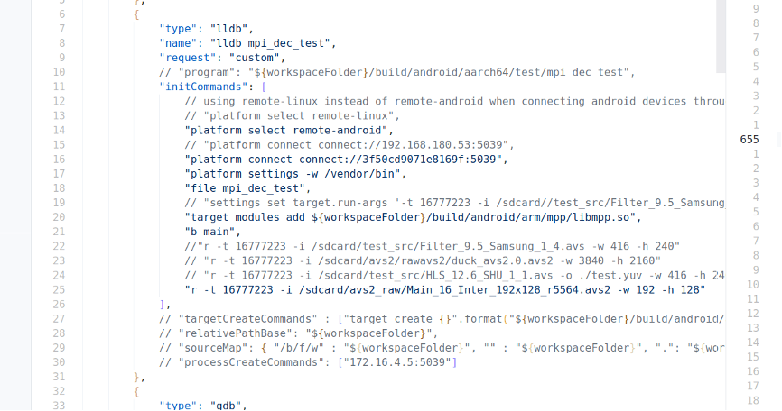
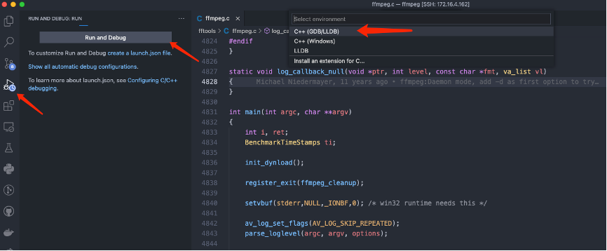
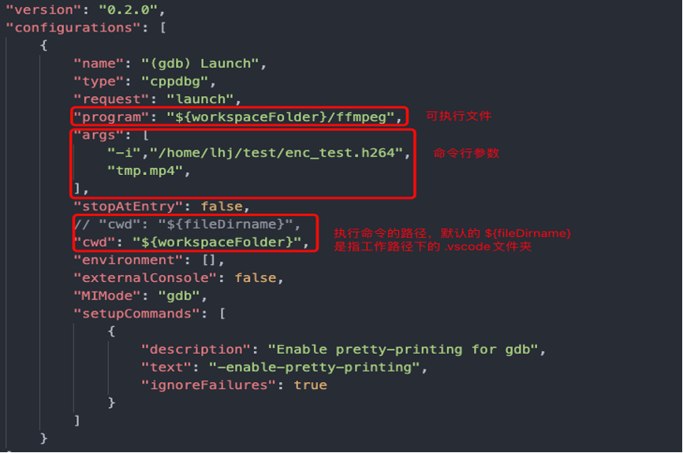
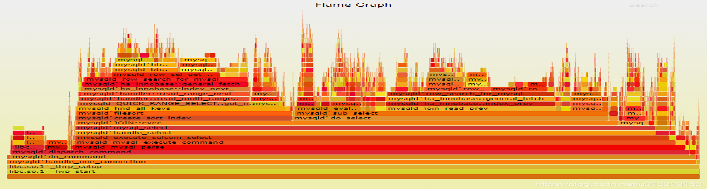
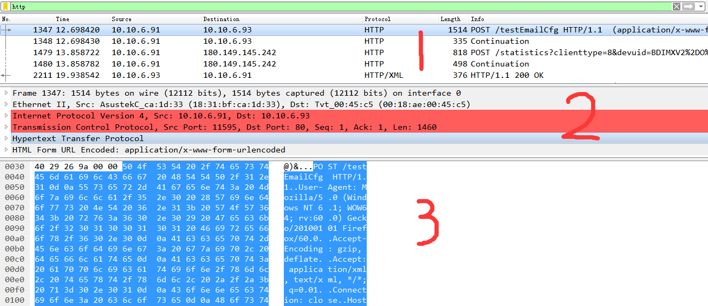
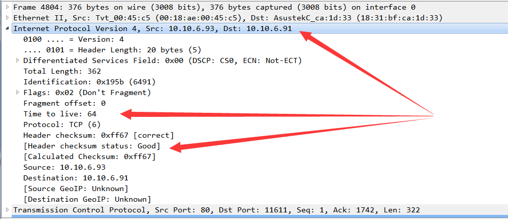
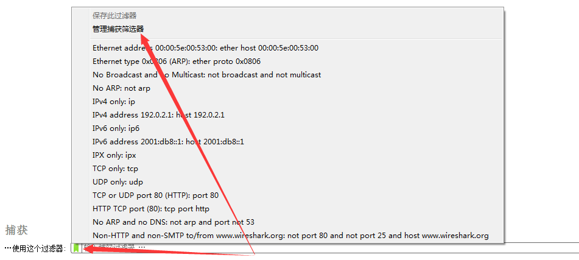
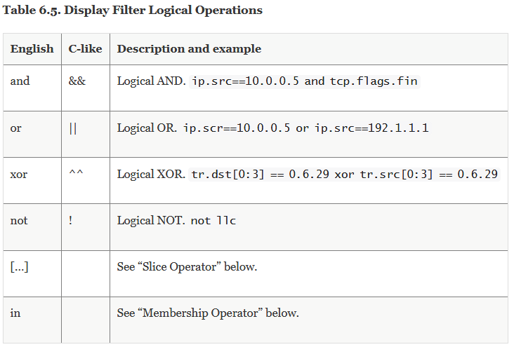

## 工具  

### 通用工具

#### 文件比较工具

#####  diff

**介绍**

diff 是一个文件比较工具，可以逐行比较两个文件的不同，它是以行为单位的，其中它有
三种输出方式，分别是 normal， context 以及 unified。区别如下：
* normal 方式为默认输出方式，不需要加任何参数
* context 相较于 normal 模式的简单输出，contetx 模式会输出修改过部分的上下文，
默认是前后 3 行。使用参数 -c
* unified 合并上下文模式则为新的上下文输出模式，同样为前后 3 行，只不过把上下文
合并了显示了。使用参数 -u

注：这里主要介绍 unified 模式

其他常用参数：
* -r 递归处理目录
* -N 将缺失的文件当作空白文件处理

***diff 语法与文件格式***

```shell
diff [options] old new

ex: diff -Nru <oldFile> <newFile> > tmp.patch
```

##### cmp

相对于diff，cmp的用途没有那么广泛，其主要是以字节为单位去比较，而diff是以行为
单位比较，因此cmp也可以比较二进制文件

##### patch

**介绍**

patch 是一个可以将 diff 生成的补丁应用到源文件，生成一个打过补丁版本的文件。语法：

```shell
patch [oiption] [originalfile [patchfile]]
```

常用参数：

* -i 指定补丁文件
* `-p<剥离层级>`或`--strip=<剥离层级>` 　设置欲剥离几层路径名称。在 diff 生成的
补丁中，第三四行是文件信息，其中文件名是可以包含路径的，例如：
```
Binary files LearnV4l2/.git/index and LearnV4l2_2/.git/index differ
diff --color -Nru LearnV4l2/v4l2Cap.c LearnV4l2_2/v4l2Cap.c
--- LearnV4l2/v4l2Cap.c	2023-06-09 20:49:57.915992397 +0800
+++ LearnV4l2_2/v4l2Cap.c	2023-09-29 09:58:17.235950333 +0800
```
-p0 代表完整的路径`LearnV4l2/v4l2Cap.c`，而 -p1 则指`v4l2Cap.c`，-pN 依此类推，
可以简单理解为，-pN 里的N表示去掉补丁路径里的几个 `/`。
* -E 删除应用补丁后为空文件的文件
* -o 输出到一个文件而不是直接覆盖文件
* -R 代表还原，将新的文件还原成原来的旧版本，也可以理解为去掉补丁

常见用法：
```shell
patch -p0 < tmp.patch
patch -R -p0 < tmp.patch
```


#### sed

sed 是以行为单位进行处理的命令

参数介绍：
```
# sed [options] 'command' file(s)
# sed [options] -f scriptfile file(s)

option 参数：
-n: 使用安静（silient）模式。在一般sed的用法中，所有来自STDIN的数据一般都会被列出
    到屏幕上。但如果加上-n参数之后，则只有经过sed处理的行才会被列出来。
-e: 直接在命令行模式上进行sed的动作编辑，sed后若要接超过两个以上的动作，每个动作
    前需要加 -e
-f: 直接将sed的动作写在一个文件中，-f filename则可以执行filename内的sed动作
-r: sed的动作支持的是扩展型正则表达式的语法（默认是基础正则表达式语法）
-i: 直接修改读取的文件内容，而不是由屏幕输出
```

sed 命令
```
# [n1[,n2]]function[funcParas]

n1,n2: 不见得会存在，一般代表选择进行动作的行数或匹配，举例来说，如果动作是需要
       在10到20行之间进行的，则“10,20[动作行为]”
       n1 : 表示n1行
       n1,n2 : 表示从n1行，到n2行
       /pattern/ 查询包含pattern的行 例如： cat tmp.txt | sed '/^a/d'
       /pattern/,/pattern2/ 对匹配pattern到pattern2的行之间操作。例如：cat tmp.txt| sed '/^c/,/^d/d'
       /pattern/,x 通过pattern和行号查询匹配的行。例如：cat tmp.txt| sed '/^c/,$d'
       x,y! 查询不包含执行行号x和y的行 例如：cat tmp.txt| sed '3,4!d'

funcParas: function可能需要参数，例如新增"a"，需要在"a"后添加需要新增的内容

function 有下面这些参数:

a\: 新增，a的后面可以接字符串，而这些字符串会在新的一行出现（目前的下一行）
          举例：sed -i '2a\this is a test line' test.conf
c\: 替换，c的后面可以接字符串，这些字符串可以替换n1,n2之间的行
i\: 插入，i的后面可以接字符串，而这些字符串会在新的一行出现（目前的上一行）
          举例：将 this is a test line 追加到以test开头的行前面：
          sed '/^test/i\this is a test line' file
d:  删除，因为是删除，所以d后面通常不接任何参数
p:  打印，也就是将某个选择的数据打印出来。通常p会与参数sed -n一起运行
s:  替换，可以直接进行替换的工作。通过s的动作可以搭配正则表达式。
    例如：1,20s/old/new/g

D: 删除模板块的第一行。
P # (大写) 打印模板块的第一行。

h # 拷贝模板块的内容到内存中的缓冲区。
H # 追加模板块的内容到内存中的缓冲区。
g # 获得内存缓冲区的内容，并替代当前模板块中的文本。
G # 获得内存缓冲区的内容，并追加到当前模板块文本的后面。
l # 列表不能打印字符的清单。
n # 读取下一个输入行，用下一个命令处理新的行而不是用第一个命令。
N # 追加下一个输入行到模板块后面并在二者间嵌入一个新行，改变当前行号码。
q # 退出Sed。
b lable # 分支到脚本中带有标记的地方，如果分支不存在则分支到脚本的末尾。
r file # 从file中读行。
t label # if分支，从最后一行开始，条件一旦满足或者T，t命令，将导致分支到带有标号的命令处，或者到脚本的末尾。
T label # 错误分支，从最后一行开始，一旦发生错误或者T，t命令，将导致分支到带有标号的命令处，或者到脚本的末尾。
w file # 写并追加模板块到file末尾。
W file # 写并追加模板块的第一行到file末尾。
! # 表示后面的命令对所有没有被选定的行发生作用。
= # 打印当前行号码。
# # 把注释扩展到下一个换行符以前。
```

sed替换标记
```
g # 表示行内全面替换。
p # 表示打印行。
w # 表示把行写入一个文件。
x # 表示互换模板块中的文本和缓冲区中的文本。
y # 表示把一个字符翻译为另外的字符（但是不用于正则表达式）
\1 # 子串匹配标记
& # 已匹配字符串标记
```

sed元字符集
```
^ # 匹配行开始，如：/^sed/匹配所有以sed开头的行。
$ # 匹配行结束，如：/sed$/匹配所有以sed结尾的行。
. # 匹配一个非换行符的任意字符，如：/s.d/匹配s后接一个任意字符，最后是d。
* # 匹配0个或多个字符，如：/*sed/匹配所有模板是一个或多个空格后紧跟sed的行。
[] # 匹配一个指定范围内的字符，如/[sS]ed/匹配sed和Sed。
[^] # 匹配一个不在指定范围内的字符，如：/[^A-RT-Z]ed/匹配不包含A-R和T-Z的一个字母开头，紧跟ed的行。
\(..\) # 匹配子串，保存匹配的字符，如s/\(love\)able/\1rs，loveable被替换成lovers。
& # 保存搜索字符用来替换其他字符，如s/love/ **&** /，love这成 **love** 。
\< # 匹配单词的开始，如:/\<love/匹配包含以love开头的单词的行。
\> # 匹配单词的结束，如/love\>/匹配包含以love结尾的单词的行。
x\{m\} # 重复字符x，m次，如：/0\{5\}/匹配包含5个0的行。
x\{m,\} # 重复字符x，至少m次，如：/0\{5,\}/匹配至少有5个0的行。
x\{m,n\} # 重复字符x，至少m次，不多于n次，如：/0\{5,10\}/匹配5~10个0的行。
```

sed用法实例
```
# 将每一行中所有的book替换为books
sed 's/book/books/g' file

# 删除空白行
sed '/^$/d' file

# 删除文件的第2行：
sed '2d' file

# 删除文件的第2行到末尾所有行：
sed '2,$d' file

# 删除文件最后一行：
sed '$d' file

# 删除文件中所有开头是test的行：
sed '/^test/'d file
```


#### man 替代工具

```shell
tldr <cmd>
curl cheat.sh/<cmd>

ex:
tldr ls
curl cheat.sh/ls
```

#### LD_LIBRARY_PATH

#### 查看程序搜索库的路径  
LD_DEBUG1.LD_DEBUG使用方法如下:  
LD_DEBUG=libs ./app  
LD_DEBUG=libs help 查看命令使用方法  

#### 动态库搜索路径

linux下动态链接器会从以下目录下搜索共享库。

1.  首先在环境变量LD_LIBRARY_PATH 保存的路径中查找。
2. 然后从缓存文件/etc/ld.so.conf.cache中查找。这个缓存文件是ldconfig加载
   /etc/ld.so.conf文件生成的，所以修改/etc/ld.so.conf后需要执行ldconfg命令
   (没有/etc/ld.so.conf也可以自己创建)。当然，ldconfig不止处理/etc/ld.so.conf
   文件，还会处理一些默认目录，如/lib，/usr/lib等，处理的过程主要是建立索引
   以便快速查找。
3. 默认的系统库文件目录/usr/lib，然后从/lib目录中查找。

还有一种方法，就是链接生成执行文件时就把库路径写到文件中，通过gcc 的-rpath选项，
这种硬编码的方法是不被推荐的


### vim

#### 基本操作

vim复制到系统剪贴板
{Visual}"+y - copy the selected text into the system clipboard

vim剪切到系统剪贴板
"+dd – 剪切一行

从系统剪贴板粘贴到vim
"*p
"+p
Shift+Insert
:put + - Ex command puts contents of system clipboard on a new line
<C-r>+ - From insert mode (or commandline mode)
"+p比 Ctrl-v 命令更好，它可以更快更可靠地处理大块文本的粘贴，也能够避免粘贴大量文本时，发生每行行首的自动缩进累积，因为Ctrl-v是通过系统缓存的stream处理，一行一行地处理粘贴的文本。

#### 在Vim中插入当前文件名
reference: https://www.cnblogs.com/Mr-Shadow/archive/2013/03/12/2954919.html
1. 使用<c-r>（即CTRL+R）。步骤如下：
在Insert模式下，先按CTRL+R，光标处变成双引号“
再按%，即可直接插入当前文件名（含路径）
关 于<c-r>，可输入”:help <c-r>“查看详细说明。此处简要说明一下，CTRL-R可以插入0～9号寄存器（numbered register）内的内容，也可以插入特殊寄存器（named register）里的内容。特殊寄存器中，只读寄存器"%包含的就是当前文件名。另外，vim中的复制粘贴（剪贴板操作）也是使用了特殊寄存器+的操作。

2. 使用expand()。其实这个也用到了<c-r>。步骤如下：
在Insert模式下，先按CTRL+R，光标处变成双引号”
再按=，提示输入表达式
输入expand("%:t")，回车
即可插入当前文件名（不含路径）
这个方法先进入<c-r>状态，然后利用"=寄存器，将表达式的值插入当前位置。基本上只要是可以返回字符串的表达式都可以用这个方法快速插入到文本中。可以将整个输入过程做map或abbreviation，实现快速插入当前文件名，比如：
:iab fname <c-r>=expand("%:t")<CR>

只要在输入状态下输入“fname空格”即可插入当前文件名。
关于expand()，可输入“:help expand”查看详细说明。

### linux 串口工具  
#### minicom  
minicom -s  修改设置，包括预置场景  
打开串口后 ctrl+a z 打开帮助，敲z时不加ctrl  
在帮助里按 o 可以进行端口配置  
打开串口后 ctrl+a q 退出  
使用功能菜单时按 Esc 基本都可以返回  

对于mac，meta键默认是esc，但可以修改  

#### picocom  
minicom的精简版  

### linux 调试工具  
#### GDB基本用法  
**基本指令：参考宋宝华的书**  

0. base
编译需要添加参数-g  
常用的打印参数指令：
```shell
$(gdb) show args
$(gdb) info files
```

1. 启动
```shell
$ gdb <app>
$ (gdb) file <app>
$ (gdb) info files
attach:
$ sudo gdb <app> -p <pid>
$ (gdb) file <app>
$ (gdb) attach <pid >

设置运行环境根目录:
$ (gdb) preinstall

运行参数处理：
1)进入gdb之前设置：gdb --args <app> <paras>
2)进入gdb之后设置：set args <paras>
3)进入gdb后，运行时设置：r <paras>
4)--batch 在处理完所有用“-x”指定的命令文件后以状态 0 退出。 如果在命令文件中执行 GDB 命令时发生错误，则以非零状态退出。例如：
gdb -ex=r --batch --args <paras>   其中 r 是 run的简写
5)使用command文件
进入gdb之前：
gdb --command=<commandfile.gdb> [--batch] --args <app> [<paras>]
进入gdb之后：
source <commandfile.gdb>
commandfile的编写按照命令行敲命令的顺序即可
6) show user
  查看当前用户使用的命令等相关信息
注意：无论在哪里设置参数，只要设置完就可以直接使用r运行，默认带有参数，除非另作修改更新，才会使用新的参数

当前工作目录：
$ (gdb) pwd
$ (gdb) cd <new/dir>


GDB动态库搜索路径
参考：
[set sysroot command](https://visualgdb.com/gdbreference/commands/set_sysroot)
[GDB动态库搜索路径](https://www.cnblogs.com/tibetanmastiff/p/4759995.html)
[GDB：无法找到动态链接器断点函数](https://www.fayewilliams.com/2013/01/31/gdb-unable-to-find-dynamic-linker-breakpoint-function/)

当GDB无法显示so动态库的信息或者显示信息有误时，通常是由于库搜索路径错误导致的，
可使用set sysroot、set solib-absolute-prefix、set solib-search-path来指定库搜索路径。
1. sysroot 与 solib-absolute-prefix 相同，sysroot是solib-absolute-prefix 的别名。
2. set solib-search-path设置动态库的搜索路径，该命令可设置多个搜索路径，路径之间
   使用“:”隔开（在linux中为冒号，DOS和Win32中为分号）。
3. set solib-absolute-prefix 与 set solib-search-path 的区别：
  总体上来说solib-absolute-prefix设置库的绝对路径前缀，只对绝对路径有效；而solib
  -search-path设置库的搜索路径，对绝对路径和相对路径均起作用。（编译器自动链接的
  so库多采用绝对路径）。

通俗理解：
solib-absolute-prefix: 别名，sysroot，指的是嵌入式根文件系统在上位机中的目录
solib-search-path: 指的是动态连接库的搜索路径


详细规则有：
set set solib-absolute-prefix由于是路径前缀，所以只能设置一个路径，而solib-search-path
可以设置多个搜索路径。
举例：
# 设置本地的sysroot：
$ (gdb) set sysroot preinstall
# 设置远程的sysroot，（之前关键字可以使用remote，但后来弃用建议使用target）：
$ (gdb) set sysroot target:/
# 设置搜索路径
$ (gdb) set solib-search-path /vendor/lib:/system/lib
# 手动加载动态库
$ (gdb) load /path/to/lib.so
# 查看加载的动态库，如果没有运行到需要动态库的位置可能也查询不到，需要用到动态库才会看到加载信息：
$ (gdb) info sharedlibrary
```

2. 列出代码  
```shell  
$(gdb)  list <show number>  
$(gdb)  list <function>  
$(gdb)  list  # 显示当前行后边的源程序  
$(gdb)  show listsize  # 显示现在 list 显示的行数  
$(gdb)  set listsize <num> # 修改 list 显示的行数  
$(gdb)  tui enable    # 使用独立的代码窗口  
$(gdb)  layout src    # 使用独立的代码窗口  
$(gdb)  layout asm    # 使用独立的代码窗口，汇编语言

layout的使用：  
layout：用于分割窗口，可以一边查看代码，一边测试。主要有以下几种用法：  
layout src：显示源代码窗口  
layout asm：显示汇编窗口  
layout regs：显示源代码/汇编和寄存器窗口  
layout split：显示源代码和汇编窗口  
layout next：显示下一个layout  
layout prev：显示上一个layout  
Ctrl + L：刷新窗口  
Ctrl + x，再按1：单窗口模式，显示一个窗口  
Ctrl + x，再按2：双窗口模式，显示两个窗口  
Ctrl + x，再按a：回到传统模式，即退出layout，回到执行layout之前的调试窗口。  
```  

3. 调试控制  
```shell  
$(gdb)  run # 运行，简写 r，后边可跟命令行参数，如果没有设置断点，不会停下。  
$(gdb)  start # 开始执行程序，在main 函数处会停下来  
$(gdb)  starti # 开始执行程序，在第一条(机器)指令处会停下来  
$(gdb)  continue [<ignore-cnt>]# 可简写为 c，恢复程序运行直到程序结束或到达下一个断点，ignore-cnt 表示忽略其后多少次断点  
$(gdb)  next # 下一步，可简写为 n  
$(gdb)  break # 中断，可简写为 b  
$(gdb)  where # 查看程序当前位置  
$(gdb)  print # 打印，可简写为 p  
$(gdb)  jump <linespec>  # GDB 提供了乱序执行的功能，<inespee>可以是文件的行号，可以是file:line格式，也可以是fnum 这种偏移量格式，表示下一条运行语句从哪里开始。  
$(gdb)  signal <signal> # 使用singal 命令，可以产生一个信号量给被调试的程序，如中断信号 ctrl+C。于是，可以在程序运行的任意位置处设置断点，并在该断点处用 GDB 产生一个信号量，这种精确地在某处产生信号的方法非常有利于程序的调试。UINIX 的系统信号量通常为 1-15，因此 signals 的取值也在这个范围内。  
$(gdb)  return [<expr>] # 如果在函数中设置了调试断点，在断点后还有语向没有执行完，这时候我们可以使用 return 命令强制函数忽略还没有执行的语句并返回。  
$(gdb)  call <func> # 强制调用某函数，也可以使用p <func> 的形式调用函数  
```  
在运行前，可以设置如下的环境变量：  
```shell  
a. 程序运行参数：  
$(gdb) set args 1 2 3 4 5  
$(gdb) r <paras>  
$(gdb) show args  
b. 运行环境：  
$(gdb) path <dir> 设定程序的运行路径  
$(gdb) show paths 查看程序的运行路径  
$(gdb) set environment varname[=value] # 设定环境变量  
$(gdb) show environment[varname] # 查看环境变量  
c. 工作目录：  
$(gdb) cd <dir> 相当于 shell 的 cd 命令  
$(pwd) pwd 显示当前所在目录  
d. 程序的输入输出：  
info terminal 用于显示程序用到的终端模式  
在gdb中也可以使用重定向控制程序输出，如 run > outfile  
用tty命令可以指定输入输出的终端设备，如 tty /dev/ttyS1  
```  

4. 单步调试：  
```shell  
1) next [<count>]  # 可简写为 n，单步执行，不会进入函数  
2) step [<count>]  # 可简写为 s，单步执行，会进入函数内部  
3) set step-mode  
   set step-mode on 用于打开step-mode 模式，这样在进行单步跟踪(step)时，若跨于某个没有调试信息的函数，程序的执行则会在该函数的第一条指令处停住，而不会跳过整个函数。这样我们可以查看该函数的机器指令  
4) finish  
   运行程序，直到当前函数完成返回，并打印函数返回时的堆栈地址、返回值及参数值等信息  
5) untile (缩写为 u)  # 运行程序直到退出循环体  
6) setpi (缩写为si) 和 nexti (缩写为ni)  
   stepi 和 nexiti 用于单步跟踪一条机器指令。比如，一条c程序代码有可能由数条机器指令完成，stepi 和 nexiti 可以单步执行机器指令，相反，setp和next是c语言级别的命令。另外，运行 display/i $pc 命令后，单步跟踪会在打出程序代码的同时打出机器指令，即汇编代码。  
```  

5. 断点调试：  
```shell  
1) break <func> # 进入函数时停住，c++ 可以使用 class::function 或 function(type,type)   
2) break <linenum> # 在指定行号停住  
3) break +offset / break -offset  # 在当前行号的前面或后面的 offset 行停住  
4) break filename:linenum # 在源文件flename 的 linenum 行处停住。  
5) break filename: function # 在源文件 fliename 的 function 函数的人口处停住。  
6) break *address # 在程序运行的内存地址处停住。  
7) break     # break 命令没有参数时，表示在下一条指令处停住。  
8) break …… if <condition>  
   …… 可以是上述的 break<linenum>、break +offset / break -offset 中的参数，condition表示条件，在条件成立时停住。比如在循环体中，可以设置 break if i = 100，表示 i 100时停住程序  
9) info breakpoints[n]、info break[n]  # 查看断点，n表示断点号  
10) delete <num> # 删除断点  
11) disable <num> # 去使能断点  
12) enable <num> # 使能断点  
13) commands 设置在给定断点被击中时要执行的命令，命令格式：  
    commands [break point idx]  
        cmd 1  
        cmd 2  
    end  
    如果不填 break point idx 默认使用最后一个中断点  
```  

6. 调试过程中的信息查询和处理  
```shell  
1）print[/<f>] <expr>  
    <expr> 是表达式，或者是变量，<f>是输出的格式，例如：/x 表示十六进制格式，当使用gdb的print查看程序运行时数据时，每个print都会被gdb记录下来。gdb会以$1,$2,$3这样的形式为每一个print命令编号。我们可以使用这个编号访问以前的表达式。如果要修改变量，可以使用类似 print x=4 的格式  
    print 的输出格式如下：  
    x：按十六进制格式显示变量  
    d：按十进制格式显示变量  
    u：按十六进制格式显示无符号整型  
    o：按八进制格式显示变量  
    t：按二进制格式显示变量  
    a：按十六进制格式显示变量  
    c：按宇符格式显示变量  
    f：按浮点数格式显示变量  
2) display</fmt> <expr>  
    和 print 命令一样，display 命令也用于调试阶段查看某个变量或表达式的值，它们的区别是，使用 display 命令查看变量或表达式的值，每当程序暂停执行（例如单步执行）且作用域能达到时，GDB 调试器都会自动帮我们打印出来，而 print 命令则不会。  
    关闭则使用 disable/delete display <idx>  其中idx可以通过info display查询  
3) watch  
    watch 一般用来观察某个表达式的值是否有了变换，如果有了变化，马上停止运行程序，使用方法如下：  
    watch <expr>：为表达式（变量）expr 设置一个观察点。一旦表达式值有变化时，马上停止程序运行。  
    rwatch <expr>：当表达式（变量）expr 被读时，停止程序运行。  
    awatch <expr>：当表达式（变量）的值被读或被写时，停止程序运行。  
    如果想观察内存的值变化可以按如下操作：  
    1. 得到内存的地址：print &val  
    2. watch *<addr>   // 观察一个byte  
       watch *(int*)<addr>  // 观察int长度的byte  
4) examine (缩写为 x) 查看内存地址中的值  
    格式：x /<[n][f][u]>  <addr>  
    n: 是正整数，表示需要显示的内存单元的个数，即从当前地址向后显示n个内存单元的内容，一个内存单元的大小由第三个参数u定义。  
    f: 表示addr指向的内存内容的输出格式，s对应输出字符串，此处需特别注意输出整型数据的格式：  
        x:按十六进制格式显示变量。  
        d:按十进制格式显示变量。  
        u:按十六进制格式显示无符号整型。  
        o:按八进制格式显示变量。  
        t:按二进制格式显示变量。  
        a:按十六进制格式显示变量。  
        c:按字符格式显示变量。  
        f:按浮点数格式显示变量。  
    u: 就是指以多少个字节作为一个内存单元-unit,默认为4。当然u还可以用被一些字符表示，如b=1 byte，h=2 bytes，w=4 bytes，g=8 bytes。  
    <addr>: 表示内存地址。  

    整合这个命令的诠释：就是以addr为起始地址，返回n个单元的值，每个单元对应u个字节，输出格式是f。  
    如：x/ 3uh 0x54320表示：以地址0x54320为起始地址，返回3个单元的值，每个单元有两个字节，输出格式为无符号十六进制。  
    也就是说返回了3*2=6个字节的数据，以十六进制输出，这6个字节的数据，每两个字节为一个单元输出，共输出3个单元。  

5) examine 命令用于查看内存，而 set 命令用于修改内存。它的命令格式是“set* 有类型的指针=value”  
6) info 命令  
    info 命令可以用来在调试时查看奇存器、断点、观察点和信号等信息。要查看寄存器的值可以使用如下命令  
    info registers（查看除了浮点寄存器以外的寄存器）  
    info a11-registers（查看所有寄存器）  
    info registers ＜regname...> （查看所指定的寄存器）  

    要查看断点信息，可以使用如下命令：  
    info break  
      
    要列出当 前所设置的所有观察点，可使用如下命令：  
    info watchpoints  

    要查看有哪些信号正在被 GDB 检测，可使用如下命令：  
    info signals  
    info handle  
    也可以使用 info line 命令来查看源代码在内存中的地址。info line 后面可以跟行号、函数名、文件名:行号、文件名:函数名等各种形式，例如用下面的命令会打印出所指定的源码在运行时的内存地址：  
    info line tst.c: func  

    查看进程(包括进程号)：  
    info inferiors  

    查看线程：  
    info threads  

    查看线程栈结构：  
    bt  

    打印所有线程堆栈：  
    thread apply all bt  

    切换线程：  
    thread n  # n 表示第几个线程  

7) 历史命令  
    mkdir -p ~/.config/gdb  
    echo 'set history save on' >> ~/.config/gdb/gdbinit  
    或  
    # 如果不设置文件的话，会在当前路径下生成.gdb_history文件  
    set history filename gdb.history  
    set history save on  
    set history size 1000  

```  
7. 查看栈/帧相关的信息  
    1）查看调用栈信息：  
    （1）backtrace: 显示程序的调用栈信息，可以用bt缩写  
    （2）backtrace n: 显示程序的调用栈信息，只显示栈顶n帧(frame)  
    （3）backtrace –n: 显示程序的调用栈信息，只显示栈底部n帧(frame)  
    （4）set backtrace limit n: 设置bt显示的最大帧层数  
    （5）where, info stack：都是bt的别名，功能一样  
    2）查看帧信息：  
    （1）frame n: 查看第n帧的信息， frame可以用f缩写  
    （2）frame addr: 查看pc地址为addr的帧的相关信息  
    （3）up [n]: 查看当前帧上面第n帧的信息，跳转后可以打印上一个函数的相关信息注意这里的上指外层函数，不写n表示跳一层  
    （4）down [n]: 查看当前帧下面第n帧的信息，跳转后可以打印下一个函数的相关信息  
    3）查看更加详细的信息：  
    （1）info frame、info frame n或者info frame addr  
    （2）info args：查看当前帧中的参数  
    （3）info locals：查看当前帧中的局部变量  
    （4）info catch：查看当前帧中的异常处理器  
    4）跟栈帧相关的寄存器  
    ```shell  
        %rax 作为函数返回值使用  
        %rbp 栈帧指针，指向栈基  
        %rsp 栈帧指针寄存器，指向栈顶  
        x86架构的芯片对同一个寄存器有不同的名字，但是描述的位数不同，以上命名都是描述64bit的位宽，但对于更小的位宽也有相应的名字，例如：  
        64bit --> 32bit --> 16bit --> 8bit  func  
        %rax      %eax      %ax       %al  作为函数返回值使用  
        %rbp      %ebp                     栈帧指针，指向栈基，被调用者保护  
        %rsp      %esp                     栈帧指针寄存器，指向栈顶  
    ```  
    参考：  
    [x86-64 下函数调用及栈帧原理](https://zhuanlan.zhihu.com/p/27339191)  
    [x86-64寄存器和栈帧](https://zhuanlan.zhihu.com/p/440016053)  
    [rax,eax,ax,ah,al 关系](https://blog.csdn.net/MashiMaroJ/article/details/120646168)  
      
      

8. `disassemble <func>` # 命令用于反汇编，可用它来查看当前执行时的源代码的机器码，实际上只是把目前内存中的指令冲刷出来。  

9. 自定义函数  
    可以写在 --command 加载的文件里，也可以在gdb的命令行里定义，语法如下：  
    ```shell  
    define <funcName>  
        <op1>  
        <op2>  
        <op3>  
    end  
    ```  
    例如：  
    ```shell  
    define test  
    print "abcd"  
    end  
    ```  
    使用时直接输入函数名就可以了  

10. 寄存器操作  
    ```shell  
    查看寄存器的值  
    info registers 打印所有寄存器  
    registers $<regName> 查看指定寄存器值，比print查看寄存器专业些  
    print $<regName> 查看指定寄存器值  

    修改寄存器的值  
    set var $<regName>=<regVal>  
    ```  

11. gef 插件
    github: https://github.com/hugsy/gef

    

    **寄存器：**
    * 冒号左边是寄存器的名字
    * 冒号右边是寄存器的值，再向右箭头后边是寄存器的值翻译得到的结果，
      例如：如果是字符串会解析出字符串的内容

    **栈：**
    * 竖线左边是当前堆栈的地址
    * `$rsp`是栈帧指针寄存器，指向栈顶
    * 竖线右边`+`号之后是当前地址相对于栈顶的偏移
    * 冒号右边是当前栈地址存放的内容

    **code：**
    * 注意该区域写的偏移是十进制的，例如：main+49，这里的49是十进制

12. kernel Call trace 分析：
    `my_func_symbol_name+0xac/0x1ac` 表示： 函数 + 函数内的偏移量/函数的大小
    查到异常点的位置:
    1) 使用objdump，反汇编elf文件，根据函数和函数偏移查找
    2) 使用gdb-multiarch，在gdb中执行 `list *(my_func_symbol_name+0xac)`可以定位，
       这里注意，gdb-multiarch加载的不一定是可执行文件，也可以是一个.o文件

#### GDB交叉编译

下载gdb源码：`https://sourceware.org/pub/gdb/releases/?C=M;O=D`

在autoconf中，定义了3种系统（或者机器）,用于标识构建过程中的参与者，它们是：
* host   运行构建过程生成的软件的系统。（译者注：gdb运行在x86上，因此host是x86;
         gdbserver运行在arm上，因此host是arm）
* build  执行构建过程的系统。大多数情况下，与上述的host系统是相同的系统，但在
         交叉编译的情况下，两者显然不同。
* target 运行正在构建的软件所依据的系统。正在构建的软件与运行在Host上运行的软件
         进行特定交互时，这才有意义。编译器、调试器、分析器和其他工具通常都是这样。

配置：
```
mkdir build
cd build
```


#### 嵌入式GDB远程调试  
* 调试主机需要安装gdb-multiarch，这里需要与嵌入式设备匹配，我是用udooer的开发板的时候发现gdb-multiarch可以使用。  
* 嵌入式设备需要安装gdbserver  
* 嵌入式设备与调试主机在同一网段  
* 嵌入式平台作为服务端执行：  
    `gdbserver <host_ip>:<port> <app>`       例如： gdbserver  localhost:8888 test  
* 调试主机作为客户端执行：  
    `gdb-multiarch <app>`                    例如：gdb-multiarch test  
    `(gdb) target remote <target_ip>:<port>` 例如：target remote 192.168.2.107:8888  
之后就可以在上位机敲指令调试了  
同样如果是使用系统中空闲的串口作为GDB调试器和GDBserver的底层通信手段的话各条指令如下：  
`gdbserver /dev/ttyS0 test`        其中/dev/ttyS0是嵌入式平台的通信设备  
`gdb-multiarch <app>`  
`(gdb) target remote /dev/ttyUSB0`  其中/dev/ttyUSB0是上位机的通信设备  


#### LLDB 基本用法  
lldb 与 gdb 使用方法大同小异，可以参考gdb使用，如果无法实现效果再细究是否有差异  
lldb 与 gdb 的关系映射 [GDB to LLDB command map](https://lldb.llvm.org/use/map.html)  
lldb 常用命令：[LLDB 常用命令](https://www.jianshu.com/p/81278ade3b80)  

**环境相关**  
```shell  
(lldb) platform status  # 打印基本状态  
(lldb)   
(lldb) platform list # 列举当前支持的平台，如果调试android，则执行 platform select remote-android  
(lldb) platform connect connect://<deviceName>:<remotePort>  
(lldb) platform settings -w <path: local or remote>  
(lldb) file <fileName>  
(lldb) r <input params>  
$ lldb -s <debug.lldb> <app> # 相当于 gdb 的—command  
$ lldb -- <args> # -- 相当于 gdb 的 --args  
```  

**远程设备执行：**  
```shell  
lldb-server p --server --listen "*:<remotePort>"  
```  

**使用独立的代码窗口**  
```shell  
(lldb) gui  
```  

**运行控制**  
```shell  
run (r) - 启动目标程序，如果遇到断点则暂停  
next (n) - 运行当前箭头指向行  
step (s) - 进入下一条指令中的函数内部  
continue (c) - 继续运行程序直到遇到断点。  
thread backtrace (bt) - 显示程序的调用栈信息，可以用bt缩写  
frame (f) - 默认显示当前栈的内容，可以通过 `frame arg` 进入特定的 frame（用作输出本地变量）  
```  

**断点相关**  
```shell  
(lldb) breakpoint list   # 列出所有断点，可简写 br l  
(lldb) b <funcName> # 添加断点  
(lldb) b <fileNmae>:<line> # 添加断点  
(lldb) br del <num> # 删除断点  
(lldb) br dis <num> # 去使能断点  
(lldb) br en <num> # 使能断点  
```  

**线程相关**  
```shell  
process interrupt  # 暂停当时程序的运行  
thread list    # 列出当前线程  
thread select 1  # 选择线程 1，可简写为 t 1  
thread backtrace # 打印当前线程的调用战信息，可简写为 bt  
thread backtrace all # 打印所有线程的调用栈信息  
```  

**变量相关**  


#### 嵌入式LLDB远程调试  

**上位机：**  
```shell  
$ lldb  
(lldb) platform list    # 列出当前支持的远程平台  
(lldb) platform select remote-android    # 选择嵌入式系统的平台  
(lldb) platform connect connect://<device name>:8888 # 设备名可以用adb devices 查询  
(lldb) platform settings -w /usr/local/bin # 修改工作路径，使用file加载文件时用的是该路径  
(lldb) file <local host> # 加载work路径下的文件，可以通过paltform status 查看work路径，被加载的文件会在运行时推到嵌入式系统的server工作路径  
(lldb) target   
```  
**attach 到远程进程**  
```shell  
(lldb) platform process list # 列出远程系统上的进程  
(lldb) attach 68639 # attach 到进程上  
```  

**嵌入式系统：**  
```shell  
lldb-server 基本使用方法，（server可以启动一次循环调试使用）：  
Usage:  
  lldb-server v[ersion]  
  lldb-server g[dbserver] [options]  
  lldb-server p[latform] [options]  

当lldb工作再 platform 模式时：  
Usage:  
  lldb-server p [--log-file log-file-name] [--log-channels log-channel-list] [--port-file port-file-path] --server --listen port  
例如：lldb-server p --server --listen "*:8888"  
注意：这里需要在一个可以运行文件的路径下启动server，例如在 /vendor/bin 下执行就可以正常调试，但是如果在/sdcard下执行就不能正常调试，会返回process launch failed: 'a' packet returned an error: 8错误  
```  

使用demo：  
```shell  
lldb-server p --server --listen "*:8888"    # 在可执行文件的路径下  
platform select remote-android  
platform connect connect://0:8888  
platform settings -w /vendor/bin  
file mpi_dec_test  
r -i output.h264 -t 7  
```  

海强的 vscode 配置  
  

#### ADB调试基本指令  
```shell  
连接设备的adb接口  
电脑上安装adb工具  
执行 adb devices 可以看到连接的设备  
Android系统的文件系统可能为只读系统，无法放入文件，需要执行一下命令：  
    adb root  
    adb remount  
然后在Android的路径 /vendor 下就是可写的了  
文件传输：  
    调试机 --> Android： adb push <localFile> <remoteDir>  
    Android --> 调试机： adb pull <remoteFile> <localDir>  
端口相关  
    #将PC的<hostPort>端口收到的数据，转发到手机中<remotePort>端口。  
    adb forward tcp:<hostPort> tcp:<remotePort>  
    例如：adb forward tcp:8887 tcp:8888  
    #查看端口转发  
    adb forward --list   
    #删除建立的转发端口  
    adb forward --remove tcp:<hostPort>  
可能会存在Linux系统无法检测到 adb 设备的情况，可以如下操作：  
    $ sudo adb kill-server  
    $ sudo adb devices  
    之后直接用 adb devices 就可以检测到设备了  
adb 网络模式  
    切换到网络模式：  
    adb tcpip <localPort>  
    adb connect <remoteIp>:<remotePort>  
    直接执行 adb connect <remoteIP> 也可以  
    切换回usb模式：  
    adb usb  
    例如：  
    adb tcpip 5555  
    adb connect 192.168.0.101:5555  
```  

#### ADB+gdb调试(命令行)  
```shell  
嵌入式设备执行： gdbserver :<port> <app> <param>  
    例如： gdbserver :8888 mpi_dec_test -i /sdcard/0.origin.h264  
    其中：<param>在嵌入式设备指定就可以了，调试主机可以不指定，软件实际执行是在嵌入式设备  
调试主机使用adb做端口映射：adb forward tcp:<hostPort> tcp:<remotePort>  
    例如：adb forward tcp:8887 tcp:8888  
调试主机启动gdb开始调试：  
    1. gdb <app>  
    2. (gdb) target remote 127.0.0.1:<hostPort> # 这里指向adb指定的主机端口  
        例如： target remote 127.0.0.1:8887  
        注意：这里的gdb应该使用nkd里的gdb，  
        例如：android-ndkbuilt/linux-x86_64/bin/gdb  
```  

#### vscode 本地调试  
  
  
  

#### vscode 调试+gdb 远程调试（adb环境）  
**launch 模式：**  
1. 在嵌入式平台上启动gdbserver，方法与ADB+gdb调试(命令行) 一致  
2. 在调试主机使用adb forward做端口映射，方法与ADB+gdb调试(命令行) 一致  
3. 在调试主机加入如下配置，然后开始调试  
  
```json  
{  
    "name": "Attach to gdbserver",  
    "type": "cppdbg",  
    "request": "launch",  
    "program": "${workspaceFolder}/build/android/arm/test/mpi_dec_test",  
    "args": [],  
    "miDebuggerPath":"/home/lhj/work/android/ndk/android-ndk-r16b/prebuilt/linux-x86_64/bin/gdb",  
    "miDebuggerServerAddress": "127.0.0.1:8887",  
    "remote": true,  
    "cwd": "${workspaceRoot}",  
    "valuesFormatting": "parseText"  
},  
```  
**attach 模式：**  
```shell  
只需要在嵌入式启动的时候将指令改为：  
gdbserver :<port> --attach <pid>  
例如：   
rk3566_r:/ # ps -elf | grep mediaserver  
media           357      1 0 04:38:15 ?     00:00:01 mediaserver  
root           2324   2321 0 07:02:00 pts/3 00:00:00 grep mediaserver  
rk3566_r:/ # gdbserver :8888 –attach 357  
```  


#### core dump
[Ubuntu 20 core dumped（核心已转储）问题分析](https://blog.csdn.net/scjdas/article/details/128585787)
[Crash/coredump 原理与实例](https://zhuanlan.zhihu.com/p/240633280)
[一文读懂Coredump文件是如何生成的](https://www.51cto.com/article/676754.html)

##### core dump 产生原因

core 指核心（线圈），没有半导体之前，使用线圈内存，指代内存。

可执行文件是分段存储的，加载进内存也是分段的，如代码段、数据段、堆、栈等，段错误的原因往往是碰到了不该碰到的内存位置（如系统保留段、代码段不能被修改，使用空指针等）。当程序发生内存越界访问等行为时，会触发OS的保护机制，此时OS会产生一个信号(signal)发送给对应的进程。当进程从内核态到用户态切换时，该进程会处理这个信号。此类信号（比如SEGV）的默认处理行为生成一个coredump文件。

核心已转储就是说进程结束之前，内存已被储存，可以用于程序员翻看程序的“临终遗言”来定位问题。往往需要使用gdb工具查看核心转储文件，且需要采用一些设置保障核心文件能够被储存，

以下列表中3、4、6、8、11默认都会产生core行为
```
Signal     Value     Action   Comment
──────────────────────────────────────────────────────────
SIGHUP        1       Term    Hangup detected on controlling terminal
                              or death of controlling process
SIGINT        2       Term    Interrupt from keyboard
SIGQUIT       3       Core    Quit from keyboard
SIGILL        4       Core    Illegal Instruction
SIGABRT       6       Core    Abort signal from abort(3)
SIGFPE        8       Core    Floating point exception
SIGKILL       9       Term    Kill signal
SIGSEGV      11       Core    Invalid memory reference
SIGPIPE      13       Term    Broken pipe: write to pipe with no
                              readers
SIGALRM      14       Term    Timer signal from alarm(2)
SIGTERM      15       Term    Termination signal
SIGUSR1   30,10,16    Term    User-defined signal 1
SIGUSR2   31,12,17    Term    User-defined signal 2
SIGCHLD   20,17,18    Ign     Child stopped or terminated
SIGCONT   19,18,25    Cont    Continue if stopped
SIGSTOP   17,19,23    Stop    Stop process
SIGTSTP   18,20,24    Stop    Stop typed at terminal
SIGTTIN   21,21,26    Stop    Terminal input for background process
SIGTTOU   22,22,27    Stop    Terminal output for background process
```

##### 构造实例

```C
int main(int argc, char *argv[])
{
    char *addr = (char *)0; // 设置 addr 变量为内存地址 "0"

    *addr = '\0';           // 向内存地址 "0" 写入数据

    return 0;
}
```

在上面的例子中，由于内存地址 ”0“ 并没有通过调用 malloc 函数申请，所以当向地址 ”0“ 写入数据时将会导致 段错误，进程将会接收到 SIGSEGV 信号。


##### coredump 文件生成原理

当进程接收到某些 信号 而导致异常退出时，就会生成 coredump 文件。

当进程从 内核态 返回到 用户态 前，内核会查看进程的信号队列中是否有信号没有处理，如果有就调用 do_signal 内核函数处理信号。我们可以通过下图来展示内核是怎么生成 coredump 文件的：


 do_coredump 函数完成四个工作：

判断当前进程可生成的 coredump 文件大小是否受到资源限制。
如果不受限制，那么调用 format_corename 函数生成 coredump 文件的文件名。
接着调用 filp_open 函数创建 coredump 文件。
最后根据当前进程所使用的可执行文件格式来选择相应的填充方法来填充 coredump 文件的内容，对于 ELF文件格式 使用的是 elf_core_dump 方法。
elf_core_dump 方法的主要工作是：把进程的内存信息和内容写入到 coredump 文件中，并且以 ELF文件格式 作为 coredump 文件的存储格式。有兴趣的可以自行阅读 elf_core_dump 方法的代码，这里就不作进一步的解说了。

##### 自定义core对应信号的处理函数

在实际的生产环境中，core文件是默认关闭的状态; 或者说，由于程序运行产生的core文件比较大，在生产环境下，为了避免产生core文件导致服务不可用，我们通常会关闭core文件的产生。这种情况下，我们需要自定义信号处理函数，来取代默认的core行为coredump. 一般情况下，我们是利用信号处理函数，保存crash时刻对应的函数调用堆栈。

```C
#include <stdio.h>
#include <stdlib.h>
#include <signal.h>
#include <execinfo.h>

void DumpTraceback(int Signal);

int main(int argc, char *argv[])
{
	(void) argc;
	(void) argv;
    char *addr = (char *)0; // 设置 addr 变量为内存地址 "0"

	signal(SIGSEGV, DumpTraceback);//注册新号处理函数

    *addr = '\0';           // 向内存地址 "0" 写入数据

    return 0;
}


void DumpTraceback(int Signal)
{
    const int len = 200;
    void* buffer[len];
    int nptrs = backtrace(buffer, len);
    char** strings = backtrace_symbols(buffer, nptrs);
    printf("sig:%d nptrs:%d\n", Signal, nptrs);
    if (strings) {
        for (int i = 0; i < nptrs; ++i) {
            printf("line=%d||trace_back=%s||\n", i, strings[i]);
        }
        free(strings);
    }

    exit(1);
}
```

##### 解决方法

1. ubuntu官方为了自动收集错误，设置了apport.service服务，用于自动生成崩溃报告，该服务开启时无法产生core文件，需要先将其关闭
```shell
# 1.关闭错误报告
sudo systemctl disable apport.service
# or
sudo service apport stop

# 2.启用错误报告
sudo systemctl enable apport.service
# or
sudo service apport start
```

2. 用 ulimit -a 查看 core file size 项是否为 unlimited（也可以用ulimit -c查看）。如果不是，修改成unlimited （指令：ulimit -c unlimited）

3. 检查core产生路径是否正确，  cat /proc/sys/kernel/core_pattern，如果路径不存在，则设置：echo "./core-%e-%p-%s" > /proc/sys/kernel/core_pattern，关闭 apport 服务前后该路径可能会有差异，关闭后可能路径只剩core，即在程序运行路径创建core

core设置主要命令解析：
```shell
# 控制core文件的文件名中是否添加pid作为扩展
echo "1" > /proc/sys/kernel/core_uses_pid
# 设置core文件的输出路径和输出文件名
echo "/home/lhj/corefile/core-%e-%p-%t"> /proc/sys/kernel/core_pattern 
 
# 参数说明
%p - insert pid into filename 添加pid
%u - insert current uid into filename 添加当前uid
%g - insert current gid into filename 添加当前gid
%s - insert signal that caused the coredump into the filename 添加导致产生core的信号
%t - insert UNIX time that the coredump occurred into filename 添加core文件生成时的unix时间
%h - insert hostname where the coredump happened into filename 添加主机名
%e - insert coredumping executable name into filename 添加程序名
```

4. 设置core文件存储的信息
`/proc/$pid/coredump_filter`设置那些内存会被dump出来，需要在程序启动之后进行设置。
```
bit 0  Dump anonymous private mappings.
bit 1  Dump anonymous shared mappings.
bit 2  Dump file-backed private mappings.
bit 3  Dump file-backed shared mappings.
bit 4 (since Linux 2.6.24)
       Dump ELF headers.
bit 5 (since Linux 2.6.28)
       Dump private huge pages.
bit 6 (since Linux 2.6.28)
       Dump shared huge pages.
```
默认设置是33,也就是保留了bit位对应的0和5对应的内存。另外，core文件的save遵循如下原则：内存映射的IO 页不会被dump；vdso 始终会被dump。我们可以比较不同filter下的内存大小.


5. gdb定位错误位置：
`gdb  <exe>  <coreFile>`

tips:
ulimit 命令是与shell有关的，并非所有shell都内置该命令，因此在一个系统上如果没有该命令，可以尝试更换shell

##### 对于嵌入式环境core dump的调试

1. 上位机需要构造与嵌入式环境相同的目录结构
2. 嵌入式平台开启ulimit -c 并执行程序，生成core dump文件
3. 将core dump文件放到pc上，并执行gdb-multiarch

关于执行gdb-multiarch是没有符号信息的问题：

在命令行中指定可执行文件和core dump文件时，会自动加载相关的符号表，这时如果相应
目录中搜不到相关文件，则无法加载相关符号表，相应函数等会显示问号，且无法查看代码。
解决该问题有两种方法：

1. 如果在命令行中指定可执行文件和core dump文件，则在上位机中构建的目录结构下执行gdb命令
2. 如果执行gdb命令时不在构建的目录结构中，则需要手动设置gdb的系统根目录到目录结构(set sysroot)，
   然后使用file命令重新加载可以执行文件，使用core-file重新加载core dump文件，这时依赖的库文件同样会被加载进来


#### addr2line工具  
addr2line工具是一个可以将指令的地址和可执行映像转换为文件名、函数名和源代码行数的工具。这在内核执行过程中出现崩溃时，可用于快速定位出出错的位置，进而找出代码的bug。  
**常用参数：**  
```shell  
-a	在函数名、文件和行号信息之前，显示地址，以十六进制形式  
-b	指定目标文件的格式为bfdname  
-e	指定需要转换地址的可执行文件名  
-j	给出的地址代表指定section的偏移，而非绝对地址  
-C	将低级别的符号名解码为用户级别的名字  
-f	在显示文件名、行号输出信息的同时显示函数名信息  
-p	使得该函数的输出信息更加人性化：每一个地址的信息占一行  
```  
示例：`addr2line -f -e <elfFile> <Num>`  

**使用方法**  
1. 编译可执行文件时要注意添加-g参数，保留调试信息  
2. 查找系统信息，然后定位代码  
```shell  
dmesg  
[150100.451504] traps: test[7593] trap divide error ip:4005f5 sp:7ffeebd4ba70 error:0 in test[400000+1000]  
```  
这条信息里，ip（指令指针寄存器）字段后面的数字就是test程序出错时程序执行的位置。使用addr2line就可以将4005f5定位到代码的位置：  
`addr2line 4005f5 -e test -f -s -C`  

**原理**  
addr2line如何找到的这一行呢。在可执行程序中都包含有调试信息（所以编译的时候需要加-g选项），其中很重要的一份数据就是源程序的行号和编译后的机器代码之间的对应关系Line Number Table。Line Number Table存储在可执行程序的.debug_line域。  
使用如下命令  
```shell  
$ readelf -w test | grep "advance Address"  

[0x000000ca]  Special opcode 7: advance Address by 0 to 0x4005e7 and Line by 2 to 3  
[0x000000cb]  Special opcode 146: advance Address by 10 to 0x4005f1 and Line by 1 to 4  
[0x000000cc]  Special opcode 104: advance Address by 7 to 0x4005f8 and Line by 1 to 5  
[0x000000cd]  Special opcode 36: advance Address by 2 to 0x4005fa and Line by 3 to 8  
[0x000000ce]  Special opcode 118: advance Address by 8 to 0x400602 and Line by 1 to 9  
[0x000000cf]  Special opcode 146: advance Address by 10 to 0x40060c and Line by 1 to 10  
[0x000000d0]  Special opcode 104: advance Address by 7 to 0x400613 and Line by 1 to 11  
[0x000000d1]  Special opcode 104: advance Address by 7 to 0x40061a and Line by 1 to 12  
[0x000000d3]  Special opcode 20: advance Address by 1 to 0x40062c and Line by 1 to 13  
[0x000000d5]  Special opcode 132: advance Address by 9 to 0x400646 and Line by 1 to 14  
[0x000000d6]  Special opcode 76: advance Address by 5 to 0x40064b and Line by 1 to 15  
```  
观察第二行和第三行，源代码的第4行的指令起始地址是0x4005f1， 第5行的起始地址是0x4005f8，可以知道0x4005f5位置的指令是属于第4行代码的。  

#### hexdump  
hexdump是Linux下的一个二进制文件查看工具，它可以将二进制文件转换为ASCII、八进制、十进制、十六进制格式进行查看。  
```shell  
hexdump: [-bcCdovx] [-e fmt] [-f fmt_file] [-n length] [-s skip] [file ...]	  
```  

此命令参数是Red Hat Enterprise Linux Server release 5.7下hexdump命令参数，不同版本Linux的hexdump命令参数有可能不同。  
```shell  
-b  每个字节显示为8进制。一行共16个字节，一行开始以十六进制显示偏移值  
-c  每个字节显示为ASCII字符  
-C  每个字节显示为16进制和相应的ASCII字符  
-d  两个字节显示为10进制  
-e  格式化输出  
-f  Specify a file that contains one or more newline separated format strings.  Empty lines and lines whose first non-blank character is a hash mark (#) are ignored.  
-n  只格式前n个长度的字符  
-o  两个字节显示为8进制  
-s  从偏移量开始输出  
-v  The -v option causes hexdump to display all input data.  Without the -v option, any number of groups of output lines, which would be identical to the immediately preceding group of output lines  
-x  双字节十六进制显示  
```  

#### ldd  
```shell  
ldd命令用于打印可执行文件或者库文件所依赖的共享库列表。  
ldd(选项)(参数)  
参数：  
    --version：打印指令版本号；  
    -v：详细信息模式，打印所有相关信息；  
    -u：打印未使用的直接依赖；  
    -d：执行重定位和报告任何丢失的对象；  
    -r：执行数据对象和函数的重定位，并且报告任何丢失的对象和函数；  
    --help：显示帮助信息。  
```  

#### ar  
    ar命令可以用来创建、修改库，也可以从库中提出单个模块。  


### Linux系统性能分析

#### top 使用技巧  
`top -H` 按照线程查看，或者启动top之后按 H 也可以  
`top` 按照进程查看  
`top -H | grep <>` 按照筛选项查看  

参考博客： 
[Linux top命令详解：持续监听进程运行状态](http://c.biancheng.net/view/1065.html)

在⽬前的多核架构下，不同版本的 top 对占有率的定义是有差别的，例如 toybox 版本显⽰
的CPU占有率是针对单 核的，也就是说如果SOC有四个核，线程A如果占满⼀个核，那 toybox
显⽰的占有率是100%。⽽ busybox 则与之相反，其占有率是按所有CPU核来算的，同样场景下
线程A的占有率只会显⽰25%。总的说来，对⽐CPU占有率， 最好⽤同⼀个版本的 top 来对⽐
才是最准的。


还有就是要注意top也是有精度的，它的原理是读取内核提供的进程信息`/proc/pid/stat`
和`/proc/stat`，所 以它完全依赖于Linux内核的调度粒度和使⽤场景。举个例⼦， stat
统计的单位是jiffies，假设⽬前内核的HZ设的 是300，并且启⽤了⾼精度定时器，那差不多
就是3ms⼀个jiffies，如果进程A以1ms甚⾄更⼩的间隔重复去睡眠，然后起来做⼀点事情，
那就可能出现这个3ms中进程A实际执⾏了挺多次，但是由于3ms间隔起始和结束刚好这个CPU
都在执⾏ idle 进程，这个3ms就被算到 idle 进程⾝上了。所以，在HZ设置的⽐较⼩，进程
又频繁的⼩跑⼩睡的场景下，其 idle 进程的统计会有⼀些误差，CPU占有率越低，idle误差
越⼤。

**选项：**  
```shell  
    -d 秒数：指定 top 命令每隔几秒更新。默认是 3 秒；  
    -b：使用批处理模式输出。一般和"-n"选项合用，用于把 top 命令重定向到文件中；  
    -n 次数：指定 top 命令执行的次数。一般和"-"选项合用；  
    -p 进程PID：仅查看指定 ID 的进程；  
    -s：使 top 命令在安全模式中运行，避免在交互模式中出现错误；  
    -u 用户名：只监听某个用户的进程；  
```  

在 top 命令的显示窗口中，还可以使用如下按键，进行一下交互操作：  
```shell  
    ? 或 h：显示交互模式的帮助；  
    P：按照 CPU 的使用率排序，默认就是此选项；  
    M：按照内存的使用率排序；  
    N：按照 PID 排序；  
    T：按照 CPU 的累积运算时间排序，也就是按照 TIME+ 项排序；  
    k：按照 PID 给予某个进程一个信号。一般用于中止某个进程，信号 9 是强制中止的信号；  
    r：按照 PID 给某个进程重设优先级（Nice）值；  
    q：退出 top 命令；  
    1：将cpu核心展开显示，而不是统计显示  
    H：切换到线程状态，再按切回到任务状态  
    F：选择指定的列显示  
    U：筛选用户  
    V：按照树状图显示  
```  

**第一部分的作用**  
```shell  
第一行为任务队列信息  
    12:26:46	                       系统当前时间  
    up 1 day, 13:32	                系统的运行时间.本机己经运行 1 天 13 小时 32 分钟  
    2 users	                        当前登录了两个用户  
    load average: 0.00,0.00，0.00	系统在之前 1 分钟、5 分钟、15 分钟的平均负载。如果 CPU 是单核的，则这个数值超过 1 就是高负载：如果 CPU 是四核的，则这个数值超过 4 就是高负载 （这个平均负载完全是依据个人经验来进行判断的，一般认为不应该超过服务器 CPU 的核数）  

第二行为进程信息  
    Tasks: 95 total	系统中的进程总数  
    1 running	    正在运行的进程数  
    94 sleeping	    睡眠的进程数  
    0 stopped	    正在停止的进程数  
    0 zombie	    僵尸进程数。如果不是 0，则需要手工检查僵尸进程  

第三行为 CPU 信息  
    Cpu(s): 0.1 %us	用户模式占用的 CPU 百分比  
    0.1%sy	        系统模式占用的 CPU 百分比  
    0.0%ni	        改变过优先级的用户进程占用的 CPU 百分比  
    99.7%id	        空闲 CPU 占用的 CPU 百分比  
    0.1%wa	        等待输入/输出的进程占用的 CPU 百分比  
    0.0%hi	        硬中断请求服务占用的 CPU 百分比  
    0.1%si	        软中断请求服务占用的 CPU 百分比  
    0.0%st	        st（steal time）意为虚拟时间百分比，就是当有虚拟机时，虚拟 CPU 等待实际 CPU 的时间百分比  

第四行为物理内存信息  
    Mem: 625344k total	物理内存的总量，单位为KB  
    571504k used	    己经使用的物理内存数量  
    53840k&ee	        空闲的物理内存数量。我们使用的是虚拟机，共分配了 628MB内存，所以只有53MB的空闲内存  
    65800k buffers	    作为缓冲的内存数量  

第五行为交换分区（swap）信息  
    Swap: 524280k total	交换分区（虚拟内存）的总大小  
    Ok used	            已经使用的交换分区的大小  
    524280k free	    空闲交换分区的大小  
    409280k cached	    作为缓存的交换分区的大小  


我们还要解释一下缓冲（buffer）和缓存（cache）的区别：  
缓存（cache）是在读取硬盘中的数据时，把最常用的数据保存在内存的缓存区中，再次读取该数据时，就不去硬盘中读取了，而在缓存中读取。  
缓冲（buffer）是在向硬盘写入数据时，先把数据放入缓冲区,然后再一起向硬盘写入，把分散的写操作集中进行，减少磁盘碎片和硬盘的反复寻道，从而提高系统性能。  
简单来说，缓存（cache）是用来加速数据从硬盘中"读取"的，而缓冲（buffer）是用来加速数据"写入"硬盘的。  
```  

**第二部分的作用**  
```shell  
top 命令的第二部分输出，主要是系统进程信息，各个字段的含义如下：  
    PID：进程的 ID。  
    USER：该进程所属的用户。  
    PR：优先级，数值越小优先级越高。  
    NI：优先级，数值越小、优先级越高。  
    VIRT：该进程使用的虚拟内存的大小，单位为 KB。  
    RES：该进程使用的物理内存的大小，单位为 KB。  
    SHR：共享内存大小，单位为 KB。  
    S：进程状态。  
    %CPU：该进程占用 CPU 的百分比。  
    %MEM：该进程占用内存的百分比。  
    TIME+：该进程共占用的 CPU 时间。  
    COMMAND：进程的命令名。  
```  
Linux系统可以使用 htop ，与 top 功能类似  


#### android 系统性能分析

referendes:  
[系统跟踪概览](https://developer.android.google.cn/topic/performance/tracing/?hl=zh-cn)  
[]()

##### ftrace

函数跟踪（function trace）这是Linux内核提供的功能，所有使用Linux内核的系统都有该功能（包括Linux和Android），其功能远不止名称所包含的内容，它可以用于测量处理中断所需要的时间、跟踪耗时函数、计算激活高优先级任务的时间、跟踪上下文切换等。具体使用方法可以参考书籍《Linux设备驱动开发》（[美]约翰·马德奥 李强 译）(已购)。也可参考内核文档：[ftrace.rst](https://www.kernel.org/doc/Documentation/trace/ftrace.txt)

##### atrace

reference:  
[Android atrace使用说明(Android sdk中的systrace)](http://bcoder.com/java/android-atrace-systrace-usage-instruction)  
[Android atrace/systrace的使用](https://juejin.cn/post/7053395801510248455)

Android tracer，使用ftrace来跟踪Android上层的函数调用。为数据采集部分

```
rk3588_s:/ # atrace -h
atrace: invalid option -- h

usage: atrace [options] [categories...]
options include:
  -a appname      enable app-level tracing for a comma separated list of cmdlines; * is a wildcard matching any process
  -b N            use a trace buffer size of N KB
  -c              trace into a circular buffer
  -f filename     use the categories written in a file as space-separated
                    values in a line
  -k fname,...    trace the listed kernel functions
  -n              ignore signals
  -s N            sleep for N seconds before tracing [default 0]
  -t N            trace for N seconds [default 5]
  -z              compress the trace dump
  --async_start   start circular trace and return immediately
  --async_dump    dump the current contents of circular trace buffer
  --async_stop    stop tracing and dump the current contents of circular
                    trace buffer
  --stream        stream trace to stdout as it enters the trace buffer
                    Note: this can take significant CPU time, and is best
                    used for measuring things that are not affected by
                    CPU performance, like pagecache usage.
  --list_categories
                  list the available tracing categories
 -o filename      write the trace to the specified file instead
                    of stdout.
```

`atrace  --list_categories` 可以查看更多策略

```
1|rk3588_s:/ # atrace  --list_categories
         gfx - Graphics
       input - Input
        view - View System
     webview - WebView
          wm - Window Manager
          am - Activity Manager
          sm - Sync Manager
       audio - Audio
       video - Video
      camera - Camera
         hal - Hardware Modules
         res - Resource Loading
      dalvik - Dalvik VM
          rs - RenderScript
      bionic - Bionic C Library
       power - Power Management
          pm - Package Manager
          ss - System Server
    database - Database
     network - Network
         adb - ADB
    vibrator - Vibrator
        aidl - AIDL calls
       nnapi - NNAPI
         rro - Runtime Resource Overlay
         pdx - PDX services
       sched - CPU Scheduling
         irq - IRQ Events
         i2c - I2C Events
        freq - CPU Frequency
        idle - CPU Idle
        disk - Disk I/O
         mmc - eMMC commands
        load - CPU Load
        sync - Synchronization
       workq - Kernel Workqueues
  memreclaim - Kernel Memory Reclaim
  regulators - Voltage and Current Regulators
  binder_driver - Binder Kernel driver
  binder_lock - Binder global lock trace
   pagecache - Page cache
      memory - Memory
     thermal - Thermal event
```

```
ex: atrace -z -b 4000 gfx input view webview wm am camera hal res audio video dalvik rs ss sched freq idle disk mmc -t 15 > /data/trace_output
```


##### systrace

systrace：Android的 trace 数据分析工具，将 atrace 采集上来的数据，以图形化的方式展现出来。

Systrace实际上是一些工具的集合，在设备端使用atrace来控制用户空间的tracing和设置ftrace，kernel中使用tracing机制进行数据采集。Systrace最终读取ftrace的buffer，然后将数据打包以HTML文件的方式呈现。

```
downlaod https://android.googlesource.com/platform/external/chromium-trace/+/6de8cfafb37437313122d1d78536749c02c3398c/systrace.py

./systrace.py --from-file trace_output -o trace_output.html
```

```
reference: https://juejin.cn/post/7053395801510248455

按键操作       作用
w             放大，[+shift]速度更快
s             缩小，[+shift]速度更快
a             左移，[+shift]速度更快
d             右移，[+shift]速度更快

f             放大当前选定区域
m             标记当前选定区域
v             高亮VSync
g             切换是否显示60hz的网格线
0             恢复trace到初始态，这里是数字0而非字母o

h             切换是否显示详情
/             搜索关键字
enter　　　　　　显示搜索结果，可通过← →定位搜索结果
`             显示/隐藏脚本控制台
?             显示帮助功能
```


##### Perfetto

reference:  
[Android 系统使用 Perfetto 抓取 trace 教程](https://zhuanlan.zhihu.com/p/508526020)  
[Perfetto工具使用简介](https://www.jianshu.com/p/ab22238a9ab1)

Perfetto工具是Android下一代全新的统一的trace收集和分析框架，可以抓取平台和app的trace信息，是用来取代systrace的，但systrace由于历史原因也还会一直存在，并且Perfetto抓取的trace文件也可以同样转换成systrace视图，如果习惯用systrace的，可以用Perfetto UI的"Open with legacy UI"转换成systrace视图来看

Perfetto 是基于 Android 的系统追踪服务， 这个配置在 Android11(R) 之后是默认打开的，但是如果你是 Android 9 (P) 或者 10 (Q) ，那么就需要手动设置一下相应的 prop 属性。

```shell
# Needed only on Android 9 (P) and 10 (Q) on non-Pixel phones.
adb shell setprop persist.traced.enable 1
```
在设置完 trace 服务可用后，下面我们就可以开始抓取相应的 trace 了。目前，主要有两个方式可以实现 trace 抓取。一个是通过命令行抓取，一个是通过 Perfetto UI 在线抓取。

###### 命令行抓取

命令行抓取 trace 方式的前提是你的电脑是已经安装了 adb 驱动，电脑能够通过 adb 命令成功连接到你的 Android 设备

使用命令行抓取又可以分为两种方式：
* 使用 Android 设备预置的 perfetto 执行程序
* 使用谷歌推荐的 record_android_trace 脚本

执行抓取命令：
```shell
adb shell perfetto -o /data/trace_file.perfetto-trace -t 5s sched freq idle am wm gfx view binder_driver hal dalvik camera input res memory

其中：
-o /data/trace_file.perfetto-trace
# -o 表示抓取文件的输出目录，这里我们是输出到 /data/ 目录下的 trace_file.perfetto-trace 文件。
-t 5s
# -t 表示抓取的时间，这里设置了 5s，默认情况下是 10s。
sched freq idle am wm gfx view binder_driver hal dalvik camera input res memory
# 这里表示我们想要抓 trace 的相关模块。
```

注意: 如果通过 adb shell perfetto 的方式抓取 trace ，需要我们手动执行 ctrl + c 结束我们的抓取操作。抓取的文件被保存在了 /data/trace_file.perfetto-trace 中。

抓取成功之后可以将文件放到网站可视化页面上显示（https://ui.perfetto.dev/#!/viewer）

另外命令行执行较复杂，我们可以通过 config 文件执行，Perfetto 为我们提供了一种更方便更加灵活的配置化式的 trace 抓取方案： trace config 。让我们先来看一下官方提供的 config 样例 config.pbtx：
```
# perfetto run time
duration_ms: 5000

buffers: {
    size_kb: 8960
    fill_policy: DISCARD
}
buffers: {
    size_kb: 1280
    fill_policy: DISCARD
}
data_sources: {
    config {
        name: "linux.ftrace"
        ftrace_config {
            ftrace_events: "sched/sched_switch"
            ftrace_events: "power/suspend_resume"
            ftrace_events: "sched/sched_process_exit"
            ftrace_events: "sched/sched_process_free"
            ftrace_events: "task/task_newtask"
            ftrace_events: "task/task_rename"
            ftrace_events: "ftrace/print"
            atrace_categories: "gfx"
            atrace_categories: "view"
            atrace_categories: "webview"
            atrace_categories: "camera"
            atrace_categories: "dalvik"
            atrace_categories: "power"
            atrace_categories: "sched"
            atrace_categories: "freq"
            atrace_categories: "idle"
            atrace_categories: "am"
            atrace_categories: "wm"
            atrace_categories: "binder_driver"
            atrace_categories: "hal"
            atrace_categories: "input"
            atrace_categories: "res"
            atrace_categories: "memory"
        }
    }
}
data_sources: {
    config {
        name: "linux.process_stats"
        target_buffer: 1
        process_stats_config {
            scan_all_processes_on_start: true
        }
    }
    # Enable the data source only on Chrome and Chrome canary. maybe not work?
    producer_name_filter: "com.android.chrome"
    producer_name_filter: "com.google.chrome.canary"
    # producer_name_filter: "mpi_dec_test -i /sdcard/benfan.h264"
}
```


注意，这是一个以 .pbtx 为后缀名的文件，使用时，我们需要先将这个文件 push 到手机目录下，而后执行如下抓取命令：

```shell
adb push config.pbtx /sdcard/
adb shell 'cat /sdcard/config.pbtx | perfetto --txt -c - -o /data/trace.perfetto-trace'
# 这里 -c - 应该是指从管道获取配置，也可以按如下执行：
adb shell perfetto --txt -c /sdcard/config.pbtx -o /data/trace.perfetto-trace
```

###### record_android_trace 抓取
除了 adb shell perfetto 的方式，Perfetto 还帮我们提供了一个保姆式服务的抓取脚本 record_android_trace ，它其实跟 adb shell perfetto 是同样的效果，但是它帮我们实现了傻瓜式操作，只要执行下脚本命令，后续文件抓好后会自动导入网页解析展示出来，我们直接开始分析就行，这也是 Perfetto 推荐的抓取方法。

record_android_trace 获取方式：
```
curl -O https://raw.githubusercontent.com/google/perfetto/master/tools/record_android_trace
```
搭配上面讲到的 config 方式，执行如下命令即课可开启抓取：
```shell
python record_android_trace.py -c config.pbtx -o trace_file.perfetto-trace
```
执行完上述命令后，脚本会自动帮我们把抓到的文件导入浏览器，并可视化展现，非常方便。

###### Perfetto UI 抓取

除了上面的命令行抓取方式外，Perfetto 还提供了一种网页抓取的方式 [Perfetto UI](https://ui.perfetto.dev/#!/record)。

通过网页的方式抓取要保证电脑连接你的 Android 设备后，网页端也要识别到设备的存在。然后点击右侧的 Record new trace 即可开始抓取。如果我们需要配置抓取的规则，可以通过下面的配置页面进行设置，比如抓取时长，buffer 大小等。


##### simpleperf

references:  
[【Simpleperf】Android的CPU分析，性能优化利器](https://blog.csdn.net/qq_38410730/article/details/103481429)  


Simpleperf 是 Android 的原生 CPU 分析工具。 它可用于分析 Android 应用程序和在 Android 上运行的本机进程。 simpleperf 可执行文件可以在 Android >=L 上运行，而 Python 脚本可以在 Android >= N 上使用。

使用simpleperf采集数据
```
simpleperf record -p 348 -g --duration 10 -o /mnt/media_rw/sda1/simpleperf_mcu.data
```

将simpleperf_mcu.data拷贝到系统源码目录android/system/extras/simpleperf/scripts/
cd android/system/extras/simpleperf/scripts/
python report_sample.py simpleperf_mcu.data > simpleperf_mcu_report.data


Simpleperf是NDK软件包中提供的一种多功能命令行工具，方便为Android应用流程执行CPU分析。也就是说，Simpleperf是NDK自带的工具，官方认证的CPU分析工具。Simpleperf是Android平台的一个本地层性能分析工具。它的命令行界面支持与linux-tools perf大致相同的选项，但是它还支持许多Android特有的改进。

Simpleperf的获取路径：[Google Git Simpleperf](https://android.googlesource.com/platform/prebuilts/simpleperf/)


###### Simpleperf的工作原理

现代的CPU具有一个硬件组件，称为性能监控单元(PMU)。PMU具有一些硬件计数器，计数一些诸如经历了多少次CPU周期，执行了多少条指令，或发生了多少次缓存未命中等的事件。Linux内核将这些硬件计数器包装到硬件perf事件(hardware perf events)中。此外，Linux内核还提供了独立于硬件的软件事件和跟踪点事件。Linux内核通过perf_event_open系统调用将这些都暴露给了用户空间。这正是simpleperf所使用的机制。

Simpleperf具有三个主要的功能：stat、record和report。

Stat命令给出了在一个时间段内被分析的进程中发生了多少事件的摘要。以下是它的工作原理：
* 给定用户选项，simpleperf通过对linux内核进行系统调用来启用分析；
* Linux 内核在调度到被分析进程时启用计数器；
* 分析之后，simpleperf从内核读取计数器，并报告计数器摘要。

Record命令在一段时间内记录剖析进程的样本。它的工作原理如下：
* 给定用户选项，simpleperf通过对linux内核进行系统调用来启用分析；
* Simpleperf在simpleperf和linux内核之间创建映射缓冲区；
* Linux内核在调度到被分析进程时启用计数器；
* 每次给定数量的事件发生时，linux内核将样本转储到映射缓冲区；
* Simpleperf从映射缓冲区读取样本并生成perf.data。

Report命令读取perf.data文件及所有被剖析进程用到的共享库，并输出一份报告，展示时间消耗在了哪里。

###### Simpleperf的使用

```shell
#==> stat
simpleperf stat [options] [command [command-args]]
# 获取一段时间内已分析进程中发生的事件数摘要。 最常使用的选项为：
simpleperf stat -p <进程号> --duration <检测进程的持续时间(秒)>

#==> record
simpleperf record [options] [command [command-args]]
# 记录一段时间内已分析进程的样本，这是simpleperf的主命令。最常使用的选项为：
simpleperf record -p <进程号> -o <输出文件(默认perf.data)> --duration <监测进程的持续时间(秒)>
# 需要注意的是，如果出现Access to kernel symbol addresses is restricted的警告，需要使用以下命令来取消
echo 0>/proc/sys/kernel/kptr_restrict

#==> report methed1
simpleperf report [options]
# 读取perf.data文件(由simpleperf record创建)，并显示报告，表明花费时间的地方。最常使用的选项为：
simpleperf report --dsos <选定动态共享对象(so库)>  -f <记录文件(默认perf.data)> --sort <用于排序和打印报告的键> -n

#==> report  methed2
# 使用NDK转数据，使用FlameGraph生成图片
~/work/android/ndk/android-ndk-r23b/simpleperf/report_sample.py ./perf.data > out.perf
~/Projects/FlameGraph/stackcollapse-perf.pl out.perf > out.foled
~/Projects/FlameGraph/flamegraph.pl out.foled > out.svg
```

应用实例：
```shell
#==> report  methed1
# -g 意味着抓取的数据含有堆栈信息，如果不加 -g 最终生成的火焰图效果不好，无法形成堆栈的火焰状态
simpleperf record -g mpi_dec_test -i /sdcard/benfan.h264
# 生成命令行的解析，-g 参数会显示调用堆栈，不然会平铺
python3 ${HOME}/work/android/ndk/android-ndk-r23b/simpleperf/report.py -g -i perf.data
# 生成html文件
python3 ${HOME}/work/android/ndk/android-ndk-r23b/simpleperf/report_html.py -i perf.data


#==> report  methed2
# 使用NDK转数据，使用FlameGraph生成图片
~/work/android/ndk/android-ndk-r23b/simpleperf/report_sample.py ./perf.data > out.perf
~/Projects/FlameGraph/stackcollapse-perf.pl out.perf > out.foled
~/Projects/FlameGraph/flamegraph.pl out.foled > out.svg
```

tips:
如果想html的火焰图都放在一张图上，需要修改ndk里的源码
```
# ndk/android-ndk-r23b/simpleperf/inferno/inferno.py

    args = parser.parse_args()
    # 新加这行代码
    args.one_flamegraph = True
    process = Process("", 0)

    if not args.skip_collection:
        if args.pid != -1:
            process.pid = args.pid

# 然后执行：
~/work/android/ndk/android-ndk-r23b/simpleperf/inferno.sh -sc --record_file ./perf.data
# 可以将火焰图放在一张图上

# 使用 FlameGraph 是直接放在一张图上的
```


**注意**:
如果使用report命令进行查找的时候，发现so现实的Symbol都是地址，而不是函数内容。这多数是因为在安卓编译的时候，设备上使用的so库已经被strip过，也就是说，已经抛离了.symbol段的内容。那么，我们需要将带有Symbol信息的so下载到设备上。同时需要将so放置到perf.data中记录的相同的路径(否则，simpleperf无法找到它)。如果找不到路径，可以在perf.data文件中直接搜索需要选定的so库的名称，即可查看到路径。

##### kernelshare

待完善

#### perf （Linux性能分析工具）  
references:  

[linux 性能分析工具perf使用详解](https://blog.csdn.net/cyq6239075/article/details/104371328)  
[perf的基本使用方法](https://blog.csdn.net/jasonactions/article/details/109332167)  

Perf包含22种子工具的工具集，以下是最常用的5种：
* Perf-list：用来查看perf所支持的性能事件，有软件的也有硬件的。
* perf-stat：用于分析指定程序的性能概况。
* perf-top：对于一个指定的性能事件(默认是CPU周期)，显示消耗最多的函数或指令。
* perf-record：收集采样信息，并将其记录在数据文件中。随后可以通过其它工具(perf-report)对数据文件进行分析，结果类似于perf-top的。
* perf-report：读取perf record创建的数据文件，并给出热点分析结果。

**perf list**

列出所有能够触发 perf 采样点的事件,主要区分为如下三类事件：
* Hardware Event 是由 PMU 硬件产生的事件，比如 cache 命中
* Software Event 是内核软件产生的事件，比如进程切换，tick 数等
* Tracepoint event 是内核中的静态 tracepoint 所触发的事件

**perf stat**

```shell
# 通过概括精简的方式提供被调试程序运行的整体情况和汇总数据
sudo perf stat ./test

# Task-clock-msecs：CPU 利用率，该值高，说明程序的多数时间花费在 CPU 计算上而非 IO。
# Context-switches：进程切换次数，记录了程序运行过程中发生了多少次进程切换，频繁的进程切换是应该避免的。
# Cache-misses：程序运行过程中总体的 cache 利用情况，如果该值过高，说明程序的 cache 利用不好
# CPU-migrations：表示进程 t1 运行过程中发生了多少次 CPU 迁移，即被调度器从一个 CPU 转移到另外一个 CPU 上运行。
# Cycles：处理器时钟，一条机器指令可能需要多个 cycles，
# Instructions: 机器指令数目。
# IPC：是 Instructions/Cycles 的比值，该值越大越好，说明程序充分利用了处理器的特性。
# Cache-references: cache 命中的次数
# Cache-misses: cache 失效的次数。
# 注：通过指定 -e 选项，您可以改变 perf stat 的缺省事件
```

**perf top**

用于实时显示当前系统的性能统计信息。该命令主要用来观察整个系统当前的状态，比如可以通过查看该命令的输出来查看当前系统最耗时的内核函数或某个用户进程

**perf record/perf report**

perf record 记录单个函数级别的统计信息，并使用 perf report 来显示统计结果

使用-g选项可以包含堆栈信息，以便查看到具体某个函数所花费的时间以及函数的调用路径：
```shell
# sudo perf record -e cpu-clock ./test
sudo perf record -g ./test
# 展示数据，该方法与火焰图都是展示采集到的数据，但是没有火焰图直观
sudo perf report
```


#### 火焰图  
[Linux Perf 性能分析工具及火焰图浅析](https://zhuanlan.zhihu.com/p/54276509)  
[Linux 之 perf性能分析(火焰图)](https://blog.csdn.net/u013919153/article/details/110559888)  
[Linux Perf性能分析常用手段(火焰图,gprof,kernelshark,bts)](https://blog.csdn.net/tugouxp/article/details/120165100)  

使用 `perf record` 采集到的数据生成火焰图，`perf report` 也是一种报告展示方式，但是没有火焰图直观

**第一步：使用perf采样**  
**方法一**：直接使用perf启动服务  
```shell  
# sudo perf record -g ls  
```  
--------------------------------  
**方法二**：挂接到已启动的进程  
```shell  
#==> 使用PID监控程序  
$ sudo perf record -e cpu-clock -g -p pid  
# perf record 表示采集系统事件  
# 没有使用 -e 指定采集事件, 则默认采集 cycles(即 CPU clock 周期)  
# -F 99 表示每秒 99 次  
# -p 13204 是进程号, 即对哪个进程进行分析  
# -g 表示记录调用栈  
# sleep 30 则是持续 30 秒  
# -F 指定采样频率为 99Hz(每秒99次), 如果 99次 都返回同一个函数名, 那就说明 CPU 这一秒钟都在执行同一个函数, 可能存在性能问题.  

# 如果svg图出现unknown函数，使用如下  
$ sudo perf record -e cpu-clock --call-graph dwarf -p pid  

#==> 使用程序名监控程序  
$ sudo perf record -e cpu-clock -g -p `pgrep your_program`  

#==> 直接执行被监控程序
$ sudo perf record -g <app>

------------------------------------  

使用ctrl+c中断perf进程，或者在命令最后加上参数 -- sleep n (n秒后停止-- 和sleep中间有空格)  
perf record表示记录到文件，perf top直接会显示到界面  
如果record之后想直接输出结果，使用perf report即可:  
sudo perf report  
或  
sudo perf report -n --stdio      // 树状图  
```  

**第二步：生成火焰图**  
```shell  
从github下载分析脚本  
git clone https://github.com/brendangregg/FlameGraph.git  

用 perf script 工具对 perf.data 进行解析,生成折叠后的调用栈  
sudo perf script -i perf.data &> perf.unfold  

用 stackcollapse-perf.pl 将 perf 解析出的内容 perf.unfold 中的符号进行折叠  
./FlameGraph/stackcollapse-perf.pl perf.unfold &> perf.folded  

生成 svg 图  
./FlameGraph/flamegraph.pl perf.folded > perf.svg  

可以利用shell 管道将上面三条命令合为一条  
perf script | FlameGraph/stackcollapse-perf.pl | FlameGraph/flamegraph.pl > process.svg  
```  
  
y 轴表示调用栈，每一层都是一个函数。调用栈越深，火焰就越高，顶部就是正在执行的函数，下方都是它的父函数。  

x 轴表示抽样数，如果一个函数在 x 轴占据的宽度越宽，就表示它被抽到的次数多，即执行的时间长。注意，x 轴不代表时间，而是所有的调用栈合并后，按字母顺序排列的。  

火焰图就是看顶层的哪个函数占据的宽度最大。只要有"平顶"（plateaus），就表示该函数可能存在性能问题。  

颜色没有特殊含义，因为火焰图表示的是 CPU 的繁忙程度，所以一般选择暖色调。  


#### ftrace、perf和eBPF

reference:  
https://zhuanlan.zhihu.com/p/113478603

* **ftrace**

ftrace 是一种调试工具，用于了解 Linux 内核中的情况。如需详细了解 ftrace 高级功能，请参阅 ftrace 文档：<kernel tree>/Documentation/trace/ftrace.txt

Ftrace 的设计目标简单，本质上是一种静态代码插装技术，不需要支持某种编程接口让用户自定义 trace 行为。静态代码插装技术更加可靠，不会因为用户的不当使用而导致内核崩溃。 ftrace 代码量很小，稳定可靠。实际上，即使是 Dtrace，大多数用户也只使用其静态 trace 功能。因此 ftrace 的设计非常务实。

它内置在内核中，可以使用跟踪点，kprobes和uprobes，并提供以下功能：事件跟踪，带有可选的过滤器和参数； 事件计数和时间安排，内核摘要； 和功能流漫游。

缺点主要是它不是可编程的（programmable），因此，举个例子说，你不能保存和获取时间戳、计算延迟，以及将其保存为直方图。你需要转储事件到用户级以便于进行后期处理，这需要花费一些成本。它也许可以通过 eBPF 实现可编程。

* **perf**

Perf 是内置于 Linux 内核源码树中的性能剖析（profiling）工具。它基于事件采样原理，以性能事件为基础，支持针对处理器相关性能指标与操作系统相关性能指标的性能剖析，可用于性能瓶颈的查找与热点代码的定位。

ftrace的跟踪方法是一种总体跟踪法，它是统计了一个事件到下一个事件所有的时间长度，然后把它们放到时间轴上，这样就可以知道整个系统运行在时间轴上的分布。这种方法很准确，但跟踪成本很高。所以，我们也需要一种抽样形态的跟踪方法。perf提供的就是这样的跟踪方法。

perf的原理大致是这样的：每隔一个固定的时间，就在CPU上（每个核上都有）产生一个中断，在中断上看看，当前是哪个pid，哪个函数，然后给对应的pid和函数加一个统计值，这样，我们就知道CPU有百分几的时间在某个pid，或者某个函数上了。

perf-event是 Linux 用户的主要跟踪工具，它的源代码位于 Linux 内核中，一般是通过 linux-tools-common 包来添加的。它又称为perf，后者指的是它的前端，它相当高效（动态缓存），一般用于跟踪并转储到一个文件中（perf.data），然后可以在之后进行后期处理。它可以做大部分 ftrace 能做的事情。它不能进行函数流步进，并且不太容易调校（而它的安全/错误检查做的更好一些）。但它可以做剖析（采样）、CPU 性能计数、用户级的栈转换、以及使用本地变量利用调试信息（debuginfo）进行行级跟踪（line tracing）。它也支持多个并发用户。与 ftrace 一样，它也不是内核可编程的，除非 eBPF 支持（补丁已经在计划中）。

* **eBPF**

扩展的伯克利包过滤器（extended Berkeley Packet Filter，eBPF）是一个内核内（in-kernel）的虚拟机，可以在事件上运行程序，它非常高效（JIT）。它可能最终为 ftrace 和 perf_events 提供内核内编程（in-kernel programming），并可以去增强其它跟踪器。


#### kernelshark分析系统调度情况  
sudo trace-cmd record -e 'sched_wakeup*' -e sched_switch -e 'sched_migrate*'  
kernelshark trace.dat  

#### vmstat

vmstat 是⼀个⾮常有⽤的⼯具，可以显⽰有关操作系统内存，进程，中断，分页等⽅⾯的
统计信息。这个⼯具⾮ 常实⽤，因为它能够提供有关系统活动的实时快照，这对于解决性能
问题，分析系统瓶颈⾮常有帮助。

vmstat的基本语法如下：
```
# 打印memory的统计信息，delay是间隔时间，单位是秒，count是重复的次数
usage: vmstat [-n] [DELAY [COUNT]]
-n Display the header only once
```

⽰例：
```
rk3562_t:/data/local/tmp # vmstat 2 5

procs ------------memory------------ ----swap--- -----io---- ---system-- ----cpu---
r b swpd free buff cache si so bi bo in cs us sy id warn
2 0 238336 408720 2212 1830524 1 1 35 35 0 1386 3 3 94 0
1 0 238336 409212 2212 1830656 0 0 0 0 0 6592 25 2 72 0
2 0 238336 407920 2212 1830632 0 0 0 96 0 6805 26 3 71 0
1 0 238336 407668 2212 1830632 0 0 0 0 0 6620 26 2 72 0
3 0 238336 381756 2212 1833236 96 0 1350 136 1 11769 49 15 35 0
```

结果分析：
* procs 下的 r 和 b 分别表⽰运⾏队列中的进程数量和阻塞进程的数量。
* memory 下的 swpd, free, buff, cache 分别表⽰使⽤的交换空间⼤⼩，空闲内存⼤⼩，
⽤作缓冲的内存⼤⼩（⽂件写），⽤作缓存的内存⼤⼩（⽂件读）。
* swap 下的 si 和 so 分别表⽰从磁盘交换到内存，和从内存交换到磁盘的数量。
* io 下的 bi 和 bo 分别表⽰从块设备接收和发送的块数量。
* system 下的 in 和 cs 分别表⽰每秒接收的中断数和上下⽂切换次数。
* cpu 下的 us , sy , id , wa 分别表⽰⽤户时间，系统时间，空闲时间，等待 I/O 时间，
单位都是百分⽐。

所以上图的vmstat统计结果，我们可以看到在最后⼀次统计信息中，cpu的负载在急剧上升，
并且不是堵在IO 上。


#### IO相关工具

##### iostat
##### iotop
##### ioblame
##### blktrace


### Linux网络工具

#### 网络问题总结  
**软件**  
断连问题ping,telnet,nc,websocat，postman  
端口问题telnet,netstat,nmap  
流量问题nethogs  
udp问题iptraf  
带宽问题iperf3,speedtest  
DNS问题ping,tcping,dig,nslookup  
路由问题traceroute,route  
延时问题ping,tcping  
运营商问题:切换不同的代理出口  
抓包问题：tcpdump，wireshark，fiddler  

**硬件**  
替换法，替换稳定的器件或者稳定的通路  
验证原先的通路是否有问题  
ifconfig  
ethtool  
nmcli  

#### nc  
```shell  
nc [-hlnruz][-g<网关...>][-G<指向器数目>][-i<延迟秒数>][-o<输出文件>][-p<通信端口>][-s<来源位址>][-v...][-w<超时秒数>][主机名称][通信端口...]  
使用示例：  
nc <ip> <port>  连接指定IP和端口  
nc -l <port> 监听本地端口  
-u: 使用udp协议传输，不带该参数默认使用tcp协议  
传输文件：  
nc <ip> <port> < <fileName>  
nc -l <port> > <fileName>  
```  


#### netstat  
```shell  
netstat -atulnp会显示所有端口和所有对应的程序，用grep管道可以过滤出想要的字段  
    -a ：all，表示列出所有的连接，服务监听，Socket资料  
    -t ：tcp，列出tcp协议的服务  
    -u ：udp，列出udp协议的服务  
    -n ：port number， 用端口号来显示  
    -l ：listening，列出当前监听服务  
    -p ：program，列出服务程序的PID  
```  

#### ssh 隧道  
**正向隧道**  
client    --> server  
localssh  <-> remotessh  
```shell  
ssh -N -f [-g] -L <locIP>:<locPort>:<remoteIP>:<remotePort> <remoteUserName>@<remoteIP> -p <sshPort>  
其中：  
-N: 表示不登陆 remote 设备  
-f: 表示后台运行，终端退出也在后台运行  
-g: 开启网关功能，开启该选项可以监听当前主机所有IP的 <locPort>  
<locIP>: locIP可以缺省，此时默认 127.0.0.1，但这种情况下只能在本机访问 <locPort> 端口，来访问远程主机。如果想其他设备访问 本机，进而转发到 远程主机，则 <locIP> 需要改为本机在网络中的IP  
```  

**反向隧道**  
场景：  
在 client 无法访问到 server 的 IP 时，但是 server 可以访问到 client时，可能需要从 server 建立反向隧道。  
典型的情况时有两台公网IP的主机，一台在 server 的环境中（IPA），另一台在其他环境中（IPB），server可以访问到IPA和IPB，但是IPA没有权限，IPB有权限，反之，IPB无法访问 server，此时需要建立反向隧道  
client     --> server  
remotessh  <-> localssh  
```shell  
ssh -N -f -R <remoteIP>:<remotePort>:<locIP>:<locPort> <remoteUserName>@<remoteIP> -p <sshPort>  
其中：  
<remoteIP>: 可以缺省不写，因为无论写不写都只能监听 remote 主机的 127.0.0.1 即：remote 主机不能被当作跳板，即便开启 -g 也不行  
```  

#### iperf3  
```shell  
（1）-s,--server：iperf服务器模式，默认启动的监听端口为5201，eg：iperf -s  
（2）-c,--client host：iperf客户端模式，host是server端地址，eg：iperf -c 222.35.11.23  
（3）-i，--interval：指定每次报告之间的时间间隔，单位为秒，eg：iperf3 -c 192.168.12.168 -i 2  
（4）-p，--port：指定服务器端监听的端口或客户端所连接的端口，默认是5001端口。  
（5）-u，--udp：表示采用UDP协议发送报文，不带该参数表示采用TCP协议。  
（6）-l，--len：设置读写缓冲区的长度，单位为 Byte。TCP方式默认为8KB，UDP方式默认为1470字节。通常测试 PPS 的时候该值为16，测试BPS时该值为1400。  
（7）-b，--bandwidth [K|M|G]：指定UDP模式使用的带宽，单位bits/sec，默认值是1 Mbit/sec。  
（8）-t，--time：指定数据传输的总时间，即在指定的时间内，重复发送指定长度的数据包。默认10秒。  
（9）-A：CPU亲和性，可以将具体的iperf3进程绑定对应编号的逻辑CPU，避免iperf进程在不同的CPU间调度。  

举例：  
#iperf3 -s -p <serPort> -i 1  
#iperf3 -c <serIP> -p <serPort> -i 1 -t 60  
Interval表示时间间隔。  
Transfer表示时间间隔里面转输的数据量。  
Bandwidth是时间间隔里的传输速率。  
```  


#### arp

reference: [ARP协议原理](https://zhuanlan.zhihu.com/p/59066874)

**arp原理**

ARP协议是地址解析协议（Address Resolution Protocol）是通过解析IP地址得到MAC地址的，它与网卡有着极其密切的关系，在TCP/IP分层结构中，把ARP划分为网络层，因为在网络层看来，源主机与目标主机是通过IP地址进行识别的，而所有的数据传输又依赖网卡底层硬件，即链路层，那么就需要将这些IP地址转换为链路层可以识别的东西，在所有的链路中都有着自己的一套寻址机制，如在以太网中使用MAC地址进行寻址，以标识不同的主机，那么就需要有一个协议将IP地址转换为MAC地址，由此就出现了ARP协议，所有ARP协议在网络层被应用，它是网络层与链路层连接的重要枢纽，每当有一个数据要发送的时候都需要在通过ARP协议将IP地址转换成MAC地址，在IP层及其以上的层次看来，他们只标识IP地址，从不跟硬件打交道。

ARP缓存表，是为了实现IP地址与MAC地址的查询与转换引入的的概念，每台主机或路由器在维护着一个ARP缓存表（ARP table），这个表包含IP地址到MAC地址的映射关系，表中记录了`<IP地址，MAC地址>`对，他们是主机最近运行时获得关于其他主机的IP地址到MAC地址的映射，当需要发送数据的时候，主机就会根据数据报中的目标IP地址信息，然后在ARP缓存表中进行查找对应的MAC地址，最后通过网卡将数据发送出去。ARP缓存表包含一个寿命值（TTL，也称作生存时间），它将记录每个ARP表项的生存时间，生存时间到了就会从缓存表中删除。从一个表项放置到ARP缓存表中开始，一个表项通常的生存时间一般是10分钟吗，当然，这些生存时间是可以任意设置的，一般使用默认即可。

当主机开机的时候，ARP缓存表肯定是空的，那么怎么一步步建立 ARP表项呢？如果没有ARP表项，那么主机就会去建立ARP表项。
* 对于局域网，如果向局域网中的某个电脑发送一个数据，那么就会从已有的ARP缓存表中寻找这个IP地址对应的物理地址的ARP表项，然后直接将数据写入以太网数据帧中让网卡进行发送即可，而如果没有找到这个IP地址，那么这个数据就没法立即发送，电脑会先在局域网上广播一个ARP请求（目标MAC地址为FF-FF-FF-FF-FF-FF），广播的ARP请求发出后，处于同一局域网内的所有主机都会接收到这个请求，如果目标IP地址与接收到ARP请求的主机自身IP地址吻合就会返回一个ARP应答，告诉请求者（即我的电脑）自身的MAC地址，当我的电脑收到这个ARP应答后，就去建立一个ARP表项，并且重新将数据发送出去。  
ARP协议的核心就是对缓存表的操作，发送数据包的时候，查找ARP缓存表以得到对应的MAC地址，在ARP缓存表中的TTL即将过期的时候更新缓存表以保证ARP表项有效，此外ARP协议还需要不断处理来自局域网中其他主机的ARP请求。

* 对于公网，因为当前电脑与服务器主机不在一个网段，电脑查询自己的路由表，知道如果想和服务器主机通信则必须通过网关（gateway）来中转，所以会在与网关直连的网卡上请求网关的MAC地址，因为电脑要把发给服务器主机的数据先发给网关，当合法以太帧到达网关并且顺利接收后，网关会将数据递交给IP层，IP层查询路由表，找到与服务器主机直连的接口（假设是直连的，实际上肯定不是直连的），网关会发一个ARP请求到服务器主机上，请求它的MAC地址，网关收到应答后将建立新的ARP表项并将开始维护ARP缓存表，然后完成最终的通信。因此这里服务器的缓存表是建立在网关中的，当前电脑只需要将数据和要请求的服务器地址发给网关。

ARP缓存表的超时处理，ARP是动态处理的，ARP表项的生存时间是一般为5-10分钟（LwIP中默认是5分钟），而ARP请求的等待时间是5秒钟，当这些时间到达后，就会更新ARP表项，如果在物理链路层无法连通则会删除表项。因此每个协议栈的实现都必须维护着一个定时器（超时机制）来管理ARP缓存表，在必要的时候更新及删除ARP表项。  
题外话：因为ARP协议是一个动态的协议，很多网络攻击都是利用ARP协议进行的，如ARP欺骗，ARP洪水攻击等等，而且这种攻击是很难防御的，当然也有办法，直接将动态的ARP缓存表设置为静态就行了，但是这就违背了ARP协议的动态地址解析特性。

**语法**

`arp <opt> <para>`

**选项**

```
-a # 主机 ：显示 arp 缓冲区的所有条目；
-H # 地址类型 ：指定 arp 指令使用的地址类型；
-d # 主机 ：从 arp 缓冲区中删除指定主机的 arp 条目；
-D # 使用指定接口的硬件地址；
-e # 以 Linux 的显示风格显示 arp 缓冲区中的条目；
-i # 接口 ：指定要操作 arp 缓冲区的网络接口；
-s # 主机 MAC 地址 ：设置指定的主机的 IP 地址与 MAC 地址的静态映射；
-n # 以数字方式显示 arp 缓冲区中的条目；
-v # 显示详细的 arp 缓冲区条目，包括缓冲区条目的统计信息；
-f # 文件 ：设置主机的 IP 地址与 MAC 地址的静态映射。
```

#### tracert

tracert是路由跟踪命令，用于确定 IP 数据包访问目标所采取的路径。

**语法**

`tracert [-d] [-h maximum_hops] [-j host-list] [-w timeout] [-R] [-S srcaddr] [-4] [-6] target_name`

**参数说明**

```
-d：表示不让 tracert 根据节点主机名查找路由的 IP 地址，直接进行路由跟踪。当路由器不支持 ICMP/UDP/ICMPv6 数据包时，建议使用该选项。
-h maximum_hops：指定最多经过多少个节点进行路由跟踪，默认值为 30。使用该选项可以更改该值。
-j host-list：枚举一个节点列表，并在路由跟踪过程中只走该列表中的节点。
-w timeout：设置等待每个回复消息的超时时间，默认值为 4000 毫秒。使用该选项可以更改该值。
-R：指示 tracert 跟踪路由时，使用“参考路由”而不是“严格源路由”。如果启用了该选项，则可以跨越某些无法到达的能够到达目标的路由器。
-S srcaddr：指定源地址。如果在单个计算机上安装了多个网络适配器，则使用该选项可以指定从哪个适配器发出路由跟踪请求。
-4：强制使用 IPv4 进行路由跟踪。
-6：强制使用 IPv6 进行路由跟踪。
target_name：表示要查询的目标 IP 地址或主机名。
```

**使用方法**

假设你要查询百度的 IP 地址的路由信息，你可以使用以下命令：

`tracert www.baidu.com`

执行该命令后，Windows 系统会自动进行路由跟踪，并打印出许多节点信息，如下：
```
tracert www.baidu.com

通过最多 30 个跃点跟踪
到 www.a.shifen.com [14.119.104.189] 的路由:

  1     2 ms     1 ms     3 ms  192.168.1.1
  2     4 ms     4 ms     5 ms  10.1.1.1
  3     4 ms     4 ms     4 ms  116.22.52.1
  4    11 ms    14 ms    14 ms  113.98.85.121
  5     3 ms     8 ms     3 ms  14.147.4.209
  6     *        *        *     请求超时。
  7    26 ms     5 ms     *     121.14.14.162
  8    24 ms    18 ms    10 ms  14.29.117.150
  9     *        *        *     请求超时。
 10     *        *        *     请求超时。
 11    12 ms     4 ms     6 ms  14.119.104.189

跟踪完成。
```

在输出中，列出了路由跟踪时经过的每个网络节点的 IP 地址以及路由延迟。第一列包含跟踪的网络节点的序号，第二列指示往返时间，第三列指示路由跟踪过程中接收到每个节点的 IP 地址。

还可以利用命令参数调整结果输出的方式，例如：
* tracert -d target_name：不将节点主机名转换为 IP 地址。
* tracert -h 20 target_name：设置最多经过 20 个节点进行路由追踪。
* tracert -R target_name：使用“参考路由”而不是“严格源路由”。

比如如下操作：

`tracert -dR www.baidu.com`

#### traceroute

references:  
[traceroute命令详解](https://www.cnblogs.com/machangwei-8/p/10353279.html)  
[Linux之traceroute命令](https://zhuanlan.zhihu.com/p/398459677)  
[traceroute使用与实现原理分析](https://zhuanlan.zhihu.com/p/36811672)  

**tracert和traceroute**
* 相同点：都是用来跟踪路由，帮助排查问题，关注的是过程，而ping关注的是结果。
* 不同点：tracert请求是icmp echo报文；traceroute请求是UDP的报文，目标端口是30000以上随机端口。

`sudo apt install traceroute`

```
ex:
traceroute www.baidu.com
traceroute youtube.com
```

命令格式：
`traceroute[参数][主机]`

命令参数：

```
-d 使用Socket层级的排错功能。
-f 设置第一个检测数据包的存活数值TTL的大小。
-F 设置勿离断位。
-g 设置来源路由网关，最多可设置8个。
-i 使用指定的网络界面送出数据包。
-I 使用ICMP回应取代UDP资料信息。
-m 设置检测数据包的最大存活数值TTL的大小。
-n 直接使用IP地址而非主机名称。
-p 设置UDP传输协议的通信端口。
-r 忽略普通的Routing Table，直接将数据包送到远端主机上。
-s 设置本地主机送出数据包的IP地址。
-t 设置检测数据包的TOS数值。
-v 详细显示指令的执行过程。
-w 设置等待远端主机回报的时间。
-x 开启或关闭数据包的正确性检验。
```

使用方法

```
[root@localhost ~]# traceroute www.baidu.com
traceroute to www.baidu.com (61.135.169.125), 30 hops max, 40 byte packets
 1  192.168.74.2 (192.168.74.2)  2.606 ms  2.771 ms  2.950 ms
 2  211.151.56.57 (211.151.56.57)  0.596 ms  0.598 ms  0.591 ms
 3  211.151.227.206 (211.151.227.206)  0.546 ms  0.544 ms  0.538 ms
 4  210.77.139.145 (210.77.139.145)  0.710 ms  0.748 ms  0.801 ms
 5  202.106.42.101 (202.106.42.101)  6.759 ms  6.945 ms  7.107 ms
 6  61.148.154.97 (61.148.154.97)  718.908 ms * bt-228-025.bta.net.cn (202.106.228.25)  5.177 ms
 7  124.65.58.213 (124.65.58.213)  4.343 ms  4.336 ms  4.367 ms
 8  202.106.35.190 (202.106.35.190)  1.795 ms 61.148.156.138 (61.148.156.138)  1.899 ms  1.951 ms
 9  * * *
30  * * *
[root@localhost ~]#
```

记录按序列号从1开始，每个纪录就是一跳 ，每跳表示一个网关，我们看到每行有三个时间，单位是 ms，其实就是-q的默认参数。探测数据包向每个网关发送三个数据包后，网关响应后返回的时间；如果您用 traceroute -q 4 www.58.com ，表示向每个网关发送4个数据包。

有时我们traceroute 一台主机时，会看到有一些行是以星号表示的。出现这样的情况，可能是防火墙封掉了ICMP的返回信息，所以我们得不到什么相关的数据包返回数据。

有时我们在某一网关处延时比较长，有可能是某台网关比较阻塞，也可能是物理设备本身的原因。当然如果某台DNS出现问题时，不能解析主机名、域名时，也会 有延时长的现象；您可以加-n 参数来避免DNS解析，以IP格式输出数据。

如果在局域网中的不同网段之间，我们可以通过traceroute 来排查问题所在，是主机的问题还是网关的问题。如果我们通过远程来访问某台服务器遇到问题时，我们用到traceroute 追踪数据包所经过的网关，提交IDC服务商，也有助于解决问题；但目前看来在国内解决这样的问题是比较困难的，就是我们发现问题所在，IDC服务商也不可能帮助我们解决。


#### route

references:  
[路由工作原理（路由表及其形成过程、静态路由、默认路由）](https://blog.csdn.net/weixin_51613313/article/details/109300224)  
[详解 linux 路由 route 命令](https://zhuanlan.zhihu.com/p/619838356)

路由：数据从源主机到目标主机的转发过程（路径）。

路由和交换机的区别：
* 数据在同一网段的转发用交换机。
* 数据在不同网段的转发用路由器。

路由器：能够将数据包转移到正确目的地，并在转交过程中选择最佳路径的设备。


**路由表的形成**

路由器的主要工作就是为经过路由器的每个数据帧寻找一条最佳传输路径，并将该数据有效地传送到目的站点。由此可见，选择最佳路径的策略即路由算法是路由器的关键所在。为了完成这项工作，在路由器中保存着各种传输路径的相关数据――路径表（RoutingTable），供路由选择时使用。路径表中保存着子网的标志信息、网上路由器的个数和下一个路由器的名字等内容。路径表可以是由系统管理员固定设置好的，也可以由系统动态修改，可以由路由器自动调整，也可以由主机控制。

路由表是路由器中维护的路由条目的集合，路由器根据路由表做路径选择，路由表中有直连网段和非直连网段两种。
* 直连网段：路由器上配置了接口的IP地址，并且接口状态为“up”状态，由此产生直连路由 。
* 非直连网段：没有跟路由器直接连接的网段，就是非直连网段 。

可以这么理解：对每一个路由器而言，长在路由器自己身上的，就是直连网段，没有长在自己身上，就是非直连网段对于非直连的网段，就需要静态路由或者动态路由，将网段添加到路由表中 。手动配上去的就是静态路由。


**路由表的内容**

路由表中的数据一般都是条目的形式。典型的路由表条目包含以下主要条目：
* 目标 IP 地址：此字段表示目标的 IP 地址。该 IP 地址可以是单个主机的地址，也可以是网络的地址。如果该条目包含主机的 IP 地址，则它由地址中的非零主机 ID 表示，而如果该条目包含网络的 IP 地址，则它由主机 ID 值 0 表示。
* 下一个路由器的 IP 地址：为什么称为“下一个”是因为这并不一定是最终路由器，它很可能是一个中间路由器。该条目给出了下一个路由器的 IP 地址，该地址决定如何进一步发送在其接口上接收到的 IP 数据报。
* 标志：此字段提供另一组重要信息，如目标 IP 地址是主机地址或网络地址。此外，标志传达下一个路由器是真正的下一个路由器还是直接连接的接口。
* 网络接口规范：关于网络接口的一些规范，应传递数据报以进行进一步传输。


**路由表相关操作**

route 命令的常用选项：
* route -n：以数字格式显示路由表。这将以 IP 地址和网络掩码的数字形式而非主机名和网络掩码的形式来显示路由表的内容。
* route add：添加新的路由表项。
* route del：从路由表中删除一条路由。
* route change：更改路由表中的一条路由。
* route flush：清空整个路由表。

在 route -n 命令的输出中可以看见标志即路由类型。以下是一些常见的路由类型及其含义：
* U 表示该路由是可用的 (up)
* G 表示该路由是一个默认网关 (gateway)
* H 表示该路由是一个主机路由 (host)
* UG 表示该路由同时具有默认网关和可用的属性
* UGH 表示该路由同时具有默认网关、可用和主机路由属性

***新增路由***

在 route add 命令中，可以使用 -gw 选项指定一个网关，也可以使用 -dev 选项指定要使用的网络设备。并且这两个选项可以同时使用，具体取决于网络设置和路由表配置。
```shell
# ==> 添加到网络的路由
route add -net 192.168.1.0 netmask 255.255.255.0 gw 192.168.0.1
# 如果指定掩码为 255.255.255.255 则变为了到主机的路由
route add -net 192.168.1.2 netmask 255.255.255.255 gw 192.168.0.1

# ==> 添加到主机的路由
route add -host 192.168.1.100 gw 192.168.0.1 eth0

# ==> 添加持久路由
# persist 选项是用于将静态路由添加到系统启动时的路由表中。当系统启动时，它会读取 /etc/network/interfaces 或 /etc/sysconfig/network-scripts/ifcfg-* 等配置文件，并在加载网络接口时自动执行 route 命令以添加静态路由
# 在 route add 命令中，指定 persist 选项将使添加的路由持久化，并在系统重启后自动加载。这样可以确保添加的路由在系统重新启动后仍然存在，而不需要手动重新添加路由。
route add -net 192.168.1.0 netmask 255.255.255.0 gw 192.168.0.1 persist

# ==> 添加路由时指定接口
route add -net 192.168.1.0 netmask 255.255.255.0 dev eth0
```

***删除路由***

删除类型基本只需要将添加路由的命令 add 改为 del 即可，下面的删除对应上面的新增。
```shell
# ==> 删除到网络的路由
route del -net 192.168.1.0 netmask 255.255.255.0 gw 192.168.0.1

# ==> 删除到主机的路由
route del -host 192.168.1.100 gw 192.168.0.1

# ==> 删除持久路由
route del -net 192.168.1.0 netmask 255.255.255.0 gw 192.168.0.1
# persist 选项指示添加的路由应该保存到系统启动时的路由表中，因此，在删除静态路由时不需要使用 -persist 选项。

# ==> 删除指定接口路由
route del -net 192.168.1.0 netmask 255.255.255.0 dev eth0
```

***更改路由表***
```shell
# ==> 更改到网络的路由网关
route change -net 192.168.1.0 netmask 255.255.255.0 gw 192.168.0.2

# ==> 更改到主机的路由网关
route change -host 192.168.1.100 gw 192.168.0.2

# ==> 更改持久路由网关
route change -net 192.168.1.0 netmask 255.255.255.0 gw 192.168.0.2 persist

# ==> 更改路由指定接口
route change -net 192.168.1.0 netmask 255.255.255.0 dev eth1
```

***清空路由表***
```shell
route flush
# 使用 route flush 命令将清空整个路由表，这意味着所有当前定义的路由都将被删除。在路由表被清空后，系统将无法将数据包路由到其目标地址，将无法访问网络。
# 因此，在执行 route flush 命令之前，应该确保已经备份了路由表，以便在需要时可以快速恢复。如果需要仅删除特定的路由表项，应该使用 route del 命令来删除特定的路由表项。
```


#### wireshark

reference:  
[Wireshark使用教程（界面说明、捕获过滤器表达式、显示过滤器表达式）](https://www.cnblogs.com/lsdb/p/9254544.html)

##### 拦截本地回环数据

本机访问本机的回环数据是不经过网卡的（如我们在本机访问搭建在本机上的web服务），但我们经常有服务搭建在本机的操作也经常有拦截本地回环数据包加以分析的需求，所以我们环要拦载回环数据包。操作如下：

``` shell
# 查看本地IP和网关
ifconfig

# 添加路由，指定回环数据也要先转发到网关
route add <your_IP> mask 255.255.255.255 <gateway_IP> metric 1

# 查看路由表中路由是否已添加成功：
route print

# 回环数据经网关再回来会增加网卡的压力，可使用以下命令删除路由（使用前边获取本的本机ip替换其中的<your_IP>）：
route delete <your_IP>
```

##### 界面说明

* 1号窗口展示的是wireshark捕获到的所有数据包的列表。注意最后一列Info列是wireshark组织的说明列并不一定是该数据包中的原始内容。
* 2号窗口是1号窗口中选定的数据包的分协议层展示。底色为红色的是因为wireshark开启校验和验证而该层协议校验和又不正确所致。
* 3号窗口是1号窗口中选定的数据包的源数据，其中左侧是十六进制表示右侧是ASCII码表示。另外在2号窗口中选中某层或某字段，3号窗口对应位置也会被高亮。



被认为最难的其实还是2号窗口展开后的内容不懂怎么看，其实也很明了，以IP层为例：  
每一行就对应该层协议的一个字段（中括号行是前一字段的说明）  
冒号前的英文是协议字段的名称，冒号后是该数据包中该协议字段的值。  



##### 捕获过滤器

捕获过滤器表达式作用在wireshark开始捕获数据包之前，只捕获符合条件的数据包，不记录不符合条件的数据包。

捕获过滤器表达式没有像显示过滤器表达式那样明显的规律，但写法不多所以也不难；而且除非全部捕获要占用的磁盘空间实现太大，且你非常明确过滤掉的数据包是你不需要的，不然一般都不用捕获过滤器表达式而用显示过滤器表达式。

在wireshark2.x版本，启动后欢迎界面即有捕获过滤器，在其中输入过滤表达式开始捕获数据包时即会生效：


点击图中“书签”标志，再点管理“捕获筛选器”，即可看到常用捕获过滤表达示的书写形式




from [超详细解析wireshark捕获过滤器语法](https://zhuanlan.zhihu.com/p/272685665)

捕获过滤器的语法格式为：  
`<Protocol> <Direction> <Host> <Value> <Logical Operation> <other expression>`

以上语法解析：
* Protocol (协议) :该选项用来指定协议。可使用的值有ether、fddi、 wlan、 ip、arprarp、decnet、 lat、 sca、 moproc、 mopdl、 tcp 和udp.如果没有特别指明是什么协议，则默认使用所有支持的协议。
* Direction (方向) :该选项用来指定来源或目的地，默认使用src or dst作为关键该选项可使用的值有src、dst、 sre and dst和src or dst。
* Host(s): 指定主机地址。如果没有指定，默认使用host 关键字。可能使用的值有：net、port、 host 和portrange.
* Logical Operations (逻辑运算):该选项用来指定逻辑运算符。可能使用的值有and和or.其中，not (否)具有最高的优先级; or (或)和and (与)具有优先级，运算时从左至右进行。
* Other expression (其他表达式) :使用其他表达式捕获过滤器。

##### 显示过滤器

显示过滤器表达式作用在在wireshark捕获数据包之后，从已捕获的所有数据包中显示出符合条件的数据包，隐藏不符合条件的数据包。

显示过滤表达示在工具栏下方的“显示过滤器”输入框输入即可生效


**基本过滤表达式**

<font color='red'>一条基本的表达式由过滤项、过滤关系、过滤值三项组成。</font>

比如ip.addr == 192.168.1.1，这条表达式中ip.addr是过滤项、==是过滤关系，192.168.1.1是过滤值（整条表达示的意思是找出所有ip协议中源或目标ip、等于、192.168.1.1的数据包）

***过滤项***
<font color='red'>wireshark的过滤项是“协议“+”.“+”协议字段”的模式。</font>以端口为例，端口出现于tcp协议中所以有端口这个过滤项且其写法就是tcp.port。

推广到其他协议，如eth、ip、udp、http、telnet、ftp、icmp、snmp等等其他协议都是这个书写思路。当然wireshark出于缩减长度的原因有些字段没有使用协议规定的名称而是使用简写（比如Destination Port在wireshark中写为dstport）又出于简使用增加了一些协议中没有的字段（比如tcp协议只有源端口和目标端口字段，为了简便使用wireshark增加了tcp.port字段来同时代表这两个），但思路总的算是不变的。而且在实际使用时我们输入“协议”+“.”wireshark就会有支持的字段提示（特别是过滤表达式字段的首字母和wireshark在上边2窗口显示的字段名称首字母通常是一样的），看下名称就大概知道要用哪个字段了。wireshark支持的全部协议及协议字段可查看[官方说明](https://www.wireshark.org/docs/dfref/)。

***过滤关系***

过滤关系就是大于、小于、等于等几种等式关系，我们可以直接看官方给出的表。注意其中有“English”和“C-like”两个字段，这个意思是说“English”和“C-like”这两种写法在wireshark中是等价的、都是可用的。


***过滤值***

过滤值就是设定的过滤项应该满足过滤关系的标准，比如500、5000、50000等等。过滤值的写法一般已经被过滤项和过滤关系设定好了，只是填下自己的期望值就可以了。


**复合过滤表达示**

所谓复合过滤表达示，就是指由多条基本过滤表达式组合而成的表达示。基本过滤表达式的写法还是不变的，复合过滤表达示多出来的东西就只是基本过滤表达示的“连接词”

我们依然直接参照[官方给出的表](https://www.wireshark.org/docs/wsug_html/#FiltLogOps)，同样“English”和“C-like”这两个字段还是说明这两种写法在wireshark中是等价的、都是可用的。



**常见用显示过滤需求及其对应表达式**

```
数据链路层：
筛选mac地址为04:f9:38:ad:13:26的数据包----eth.src == 04:f9:38:ad:13:26
筛选源mac地址为04:f9:38:ad:13:26的数据包----eth.src == 04:f9:38:ad:13:26

网络层：
筛选ip地址为192.168.1.1的数据包----ip.addr == 192.168.1.1
筛选192.168.1.0网段的数据---- ip contains "192.168.1"
筛选192.168.1.1和192.168.1.2之间的数据包----ip.addr == 192.168.1.1 && ip.addr == 192.168.1.2
筛选从192.168.1.1到192.168.1.2的数据包----ip.src == 192.168.1.1 && ip.dst == 192.168.1.2

传输层：
筛选tcp协议的数据包----tcp
筛选除tcp协议以外的数据包----!tcp
筛选端口为80的数据包----tcp.port == 80
筛选12345端口和80端口之间的数据包----tcp.port == 12345 && tcp.port == 80
筛选从12345端口到80端口的数据包----tcp.srcport == 12345 && tcp.dstport == 80

应用层：
特别说明----http中http.request表示请求头中的第一行（如GET index.jsp HTTP/1.1），http.response表示响应头中的第一行（如HTTP/1.1 200 OK），其他头部都用http.header_name形式。
筛选url中包含.php的http数据包----http.request.uri contains ".php"
筛选内容包含username的http数据包----http contains "username"
```


## 交叉编译环境  
参考博客： https://blog.csdn.net/jpy1391/article/details/113798059  
交叉编译就是在一种平台上编译出能运行在体系结构不同的另一种平台上的程序，比如在PC平台（X86 CPU）上编译出能运行在以ARM为内核的CPU平台上的程序，编译得到的程序在X86 CPU平台上是不能运行的，必须放到ARM CPU平台上才能运行，虽然两个平台用的都是Linux系统。 交叉编译工具链是一个由编译器、连接器和解释器组成的综合开发环境，交叉编译工具链主要由binutils、gcc和glibc三个部分组成。有时出于减小 libc 库大小的考虑，也可以用别的 c 库来代替 glibc，例如 uClibc、dietlibc 和 newlib。  

**分类和说明**  
从授权上，分为免费授权版和付费授权版。  
免费版目前有三大主流工具商提供，第一是GNU（提供源码，自行编译制作），第二是 Codesourcery，第三是Linora。  
收费版有ARM原厂提供的armcc、IAR提供的编译器等等，因为这些价格都比较昂贵，不适合学习用户使用，所以不做讲述。  
* arm-none-linux-gnueabi-gcc：是 Codesourcery 公司（目前已经被Mentor收购）基于GCC推出的的ARM交叉编译工具。可用于交叉编译ARM（32位）系统中所有环节的代码，包括裸机程序、u-boot、Linux kernel、filesystem和App应用程序。  
* arm-linux-gnueabihf-gcc：是由 Linaro 公司基于GCC推出的的ARM交叉编译工具。可用于交叉编译ARM（32位）系统中所有环节的代码，包括裸机程序、u-boot、Linux kernel、filesystem和App应用程序。  
* aarch64-linux-gnu-gcc：是由 Linaro 公司基于GCC推出的的ARM交叉编译工具。可用于交叉编译ARMv8 64位目标中的裸机程序、u-boot、Linux kernel、filesystem和App应用程序。  
* arm-none-elf-gcc：是 Codesourcery 公司（目前已经被Mentor收购）基于GCC推出的的ARM交叉编译工具。可用于交叉编译ARM MCU（32位）芯片，如ARM7、ARM9、Cortex-M/R芯片程序。  
* arm-none-eabi-gcc：是 GNU 推出的的ARM交叉编译工具。可用于交叉编译ARM MCU（32位）芯片，如ARM7、ARM9、Cortex-M/R芯片程序。  


命名规则  
```shell  
交叉编译工具链的命名规则为：arch [-vendor] [-os] [-(gnu)eabi]  
    arch – 体系架构，如ARM，MIPS（通过交叉编译工具生成的可执行文件或系统镜像的运行平台或环境）  
    vendor – 工具链提供商  
    os – 目标操作系统（host主要操作平台，也就是编译时的系统）  
    eabi – 嵌入式应用二进制接口（Embedded Application Binary Interface）  
根据对操作系统的支持与否，ARM GCC可分为支持和不支持操作系统，如  
    arm-none-eabi：这个是没有操作系统的，自然不可能支持那些跟操作系统关系密切的函数，比如fork(2)。他使用的是newlib这个专用于嵌入式系统的C库。  
    arm-none-linux-eabi：用于Linux的，使用Glibc  
```  

实例  
1. arm-none-eabi-gcc  
（ARM architecture，no vendor，not target an operating system，complies with the ARM EABI）  
用于编译 ARM 架构的裸机系统（包括 ARM Linux 的 boot、kernel，不适用编译 Linux 应用 Application），一般适合 ARM7、Cortex-M 和 Cortex-R 内核的芯片使用，所以不支持那些跟操作系统关系密切的函数，比如fork(2)，他使用的是 newlib 这个专用于嵌入式系统的C库。  
2. arm-none-linux-gnueabi-gcc  
(ARM architecture, no vendor, creates binaries that run on the Linux operating system, and uses the GNU EABI)  
主要用于基于ARM架构的Linux系统，可用于编译 ARM 架构的 u-boot、Linux内核、linux应用等。arm-none-linux-gnueabi基于GCC，使用Glibc库，经过 Codesourcery 公司优化过推出的编译器。arm-none-linux-gnueabi-xxx 交叉编译工具的浮点运算非常优秀。一般ARM9、ARM11、Cortex-A 内核，带有 Linux 操作系统的会用到。  
3. arm-eabi-gcc  
Android ARM 编译器。  
4. armcc  
ARM 公司推出的编译工具，功能和 arm-none-eabi 类似，可以编译裸机程序（u-boot、kernel），但是不能编译 Linux 应用程序。armcc一般和ARM开发工具一起，Keil MDK、ADS、RVDS和DS-5中的编译器都是armcc，所以 armcc 编译器都是收费的（爱国版除外，呵呵）。  
5. arm-none-uclinuxeabi-gcc 和 arm-none-symbianelf-gcc  
arm-none-uclinuxeabi 用于uCLinux，使用Glibc。  
arm-none-symbianelf 用于symbian，没用过，不知道C库是什么 。  

**Codesourcery**  
Codesourcery推出的产品叫Sourcery G++ Lite Edition，其中基于command-line的编译器是免费的，在官网上可以下载，而其中包含的IDE和debug 工具是收费的，当然也有30天试用版本的。  
目前CodeSourcery已经由明导国际(Mentor Graphics)收购，所以原本的网站风格已经全部变为 Mentor 样式，但是 Sourcery G++ Lite Edition 同样可以注册后免费下载。  
Codesourcery一直是在做ARM目标 GCC 的开发和优化，它的ARM GCC在目前在市场上非常优秀，很多 patch 可能还没被gcc接受，所以还是应该直接用它的（而且他提供Windows下[mingw交叉编译的]和Linux下的二进制版本，比较方便；如果不是很有时间和兴趣，不建议下载 src 源码包自己编译，很麻烦，Codesourcery给的shell脚本很多时候根本没办法直接用，得自行提取关键的部分手工执行，又费精力又费时间，如果想知道细节，其实不用自己编译一遍，看看他是用什么步骤构建的即可，如果你对交叉编译器感兴趣的话。  

**ABI 和 EABI**  
ABI：二进制应用程序接口(Application Binary Interface (ABI) for the ARM Architecture)。在计算机中，应用二进制接口描述了应用程序（或者其他类型）和操作系统之间或其他应用程序的低级接口。  
EABI：嵌入式ABI。嵌入式应用二进制接口指定了文件格式、数据类型、寄存器使用、堆积组织优化和在一个嵌入式软件中的参数的标准约定。开发者使用自己的汇编语言也可以使用 EABI 作为与兼容的编译器生成的汇编语言的接口。  
两者主要区别是，ABI是计算机上的，EABI是嵌入式平台上（如ARM，MIPS等）。  

**arm-linux-gnueabi-gcc 和 arm-linux-gnueabihf-gcc**  
两个交叉编译器分别适用于 armel 和 armhf 两个不同的架构，armel 和 armhf 这两种架构在对待浮点运算采取了不同的策略（有 fpu 的 arm 才能支持这两种浮点运算策略）。  
其实这两个交叉编译器只不过是 gcc 的选项 -mfloat-abi 的默认值不同。gcc 的选项 -mfloat-abi 有三种值 soft、softfp、hard（其中后两者都要求 arm 里有 fpu 浮点运算单元，soft 与后两者是兼容的，但 softfp 和 hard 两种模式互不兼容）：  
soft： 不用fpu进行浮点计算，即使有fpu浮点运算单元也不用，而是使用软件模式。  
softfp： armel架构（对应的编译器为 arm-linux-gnueabi-gcc ）采用的默认值，用fpu计算，但是传参数用普通寄存器传，这样中断的时候，只需要保存普通寄存器，中断负荷小，但是参数需要转换成浮点的再计算。  
hard： armhf架构（对应的编译器 arm-linux-gnueabihf-gcc ）采用的默认值，用fpu计算，传参数也用fpu中的浮点寄存器传，省去了转换，性能最好，但是中断负荷高。  
把以下测试使用的C文件内容保存成 mfloat.c：  
```c  
#include <stdio.h>  
int main(void)  
{  
    double a,b,c;  
    a = 23.543;  
    b = 323.234;  
    c = b/a;  
    printf(“the 13/2 = %f\n”, c);  
    printf(“hello world !\n”);  
    return 0;  
}  
```  
1. 使用 arm-linux-gnueabihf-gcc 编译，使用“-v”选项以获取更详细的信息：  
arm-linux-gnueabihf-gcc -v mfloat.c  
COLLECT_GCC_OPTIONS=’-v’ ‘-march=armv7-a’ ‘-mfloat-abi=hard’ ‘-mfpu=vfpv3-d16′ ‘-mthumb’ -mfloat-abi=hard  
可看出使用hard硬件浮点模式。  
2. 使用 arm-linux-gnueabi-gcc 编译：  
arm-linux-gnueabi-gcc -v mfloat.c  
COLLECT_GCC_OPTIONS=’-v’ ‘-march=armv7-a’ ‘-mfloat-abi=softfp’ ‘-mfpu=vfpv3-d16′ ‘-mthumb’ -mfloat-abi=softfp  
可看出使用softfp模式。  

## 构建交叉编译工具链待整理  
参考博客： https://zhuanlan.zhihu.com/p/25752954  

## gcc llvm 和 clang

[GCC和clang/LLVM](https://zhuanlan.zhihu.com/p/424081696)  
[深入浅出让你理解什么是LLVM](https://www.jianshu.com/p/1367dad95445)  
[详解三大编译器：gcc、llvm 和 clang](https://zhuanlan.zhihu.com/p/357803433)  

简言之：

gcc是一个编译器，llvm和clang一起作为一个完整的编译器，llvm作为后端，clang作为前端


## 许可证


