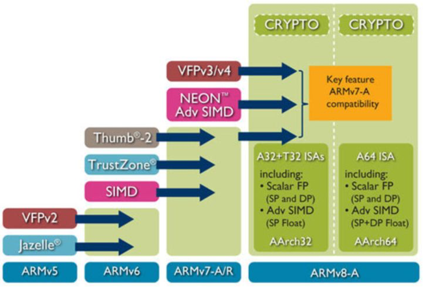

# 第一章 ARM内核与架构

任何一款ARM芯片都由两大部分组成：ARM内核，外设。
* **ARM内核**： 包括了寄存器组、指令集、总线、存储器映射规则、中断逻辑和调试组件等。 内核是由ARM公司设计并以销售方式授权给个芯片厂商使用的（ARM公司本身不做芯片）。 比如为高速度设计的Cortex A8、A9都是ARMv7a 架构;Cortex M3、M4是ARMv7m架构;**前者是处理器（就是内核），后者是指令集的架构（也简称架构）。**
* **外设部分** 包括计时器、A/D转换器、存储器、i2c、UART、SPI、ROM...等等，则完全由各芯片厂商自己设计并与ARM内核衔接配套。不同的芯片厂商就有不同的外设，因此构成了数量和规格庞大的ARM芯片产业。

**ARM指令集架构**

* 指令集的设计是处理器结构中最重要的一个部分，用ARM的术语称之为ISA（Instruction Set Architecture）。
* 指令集可以说是cpu设计的灵魂，是打开CPU这个潘多拉魔盒的咒语，要想使用cpu，我们只能通过这些指令来操作cpu。
* 对于32位的cpu，这些指令就是一个个32位的01的序列，不同的值就代表了不同的机器指令，cpu的硬件能完美的解析并执行这些指令，比如寻址、运算、异常处理等等。
* 当我们用手机玩着王者荣耀的时候，要知道我们的每发的一招，其实最终都是被翻译成了一系列机器指令。
* 从1985年ARMv1架构诞生起，到2011年，ARM架构已经发展到了第八代ARMv8。
* Cortex-A32/35/53/57/72/73/77/78采用的都是ARMv8架构，这是ARM公司的首款支持64位指令集的处理器架构。

**ARM11之前的处理器和指令集架构**

ARM11芯片之前，每一个芯片对应的架构关系如下：

**ARM11之后处理器和指令集架构**

ARM11芯片之后，也就是从ARMv7架构开始，ARM的命名方式有所改变。新的处理器家族，改以Cortex命名，并分为三个系列，分别是Cortex-A，Cortex-R，Cortex-M。很巧合，又是这三个字母**A、R、M**。

**Cortex-A系列（A：Application）**

针对日益增长的消费娱乐和无线产品设计，用于具有高计算要求、运行丰富操作系统及提供交互媒体和图形体验的应用领域，如智能手机、平板电脑、汽车娱乐系统、数字电视，智能本、电子阅读器、家用网络、家用网关和其他各种产品。

**Cortex-R系列 （R：Real-time）**

针对需要运行实时操作的系统应用，面向如汽车制动系统、动力传动解决方案、大容量存储控制器等深层嵌入式实时应用。

**Cortex-M系列（M：Microcontroller）**

该系列面向微控制器领域，主要针对成本和功耗敏感的应用，如智能测量、人机接口设备、汽车和工业控制系统、家用电器、消费性产品和医疗器械等。

**Cortex-SC系列（SC：SecurCore）**

其实，除了上述三大系列之外，还有一个主打安全的Cortex-SC系列（SC：SecurCore），主要用于政府安全芯片。

* Cortex-A53、Cortex-A57两款处理器属于Cortex-A50系列，首次采用64位ARMv8架构。
* ARM11系列包括了ARM11MPCore处理器、ARM1176处理器、ARM1156处理器、ARM1136处理器，它们是基于ARMv6架构。ARM Cortex-A5处理器、Cortex-A7处理器、Cortex-A8处理器、Cortex-A9处理器、Cortex-A15处理器隶属于Cortex-A系列，基于ARMv7-A架构。
* 2020年ARM最近发布了一款全新的CPU架构Cortex-A78，是基于ARMv8.2指令集。
