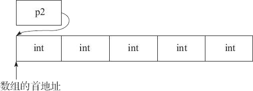
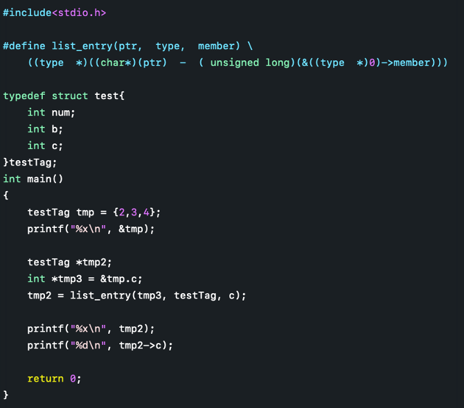

# 第二章 嵌入式开发基础

## C语言常用技巧

### uml 关系
```
【泛化】
    - 关系：指定了子类如何特化父类的所有特征和行为
    - 代码：继承
    - 箭头：三角、空心、实线，指向父类
【实现】
    - 关系：类与接口的关系，表示类是接口所有特征和行为的实现
    - 代码：类接口
    - 箭头：三角、空心、虚线，指向接口
【依赖】
    - 关系：是一种使用的关系，即一个类的实现需要另一个类的协助，弱关联，短期相关
    - 代码：形参、临时变量等
    - 箭头：三角、实心、虚线，指向被依赖
【关联】
    - 关系：是一种拥有的关系，它使一个类知道另一个类的属性和方法，可单向可双向，
            长期相关需要重点关注，是长期的，因此以成员变量的形式存在
    - 代码：成员变量
    - 箭头：三角、实心、实线，指向被拥有者
【聚合】
    - 关系：整体与部分的关系，部分可以离开整体单独存在，是一种强的关联关系；
            关联和聚合在语法上无法区分，必须考察具体的逻辑关系。
            例如雁群和大雁的关系、学校和学生之间的关系
    - 代码：成员变量
    - 箭头：菱形、空心、实线，指向整体
【组合】
    - 关系：整体与部分的关系，但部分不能离开整体而单独存在，是一种更强的关联关系
            例如大雁和大雁的翅膀是组合关系。
    - 代码：成员变量
    - 箭头：菱形、实心、实线，指向整体

耦合强弱： 组合 > 聚合 > 关联 > 依赖
```

### 关于#和##
在C语言的宏中，#的功能是将其后面的宏参数进行字符串化操作（Stringfication），简单
说就是在对它所引用的宏变量通过替换后在其左右各加上一个双引号。例如：
```c
#define WARN_IF(EXP) \
do{ \
    if (EXP) \
    fprintf(stderr, "Warning: " #EXP "\n"); \
}while(0)
```
那么实际使用中会出现下面所示的替换过程：
```c
WARN_IF (divider == 0);
```
被替换为
```c
do {
  if (divider == 0)
  fprintf(stderr, "Warning" "divider == 0" "\n");
} while(0);
```
这样每次divider（除数）为0的时候便会在标准错误流上输出一个提示信息。

而##被称为连接符（concatenator），用来将两个Token连接为一个Token。注意这里连接的
对象是Token就行，而不一定是宏的变量。比如你要做一个菜单项命令名和函数指针组成的
结构体的数组，并且希望在函数名和菜单项命令名之间有直观的、名字上的关系。那么下面
的代码就非常实用：
```c
struct command
{
  char *name;
  void (*function) (void);
};
#define COMMAND(NAME)   { NAME, NAME ## _command }
// 这里NAME##_command 里的NAME会被替换为给定变量的名字，而不是值
// 然后你就用一些预先定义好的命令来方便的初始化一个command结构的数组了：
struct command commands[] = {
  COMMAND(quit),
  COMMAND(help),
  ...
}
```
COMMAND宏在这里充当一个代码生成器的作用，这样可以在一定程度上减少代码密度，间接地
也可以减少不留心所造成的错误。我们还可以n个##符号连接 n+1个Token，这个特性也是
`#`符号所不具备的。比如：
```c
#define LINK_MULTIPLE(a,b,c,d) a##_##b##_##c##_##d
typedef  struct  _record_type  LINK_MULTIPLE(name,company,position,salary);
// 这里这个语句将展开为：
// typedef  struct  _record_type  name_company_position_salary;
```

### 变参列表

可变参数列表是通过宏来实现的，这些宏定义于 stdarg.h 头文件，他是标准库的一部分。
这个头文件声明了一个类型 vs_list 和三个宏： va_start 、 va_arg 和 va_end 。我们
可以声明一个类型为 va_list 的变量，与这几个宏配合使用，访问参数的值。
```c
/*
 * 计算指定数量的数据的平均值
 */
#include <stdarg.h>

float average(int n_values, ...) {
    va_list var_arg;
    int sum;
    int count;

    // 准备访问可变参数
    va_start(var_arg, n_values);

    // 添加取自可变参数列表的值
    for(count = 0; count < n_values; count++) {
        sum += va_arg(var_arg, int);
    }

    // 完成处理可变参数
    va_end(var_arg);

    return sum / n_values;
}

int main(int argc, char *argv)
{
    printf("average is: %d \n", average(1, 2, 3));
}
```
注意参数列表中的省略号，他提示此处可能传递数量和类型未知的参数。

在函数中声明了一个名为 var_arg 的变量，它用于访问参数列表的未确定部分。这个变量
通过 va_start 来初始化，它的第一个参数是 va_lista 变量的名字（即程序中的var_arg），
第二个参数是省略号前最后一个有名字的参数。初始化过程把 var_arg 变量设置为指向可变
参数部分的第一个参数（n_values）。

|栈底|
|--|
|…|
|param3|
|param2|
|param1 (n_values)|
|var_arg|
|栈顶|

为了访问参数，需要使用 va_arg，这个宏接受两个参数： va_list 变量和参数列表当前
参数的类型。在有些函数中可能要通过前面获得的数据来判断当前参数的类型（例如，
printf检查格式字符串中的字符来判断他需要打印的参数类型），va_arg 返回这个参数的
值，并使 var_arg 指向下一个可变参数。

最后，当访问完毕最后一个可变参数之后，需要调用va_end。

### 变参宏

**`标识符 __VA_ARGS__`**

`__VA_ARGS__` 是在 C99 中增加的新特性。虽然 C89 引入了一种标准机制，允许定义具有
可变数量参数的函数，但是 C89 中不允许这种定义可变数量参数的方式出现在宏定义中。
C99 中加入了 `__VA_ARGS__` 关键字，用于支持在宏定义中定义可变数量参数，用于接收
`...`传递的多个参数。

`__VA_ARGS__` 只能出现在使用了省略号的像函数一样的宏定义里。例如:
```
#define myprintf(...) fprintf(stderr, `__VA_ARGS__`)。
```

**带 ‘#’ 的标识符 `#__VA_ARGS__`**
预处理标记 ‘#’ 用于将宏定义参数转化为字符串，因此 #__VA_ARGS__ 会被展开为参数列表
对应的字符串。

示例：
```c
#define showlist(...) put(#__VA_ARGS__)

// 测试如下：
showlist(The first, second, and third items.);
showlist(arg1, arg2, arg3);

// 输出结果分别为：
// The first, second, and third items.
// arg1, arg2, arg3
```

**带 ‘##’ 的标识符 `##__VA_ARGS__`**

`##__VA_ARGS__` 是 GNU 特性，不是 C99 标准的一部分，C 标准不建议这样使用，但目前
已经被大部分编译器支持。

标识符 `##__VA_ARGS__` 的意义来自 ‘##’，主要为了解决一下应用场景：
```c
#define myprintf_a(fmt, ...) printf(fmt, __VA_ARGS__)
#define myprintf_b(fmt, ...) printf(fmt, ##__VA_ARGS__)
```

应用：
```c
myprintf_a("hello");
myprintf_b("hello");

myprintf_a("hello: %s", "world");
myprintf_b("hello: %s", "world");
```
这个时候，编译器会报错，如下所示：
```c
applications\main.c: In function 'main':
applications\main.c:26:57: error: expected expression before ')' to-ken
 #define myprintf_a(fmt, ...) printf(fmt, __VA_ARGS__)
                                                         ^
applications\main.c:36:5: note: in expansion of macro 'myprintf_a'
     myprintf_a("hello");
```
为什么呢？
我们展开 myprintf_a("hello"); 之后为 printf("hello",)。因为没有不定参，所以，
`__VA_ARGS__` 展开为空白字符，这个时候，printf 函数中就多了一个 ‘,’（逗号），
导致编译报错。而 `##__VA_ARGS__` 在展开的时候，因为 ‘##’ 找不到连接对象，会将
‘##’之前的空白字符和‘,’（逗号）删除，这个时候printf函数就没有了多余的‘,’（逗号）。

### main函数入参
```c
// main函数入参有两种写法：
int main (int argc, char *argv[])
// [ ] 的优先级高于 *，这样第二个参数可以解释为定义了一个数组，该数组中的所有元素
// 都是指向C风格字符串的指针（即 char *）。

// 另一种写法：
int main (int argc, char **argv)
```

### C 语言中的constructor与destructor

可以给一个函数赋予constructor或destructor，其中constructor在main开始运行之前被
调用，destructor在main函数结束后被调用。如果有多个constructor或destructor，可以
给每个constructor或destructor赋予优先级，对于constructor，优先级数值越小，运行
越早。destructor则相反。

例如：
```c
#include <stdio.h>

__attribute__((constructor(101))) void foo()
{
    printf("in constructor of foo\n");
}
__attribute__((constructor(102))) void foo1()
{
    printf("in constructor of foo1\n");
}
__attribute__((destructor)) void bar()
{
    printf("in constructor of bar\n");
}

int main()
{
        printf("in main\n");
        return 0;
}
```
其中constructor后边括号中为优先级，也可以不指定优先级。

### `__FUNCTION__` `__func__`等
```c
__FUNCTION__： 当前函数名

__func__：当前函数名

__PRETTY_FUNCTION__： 非标准宏。这个宏比__FUNCTION__功能更强,  若用g++编译C++程
序, __FUNCTION__只能输出类的成员名,不会输出类名;而__PRETTY_FUNCTION__则会以
<return-type>  <class-name>::<member-function-name>(<parameters-list>) 的格式
输出成员函数的详悉信息(注: 只会输出parameters-list的形参类型, 而不会输出形参名).
若用gcc编译C程序,__PRETTY_FUNCTION__跟__FUNCTION__的功能相同。

__LINE__：当前程序行的行号，表示为十进制整型常量，#line指令可以改变它的值。
                  例如： #line  200 指定下一行的__LINE__为200,重点是line的下一行是200

__FILE__：当前源文件名，表示字符串型常量

__DATE__：转换的日历日期，表示为Mmm dd yyyy 形式的字符串常量，Mmm是由asctime产生的。

__TIME__：转换的时间，表示"hh:mm:ss"形式的字符串型常量，是由asctime产生的。

__SIZEOF_POINTER__：当前平台指针的byte数

__WORDSIZE： 这个好像针对嵌入式平台

__SIZEOF_INT__
__SIZEOF_LONG__
__SIZEOF_LONG_LONG__
__SIZEOF_SHORT__
__SIZEOF_POINTER__
__SIZEOF_FLOAT__
__SIZEOF_DOUBLE__
__SIZEOF_LONG_DOUBLE__
__SIZEOF_SIZE_T__
__SIZEOF_WCHAR_T__
__SIZEOF_WINT_T__
__SIZEOF_PTRDIFF_T__
__GNUC__ 、__GNUC_MINOR__ 、__GNUC_PATCHLEVEL__分别代表gcc的主版本号，次版本号，修正版本号
```
更多宏定义可以参考：
[3.7.2 Common Predefined Macros](https://gcc.gnu.org/onlinedocs/cpp/Common-Predefined-Macros.html)

### do{}while(0)
为了保证宏定义的使用者能无编译错误地使用宏，可以考虑使用 do{}while(0)的形式。

### 数组和指针

1. 编译器为每个变量分配一个地址（左值）。这个地址在编译时可知，而且该变量在运行
时一直保存于这个地址。相反，存储与变量中的值（他的右值）只有在运行时才可知。所以
定义一个数组，例如：int num[5]; 。这时候num跟一个地址绑定在一起，如果编译器需要
一个地址（可能还要加上偏移量）来执行某种操作，他就可以直接进行操作，不需要增加
指令首先取得具体的地址。相反，对于指针，必须首先在运行时取得他的当前值，然后才能
对他进行解除引用操作。
2. 在表达式中，指针和数组是可以互换的，因为他们在编译器里的最终形式都是指针，并且
都可以进行取下标操作。
3. C语言把数组下标作为指针的偏移量。
4. 在函数参数的声明中，数组名被编译器当作指向该数组第一个元素的指针。编译器只向
函数传递数组的地址，而不是整个数组的拷贝。

### 数组指针和指针数组
```c
int *p1[5]； // 指针数组
int (*p2)[5]； // 数组指针
```
首先，对于语句`int*p1[5]`，因为“[]”的优先级要比`*`要高，所以 p1 先与“[]”结合，构成
一个数组的定义，数组名为 p1，而“int*”修饰的是数组的内容，即数组的每个元素。也就是说，
该数组包含 5 个指向 int 类型数据的指针


其次，对于语句`int(*p2)[5]`，“()”的优先级比“[]”高，`*`号和 p2 构成一个指针的定义，
指针变量名为 p2，而 int 修饰的是数组的内容，即数组的每个元素。也就是说，p2 是一个
指针，它指向一个包含 5 个 int 类型数据的数组。很显然，它是一个数组指针，数组在这里
并没有名字，是个匿名数组。


由此可见，对指针数组来说，首先它是一个数组，数组的元素都是指针，也就是说该数组存储
的是指针，数组占多少个字节由数组本身决定；而对数组指针来说，首先它是一个指针，它指
向一个数组，也就是说它是指向数组的指针，在 32 位系统下永远占 4 字节，至于它指向的
数组占多少字节，这个不能够确定，要看具体情况。

分析一个bug：
```c
int arr[5]={1，2，3，4，5};
int (*p1)[5] = &arr;
/*下面是错误的*/
int (*p2)[5] = arr;
```
不难看出，在上面的示例代码中，&arr 是指整个数组的首地址，而 arr 是指数组首元素的
首地址，虽然所表示的意义不同，但二者之间的值却是相同的。那么问题出来了，既然值是
相同的，为什么语句`int(*p1)[5]=&arr`是正确的，而语句`int(*p2)[5]=arr`却在有些编译
器下运行时会提示错误信息呢（如在 Microsoft Visual Studio 2010 中提示的错误信息为
“a value of type"int*"cannot be used to initialize an entity of type"int(*)[5]"”）？

其实原因很简单，在 C 语言中，赋值符号“=”号两边的数据类型必须是相同的，如果不同，
则需要显示或隐式类型转换。在这里，p1 和 p2 都是数组指针，指向的是整个数组。p1
这个定义的“=”号两边的数据类型完全一致，而 p2 这个定义的“=”号两边的数据类型就不
一致了（左边的类型是指向整个数组的指针，而右边的数据类型是指向单个字符的指针），
因此会提示错误信息。


### const
```c
int *pi;    普通指针
int const *pci; 可以修改指针指向的地址，但是不能修改指针指向的值。值是常量
等价于 const int *cpi;    被称为常量指针（底层），指针指向的内容不能更改。
int * const cpi;  可以修改指针指向的值，但不能修改指针指向的地址，指针是常量
被称为指针常量（顶层），指针指向的地址不能更改。
int const * const cpci;  指针的值和指针指向的值均不能修改，指针和值都是常量

注意：当用实参初始化函数形参时会忽略掉顶层const（值是常量）。换句话说，形参的顶层
const被忽略掉了。当形参有顶层const时，传给它常量对象或者非常量对象都是可以的。这就
导致下边两个定义是一样的，因为顶层const被忽略掉了。
void fcn(const int i){…}
void fcn(int i){…}
```

### 友元
友元函和友元类统称为友元（friend）。

借助友元，可以使得普通函数或其他类中的成员函数可以访问某个类的私有成员和保护成员。

友元函数：普通函数可以访问某个类私有成员或保护成员。需要在类A中声明友元函数
友元类：类A中的成员函数可以访问类B中的私有或保护成员。需要在类B中声明友元类

友元函数的声明格式如下：
`friend 类型 函数名(形参);`

友元类的所有成员函数都是另一个类的友元函数，都可以访问另一个类中的保护成员和私有
成员。声明友元类的格式如下：
`friend class 类名;`

类CB是类CA的友元类，可以直接访问类CA的私有成员。这需要在类CA中声明友元类：`friend class CB`

使用友元类时，需要注意：
- 友元关系不能被继承；
- 友元关系是单向的，不具有交换性。即类B是类A的友元，则类A不一定是类B的友元，需要
  看类中是否有相应的声明；
- 友元关系不具有传递性。即类B是类A的友元，类C是类B的友元，但类C不一定是类A的友元，
  需要看类中是否有相应的声明。
- 友元的声明只能出现在类定义的内部，但是在类内出现的具体位置不限。友元不是类的
  成员，也不受他所在区域访问控制级别的约束。

另外，使用一般不建议把整个类声明为友元类，而只将某些成员函数声明为友元函数，这样
更安全些。

另外，类还可以把其他的类定义为友元，也可以把其他类（之前已经定义过的）的成员函数
定义为友元。此外，友元函数能定义在类的内部，这样的函数是隐式的。

### 单引号和双引号

用单引号括起的一个字符代表一个整数，整数值对应于该字符在编译器采用的字符集中的
序列值。因此，对于采用ASCII字符集的编译器而言，‘a’的含义与0141（八进制）或者97
（十进制）严格一致。

用双引号括起的一个字符代表一个指向无名数组起始字符的指针，该数组被双引号之间的
字符以及一个额外的二进制值为零的字符‘\0’初始化。
因此如下的语句时错误的，因为单引号括起来的是一个整数，而不是char指针：
char *slash = ‘/’;

### 使用 0(NULL)

ANSIC标准允许值为0的常量被强制转换成任何一种类型的指针，并且转换的结果是个NULL，
因此((type *)0)的结果就是一个类型为type *的NULL指针。
如果利用这个NULL指针来访问type的成员当然是非法的，但typeof( ((type *)0)->member)
是想取该成员的类型，所有编译器不会生成访问type成员的代码，类似的代码
&(((type *)0)->member )在最前面有个取地址符&，它的意图是想取member的地址，所以
编译器同样会优化为直接取地址。

如下宏是根据结构体成员获取结构体地址：
```c
#define list_entry(ptr,  type,  member) \
    ((type  *)((char*)(ptr)  -  ( unsigned long)(&((type  *)0)->member)))
```



### 判断大端小端

大端：数据高位在低地址，低位在高地址
小端：数据地位在低地址，高位在高地址
Linux和mac默认栈从低地址向高地址增长
判断大小端的代码：
```c
#include <stdio.h>
int main() {
    int i = 0x11223344;
    char *p;

    p = (char *) &i;
    if (*p == 0x44) {
        printf("Little endian\n");
    }
    else {
        printf("Big endian\n");
    }
    return 0;
}
```

### C语言结构体对齐规则

1. 每个成员的偏移量（Offset）必须是其自身大小（Size）的整数倍：这意味着一个成员
   的起始地址必须是它自身大小的整数倍。例如，一个4字节大小的整数通常必须从4字节
   对齐的地址开始存储。
2. 结构体的总大小（Size）必须是最大成员大小的整数倍：结构体的大小必须足够大，以
   容纳其最大的成员，且必须是最大成员大小的整数倍。这确保了结构体在内存中的布局
   是紧凑的。
3. 结构体成员的顺序保持不变：C语言规定结构体成员的顺序是按照它们在声明中出现的
   顺序进行排列的，不会重新排序。

`#pragma pack(N)`每个特定平台上的编译器都有自己的默认“对齐系数”(也叫对齐模数)。
程序员可以通过预编译命令#pragma pack(n)，n=1,2,4,8,16来改变这一系数，其中的n就是
你要指定的“对齐系数”。

位域也是同理，每个位域会尽可能排列到一个对齐单元中（例如x86默认4byt对齐），但如果
当前对齐单元剩下的空间不够一个新的位域使用时，会将这个新的位域从下一个对齐单元开始
存放

注意这里的`#pragma pack(N)`不能保证位域定义中没有空隙，如果想没有空隙就要使用
`packed`属性


### `__attribute__((packed))` 和 `__attribute__((aligned(4)))`

packed 在用在结构体里时，指的是所有元素紧密排列，不进行填充

aligned(4) 在用在结构体里时，指的是结构体存放的起始地址是4字节对齐的，自然结构体
也占4字节对齐的内存空间

## C/C++程序编译过程

整个代码的编译过程分为编译和链接两个过程，编译对应图中的大括号括起的部分，其余则为
链接过程。

### 编译过程

编译过程又可以分成两个阶段：编译和汇编。

#### 编译

编译是读取源程序（字符流），对之进行词法和语法的分析，将高级语言指令转换为功能等效
的汇编代码，源文件的编译过程包含两个主要阶段：

**编译预处理**

读取c源程序，对其中的伪指令（以# 开头的指令）和特殊符号进行处理。
伪指令主要包括以下四个方面：
1. 宏定义指令，如# define Name TokenString，# undef等。
对于前一个伪指令，预编译所要做的是将程序中的所有Name用TokenString替换，但作为字符串
常量的 Name则不被替换。对于后者，则将取消对某个宏的定义，使以后该串的出现不再被替换。
2. 条件编译指令，如# ifdef，# ifndef，# else，# elif，# endif等。
这些伪指令的引入使得程序员可以通过定义不同的宏来决定编译程序对哪些代码进行处理。
预编译程序将根据有关的文件，将那些不必要的代码过滤掉。
3. 头文件包含指令，如# include "FileName" 或者`# include < FileName>`等。
在头文件中一般用伪指令# define定义了大量的宏（最常见的是字符常量），同时包含有各种
外部符号的声明。
采用头文件的目的主要是为了使某些定义可以供多个不同的C源程序使用。因为在需要用到
这些定义的C源程序中，只需加上一条# include语句即可，而不必再在此文件中将这些定义
重复一遍。预编译程序将把头文件中的定义统统都加入到它所产生的输出文件中，以供编译
程序对之进行处理。
包含到c源程序中的头文件可以是系统提供的，这些头文件一般被放在/ usr/ include目录下。
在程序中# include它们要使用尖括号`< >`。另外开发人员也可以定义自己的头文件，这些
文件一般与c源程序放在同一目录下，此时在# include中要用双引号（""）。
4. 特殊符号，预编译程序可以识别一些特殊的符号。
例如在源程序中出现的__LINE__标识将被解释为当前行号（十进制数），`__FILE__`则被
解释为当前被编译的C源程序的名称。预编译程序对于在源程序中出现的这些串将用合适的
值进行替换。
预编译程序所完成的基本上是对源程序的“替代”工作。经过此种替代，生成一个没有宏定义、
没有条件编译指令、没有特殊符号的输出文件。这个文件的含义同没有经过预处理的源文件是
相同的，但内容有所不同。下一步，此输出文件将作为编译程序的输入而被翻译成为机器指令。

**编译、优化阶段**

经过预编译得到的输出文件中，只有常量；如数字、字符串、变量的定义，以及C语言的关键字，
如main, if , else , for , while , { , } , + , - , * , \ 等等。

*编译程序*所要作得工作就是通过词法分析和语法分析，在确认所有的指令都符合语法规则之后，
将其翻译成等价的中间代码表示或汇编代码。

*优化处理*是编译系统中一项比较艰深的技术。它涉及到的问题不仅同编译技术本身有关，
而且同机器的硬件环境也有很大的关系。优化一部分是对中间代码的优化。这种优化不依赖于
具体的计算机。另一种优化则主要针对目标代码的生成而进行的。

对于前一种优化，主要的工作是删除公共表达式、循环优化（代码外提、强度削弱、变换循环
控制条件、已知量的合并等）、复写传播，以及无用赋值的删除，等等。

后一种类型的优化同机器的硬件结构密切相关，最主要的是考虑是如何充分利用机器的各个
硬件寄存器存放有关变量的值，以减少对于内存的访问次数。另外，如何根据机器硬件执行
指令的特点（如流水线、RISC、CISC、VLIW等）而对指令进行一些调整使目标代码比较短，
执行的效率比较高，也是一个重要的研究课题。

经过优化得到的汇编代码必须经过汇编程序的汇编转换成相应的机器指令，方可能被机器执行。

#### 汇编

汇编过程实际上指把汇编语言代码翻译成目标机器指令的过程。对于被翻译系统处理的每一个
C语言源程序，都将最终经过这一处理而得到相应的目标文件。目标文件中所存放的也就是与
源程序等效的目标的机器语言代码。
目标文件由段组成。通常一个目标文件中至少有两个段：
1. 代码段：该段中所包含的主要是程序的指令。该段一般是可读和可执行的，但一般却不可写。
2. 数据段：主要存放程序中要用到的各种全局变量或静态的数据。一般数据段都是可读，可写，可执行的。

UNIX环境下主要有三种类型的目标文件：
1. 可重定位文件
其中包含有适合与其它目标文件链接来创建一个可执行的或者共享的目标文件的代码和数据。
通过指令 readelf -S 可以发现，可重定位文件会多一个.rel.text段。通过指令 readelf -r
可以读取重定义表。
2. 共享的目标文件
   这种文件存放了适合于在两种上下文里链接的代码和数据。
   第一种是链接程序可把它与其它可重定位文件及共享的目标文件一起处理来创建另一个目标文件；
   第二种是动态链接程序将它与另一个可执行文件及其它的共享目标文件结合到一起，创建一个进程映象。
3. 可执行文件
它包含了一个可以被操作系统创建一个进程来执行之的文件。
汇编程序生成的实际上是第一种类型的目标文件。对于后两种还需要其他的一些处理方能得到，
这个就是链接程序的工作了。

### 链接过程

由汇编程序生成的目标文件并不能立即就被执行，其中可能还有许多没有解决的问题。
例如，某个源文件中的函数可能引用了另一个源文件中定义的某个符号（如变量或者函数调用
等）；在程序中可能调用了某个库文件中的函数，等等。所有的这些问题，都需要经链接程序的
处理方能得以解决。

链接程序的主要工作就是将有关的目标文件彼此相连接，也即将在一个文件中引用的符号同
该符号在另外一个文件中的定义连接起来，使得所有的这些目标文件成为一个能够被操作系统
装入执行的统一整体。

根据开发人员指定的同库函数的链接方式的不同，链接处理可分为两种：
1. 静态链接
在这种链接方式下，函数的代码将从其所在的静态链接库中被拷贝到最终的可执行程序中。
这样该程序在被执行时这些代码将被装入到该进程的虚拟地址空间中。**静态链接库实际上
是一个目标文件的集合**，其中的每个文件含有库中的一个或者一组相关函数的代码。
2. 动态链接
在此种方式下，函数的代码被放到称作是动态链接库或共享对象的某个目标文件中。链接
程序此时所作的只是在最终的可执行程序中记录下共享对象的名字以及其它少量的登记信息。
在此可执行文件被执行时，动态链接库的全部内容将被映射到运行时相应进程的虚地址空间。
动态链接程序将根据可执行程序中记录的信息找到相应的函数代码。
对于可执行文件中的函数调用，可分别采用动态链接或静态链接的方法。使用动态链接能够
使最终的可执行文件比较短小，并且当共享对象被多个进程使用时能节约一些内存，因为在
内存中只需要保存一份此共享对象的代码。但并不是使用动态链接就一定比使用静态链接要
优越。在某些情况下动态链接可能带来一些性能上损害。

### GCC的编译链接

我们在linux使用的gcc编译器便是把以上的几个过程进行捆绑，使用户只使用一次命令就把
编译工作完成，这的确方便了编译工作，但对于初学者了解编译过程就很不利了，下图便是
gcc代理的编译过程：

从上图可以看到：
1. 预编译
   * 将.c 文件转化成 .i文件
   * 使用的gcc命令是：gcc –E
   * 对应于预处理命令cpp
2. 编译
   * 将.c/.h文件转换成.s文件
   * 使用的gcc命令是：gcc –S
   * 对应于编译命令 cc –S
3. 汇编
   * 将.s 文件转化成 .o文件
   * 使用的gcc 命令是：gcc –c
   * 对应于汇编命令是 as
4. 链接
   * 将.o文件转化成可执行程序
   * 对应于链接命令是 ld
   * 使用的gcc 命令是： gcc

总结起来编译过程就上面的四个过程：
预编译处理(.c) －－> 编译、优化程序（.s、.asm）－－> 汇编程序(.obj、.o、.a、.ko)
－－> 链接程序（.exe、.elf、.axf等）。

参考博客：
[C/C++程序编译过程详解 ](https://www.cnblogs.com/mickole/articles/3659112.html)
在博客后半部分有对C++的编译说明，与C大致类似，但有差异

## ELF文件

ELF文件参考资料：  
[ELF文件格式解析](https://blog.csdn.net/feglass/article/details/51469511)  
[ELF文件格式, ELF文件是什么，里面包含什么内容](https://blog.csdn.net/liugaigai427/article/details/86742062)  
[Linux[ELF]: ELF文件结构简单梳理](https://www.jianshu.com/p/dd5aec5826da)  
[ELF格式文件（非常详细）](https://blog.csdn.net/weixin_44316996/article/details/107396385?utm_medium=distribute.pc_relevant.none-task-blog-BlogCommendFromBaidu-1.control&depth_1-utm_source=distribute.pc_relevant.none-task-blog-BlogCommendFromBaidu-1.control)

ELF文件(B站视频  推荐 已下载在当前目录下：elf文件及符号表解析)：  
[ELF文件装载和符号表解析](https://www.bilibili.com/video/BV1e54y1d74j?from=search&seid=157787288945585334)  
该up主有好多相关视频，可以关注：  
[南京大学-计算机系统基础-PA](https://space.bilibili.com/284613991/channel/detail?cid=103368)

### 原理介绍

**可重定位文件（Relocatable File）** 包含适合于与其他目标文件链接来创建可执行文件
或者共享目标文件的代码和数据。

**可执行文件（Executable File）** 包含适合于执行的一个程序，此文件规定了 exec() 
如何创建一个程序的进程映像。

**共享目标文件（Shared Object File）** 包含可在两种上下文中链接的代码和数据。首先
链接编辑器可以将它和其它可重定位文件和共享目标文件一起处理，生成另外一个目标文件。
其次，动态链接器（Dynamic Linker）可能将它与某个可执行文件以及其它共享目标一起组合，
创建进程映像。

**readelf -l < elf文件>可以查询elf程序头表信息：**

MemSiz可能比FileSiz大，这一般是由于存在定义未初始化的全局变量(.bss)引入的，这样的
话多出来的空前全都需要初始化为0。


**readelf -S < elf文件>可以查询elf程序头表信息：**


### 组织结构


```
          linkable                               executable
          sections                               segments
                     +----------------------+
                     |       ELF header     |
                     +----------------------+
(optional, ignored)  | program header table | ------+   describes segments
                     +----------------------+       |
            +------> |_  _  _  _  _  _  _  _|       |
            |------> |_  _  _  _  _  _  _  _| <-----+
            |------> |______________________|       |    segments
sections    |------> |_  _  _  _  _  _  _  _| <-----+
            |------> |______________________|       |
            |------> |______________________|       |
            |------> |______________________| <-----+
describes   +------- | section header table |            (optional, ignored)
sections             +----------------------+
```

ELF Header: 文件开始处是ELF Header，它包含了描述整个文件的基本属性和整个文件的组织，
比如ELF文件版本、目标机器型号、程序入口地址等

节区部分包含链接视图的大量信息：指令、数据、符号表、重定位信息等等。

Program Header Table: 程序头表，如果存在的话，告诉系统如何创建进程映像。用来构造
进程映像的目标文件必须具有程序头部表，可重定位文件不需要这个表。

Section Heade Table: 节区头表，包含了描述文件节区的信息，每个节区在表中都有一项，
每一项给出诸如节区名称、节区大小、在文件中的偏移、读写权限等信息。用于链接的目标
文件必须包含节区头部表，其他目标文件可以有，也可以没有这个表。

注意：尽管图中显示的各个组成部分是有顺序的，实际上除了 ELF 头部表以外，其他节区
和段都没有规定的顺序。

#### ELF 头

**readelf -h < elf文件>可以查询elf头信息：**


网上的一张图，有别的相关注释，留作记录：


```
$ readelf -h hello

ELF Header:
  Magic:   7f 45 4c 46 02 01 01 00 00 00 00 00 00 00 00 00
  Class:                             ELF64
  Data:                              2's complement, little endian
  Version:                           1 (current)
  OS/ABI:                            UNIX - System V
  ABI Version:                       0
  Type:                              DYN (Position-Independent Executable file)
  Machine:                           Advanced Micro Devices X86-64
  Version:                           0x1
  Entry point address:               0x1060
  Start of program headers:          64 (bytes into file)
  Start of section headers:          14632 (bytes into file)
  Flags:                             0x0
  Size of this header:               64 (bytes)
  Size of program headers:           56 (bytes)
  Number of program headers:         13
  Size of section headers:           64 (bytes)
  Number of section headers:         37
  Section header string table index: 36
```

elf 的文件头中定义了elf魔数、文件机器字节长度、数据存储方式、版本、运行平台、
ABI版本、ELF重定位类型、硬件平台、硬件平台版本、入口地址、程序头表和节头表的
入口/size/数量、ELF头的size等。

elf文件头结构及相关常数被定义在 "/usr/include/elf.h" 里，Elf32_Ehdr和Elf64_Ehdr
对应32位平台和64位平台，其内容是一样的，只是有些成员的大小不一样

##### ELF 魔数

```
  Magic:   7f 45 4c 46 02 01 01 00 00 00 00 00 00 00 00 00
```

最开始的四个字节是所有 ELF 文件都必须相同的标识码，分别是0x7F、0x45、0x4c、0x46，
第一个字节对应ASCII字符串里面的DEL控制符，后面三个字符刚好是ELF的ASCII码。这4个
字节也被称为ELF文件的魔数，几乎所有的可执行文件格式的最开始的几个字节都是魔数。
这种魔数用来确认文件的类型，操作系统在加载可执行文件的时候会确认模数是否正确，
如果不正确会拒绝加载。

第5个字节是用来标识文件类型的，0x01标识32位文件，0x02标识64位文件；第6个字节是
字节序，规定该ELF文件是大端的还是小端的；第7个字节规定ELF文件的主版本号，一般是1，
因为ELF标准自1.2版本以后就再也没有更新了。后面的9个字节ELF标准没有定义，一般填0，
有些平台会用这9个字节作为扩展标志。


#### 段表

可以使用`objdump -h`来查看ELF文件中包含的段，但`objdump -h`命令只是把ELF文件中
关键的段显示出来了，而省略了其他的辅助性的段，可以使用`readelf -S`来查看ELF文件
的段，它显示的才是真正的段表结构

readelf -S 打印的各个段的含义见《程序员的自我修养P76表3-7》


`readelf -S hello`
```
There are 37 section headers, starting at offset 0x3928:

Section Headers:
  [Nr] Name              Type             Address           Offset
       Size              EntSize          Flags  Link  Info  Align
  [ 0]                   NULL             0000000000000000  00000000
       0000000000000000  0000000000000000           0     0     0
  [ 1] .interp           PROGBITS         0000000000000318  00000318
       000000000000001c  0000000000000000   A       0     0     1
  [ 2] .note.gnu.pr[...] NOTE             0000000000000338  00000338
       0000000000000030  0000000000000000   A       0     0     8
  [ 3] .note.gnu.bu[...] NOTE             0000000000000368  00000368
       0000000000000024  0000000000000000   A       0     0     4
  [ 4] .note.ABI-tag     NOTE             000000000000038c  0000038c
       0000000000000020  0000000000000000   A       0     0     4
  [ 5] .gnu.hash         GNU_HASH         00000000000003b0  000003b0
       0000000000000024  0000000000000000   A       6     0     8
  [ 6] .dynsym           DYNSYM           00000000000003d8  000003d8
       00000000000000a8  0000000000000018   A       7     1     8
  [ 7] .dynstr           STRTAB           0000000000000480  00000480
       000000000000008d  0000000000000000   A       0     0     1
  [ 8] .gnu.version      VERSYM           000000000000050e  0000050e
       000000000000000e  0000000000000002   A       6     0     2
  [ 9] .gnu.version_r    VERNEED          0000000000000520  00000520
       0000000000000030  0000000000000000   A       7     1     8
  [10] .rela.dyn         RELA             0000000000000550  00000550
       00000000000000c0  0000000000000018   A       6     0     8
  [11] .rela.plt         RELA             0000000000000610  00000610
       0000000000000018  0000000000000018  AI       6    24     8
  [12] .init             PROGBITS         0000000000001000  00001000
       000000000000001b  0000000000000000  AX       0     0     4
  [13] .plt              PROGBITS         0000000000001020  00001020
       0000000000000020  0000000000000010  AX       0     0     16
  [14] .plt.got          PROGBITS         0000000000001040  00001040
       0000000000000010  0000000000000010  AX       0     0     16
  [15] .plt.sec          PROGBITS         0000000000001050  00001050
       0000000000000010  0000000000000010  AX       0     0     16
  [16] .text             PROGBITS         0000000000001060  00001060
       0000000000000107  0000000000000000  AX       0     0     16
  [17] .fini             PROGBITS         0000000000001168  00001168
       000000000000000d  0000000000000000  AX       0     0     4
  [18] .rodata           PROGBITS         0000000000002000  00002000
       0000000000000011  0000000000000000   A       0     0     4
  [19] .eh_frame_hdr     PROGBITS         0000000000002014  00002014
       0000000000000034  0000000000000000   A       0     0     4
  [20] .eh_frame         PROGBITS         0000000000002048  00002048
       00000000000000ac  0000000000000000   A       0     0     8
  [21] .init_array       INIT_ARRAY       0000000000003db8  00002db8
       0000000000000008  0000000000000008  WA       0     0     8
  [22] .fini_array       FINI_ARRAY       0000000000003dc0  00002dc0
       0000000000000008  0000000000000008  WA       0     0     8
  [23] .dynamic          DYNAMIC          0000000000003dc8  00002dc8
       00000000000001f0  0000000000000010  WA       7     0     8
  [24] .got              PROGBITS         0000000000003fb8  00002fb8
       0000000000000048  0000000000000008  WA       0     0     8
  [25] .data             PROGBITS         0000000000004000  00003000
       0000000000000010  0000000000000000  WA       0     0     8
  [26] .bss              NOBITS           0000000000004010  00003010
       0000000000000008  0000000000000000  WA       0     0     1
  [27] .comment          PROGBITS         0000000000000000  00003010
       000000000000002b  0000000000000001  MS       0     0     1
  [28] .debug_aranges    PROGBITS         0000000000000000  0000303b
       0000000000000030  0000000000000000           0     0     1
  [29] .debug_info       PROGBITS         0000000000000000  0000306b
       000000000000008c  0000000000000000           0     0     1
  [30] .debug_abbrev     PROGBITS         0000000000000000  000030f7
       0000000000000043  0000000000000000           0     0     1
  [31] .debug_line       PROGBITS         0000000000000000  0000313a
       0000000000000054  0000000000000000           0     0     1
  [32] .debug_str        PROGBITS         0000000000000000  0000318e
       00000000000000d9  0000000000000001  MS       0     0     1
  [33] .debug_line_str   PROGBITS         0000000000000000  00003267
       0000000000000017  0000000000000001  MS       0     0     1
  [34] .symtab           SYMTAB           0000000000000000  00003280
       0000000000000360  0000000000000018          35    18     8
  [35] .strtab           STRTAB           0000000000000000  000035e0
       00000000000001db  0000000000000000           0     0     1
  [36] .shstrtab         STRTAB           0000000000000000  000037bb
       000000000000016a  0000000000000000           0     0     1
Key to Flags:
  W (write), A (alloc), X (execute), M (merge), S (strings), I (info),
  L (link order), O (extra OS processing required), G (group), T (TLS),
  C (compressed), x (unknown), o (OS specific), E (exclude),
  D (mbind), l (large), p (processor specific)
```

`objdump -h hello`
```
hello:     file format elf64-x86-64

Sections:
Idx Name          Size      VMA               LMA               File off  Algn
  0 .interp       0000001c  0000000000000318  0000000000000318  00000318  2**0
                  CONTENTS, ALLOC, LOAD, READONLY, DATA
  1 .note.gnu.property 00000030  0000000000000338  0000000000000338  00000338  2**3
                  CONTENTS, ALLOC, LOAD, READONLY, DATA
  2 .note.gnu.build-id 00000024  0000000000000368  0000000000000368  00000368  2**2
                  CONTENTS, ALLOC, LOAD, READONLY, DATA
  3 .note.ABI-tag 00000020  000000000000038c  000000000000038c  0000038c  2**2
                  CONTENTS, ALLOC, LOAD, READONLY, DATA
  4 .gnu.hash     00000024  00000000000003b0  00000000000003b0  000003b0  2**3
                  CONTENTS, ALLOC, LOAD, READONLY, DATA
  5 .dynsym       000000a8  00000000000003d8  00000000000003d8  000003d8  2**3
                  CONTENTS, ALLOC, LOAD, READONLY, DATA
  6 .dynstr       0000008d  0000000000000480  0000000000000480  00000480  2**0
                  CONTENTS, ALLOC, LOAD, READONLY, DATA
  7 .gnu.version  0000000e  000000000000050e  000000000000050e  0000050e  2**1
                  CONTENTS, ALLOC, LOAD, READONLY, DATA
  8 .gnu.version_r 00000030  0000000000000520  0000000000000520  00000520  2**3
                  CONTENTS, ALLOC, LOAD, READONLY, DATA
  9 .rela.dyn     000000c0  0000000000000550  0000000000000550  00000550  2**3
                  CONTENTS, ALLOC, LOAD, READONLY, DATA
 10 .rela.plt     00000018  0000000000000610  0000000000000610  00000610  2**3
                  CONTENTS, ALLOC, LOAD, READONLY, DATA
 11 .init         0000001b  0000000000001000  0000000000001000  00001000  2**2
                  CONTENTS, ALLOC, LOAD, READONLY, CODE
 12 .plt          00000020  0000000000001020  0000000000001020  00001020  2**4
                  CONTENTS, ALLOC, LOAD, READONLY, CODE
 13 .plt.got      00000010  0000000000001040  0000000000001040  00001040  2**4
                  CONTENTS, ALLOC, LOAD, READONLY, CODE
 14 .plt.sec      00000010  0000000000001050  0000000000001050  00001050  2**4
                  CONTENTS, ALLOC, LOAD, READONLY, CODE
 15 .text         00000107  0000000000001060  0000000000001060  00001060  2**4
                  CONTENTS, ALLOC, LOAD, READONLY, CODE
 16 .fini         0000000d  0000000000001168  0000000000001168  00001168  2**2
                  CONTENTS, ALLOC, LOAD, READONLY, CODE
 17 .rodata       00000011  0000000000002000  0000000000002000  00002000  2**2
                  CONTENTS, ALLOC, LOAD, READONLY, DATA
 18 .eh_frame_hdr 00000034  0000000000002014  0000000000002014  00002014  2**2
                  CONTENTS, ALLOC, LOAD, READONLY, DATA
 19 .eh_frame     000000ac  0000000000002048  0000000000002048  00002048  2**3
                  CONTENTS, ALLOC, LOAD, READONLY, DATA
 20 .init_array   00000008  0000000000003db8  0000000000003db8  00002db8  2**3
                  CONTENTS, ALLOC, LOAD, DATA
 21 .fini_array   00000008  0000000000003dc0  0000000000003dc0  00002dc0  2**3
                  CONTENTS, ALLOC, LOAD, DATA
 22 .dynamic      000001f0  0000000000003dc8  0000000000003dc8  00002dc8  2**3
                  CONTENTS, ALLOC, LOAD, DATA
 23 .got          00000048  0000000000003fb8  0000000000003fb8  00002fb8  2**3
                  CONTENTS, ALLOC, LOAD, DATA
 24 .data         00000010  0000000000004000  0000000000004000  00003000  2**3
                  CONTENTS, ALLOC, LOAD, DATA
 25 .bss          00000008  0000000000004010  0000000000004010  00003010  2**0
                  ALLOC
 26 .comment      0000002b  0000000000000000  0000000000000000  00003010  2**0
                  CONTENTS, READONLY
 27 .debug_aranges 00000030  0000000000000000  0000000000000000  0000303b  2**0
                  CONTENTS, READONLY, DEBUGGING, OCTETS
 28 .debug_info   0000008c  0000000000000000  0000000000000000  0000306b  2**0
                  CONTENTS, READONLY, DEBUGGING, OCTETS
 29 .debug_abbrev 00000043  0000000000000000  0000000000000000  000030f7  2**0
                  CONTENTS, READONLY, DEBUGGING, OCTETS
 30 .debug_line   00000054  0000000000000000  0000000000000000  0000313a  2**0
                  CONTENTS, READONLY, DEBUGGING, OCTETS
 31 .debug_str    000000d9  0000000000000000  0000000000000000  0000318e  2**0
                  CONTENTS, READONLY, DEBUGGING, OCTETS
 32 .debug_line_str 00000017  0000000000000000  0000000000000000  00003267  2**0
                  CONTENTS, READONLY, DEBUGGING, OCTETS
```

#### 重定位表

对于每个需要重定位的代码段或数据段，都会有一个相应的重定位表，例如：“rel.text”就是
针对“.text”段的重定位表


#### 符号

##### 概念及定义

编程层面
* 符号：函数和变量统称为符号
* 符号名：函数名或变量名就是符号名

elf目标文件层面
* 符号表：每一个目标文件都会有一个相应的符号表，往往对应 .symtab 段
* 符号值：每个定义的符号有一个对应的值，即符号值，对于变量和函数来说，符号值就是他们的地址


分类：
* 当前目标文件中的全局符号，可以被其他目标文件引用
* 当前目标文件引用的全局符号，却没有定义在当前目标文件中，也可以称为外部符号
* 局部符号，这类符号只在编译单元内部可见，例如局部变量或者静态存储的变量等
* 段名，往往由编译器产生，他的值就是该段的起始地址。例如：.text、.data等
* 行号信息，即目标文件指令与源代码中代码行的对应关系，这在调试过程中会使用，是可选的

链接过程中主要关注第一类和第二类

符合的定义如下：
```
typedef struct
{
  Elf32_Word       st_name;         /* Symbol name (string tbl index) */
  Elf32_Addr       st_value;        /* Symbol value */
  Elf32_Word       st_size;         /* Symbol size */
  unsigned char    st_info;         /* Symbol type and binding */
  unsigned char    st_other;        /* Symbol visibility */
  Elf32_Section    st_shndx;        /* Section index */
} Elf32_Sym;
```
set_value 是符号的值，有可能是一个绝对值，也可能是一个地址等，不同的符号含义也不同，
如果这个符号是一个函数或者变量的定义，那么符号的值就是这个函数或变量的地址，其他细节
见《程序员的自我修养P83》


在使用ld作为链接器生成可执行文件时，它会定义很多特殊符号，这些符号是定义在ld链接器脚本中的
* __excutable_start 程序起始地址，注意不是入口地址，是程序最开始的地址
* __etext or _etext or etext 代码段结束地址，即代码段最末尾的地址
* _edata or edata 数据段结束地址，即数据段最末尾的地址
* _end or end 程序结束地址

以上地址都是程序被装载时的虚拟地址

为了避免符号冲突，UNIX下的C语言规定，C语言源代码文件中的所有全局的变量和函数经过
编译以后，相对应的符号名前加上下划线。而C++也通过命名空间来解决了多模块的符号冲突
问题，另外C++编译过程中，会考虑综合符合参数类型给出函数签名，因此同名函数的参数
如果参数不同的话，也会认为是不同的符号。


##### extern "C" 的底层原理

c语言调用memset函数时，编译器会将memset符号正确处理，但是在C++中，编译器会认为
这个memset函数是一个C++函数，将memset的符号修饰成_Z6memsetPvii，这样链接器就无法
与C库中的memset符号进行链接。所以对于C++来说，必须使用exter "C"来声明memset这个
函数。

但C语言是不支持exter "C"语法的，为了兼容C语言和C++，可以使用C++的宏：__cplusplus，
C++编译器会在编译时默认定义这个宏，这样就可以避免定义两套头文件的情况，举例如下：
```
#ifdef __cplusplus
extern "C" {
#endif

void *memset (void *, int, size_t);

#ifdef __cplusplus
}
#endif
```

##### 强符号和弱符号

编译器默认函数和初始化了的全局变量为强符号，未初始化的全局变量为弱符号。也可以通过
GCC的`__attribute__((weat))`来定义任何一个强符号为弱符号。

强符号和弱符号都是针对定义来说的，不是针对符号的引用。例如：`extern int ext`不是
强符号，也不是弱符号，因为它是一个外部变量的引用。

链接过程中对强符号和弱符号的处理：
* 不允许强符号被多次定义
* 链接过程中如果一个符号是强符号，其他是弱符号，则选择强符号链接
* 如果所有符号都是弱符号，则选择占用空间最大的一个进行链接

强引用和弱引用
* 强引用：如果没有找到该符号的定义，链接器就会报错
* 弱引用：如果有定义，则会引用，如果没有定义，也不会报错。一般对于未定义的弱引用，
链接器默认其为0，或者是一个特殊的值，以便于程序代码能够正常识别

对于一些弱引用的情况，使用场景举例如下：
```
if (pthread_create) {
    printf("This is multi-thread version\n");
} else {
    printf("This is singel-thread version\n");
}
```

#### 调试信息

编译过程中可以使用 -g 参数给目标文件加上调试信息，可以通过readelf看到文件有很多
debug相关的段，也可以使用strip去掉调试信息

$ readelf -S hello
```
  [28] .debug_aranges    PROGBITS         0000000000000000  0000303b
       0000000000000030  0000000000000000           0     0     1
  [29] .debug_info       PROGBITS         0000000000000000  0000306b
       000000000000008c  0000000000000000           0     0     1
  [30] .debug_abbrev     PROGBITS         0000000000000000  000030f7
       0000000000000043  0000000000000000           0     0     1
  [31] .debug_line       PROGBITS         0000000000000000  0000313a
       0000000000000054  0000000000000000           0     0     1
  [32] .debug_str        PROGBITS         0000000000000000  0000318e
       00000000000000d9  0000000000000001  MS       0     0     1
  [33] .debug_line_str   PROGBITS         0000000000000000  00003267
       0000000000000017  0000000000000001  MS       0     0     1
```

执行 `$ strip hello` 后再执行`readelf -S hello`就会发现没有debug相关的段了


#### 各个段的介绍

| 常用的段名 | 说明 |
| -- | -- |
| .text       | 代码段 |
| .data       | 保存已经初始化了的全局静态变量和局部静态变量 |
| .rodata     | 段存放的是只读数据，一般是程序里面的只读变量（如 const修饰的变量）和字符串常量，有时候编译器会把字符串常量放到.data段 |
| .bss        | 未初始化的全局变量和局部静态变量，有些编译器会将全局的未初始化变量存放在.bss段，有些不放，只是预留一个未定义的全局变量符号，等到最终连接成可执行文件的时候再在.bss段分配空间 |
| .rodata1    | Read only Data，这种段里存放的是只读数据，比如字符串常量、全局const变量，根“.rodata”一样 |
| .comment    | 存放的是编译器版本信息，比如字符串：“GCC:(GNU)4.2.0” |
| .debug      | 调试信息 |
| .dynamic    | 动态链接信息 |
| .hash       | 符号哈希表   |
| .line       | 调试时的行号表，即源代码行号与编译后指令的对应表 |
| .note       | 额外的编译器信息。比如程序的公司名、发布版本号等 |
| .strtab     | String Table.字符串表，用于存储ELF文件中用到的各种字符串，是普通的字符串 |
| .symtab     | Symbol Table.符号表 |
| .shstrtab   | Section String Table.段名表，用来保存段表中用到的字符串，最常见的就是段名（例如：.data、.text） |
| .plt .got   | 动态链接的跳转表和全局入口表 |
| .init .fini | 程序初始化与终结代码段 |

如果需要将指定变量放到特定的段，需要在全局变量或者函数之前加上 "__attribute__((section("<name>")))"
例如：
```
__attribute__((section("lhjSec"))) int mtest = 6;

objdump -s test
就可以相应的段和其内容
```

### 相关工具

#### readelf

readelf命令用来显示一个或者多个elf格式的目标文件的信息，可以通过它的选项来控制
显示哪些信息。
```
readelf < option(s)> elf-file(s)
**常用的选项：**
<font color=blue>-a --all 显示全部信息,等价于 -h -l -S -s -r -d -V -A -I.
-h --file-header 显示elf文件开始的文件头信息.
-l --program-headers  显示程序头（段头）信息(如果有的话)。  别称： --segments
-S --section-headers  显示节头信息(如果有的话)。 别称：--sections </font>
-g --section-groups 显示节组信息(如果有的话)。
-t --section-details 显示节的详细信息(-S的)。
<font color=blue>-s --syms --symbols 显示符号表段中的项（如果有的话）。 </font>
-e --headers 显示全部头信息，等价于: -h -l -S
-n --notes 显示note段（内核注释）的信息。
-r --relocs 显示可重定位段的信息。
-u --unwind 显示unwind段信息。当前只支持IA64 ELF的unwind段信息。
-d --dynamic 显示动态段的信息。
-V --version-info 显示版本段的信息。
-A --arch-specific 显示CPU构架信息。
-D --use-dynamic 使用动态段中的符号表显示符号，而不是使用符号段。
-x <number or name> --hex-dump=<number or name> 以16进制方式显示指定段内内容。
   number指定段表中段的索引,或字符串指定文件中的段名。
-w[liaprmfFsoR] or --debug-dump [=line, =info, =abbrev, =pubnames, =aranges,
   =macro, =frames, =frames-interp, =str, =loc, =Ranges] 显示调试段中指定的内容。
-I --histogram 显示符号的时候，显示bucket list长度的柱状图。
-v --version 显示readelf的版本信息。
-H --help 显示readelf所支持的命令行选项。
-W --wide 宽行输出。
```

#### nm

nm命令是linux下自带的特定文件分析工具，一般用来检查分析二进制文件、库文件、可执行
文件中的符号表，返回二进制文件中各段的信息。

[linux下强大的文件分析工具 -- nm](https://zhuanlan.zhihu.com/p/363014233)

**常用选项：**
```
-A 或-o或 --print-file-name：打印出每个符号属于的文件
-a或--debug-syms：打印出所有符号，包括debug符号
-B：BSD码显示
-C或--demangle[=style]：对低级符号名称进行解码，C++文件需要添加
--no-demangle：不对低级符号名称进行解码，默认参数
-D 或--dynamic：显示动态符号而不显示普通符号，一般用于动态库
-f format或--format=format：显示的形式，默认为bsd，可选为sysv和posix
-g或--extern-only：仅显示外部符号
-h或--help：国际惯例，显示命令的帮助信息
-n或-v或--numeric-sort：显示的符号以地址排序，而不是名称排序
-p或--no-sort：不对显示内容进行排序
-P或--portability：使用POSIX.2标准
-V或--version：国际管理，查看版本
--defined-only：仅显示定义的符号，这个从英文翻译过来可能会有偏差，故贴上原文：
Display only defined symbols for each object file
```

**nm输出内容解析**
* 首先，前面那一串数字，指的就是地址，如果是二进制目标文件，指的就是逻辑地址，并非
  程序最后运行时的地址。
* 然后，我们发现，每一个条目前面还有一个字母，类似'U','B','D等等，其实这些符号代表
  的就是当前条目所对应的内存所在部分
* 最右边的就是对应的符号内容了

首要的需要讲解的就是第二点中字符所对应的含义，同样在还是在linux命令行下man nm指令
可以得到：
```
A     ：符号的值是绝对值，不会被更改
B或b  ：未被初始化的全局数据，放在.bss段
D或d  ：已经初始化的全局数据
G或g  ：指被初始化的数据，特指small objects
I     ：另一个符号的间接参考
N     ：debugging 符号
p     ：位于堆栈展开部分
R或r  ：属于只读存储区
S或s  ：指为初始化的全局数据，特指small objects
T或t  ：代码段的数据，.test段
U     ：符号未定义
W或w  ：符号为弱符号，当系统有定义符号时，使用定义符号，当系统未定义符号且定义了
        弱符号时，使用弱符号。
？    ：unknown符号
```

#### objdump

objdump命令是用查看目标文件或者可执行的目标文件的构成的gcc工具。可以用来反汇编代码。
```
objdump <option(s)> <file(s)>
**常用选项：**
objdump -d <file(s)>: 将所有包含指令的段反汇编
objdump -D <file(s)>: 将所有段反汇编；
objdump -s <file>: 将所有段的内容以16进制的方式打印出来
objdump -S <file(s)>: 将代码段反汇编的同时，将反汇编代码与源代码
                      交替显示，编译时需要使用-g参数，即需要调试信息
objdump -C <file(s)>: 将C++符号名逆向解析
objdump -l <file(s)>: 反汇编代码中插入文件名和行号
objdump -j section <file(s)>: 仅反汇编指定的section
objdump -h <file(s)>: 将ELF文件的各个段的基本信息打印出来
objdump -x <file(s)>: 在 -h 的基础上，将更多的信息打印出来
```

-T --dynamic-syms
显示文件的动态符号表入口，仅仅对动态目标文件意义，比如某些共享库。它显示的信息类似于 nm -D|–dynamic 显示的信息。

对于 arm 平台的反汇编：
sudo apt-get install gcc-arm-none-eabi
arm-linux-gnueabihf-objdump
arm-linux-gnueabi-objdump

#### size
可以用来查看ELF文件的代码段、数据段和BSS：
```
size <file>

得到如下信息：
text       data        bss        dec        hex    filename
2526        648          8       3182        c6e    test
```

#### pmap
查看进程的内存映像信息

### 静态链接

#### 地址空间分配

链接器为目标文件分配地址和空间，这里的地址和空间包括两个内容：
1. 输出的可执行文件中的空间
2. 装载后的虚拟地址中的虚拟地址空间

对于.bss这样的段来说，分配空间的意义只局限于虚拟空间地址，因为他在文件中并没有内容。

现在的链接器空间分配的基本策略基本上都用两步链接：
1. 收集所有信息，包括文件中的符号定义、符号引用、目标文件各个段的长度、输出文件中
各个段合并后的长度和位置，并建立映射关系
2. 使用第一步收集到的信息，读取输入文件中段的数据、重定位信息，并且进行符号解析与
重定位、调整代码中的地址等。第二步是链接的核心，特别是重定位

链接后的程序中所使用的地址已经是程序在进程中的虚拟地址，即各个段中的VMA(virtual
 memory address)和size，而忽略了文件偏移。可以看到在链接之前，目标文件中的所有段
的VMA都是0，因为虚拟空间还没有被分配，所以他们默认都为0.等到链接之后，可执行文件
中的各个段都被分配到了相应的虚拟地址。可以使用`objdump -h <file>`对比链接前后的vma。

在Linux下，ELF可执行文件默认从地址0x08048000开始分配


#### 重定位

一个可重定位的ELF文件必须包含重定位表，重定位表在elf文件中，也是以段的形式存在，
例如 .text 如果需要被重定位，就会有一个相应的 .rel.data 段，同样 .data 对应的
重定位表为 .rel.data，可以使用 `objdump -r <file>` 查看目标文件的重定位表，即 elf
文件需要引用到外部符号的地址。每个要被重定位的地方都被称为一个重定位入口，举例如下：
```
RELOCATION RECORDS FOR [.text]:             代码段的重定位表
OFFSET   TYPE              VALUE
00000064 UNKNOWN           _mpp_log_l
00000098 UNKNOWN           pthread_attr_init
000000c8 UNKNOWN           fopen
000000ec UNKNOWN           fopen
00000100 UNKNOWN           dec_buf_mgr_init
```
这里的OFFSET表示需要被重定位的函数/变量在.text段中的偏移，即需要修改.text段中，偏移
为OFFSET的的值，这样才能保证链接之后使用正确的函数或变量

读取链接前ELF文件中的符号表时，可能会发现UND的类型，即“undefine”，这种未定义的符号
都是因为该目标文件中有关于他们的重定位项。所以在链接器扫描完所有的输入目标文件之后，
所有这些未定义的符号都应该能够在全局符号表中找到，否则链接器就会报符号未定义的错误。

进行地址修正时，分为绝对寻址修正和相对寻址修正，详细修正方法见《程序员的自我修养》P109


#### COMMON 块

现在的编译器和链接器都支持一种叫COMMON块的机制，当不同的文件需要的COMMON块大小不一致时，以最大的那块
为准。当然COMMON类型的链接规则是针对符号都是弱符号的情况，如果其中有一个符号为强符号，则最终输出结果中
的符号所占空间与强符号相同。

编译器将未初始化的全局变量定义作为弱符号处理，所以编译器无法为该弱符号在BSS段分配空间，因为所需要空间的
大小未知。但是连接器在链接过程中可以确定弱符号的大小，因为当链接器读取所有输入目标文件以后，任何一个弱符号
的最终大小都可以确定了，所以他可以在最终输出文件的BSS段为其分配空间，所以总体来看，未初始化全局变量最终
还是被放在BSS段的。

GCC的`-fno-common`也允许把所有未初始化的全局变量不以COMMON块的形式处理或者使用“__attribute__”扩展，
一旦一个未初始化的全局变量不是以COMMON块的形式存在，那么他就相当于一个强符号，如果其他目标文件中还有同一
个变量的强符号定义，链接时就会发生符号重复定义的错误

#### ABI和API

API往往是指源代码级别的接口，比如可以说POSIX是一个API标准；而ABI（Application Binary Interface）
是指二进制层面的接口，ABI的兼容程度比API更为严格，比如可以说C++的对象内存分布是C++ABI的一部分。

影响ABI的因素非常多，硬件、编程语言、编译器、链接器、操作系统等都会影响ABI。对于C语言的目标代码来说，
以下几个方面会决定目标文件之间是否二进制兼容：
* 内置类型（如 int、float、char等）的大小和在存储器中的放置方式（大端、小端、对齐方式等）。
* 组合类型（如 struct、union、数组等）的存储方式和内存分布。
* 外部符号（external-liinkage）与用户定义的符号之间的命名方式和解析方式，如函数名 func 在C语言的
  目标文件中是否被解析成外部符号_func。
* 函数的调用方式，比如参数入栈顺序、返回值如何保持等。
* 堆栈的分布方式，比如参数和局部变量在堆栈里的位置，参数传递方法等。
* 寄存器使用约定，函数调用时哪些寄存器可以修改，哪些需要保存等等。

以上只是一部分因素，其他因素不再一一列举。到了C++的时代，语言层面对ABI的影响又增加了很多额外的内容，
正是这些内容使C++要做到二进制兼容比C更为不易。因此二进制兼容性不好，也成为C++被人诟病的一大原因。