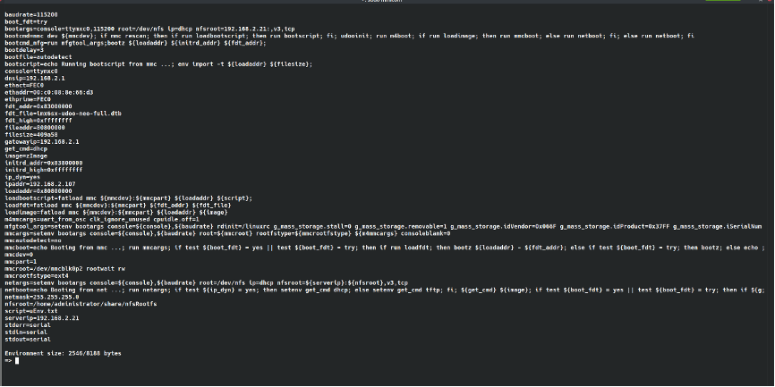

# 第三章 u-Boot 原理及移植  

## u-boot介绍  
待完善  

## 常用指令及环境变量  
### 常用指令  

**help**  
查看当前uboot版本所支持的所有命令，对于列出的命令并不是都能运行的，如果该命令并没有在板级文件中使能配置的话，那么直接在命令行中输入后按回车键，将会直接提示运行不了 。  
如果我们想查看某个命令的详细用法的话，可以输入：  
```shell  
    =>help command_name  或  =>? command_name  
```  

**信息查询相关命令**  
```shell  
bdinfo  
查询当前板子的相关信息，可以查看板子的DRAM的大小以及DRAM的起始地址、当前使用的网络接口以及IP地址、波特率和uboot偏移地址以及偏移量等相关信息。  

version  
查询uboot版本和交叉编译工具的相关信息。  
```  

**环境变量相关命令**  
```shell  
printenv  
打印环境变量，例如：当前串口的波特率baudrate、启动参数bootargs以及启动命令bootcmd等，这些环境变量都是字符串，能对其进行修改。  

setenv <name> <value>  
设置环境变量，setenv  <name>  <value>，当修改环境变量有空格值的时候，例如bootcmd或者bootargs等，这个时候的环境变量值需要使用单引号括起来。setenv命令也可以用来新建环境变量。  

editenv <value>    编辑环境变量  
saveenv    保存环境变量  
```  

**USB操作相关命令**  
```shell  
指令                     功能  
usb start               开始扫描USB控制器  
usb reset               复位USB控制器  
usb stop [f]            关闭USB控制器，[f]=force  
usb tree                已连接的USB设备树  
usb info [dev]          显示USB设备[dev]的信息  
usb storage             显示已连接的USB存储设备信息  
usb dev [dev]           显示和设置当前USB存储设备  
usb part [dev]          显示USB存储设备[dev]的分区信息  
usb read addr blk# cnt	读取USB存储设备数据  
```  

**网络传输相关命令**  
```shell  
dhcp        boot image via network using DHCP/TFTP protocol  
rarpboot    boot image via network using RARP/TFTP protocol  
nfs         boot image via network using NFS protocol  
tftpboot    boot image via network using TFTP protocol  
bootp       boot image via network using BOOTP/TFTP protocol  
```  
这几个命令的格式都是：<指令> [目的SDRAM地址] [[主机IP:]文件名]  
注意：  
要使用dhcp、rarpboot或 bootp 等功能要路由器或Host的支持。  
如果没有输入[目的SDRAM地址]，系统就是用编译时定义的CONFIG_SYS_LOAD_ADDR作为目的SDRAM地址  
如果tftpboot和nfs命令没有定义[主机IP:]，则使用ENV中的serverip  
其它命令必需定义[主机IP:]，否则会使用提供动态IP服务的主机IP作为[主机IP:]。  

**内存操作相关命令**  
```shell  
md [.b, .w, .l] address [# of objects]  
    命令用法中的[.b, .w, .l]对应着byte、word、long，分别以1个字节、2个字节、4个字节来进行内存值显示，address表示要查看的内存起始地址，[# of objects]表示要查看的数据长度，和显示的数据格式有关，并且需要注意的是uboot命令中的数字都是十六进制的。  
    例如： md.b 80000000 14  等价  md.b 80000000 0x14  

nm [.b, .w, .l] address  
    nm命令用于修改指定地址的内存值。nm命令同样是使用[.b, .w, .l]来指定内存的操作格式，例如，想要使用修改0x80000000地址的数据为0x77，可使用下面的命令：  
    => nm.b 80000000  或 => nm.b 0x80000000  

mm [.b, .w, .l] address  
    mm命令也是可以用来修改内存值，但是使用mm命令修改内存值的时候，地址值将会自增，使用nm命令时，地址值将不会自增。  

mw [.b, .w, .l] address value [count]  
    mw命令用来使用一个指定的数据填充一段内存，该命令同样使用[.b, .w, .l]来指定操作格式，address表示要填充的内存起始地址，value表示要填充的数据，count是要填充的长度。  
    例如，使用.b格式将以0x80000000为起始地址的0x14个内存块填充为0x33，命令如下：  
    => mw.b 80000000 33 14  

cp [.b, .w, .l] source target count  
    cp命令是数据拷贝命令，用于将DRAM中的数据从一段内存中拷贝到另一段内存中，该命令同样使用[.b, .w, .l]来指定操作格式，source表示为内存源地址，target表示为目标地址，count为拷贝的长度。  
    例如，使用.b格式将0x80000000开始地址处的0x14个字节拷贝到0x80000100地址处，命令如下所示：  
    => cp.b 80000000 80000100 14  
    or  
    => cp.b 0x80000000 0x80000100 14  

cmp [.b, .w, .l] addr1 addr2 count  
    cmp命令用于比较两段内存的数据是否相等，该命令同样使用[.b, .w, .l]来指定操作格式，addr1为第一段内存首地址，addr2为第二段内存首地址，count表示要比较的长度。  
    例如，使用.b格式来比较0x80000000和0x80000100两个地址的数据是否相等，比较的长度为0x14个字节，命令如下：  
    => cmp.b 80000000 80000100 14  
```  

**emmc和sd卡相关操作命令**  
对于uboot来说是支持emmc或者sd卡，因此也需要提供给用户emmc和sd卡的相关操作命令，uboot中常用于操作mmc设备的命令为"mmc"，mmc是一系列的命令，它的后面可以跟不同的参数  
```shell  
命令                 功能  
mmc info            输出mmc设备的信息, SD卡的速率，容量,总线宽度  
mmc read            mmc read addr blk# cnt  
                    读取mmc设备中的数据，其中addr是将数据读取到DRAM中的地址，blk是要读取的块起始地址，一块为512字节，cnt则是要读取的块的数量。  
                    例如，从当前的SD卡设备的第2048块开始，读取20个块数据到DRAM的0x80000100地址处，该命令如下：  
                    => mmc list  
                    => mmc dev 0  
                    => mmc read 80000100 800 14  
mmc write           mmc write addr blk# cnt  
                    向mmc设备中写入数据，addr是要写入到mmc设备中的数据在DRAM中的起始地址，blk是要写入mmc的块起始地址，cnt是要写入的块数量，一个块的大小为512字节。  
                    例如，将DRAM地址0x80000100开始的数据，从mmc设备的2048个块开始烧写，烧写20个块，命令如下：  
                    => mmc list  
                    => mmc part  
                    => mmc write 80000100 2048 14  
mmc erase           mmc erase blk# cnt  
                    其中blk是要擦除的起始块，cnt是要擦除的块数量。  
                    例如，可以使用下面的命令擦除mmc设备从2048个块开始的20个块：  
                    => mmc list  
                    => mmc part  
                    => mmc erase 800 14  
mmc rescan          扫描当前目标板上所有的mmc设备，包括eMMC和SD卡  
mmc part            查看当前mmc设备的分区  
mmc dev             切换当前的mmc设备，mmc dev [dev] [part]  
                    其中[dev]表示要切换的mmc设备号，[part]是mmc设备的分区号，如果不写分区号，则默认为分区0。  
mmc list            查看当前目标板共有多少个mmc设备  
mmc hwpartition     设置mmc设备的分区  
mmc bootbus         设置指定mmc设备的BOOT_BUS_WIDTH的值  
mmc bootpart        设置指定mmc设备的boot和RPMB分区大小  
mmc partconf        设置指定mmc设备的PARTITION_CONFIG的值  
mmc rst             mmc设备复位  
mmc setdsr          设置mmc设备DSR寄存器的值  
```  

**Nand Flash相关操作命令**  
```shell  
uboot中除了有emmc子系统外，还具有nand子系统，所有uboot也是支持Nand Flash的。  

nand info  
打印目标板上Nand Flash的相关信息，页面大小和00B大小等相关信息。  

nand device  
显示Nand Flash的信息，也能用于切换目标板上的Nand Flash，如果目标板支持多块Nand Flash的话，可以使用该命令进行切换。  

nand erase  
擦除Nand Flash，在对Nand Flash中写入数据之前，必须要先对写的区域进行擦除，然后才能保证数据能写入进擦除的区域内，nand erase命令的形式有3种，如下：  
第一种形式如下：  
nand erase[.spread] [clean] off size   
off表示Nand Flash的偏移地址，也就是要擦除区域的起始地址，size表示要擦除的区域大小。  
例如，可以使用下面的命令将Nand Flash存储Linux内核镜像zImage的区域进行擦除：  
=> nand erase 0x400000 0x1000000  
第二种形式如下：  
nand erase.part [clean] partition  
表示擦除指定的区域。  
第三种形式如下：  
nand erase.chip [clean]  
该形式将会将整个Nand Flash进行擦除，nand erase命令一般是与nand write命令进行配合使用。  

nand read  
nand read命令可以用于从Nand Flash中指定的地址读取指定大小的数据到DRAM中，该命令的使用格式如下：  
nand read - addr off|partition size  
命令使用格式中，addr表示DRAM的地址，off表示要读取的Nand Flash的区域的起始地址，size表示要读取的数据大小。  
例如，可以使用下面的命令读取Linux内核镜像zImage文件到DRAM的0x80800000地址处：  
=> nand read 0x80800000 0x400000 0x1000000  

nand write  
向Nand Flash中指定的地址写入指定大小的数据，一般和nand erase命令结合使用，还可以用来更新Nand Flash中的uboot、kernel和dtb等文件，该命令的使用格式如下：  
nand write - addr off|partition size  
和nand read命令类似，addr表示要写入的数据的开始地址，off表示Nand Flash中写入的起始地址，size表示要写入的数据大小。  
例如，使用该命令并结合fatload命令进行Linux内核镜像zImage和dtb文件更新，将我们需要更新的文件放入到SD卡中，使用fatload命令将需要更新的zImage和dtb写入到DRAM中，然后使用nand write命令更新到Nand Flash中，如下：  
将需要更新的zImage镜像文件读入到DRAM中：  
=> fatload mmc 0:1 0x80800000 img/zImage  
擦除Nand Flash中存储zImage的区域，并将DRAM中的zImage更新到Nand Flash中：  
=> nand erase 0x400000 0x1000000  
=> nand write 0x80800000 0x400000 0x1000000  
接下来，按照类似的方法去更新dtb：  
将需要更新的dtb设备树文件读入到DRAM中：  
=> fatload mmc 0:1 0x83000000 img/imx6ul-14x14-evk.dtb  
擦除Nand Flash中存储dtb设备树的区域，并将DRAM中的dtb文件更新到Nand Flash中：  
=> nand erase 0x1400000 0x80000  
=> nand write 0x83000000 0x1400000 0x80000  
另外，还可以使用bootz命令启动Linux内核，使用下面命令即可：  
=> bootz 0x80800000 - 0x83000000  
```  

**FAT格式文件系统相关操作命令**  
```shell  
fatinfo <interface> [<dev[:part]>]  
查询mmc设备中指定分区的文件系统信息，<interface> 表示要查看的接口，例如mmc，[<dev[:part]>]中的dev表示要查询的设备号，part则表示要查询的分区。  
例如，当前我的目标板有个sd卡设备，查看sd卡中分区1的文件系统信息，可以使用下面的命令：  
=> mmc list  
=> mmc part  
=> fatinfo mmc 0:1  

fatls <interface> [<dev[:part]>] [directory]  
查询FAT格式文件系统的目录和文件信息，<interface>表示要查询的接口，[<dev[:part]>]中dev表示要查询的设备号，part表示要查询分区，[directory]表示要查询的目录，如果该参数不输入的话，默认为根目录。  
例如，查询我当前sd卡中分区1中的目录和文件，可以输入下面命令：  
=> fatls mmc 0:1  
当我们再想查看img/目录下的目录或者文件时，可以使用下面的命令：  
=> fatls mmc 0:1 img/  

fstype  
fstype命令可以用于查看mmc设备中某个分区的文件系统格式，fstyp命令具有两个用法，第一个用来查看mmc设备分区中的文件系统类型，第二个则是用来设置文件系统类型的环境变量，对于第一个命令用法，<interface>表示接口，例如mmc，<dev>:<part>中dev则表示要查询的设备号，part则是设备的分区。  
例如，查看我当前目标板中sd设备的第一个分区的文件系统类型，可以使用下面命令：  
=> fstype mmc 0:1  

fatload <interface> [<dev[:part]> [<addr> [<filename> [bytes [pos]]]]]  
fatload命令用来将指定的文件读取到DRAM内存中，<interface>表示设备接口，例如mmc，[<dev[:part]>中的dev表示设备号，part表示mmc设备的分区，<addr>则是文件读取到DRAM中的起始地址，<filename>则是要读取的文件的名字，bytes表示要读取多少字节的数据，如果该值为0或者未使用，则表示将要读取整个文件，pos表示要读的文件相对于文件首地址的偏移，如果为0或者未使用，则表示从文件首地址开始读取。  
例如，在我当前的目标帮中，将sd卡中第一个分区中的img/u-boot-imx6ul14x14evk_nand.imx文件读取到DRAM中0x80000100起始地址中，可以使用下面的命令：  
=> fatls mmc 0:1 img/  
=> fatload mmc 0:1 80000100 img/u-boot-imx6ul14x14evk_nand.imx  

fatwrite  
当在uboot的板级配置文件中定义了#define CONFIG_CMD_FAT宏，fatinfo、fatls、fatload命令才会出现在uboot命令中，而fatwrite命令则需要定义#define CONFIG_FAT_WRITE宏才会出现，因此，如果想要在uboot中使用fatwrite命令，则需要定义宏CONFIG_FAT_WRITE。   
fatwrite命令可以用于将DRAM中的数据写入到mmc设备中去，命令格式中，<interface>表示为接口，例如mmc，<dev[:part]>中dev表示为设备号，part表示为mmc设备的分区，<addr>则为要写入的数据在DRAM中的起始地址，<filename>表示写入的数据文件的名字，<bytes>表示要写入的字节数。  
例如，在我的目标板系统中从DRAM地址0x80000100开始写20个字节，在sd卡设备的分区1中生成test.bin文件，可以使用下面命令：  
=> mmc list  
=> fatls mmc 0:1  
=> fatwrite mmc 0:1 80000100 test.bin 14  
=> fatls mmc 0:1  
```  

**EXT格式文件系统相关操作命令**  
uboot中除了有FAT格式文件系统的相关操作命令外，还有EXT格式文件系统的相关操作命令，这些命令和实现的功能如下所示：  
```shell  
命令         功能  
ext2load    从Ext2文件系统中加载二进制文件到DRAM中  
ext2ls      列举目录中的文件  
ext4load    从Ext4文件系统中加载二进制文件到DRAM中  
ext4ls      列举目录中的文件  
ext4size    修改文件大小  
ext4write   在root目录下新创建文件  
```  

**BOOT启动相关操作命令**  
```shell  
boot  
boot命令是用来启动Linux系统的，该命令将会运行bootcmd，也就是boot命令将会读取bootcmd这个环境变量，并运行这个环境变量中的命令，查看当前目标板中的bootcmd环境变量内容：print bootcmd  


bootm [addr [arg ...]]  
bootm命令用于启动uImage镜像，其中addr就是uImage镜像文件在DRAM的起始地址，另外它还有一些参数，如果要使用dtb或initrd的话，则就是在后面添加对应的DRAM地址。  


bootz [addr [initrd[:size]] [fdt]]  
bootz命令也是用来启动Linux系统，只不过启动的是Linux zImage镜像文件，命令中的addr是DRAM内存Linux镜像文件的起始地址，initrd是initrd文件在DRAM中的地址，fdt是设备树在DRAM中的地址，如果没有使用到initrd文件的话，则使用'-'进行替代，对于Linux镜像和设备树文件，我们可以通过读取eMMC或Nand Flash到DRAM中，当然，如果在网络接口可以使用的情况下，也可以使用NFS或TFTP服务将镜像下载到DRAM中，启动的原理是一样的。  
例如，当Nand Flash中存储着我们需要启动的Linux系统镜像和设备树文件的话，可以使用下面命令进行启动：  
先读取Linux zImage镜像到DRAM的0x80800000处：  
=> nand read 0x80800000 0x400000 0x1000000  
然后读取设备树文件到DRAM的0x83000000处：  
=> nand read 0x83000000 0x1400000 0x80000  
使用bootz启动引导Linux系统：  
=> bootz 0x80800000 - 0x83000000  
```  

**其它常用uboot命令**  
```shell  
reset  
reset命令能用来复位CPU  

go addr [arg ...]  
go命令能用于跳转到指定的内存地址处执行应用程序，命令用法中的addr就是内存的地址。  

run var [...]  
run命令能用来运行环境变量中定义的命令，例如通过run bootcmd来运行bootcmd中定义的启动命令，能将Linux系统进行启动，该命令能运行我们自己定义的环境变量  


mtest [start [end [pattern [iterations]]]]  
mtest命令能用于进行内存读写测试，例如可以用来测试目标板DDR的稳定性，命令用法中的start是DRAM内存的起始地址，end是内存的结束地址。  
例如我们向测试0x80000000到0x87800000这段内存，可以使用下面命令：  
=> mtest 80000000 87800000  
测试的时候，如果想退出测试的话，可以使用键盘上的"Ctrl+C"组合键。  
```  

[常用u-boot命令详解（全）](https://blog.csdn.net/ghostyu/article/details/6968681)  

### 环境变量  
```shell  
变量                解释  
bootargs        传递给内核的参数，设置了许多重要的参数  
bootcmd         启动uboot会执行的命令  
bandrate        串口速率  
ipaddr          本地IP地址  
serverip        服务端地址  
bootdelay       启动前的延时等待  
```  

### 从uboot网络启动嵌入式设备  
**搭建tftp服务器**  
```shell  
1. $sudo apt-get install tftp-hpa tftpd-hpa  
2. 编辑 /etc/default/tftpd-hpa  
    # /etc/defaut/tftpd_hpa  
    TFTP_USERNAME = "tftp"  
    # 共享目录  
    TFTP_DIRECTORY = "/var/lib/tftproot"  
    TFTP_ADDRESS = ":69"  
    TFTP_OPTIONS = "-l -c -s"  
    # TFTP_OPTIONS = "--secure"  
3. 将共享目录权限设置为 777  
4. 重启 tftp 服务： $: sudo service tftpd-hpa restart  
5. 使用 $: tftp <服务IP>  put/get 上传/下载  
```  

**关闭服务器防火墙**  
```shell  
Ubuntu防火墙设置  
1.安装  
    sudo apt-get install ufw  

2.启用  
    sudo ufw enable   
    sudo ufw default deny  
    运行以上两条命令后，开启了防火墙，并在系统启动时自动开启。  
    关闭所有外部对本机的访问，但本机访问外部正常。  

3.开启/禁用  
    sudo ufw allow|deny [service]  
    打开或关闭某个端口，例如：  
    sudo ufw allow smtp　允许所有的外部IP访问本机的25/tcp (smtp)端口   
    sudo ufw allow 22/tcp 允许所有的外部IP访问本机的22/tcp (ssh)端口   
    sudo ufw allow 53 允许外部访问53端口(tcp/udp)   
    sudo ufw allow from 192.168.1.100 允许此IP访问所有的本机端口   
    sudo ufw allow proto udp 192.168.0.1 port 53 to 192.168.0.2 port 53   
    sudo ufw deny smtp 禁止外部访问smtp服务   
    sudo ufw delete allow smtp 删除上面建立的某条规则   

4.查看防火墙状态  
    sudo ufw status  

一般用户，只需如下设置：  
sudo apt-get install ufw   
sudo ufw enable   
sudo ufw default deny  
以上三条命令已经足够安全了，如果你需要开放某些服务，再使用sudo ufw allow开启。  

补充：  
开启/关闭防火墙 (默认设置是’disable’)  
#ufw enable|disable  

转换日志状态  
#ufw logging on|off  

设置默认策略 (比如 “mostly open” vs “mostly closed”)  
#ufw default allow|deny  

许可或者屏蔽某些入埠的包 (可以在“status” 中查看到服务列表［见后文］)。可以用“协议：端口”的方式指定一个存在于/etc/services中的服务名称，也可以通过包的meta-data。 ‘allow’ 参数将把条目加入 /etc/ufw/maps ，而 ‘deny’ 则相反。基本语法如下：  
#ufw allow|deny [service]  

显示防火墙和端口的侦听状态，参见 /var/lib/ufw/maps。括号中的数字将不会被显示出来。  
#ufw status  

［注意：上文中虽然没有使用 sudo，但是命令提示符号都是“#”］  

UFW 使用范例：  
允许 53 端口  
$ sudo ufw allow 53  

禁用 53 端口  
$ sudo ufw delete allow 53  

允许 80 端口  
$ sudo ufw allow 80/tcp  

禁用 80 端口  
$ sudo ufw delete allow 80/tcp  

允许 smtp 端口  
$ sudo ufw allow smtp  

删除 smtp 端口的许可  
$ sudo ufw delete allow smtp  

允许某特定 IP  
$ sudo ufw allow from 192.168.254.254  

删除上面的规则  
$ sudo ufw delete allow from 192.168.254.254  

而对于uboot 可以直接关闭防火墙，或者允许指定IP  
```  

**搭建NFS服务器**  
```shell  
1. 安装nfs服务：  
    $ sudo apt-get install nfs-kernel-server  

2. 修改配置文件： /etx/exports  
    在配置最后加上：  
    /home/administrator/share/nfsRootfs *(insecure, rw, sync, no_subtree_check, all_squash, anonuid=1000, anongid=1000)  
    其中 anonuid 为用户 udi ，anongid 为用户 gid  

3. 重启 nfs-ernel-server 服务  

4. 客户端：查看指定IP的nfs共享目录： $ showmount -e <serverIP>  
    挂载：$ sudo mount <serverIP>:/path/to/share/   <localDir>  

5. windows 挂载 nfs  
    1）控制面板->程序->程序和功能->打开或关闭windows功能  
    2）勾选nfs服务及相关子项  
    3）进入cmd执行：mount \\<serverIP>\path\to\share  x:  
    其中 x 为一个挂载点，选择一个闲置的盘符即可  

windows设置文件共享：  
    <1>右击网络->属性->更改高级共享设置    启用相关网络范围内的网络发现  
    <2>选择需要共享的文件夹右击->共享->共享->选择一个用户，如果有可以选择 Guest  
    或： 选择需要共享的文件夹右击->共享->高级共享->设置共享此文件夹  
    <3>使用：打开我的电脑，在地址栏输入 \\<serverIP>\  
    注意：第一次登陆需要使用服务端的用户账号和密码  
```  

**构建部署kernel、设备树、根文件系统**  
```shell  
这里以buildroot和 udoo-neo-full为例简要说明  
git://git.busybox.net/buildroot  
make list-defconfigs | grep udoo  
make mx6sx_udoo_neo_defconfig  
make all  

将 output/image 路径下的 zImage 和 设备树 放到 tftp 共享路径下  
将 output/image 路径下的根文件系统解压到 nfs 共享目录下  
```  

**修改uboot环境变量**  
```shell  
通常需要修改 serverip、ipaddr、image(kernel)、fdt_file(dtb)、nfsroot(rootfs) 这几个变量  
例如：  
serverip=192.168.2.21  
ipaddr=192.168.2.107  
image=zImage  
fdt_file=imx6sx-udoo-neo-full.dtb  
nfsroot=/home/administrator/share/nfsRootfs  
```  
以下为配置之后的参数：  
  

**网络启动**  
一般boot里会设置网络启动的参数，直接通过run命令执行即可，例如： run netboot  
此时使用的参数为：  
```shell  
netargs=setenv bootargs console=${console},${baudrate} root=/dev/nfs ip=dhcp nfsroot=${serverip}:${nfsroot},v3,tcp  
```  

## u-boot编译架构  
待完善  
## 源码分析  
### 链接脚本（lds文件）  

lds文件：https://www.jianshu.com/p/ec39403db315  
https://www.jianshu.com/p/42823b3b7c8e  
https://blog.csdn.net/u010833290/article/details/8991585  

https://www.zhihu.com/question/36860638  
▲ https://insidelinuxdev.net/article/a00r78.html  
http://ftp.gnu.org/old-gnu/Manuals/ld-2.9.1/html_mono/ld.html  
http://www.gnu.org/software/make/manual/make.html  

每一个链接都是链接脚本（linker script）控制的，脚本是按照链接器命令语言（linker command language）书写的。  

链接脚本的主要目的是描述输入文件的section如何映射到输出文件，以及如何控制输出文件的内存布局。除此之外，大多数链接脚本不做什么其它的事。然而如果需要，链接脚本也可以指导链接器执行其它许多操作。  

链接器总是使用链接脚本，如果没有提供，它使用缺省脚本，使用--verbose命令行选项，可以显示缺省的链接脚本。一些命令如-r或者-N，会影响缺省链接脚本。  

可以使用-T选项指定自己的链接脚本，这么做时，你的脚本完全替换缺省链接脚本。  

**基本的链接脚本概念：**  
section：可参考本博客ELF分类中的文章。  
input section：输入文件中的section。  
output section：输出文件中的section。  
loadable：当输出文件运行时，该section的内容加载内存中。  
allocatable：该section没有内容，但是会分配内存，通常是.bss section。  

每个可加载和可分配section有两个地址，第一个是VMA（virtual memory address），这是输出文件运行时，section的地址。第二个是LMA（load memory address），这是section要加载到的地址。大多数情况下，这两个地址相同。但是在一些嵌入式系统中，整个目标文件烧写到nor flash（指令可直接执行），只读段仍然在ROM中，但是变量加载到RAM中，此时VMA和LMA不同。  

**链接脚本格式：**  
链接脚本是文本文件，链接脚本由一系列命令组成。每一个命令或者是一个关键字，关键字可以带参数；或者是给符号赋值。可以用分号分开各个命令。注释的格式为 /* */。文件名和格式名可直接输入，如果有特殊字符，使用双引号。  

**简单的链接脚本例子：**  
最简单的链接脚本只有一个命令："SECTIONS"，这个命令用来描述输出文件的内存布局。  
```shell  
SECTIONS  
{  
    . = 0x10000;  
    .text : { *(.text) }  
    . = 0x8000000;  
    .data : { *(.data) }  
    .bss : { *(.bss) }  
}  
```  
"."符号是location counter，用于指定section的地址，SECTIONS命令开始时，其值为0，可以显式设置，如果没有设置，则按照section大小自动增长。.text定义一个ouput section。后面跟一个冒号，现在可以省略。大括号用来指定input sections，*是通配符，匹配任何文件名。表达式'*(.text)'表示输入文件的所有.text section。链接器保证output section满足对齐要求  

**ENTRY命令**  
程序执行的第一条指令叫做entry point。ENTRY命令用于设置入口点。链接器按照下面的顺序寻找入口点。  
1. -e 命令行选项。  
2. ENTRY(symbol)链接脚本命令。  
3. 目标指定的符号，通常是start。  
4. .text的第一个字节。  
5. 0  

**SECTIONS命令**  
SECTIONS命令告诉链接器，如何映射输入section到输出section，如何将输出section放到内存。SECTIONS命令的格式：  
```shell  
SECTIONS  
{  
    sections-command  
    sections-command  
    ...  
}  
```  
每个sections-command可能是下列之一：  
1. 一个ENTRY命令  
2. 一个符号赋值  
3. 一个输出section描述  
4. 一个overlay描述  
ENTRY命令和符号赋值允许出现在SECTIONS命令中，是为了在这些命令中方便的使用location counter。这也使链接脚本更容易理解，因为你将这些命令放在输出文件布局中有意义的位置。  
如果在链接脚本中，没有使用SECTIONS命令。链接器将每一个输入section放入一个唯一命名的输出section。按照其在第一个输入文件的顺序。当然也会合并输入section。第一个section的地址将为0。  
其他更详细的信息、命令、学习资料参考： https://insidelinuxdev.net/article/a00r78.html  

一段典型脚本：（hello.lds）  
```shell  
ENTRY(helloworld)  
SECTIONS  
{  
    . = 0x20008000;  
    .text :  
    {  
        start.o(.text);  
        *(.text);  
    }  
    . = ALIGN(4);  
    .data :  
    {  
        *(.data);  
    }  
    .bss :  
    {  
        *(.bss);  
    }  
}     

----------------------------------  

1、点号(.)：  
    点号在SECTIONS命令里称为位置计数器，代表了当前位置。如上面的0x20008000表示代码段的起始位置从这个值开始。  
    也可以不指定，如.data段和.bss段；代表紧挨着上面的段分布。如果一开始就不指定，则默认值为0。  
2、输出段（.text/.data/.bss）：  
    各关键字代表了输出段的段名，花括号内定义了各段对应的内容。段名可任意定义，输出段的实际内容与段名无关，只与花括号内的具体内容有关。  
    如：.text，把列出的（*代表任意）输入文件的.text段合并成一个.text（其中，start.o中的.text放在最前面）；  
    该段的地址由定位器符号的值指定，即0x20008000；  
3、ALIGN（N）：  
    产生对齐的代码或数据，很多体系结构对对齐的代码或数据有严格的要求。  
    如 . = ALIGN（4）表示位置计数器向高地址方向取最近的4字节的整数倍。  
4、ENTRY(SYMBOL)：  
    相等于-e，将符号SYMBOL的值设置成入口地址（进程执行的第一条用户空间的指令，在进程地址空间的地址）。  
    arm-linux-ld 有多种方法设置进程入口地址：按以下顺序，优先级依次之：  
    1、arm-linux-ld 命令行的 -e 选项；  
    2、连接脚本的ENTRY(SYMBOL)命令；  
    3、如果定义了start符号，使用start符号值；  
    4、如果存在.text section，使用.text section的第一字节的位置值；  
    5、使用值0；  

-----------------------------------  
使用：(运行链接命令时，借助于-T参数）  
    arm-linux-ld -T hello.lds -o file.eld  
```  

**u-boot入口：**  
https://blog.csdn.net/weixin_43288201/article/details/107496580  
https://zhuanlan.zhihu.com/p/132479321  
https://blog.csdn.net/newnewman80/article/details/9948509  
程序的链接是由链接脚本来决定的，所以通过链接脚本可以找到程序的入口。  
根据编译后的u-boot根目录下的u-boot.lds文件可以看到  
入口点是 arch/arm/lib/vectors.S 文件中的_start --- 中断向量表 然后跳转到  
arch/arm/cpu/armv7/start.S 里面的reset函数  

### 基本汇编语法  
https://www.crifan.com/files/doc/docbook/uboot_starts_analysis/release/htmls/summary_assembly.html  
1.汇编中的标号=C中的标号  
如：  
```shell  
reset:  
    /*  
     * set the cpu to SVC32 mode  
     */  
    mrs	r0,cpsr  
```  
中的reset，就是汇编中的标号，相对来说，比较容易理解，就相当于C语言的标号。  

比如，C语言中定义一个标号ERR_NODEV：  
```shell  
ERR_NODEV: /* no device error */  
    ... /* c code here */       
```  
然后对应在别处，使用goto去跳转到这个标号ERR_NODEV：  
```shell  
if (something)  
goto ERR_NODEV ;  
```  

2.汇编中的跳转指令=C中的goto  
对应地，和上面的例子中的C语言中的编号和掉转到标号的goto类似，汇编中，对于定义了标号，那么也会有对应的指令，去跳转到对应的汇编中的标号。这些跳转的指令，就是b指令，b是branch的缩写。  

b指令的格式是：  
`b{cond} label`  
简单说就是跳转到label处。  

用和上面的例子相关的代码来举例：  
```shell  
.globl _start  
_start:	b       reset  
```  
就是用b指令跳转到上面那个reset的标号。  


3.汇编中的.globl=C语言中的extern  
对于上面例子中：  
`.globl _start`  
中的.global，就是声明_start为全局变量/标号，可以供其他源文件所访问。  

即汇编器，在编译此汇编代码的时候，会将此变量记下来，知道其是个全局变量，遇到其他文件是用到此变量的的时候，知道是访问这个全局变量的。  
因此，从功能上来说，就相当于C语言用extern去生命一个变量，以实现本文件外部访问此变量。  

4.汇编中用bl指令和mov pc，lr来实现子函数调用和返回  
和b指令类似的，另外还有一个bl指令，语法是：  
`bl{cond} label`  
其作用是，除了b指令跳转到label之外，在跳转之前，先把下一条指令地址存到lr寄存器中，以方便跳转到那边执行完毕后，将lr再赋值给pc，以实现函数返回，继续执行下面的指令的效果。  

用下面这个start.S中的例子来说明：  
```shell  
    bl	cpu_init_crit  
......  
cpu_init_crit:  
......  
    mov	pc, lr  
```  
其中，就是先调用bl掉转到对应的标号cpu_init_crit，其实就是相当于一个函数了，然后在cpu_init_crit部分，执行完毕后，最后调用 mov pc, lr，将lr中的值，赋给pc，即实现函数的返回原先 bl cpu_init_crit下面那条代码，继续执行函数。上面的整个过程，用C语言表示的话，就相当于：  
```shell  
......  
cpu_init_crit();  
......  

void cpu_init_crit(void)  
{  
......  
}  
```  
而关于C语言中，函数的跳转前后所要做的事情，都是C语言编译器帮我们实现好了，会将此C语言中的函数调用，转化为对应的汇编代码的。  

其中，此处所说的，函数跳转前后所要做的事情，就是：  
函数跳转前，要将当前指令的下一条指令的地址，保存到lr寄存器中  
函数调用完毕后，将之前保存的lr的值给pc，实现函数跳转回来。继续执行下一条指令。  
而如果你本身自己写汇编语言的话，那么这些函数跳转前后要做的事情，都是你程序员自己要关心，要实现的事情。  

5.汇编中的对应位置有存储值的标号 = C语言中的指针变量  
像前文所解析的代码中类似于这样的：  
`LABEL1：.word Value2`  
比如：  
```shell  
_TEXT_BASE:  
    .word	TEXT_BASE  
```  
所对应的含义是，有一个标号_TEXT_BASE  
而该标号中对应的位置，所存放的是一个word的值，具体的数值是TEXT_BASE，此处的TEXT_BASE是在别处定义的一个宏，值是0x33D00000。  

所以，即为：  
有一个标号_TEXT_BASE，其对应的位置中，所存放的是一个word的值，值为  
TEXT_BASE=0x33D00000  
总的来说，此种用法的含义，如果用C语言来表示，其实更加容易理解：  
`int *_TEXT_BASE = TEXT_BASE = 0x33D00000`  
即：  
`int *_TEXT_BASE = 0x33D00000`  

**C语言中如何引用汇编中的标号**  
不过，对于这样的类似于C语言中的指针的汇编中的标号，在C语言中调用到的话，却是这样引用的：  
```shell  
/* for the following variables, see start.S */  
extern ulong _armboot_start;	/* code start */  
extern ulong _bss_start;	/* code + data end == BSS start */  
......  
    IRQ_STACK_START = _armboot_start - CFG_MALLOC_LEN - CFG_GBL_DATA_SIZE - 4;  
......  
```  
而不是我原以为的，直接当做指针来引用该变量的方式：  
```shell  
    *IRQ_STACK_START = *_armboot_start - CFG_MALLOC_LEN - CFG_GBL_DATA_SIZE - 4;  
```  
其中，对应的汇编中的代码为：  
```shell  
.globl _armboot_start  
_armboot_start:  
    .word _start  
```  
所以，针对这点，还是需要注意一下的。至少以后如果自己写代码的时候，在C语言中引用汇编中的global的标号的时候，知道是如何引用该变量的。  

【总结】  
汇编中类似这样的代码：  
`label1: .word value2`  
就相当于C语言中的：  
`int *label1 = value2`  
但是在C语言中引用该标号/变量的时候，却是直接拿来用的，就像这样：  
`label1 = other_value`  
其中label1就是个int型的变量。  

6.汇编中的ldr+标号，来实现C中的函数调用  
接着上面的内容，继续解释，对于汇编中这样的代码：  
第一种：  
```shell  
ldr pc, 标号1  
......  
标号1：.word 标号2  
......  
标号2：  
......（具体要执行的代码）  
```  
或者是，  
第二种：  
```shell  
ldr pc, 标号1  
......  
标号1：.word XXX（C语言中某个函数的函数名）  
```  
这里意思就是，将地址为标号1中内容载入到pc中。而地址为标号1中的内容，就类似第一种的标号2。  

所以上面第一种的意思：就很容易看出来，就是把标号2这个地址值，给pc，即实现了跳转到标号2的位置执行代码，就相当于调用一个函数，该函数名为标号2。  

第二种的意思，和上面类似，是将C语言中某个函数的函数名，即某个地址值，给pc，实现调用C中对应的那个函数。  

两种做法，其含义用C语言表达，其实很简单：  
`PC = *（标号1） = 标号2`  

例：汇编中的ldr加标号实现函数调用 示例  

第一种：  
```shell  
......  
    ldr	pc, _software_interrupt  
......  
_software_interrupt:	.word software_interrupt  
......  
software_interrupt:  
    get_bad_stack  
    bad_save_user_regs  
    bl 	do_software_interrupt  
```  
以上就是实现了将标号1，_software_interrupt，对应的位置中的值，标号2，software_interrupt，给pc，即实现了将pc掉转到software_interrupt的位置，即实现了调用函数software_interrupt的效果。  

第二种：  
```shell  
    ldr	pc, _start_armboot  
_start_armboot:	.word start_armboot  
```  
含义就是，将标号1，_start_armboot，所对应的位置中的值，start_armboot给pc，即实现了调用函数start_armboot的目的。  
其中，start_armboot是C语言文件中某个C语言的函数。  

[注意]	总结汇编中实现函数调用的方式  
汇编中，实现函数调用的效果，有如下两种方法：  

方法1  
```shell  
ldr pc, 标号1  
......  
标号1：.word 标号2  
......  
标号2：  
......（具体要执行的代码）  
```  
                      
方法2  
```shell  
ldr pc, 标号1  
......  
标号1：.word XXX（C语言中某个函数的函数名）  
```  

7.汇编中设置某个寄存器的值或给某个地址赋值  
在汇编代码start.S中，看到不止一处， 类似于这样的代码：  
形式1：  
```shell  
# define pWTCON		0x53000000  
......  
	ldr     r0, =pWTCON  
	mov   r1, #0x0  
	str     r1, [r0]  
```  
或者是，形式2：  
```shell  
# define INTSUBMSK	0x4A00001C  
......  
    ldr	r1, =0x3fff  
    ldr	r0, =INTSUBMSK  
    str	r1, [r0]  
```      
其含义，都是将某个值，赋给某个地址，此处的地址，是用宏定义来定义的，对应着某个寄存器的地址。  

其中，形式1是直接通过mov指令来将0这个值赋给r1寄存器，和形式2中的通过ldr伪指令来将0x3ff赋给r1寄存器，两者区别是，前者是因为已经确定所要赋的值0x0是mov的有效操作数，而后者对于0x3ff不确定是否是mov的有效操作数，如果不是，则该指令无效，编译的时候，也无法通过编译，会出现类似于这样的错误：  
```shell  
    start.S: Assembler messages:  
    start.S:149: Error: invalid constant -- 'mov r1,#0xFFEFDFFF'  
    make[1]: *** [start.o] 错误 1  
    make: *** [cpu/arm920t/start.o] 错误 2  
```  
所以才用ldr伪指令，让编译器来帮你自动判断：  
①如果该操作数是mov的有效操作数，那么ldr伪指令就会被翻译成对应的mov指令  
例如：  
汇编代码：  
```shell  
# define  pWTCON		0x53000000  
......  
ldr     r0, =pWTCON  
被翻译后的真正的汇编代码：  
33d00068:	e3a00453 	mov	r0, #1392508928	; 0x53000000  
```  
②	如果该操作数不是mov的有效操作数，那么ldr伪指令就会被翻译成ldr指令  
例如：  
汇编代码：  
```shell  
ldr	r1, =0x7fff  
被翻译后的真正的汇编代码：  
33d00080:	e59f13f8 	ldr	r1, [pc, #1016]	; 33d00480 <fiq+0x60>  
......  
33d00480:	00007fff 	.word	0x00007fff  
```  
即把ldr伪指令翻译成真正的ldr指令，并且另外分配了一个word的地址空间用于存放该数值，然后用ldr指令将对应地址中的值载入，赋值给r1寄存器。  

总结汇编中给某个地址赋值的方法  
汇编中，一个常用的，用来给某个地址赋值的方法，类似如下形式：  
```shell  
#define 宏的名字  寄存器地址  
......  
ldr	r1, =要赋的值  
ldr	r0, =宏的名字  
str	r1, [r0]  
```  

### 复位之后函数调用流程  

**关键文件：**  
u-boot/arch/arm/cpu/armv7/start.S    第一阶段文件  
u-boot/arch/arm/cpu/armv7/lowlevel_init.S    第一阶段文件  
u-boot/arch/arm/lib/crt0.S  第二阶段文件  
u-boot/common/board_f.c  
u-boot/common/board_r.c  

**重要变量：**  
global_data   gd_t   u-boot/include/asm-generic/global_data.h  
保存很多有用信息的全局结构体－－gd_t（global data缩写），其中包括了bd变量，可以说gd_t结构体包括了u-boot中所有重要全局变量。  

**代码段、数据段：**  
一个程序本质上都是由 bss段、data段、text段（代码段）三个组成的。这在当前的计算机程序设计中是很重要的一个基本概念。在嵌入式系统的设计中也非常重要，牵涉到嵌入式系统运行时的内存大小分配，存储单元占用空间大小的问题。  
**bss段**：在采用段式内存管理的架构中（比如x86系统），bss段通常是指用来存放程序中未初始化的全局变量的一块内存区域，一般在初始化时bss 段部分将会清零。bss段属于静态内存分配，即程序一开始就将其清零了。比如，在C语言之类的程序编译完成之后，已初始化的全局变量保存在.data 段中，未初始化的全局变量保存在.bss 段中。text和data段都在可执行文件，或镜像文件等，由系统从执行文件中加载，而bss段不在可执行文件中，由系统初始化。  
  
**text段**: 用于存放程序代码的区域， 编译时确定， 只读。更进一步讲是存放处理器的机器指令，当各个源文件单独编译之后生成目标文件，经连接器链接各个目标文件并解决各个源文件之间函数的引用，与此同时，还得将所有目标文件中的.text段合在一起，但不是简单的将它们“堆”在一起就完事，还需要处理各个段之间的函数引用问题。  
在嵌入式系统中，如果处理器是带MMU（MemoryManagement Unit，内存管理单元），  
那么当我们的可执行程序被加载到内存以后，通常都会将.text段所在的内存空间设置为只读，以保护.text中的代码不会被意外的改写（比如在程序出错时）。当然，如果没有MMU就无法获得这种代码保护功能。  
**data段**: 用于存放在编译阶段(而非运行时)就能确定的数据，可读可写。也是通常所说的静态存储区，赋了初值的全局变量、常量和静态变量都存放在这个域。  

包含有代码的可执行程序至少有一个段，通常称为 .text。在 .data 段包含数据。可执行代码保存在 .text 段，读写 .data 段中的数据。此外，只读常数保存在 .rodata 段。 初始化为零的数据保存在 .bss 段。以 bss 段起始块定义了没有初始化的静态数据空间。  

**函数调用流程：**  
```shell  
.globl  reset    u-boot/arch/arm/cpu/armv7/start.S  
  --> save_boot_params    u-boot/arch/arm/cpu/armv7/start.S  
--> save_boot_params_ret    u-boot/arch/arm/cpu/armv7/start.S  
    检查是否支持 Hypervisor 模式  
      --> switch_to_hypervisor    u-boot/arch/arm/cpu/armv7/start.S  
        --> switch_to_hypervisor_ret    u-boot/arch/arm/cpu/armv7/start.S  
            1）如果不支持 HYP 模式，设置为 SVC 模式  
            2）关闭 FIQ 和 IRQ  
            3）修改CP15 内的系统控制寄存器 SCTLR，将V设置为0，表示向量表在低  
               地址区  
            4）将处理器异常向量的入口地址设置为 _start  
          --> cpu_init_cp15    u-boot/arch/arm/cpu/armv7/start.S  
              配置CP15处理器相关的寄存器来配置处理器的MMU、Cache及TLB如果  
              没有定义 CONFIG_SYS_ICACHE_OFF，则打开ICACHE，关闭MMU和TLB  
          --> cpu_init_crit    u-boot/arch/arm/cpu/armv7/start.S  
              跳至板子特定的初始化...  
              Mask ROM将已经初始化了基本存储器。 去这里提高时钟速率并处理唤醒  
              条件。  
            --> lowlevel_init    u-boot/arch/arm/cpu/armv7/lowlevel_init.S  
                初始化堆栈后调用C函数继续进行初始化  
              --> s_init    u-boot/arch/arm/cpu/armv7/kona-common/s_init.c  
              ======> 第一阶段结束 <======  
          --> _main    u-boot/arch/arm/lib/crt0.S  第二阶段开始  
              1) 设置初始C运行时环境并调用board_init_f(0)，即初始化堆栈指针sp  
                 并且8字节对齐。GD_SIZE 是指全局结构体gd的大小，在 GD_SIZE 周  
                 围有相关的宏设置，可以留意，文件：  
                 u-boot\include\generated\generic-asm-offsets.h。  
              2) 设置中间环境（新的sp和gd）并调用relocate_code（addr_moni）。   
                 这里的窍门是我们将返回“这里”但已重新定位  
            --> board_init_f_alloc_reserve    u-boot/common/init/board_init.c  
            --> board_init_f_init_reserve    u-boot/ common/init/board_init.c  
            --> board_init_f    u-boot/common/board_f.c     
                在SPL的上下文中，board_init_f（）准备从系统RAM（DRAM，DDR ...）  
                执行的硬件。 由于系统RAM可能尚不可用，因此board_init_f（）必须  
                使用当前的GD来存储必须传递到后续阶段的任何数据。 这些数据包括  
                重定位目标，将来的堆栈和将来的GD位置。 使用此功能后将清除BSS  
               （因此必须可访问）。   
            --> relocate_code    u-boot/arch/arm/lib/relocate.S  
                重定位监控程序代码  
            --> relocate_vectors    u-boot/arch/arm/lib/ relocate.S  
               将u-boot由当前位置重定位到由board_inti_f()函数所计算出的目的位置  
            --> spl_relocate_stack_gd    u-boot/common/spl/spl.c	  
            --> coloured_LED_init    u-boot/ common/board_f.c  
            --> red_led_on    u-boot/ common / board_f.c  
            --> board_init_r    u-boot/common/board_r.c  
              --> init_sequence_r    u-boot/common/board_r.c  
                  各种外围设备初始化，如：控制台初始化、网卡初始化等  
                --> run_main_loop    u-boot/common/board_r.c  
                                    实际执行在u-boot/include/initcall.h中  
                  --> main_loop    u-boot/common/main.c  
                      控制台命令操作体现在这里  
```  

### uboot启动过程分析  
https://www.cnblogs.com/linfeng-learning/p/9284060.html  
重要 https://blog.csdn.net/qq_16933601/article/details/106244510  嵌入式Linux应用开发完全手册  
https://zhuanlan.zhihu.com/p/65853967  
https://www.linuxidc.com/Linux/2017-02/141019.htm  

U-Boot的启动过程分为两个阶段：  
第一阶段：主要是对处理器的内部资源的初始化(如时钟、串口)、内存(ddr)初始化，并进行 uboot 的重定位，板级的初始化比较少，所以移植的修改量比较小。此阶段由汇编语言编写，代码主体分布在start.S和lowlevel_init.S中。  
第二阶段：主要是板级的初始化，对处理器的外部资源(iNand、网卡芯片…)、uboot环境(uboot命令、环境变量..)等初始化，并等待命令输入，SOC内部的初始化比较少，移植的修改量主要在此。此阶段由c语言编写，代码主体分布在/uboot/lib_arm/board.c中。  

正常情况下，在 uboot 的初始化工作完毕后，会启动内核，在启动内核后结束 uboot 程序。  

但是用户可以阻止 uboot 的结束，进入 uboot 的命令行模式，就是一个 uboot 中的死循环；uboot 在死循环中不断接受命令、解析命令、执行命令  


uboot启动流程如下（该流程作为参看，以实际代码为准，如2.4.2的调用流程）:  
1)设置CPU为管理模式  
2)关看门狗  
3)关中断  
4)设置时钟频率  
5)关mmu,初始化各个bank  
6)进入board_init_f()函数 (初始化定时器,GPIO,串口等,划分内存区域)  
7)重定位 复制uboot,然后修改SDRAM上的uboot链接地址)  
8)清bss  
9)跳转到board_init_r()函数,启动流程结束  


另一个可参考的启动流程：红色字体部分和板级关系较大，是移植的重点修改部分。  
  

## u-boot 移植  
